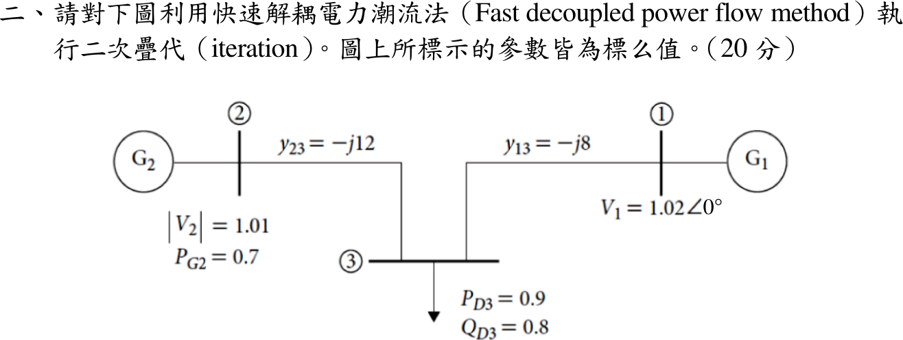

# 108 年電力系統第 2 題｜快速解耦電力潮流法二次疊代

## 已知與所求

三匯流排（標么值）：Bus 1 slack，\(V_1=1.02\angle0^\circ\)；Bus 2 發電機（PV），\(|V_2|=1.01\)、\(P_{G2}=0.7\)；Bus 3 負載（PQ），\(P_{D3}=0.9\)、\(Q_{D3}=0.8\)。線路 \(y_{13}=-j8\)、\(y_{23}=-j12\)。以快速解耦法做兩次疊代，起始值取平坦啟動 \(\theta_2=\theta_3=0\)、\(|V_3|=1\)。求 \(\theta_2,\theta_3,|V_3|\)。

## 考場標準作答

### 1. 指定注入與矩陣

\(P_2^{sp}=0.7\)，\(P_3^{sp}=-0.9\)，\(Q_3^{sp}=-0.8\)。無電阻、無並聯元件，故 \(B'\) 與 \(B''\) 皆取線路電納：
\[
B'=\begin{bmatrix}12&-12\\-12&20\end{bmatrix},\qquad B''=[20]
\]
每次疊代先解 \(B'\Delta\boldsymbol\theta=\Delta\mathbf P/|V|\)，再以新角度算 \(Q_3\)，解 \(B''\Delta|V_3|=\Delta Q_3/|V_3|\)。

### 2. 第 1 次疊代

平坦啟動下 \(P_2=P_3=0\)：
\[
\frac{\Delta\mathbf P}{|V|}=\begin{bmatrix}0.7/1.01\\-0.9/1.0\end{bmatrix}=\begin{bmatrix}0.69307\\-0.90000\end{bmatrix}
\Rightarrow
\Delta\boldsymbol\theta=\begin{bmatrix}0.031889\\-0.025866\end{bmatrix}\mathrm{rad}
\]
以新角度算得 \(Q_3=-0.25706\)，\(\Delta Q_3/|V_3|=-0.8+0.25706=-0.54294\)：
\[
\Delta|V_3|=\frac{-0.54294}{20}=-0.027147,\qquad |V_3|^{(1)}=0.97285
\]

### 3. 第 2 次疊代

用 \(\theta^{(1)}\)、\(|V_3|^{(1)}\) 重算 \(P_2=0.68062\)、\(P_3=-0.88594\)：
\[
\frac{\Delta\mathbf P}{|V|}=\begin{bmatrix}0.019189\\-0.014457\end{bmatrix}
\Rightarrow
\Delta\boldsymbol\theta=\begin{bmatrix}0.002191\\0.000592\end{bmatrix}\mathrm{rad}
\]
\(\theta_2^{(2)}=0.034080\) rad、\(\theta_3^{(2)}=-0.025275\) rad。再算 \(Q_3=-0.77730\)，\(\Delta Q_3/|V_3|=-0.023334\)，\(\Delta|V_3|=-0.001167\)：
\[
\boxed{V_2=1.01\angle1.953^\circ\ \mathrm{pu}},\qquad
\boxed{V_3=0.9717\angle-1.448^\circ\ \mathrm{pu}}
\]

## 驗算

把兩次疊代結果代回完整交流潮流式：\(P_2=0.69860\)、\(P_3=-0.89898\)、\(Q_3=-0.79904\) pu，與指定值 \((0.7,-0.9,-0.8)\) 的殘差不超過 \(1.4\times10^{-3}\) pu。以牛頓法解到收斂得 \(\theta_2=1.962^\circ\)、\(\theta_3=-1.446^\circ\)、\(|V_3|=0.97163\)，兩次 FDLF 結果與之相差 \(|V_3|\) 0.006%、角度 0.01°。收斂解下 slack 輸出 \(P_1=0.9-0.7=0.2\) pu，亦與功率守恆（無損）一致。

## 失分點

- 負載是負注入：\(P_3=-0.9\)、\(Q_3=-0.8\)；寫成正值會使 \(\Delta P_3,\Delta Q_3\) 全部反號。
- \(B'\) 只含 Bus 2、3（刪除 slack），\(B''\) 只含 PQ 的 Bus 3（\(=20\)）；Bus 2 的 \(|V_2|=1.01\) 保持固定。
- 右端要除以目前的 \(|V|\)（第 1 次 \(0.7/1.01\)），第 2 次的 \(\Delta P_3\) 要除以已更新的 \(|V_3|^{(1)}\)。
