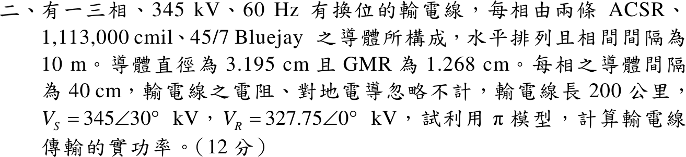

# 109 年電力系統第 2 題｜345 kV 雙分裂導線中程 π 模型與傳輸功率

## 已知與所求

三相 345 kV、60 Hz 換位線，每相兩條 Bluejay（直徑 3.195 cm、GMR 1.268 cm），子導體間隔 40 cm；水平排列相間 10 m；忽略電阻與電導；長 200 km；\(V_S=345\angle30^\circ\) kV、\(V_R=327.75\angle0^\circ\) kV（線電壓）。以 π 模型求傳輸實功率。

## 考場標準作答

**幾何量**：
\[
D_m=\sqrt[3]{10\cdot10\cdot20}=12.599\ \mathrm m,\quad
D_{sL}=\sqrt{0.01268(0.40)}=0.07122\ \mathrm m,\quad
D_{sC}=\sqrt{0.015975(0.40)}=0.07994\ \mathrm m
\]

**線路常數**（\(l=200\) km）：
\[
L=2\times10^{-7}\ln\frac{12.599}{0.07122}=1.0351\times10^{-6}\ \mathrm{H/m},\qquad X=\omega Ll=377(1.0351\times10^{-6})(2\times10^5)=78.05\ \Omega
\]
\[
C=\frac{2\pi\varepsilon_0}{\ln(12.599/0.07994)}=1.0994\times10^{-11}\ \mathrm{F/m},\qquad Y=j\omega Cl=j8.289\times10^{-4}\ \mathrm S\ (Y/2\text{ 接兩端})
\]

**傳輸功率**：π 模型兩端並聯導納為純電容，只吸收虛功率，實功率全經串聯 \(jX\)：
\[
\boxed{P=\frac{|V_S||V_R|}{X}\sin\delta=\frac{345(327.75)}{78.05}\sin30^\circ=724.4\ \mathrm{MW}}
\]
（線電壓 kV 相乘直接得三相 MW。）

## 驗算

每相複功率：\(I_{ser}=(V_S-V_R)/(jX)\)，受電端 \(I_R=I_{ser}-j\tfrac Y2V_R\)，\(3\,\mathrm{Re}(V_RI_R^*)=724.4\) MW；送電端 \(I_S=I_{ser}+j\tfrac Y2V_S\)，\(3\,\mathrm{Re}(V_SI_S^*)=724.4\) MW，送受兩端相等，符合無損線路。

## 失分點

- 電感用導體 GMR（1.268 cm），電容用導體實際半徑 \(3.195/2\) cm；兩者互換會使 \(L\)、\(C\) 皆錯。
- 水平排列的 \(D_{31}=20\) m，\(D_m=\sqrt[3]{2000}\)，不是 10 m。
- 題給為線電壓，\(V_SV_R\sin\delta/X\) 已是三相功率，不可再乘 3。
