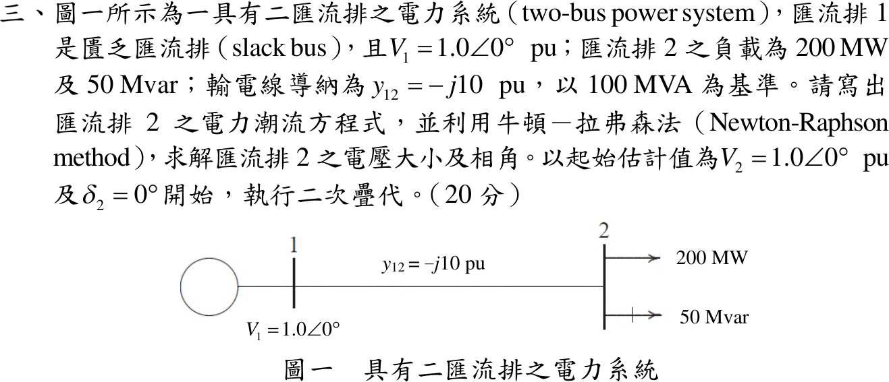

# 109 年電力系統第 3 題｜二匯流排牛頓－拉弗森法二次疊代

## 已知與所求

匯流排 1 為 slack，\(V_1=1.0\angle0^\circ\)；匯流排 2 負載 200 MW、50 Mvar；\(y_{12}=-j10\) pu，基準 100 MVA。寫出匯流排 2 潮流方程，由 \(V_2=1.0\angle0^\circ\) 起以牛頓－拉弗森法疊代兩次，求 \(|V_2|\)、\(\delta_2\)。

## 考場標準作答

\(Y_{22}=-j10\)、\(Y_{21}=j10\)；負載為負注入：\(P_2^{sch}=-2.0\)、\(Q_2^{sch}=-0.5\) pu。由 \(S_2=V_2(Y_{21}V_1+Y_{22}V_2)^*\)：
\[
P_2=10|V_2|\sin\delta_2,\qquad Q_2=10|V_2|^2-10|V_2|\cos\delta_2
\]
\[
J=\begin{bmatrix}\partial P_2/\partial\delta_2&\partial P_2/\partial|V_2|\\\partial Q_2/\partial\delta_2&\partial Q_2/\partial|V_2|\end{bmatrix}
=\begin{bmatrix}10|V_2|\cos\delta_2&10\sin\delta_2\\10|V_2|\sin\delta_2&20|V_2|-10\cos\delta_2\end{bmatrix}
\]

**第 1 次**（\(|V_2|=1,\ \delta_2=0\)）：\(P_2=Q_2=0\)，\(\Delta P=-2.0\)、\(\Delta Q=-0.5\)，\(J=\mathrm{diag}(10,10)\)：
\[
\Delta\delta_2=-0.2\ \mathrm{rad},\ \Delta|V_2|=-0.05\ \Rightarrow\ \boxed{\delta_2^{(1)}=-0.2\ \mathrm{rad}=-11.46^\circ,\quad |V_2|^{(1)}=0.95\ \mathrm{pu}}
\]

**第 2 次**：\(P_2=9.5\sin(-0.2)=-1.88736\)，\(Q_2=9.025-9.5\cos0.2=-0.28564\)；\(\Delta P=-0.11264\)、\(\Delta Q=-0.21436\)。
\[
\begin{bmatrix}9.31063&-1.98669\\-1.88736&9.19933\end{bmatrix}
\begin{bmatrix}\Delta\delta_2\\\Delta|V_2|\end{bmatrix}=
\begin{bmatrix}-0.11264\\-0.21436\end{bmatrix}
\Rightarrow \Delta\delta_2=-0.017852,\ \Delta|V_2|=-0.026965
\]
\[
\boxed{\delta_2^{(2)}=-0.21785\ \mathrm{rad}=-12.48^\circ,\quad |V_2|^{(2)}=0.9230\ \mathrm{pu}}
\]

## 驗算

兩匯流排可求精確解：由 \(|V_2|\sin\delta_2=-0.2\)、\(|V_2|\cos\delta_2=|V_2|^2+0.05\) 消去 \(\delta_2\) 得 \((u+0.05)^2+0.04=u\)（\(u=|V_2|^2\)），取大根 \(|V_2|=0.92195\)、\(\delta_2=-12.53^\circ\)。第二次疊代值與精確解差 \(0.0011\) pu、\(0.05^\circ\)，收斂方向正確。

## 失分點

- 負載是負注入，\(P_2^{sch}=-2.0\)、\(Q_2^{sch}=-0.5\)；寫成正值會使修正方向全反。
- \(\partial Q_2/\partial|V_2|=20|V_2|-10\cos\delta_2\)，漏掉 \(|V_2|^2\) 項的 2 倍會讓第 2 次電壓修正錯。
- 第 2 次要以 \(\delta_2=-0.2\) rad、\(|V_2|=0.95\) 重算 Jacobian，沿用初始 \(J\) 不算牛頓法。
