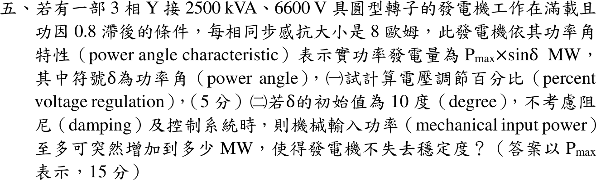

# 110 年電力系統第 5 題｜發電機電壓調整率與暫態穩定

## 已知與所求

三相 Y 接 2500 kVA、6600 V 圓型轉子發電機，\(X_s=8\ \Omega\)/相，滿載 pf 0.8 滯後；\(P=P_{\max}\sin\delta\) MW。求（一）電壓調整率；（二）\(\delta_0=10^\circ\)、不計阻尼與控制時，機械輸入功率至多可突增到多少 MW（以 \(P_{\max}\) 表示）。

## 考場標準作答

### （一）電壓調整率

\[
V_\phi=\frac{6600}{\sqrt3}=3810.51\ \mathrm V,\qquad I_a=\frac{2500\times10^3}{\sqrt3(6600)}=218.69\angle-36.87^\circ\ \mathrm A
\]
\[
E_f=V_\phi+jX_sI_a=3810.51+j8(174.95-j131.22)=4860.24+j1399.64,\quad |E_f|=5057.76\ \mathrm V
\]
\[
\boxed{VR=\frac{|E_f|-V_\phi}{V_\phi}\times100\%=\frac{5057.76-3810.51}{3810.51}\times100\%=32.73\%}
\]

### （二）突增機械功率上限

突增後新平衡角 \(\delta_1\)：\(P_m=P_{\max}\sin\delta_1\)。轉子由 \(\delta_0\) 加速，臨界時最遠擺到 \(\delta_{\max}=\pi-\delta_1\)，等面積：
\[
\int_{\delta_0}^{\pi-\delta_1}(P_m-P_{\max}\sin\delta)\,d\delta=0
\Rightarrow
\sin\delta_1(\pi-\delta_0-\delta_1)=\cos\delta_0+\cos\delta_1
\]
\(\delta_0=0.17453\) rad，數值解 \(\delta_1=0.89015\ \mathrm{rad}=51.00^\circ\)：
\[
\boxed{P_{m,\max}=P_{\max}\sin51.00^\circ=0.7772\,P_{\max}\ \mathrm{MW}}
\]
即較原來 \(P_{\max}\sin10^\circ=0.1736P_{\max}\) 最多增加 \(0.6035P_{\max}\) MW。

## 驗算

回代等面積式：左 \(0.77717(\pi-0.17453-0.89015)=0.77717(2.07691)=1.6141\)，右 \(\cos10^\circ+\cos51.00^\circ=0.98481+0.62930=1.6141\)。另以擺動方程數值積分：\(P_m=0.995\times0.7772P_{\max}\) 時轉子在 \(\pi\) 前折返，\(P_m=1.005\times0.7772P_{\max}\) 時越過 \(\pi-\delta_1\) 後持續加速而失步，臨界值夾在兩者之間。

## 失分點

- 等面積式中的 \(\pi-\delta_0-\delta_1\) 必須以弧度代入，以度數代入結果完全錯。
- 臨界最大擺角是 \(\pi-\delta_1\)（新功率線與正弦曲線的另一交點），不是 \(90^\circ\)。
- 6600 V 是線電壓，Y 接要先除以 \(\sqrt3\)；滯後功因電流角取 \(-36.87^\circ\)。
