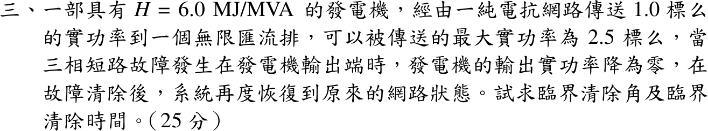

# 111 年第 3 題｜三相短路之臨界清除角與清除時間

## 已知與所求

\(H=6.0\) MJ/MVA，經純電抗網路送 \(P_m=1.0\) pu 至無限匯流排，\(P_{\max}=2.5\) pu；發電機出口三相短路期間 \(P_e=0\)，清除後恢復原網路。求臨界清除角 \(\delta_{cr}\) 與臨界清除時間 \(t_{cr}\)。題面未給系統頻率 \(f\)。

## 考場標準作答

**初始角與最大擺角**（故障後網路不變）：
\[
\delta_0=\sin^{-1}\frac{1.0}{2.5}=23.578^\circ=0.41152\ \mathrm{rad},\qquad \delta_{\max}=\pi-\delta_0=156.422^\circ
\]

**等面積準則**：加速面積 \(A_1=P_m(\delta_{cr}-\delta_0)\)，減速面積 \(A_2=\int_{\delta_{cr}}^{\delta_{\max}}(P_{\max}\sin\delta-P_m)\,d\delta\)，令 \(A_1=A_2\)：
\[
\cos\delta_{cr}=\frac{P_m}{P_{\max}}(\pi-2\delta_0)-\cos\delta_0=0.4(2.31856)-0.91652=0.010908
\]
\[
\boxed{\delta_{cr}=89.375^\circ\ (1.55989\ \mathrm{rad})}
\]

**臨界清除時間**：故障期間 \(\dfrac{2H}{\omega_s}\ddot\delta=P_m\)，\(\dot\delta(0)=0\)，故 \(\delta_{cr}-\delta_0=\dfrac{\omega_sP_m}{4H}t^2\)：
\[
t_{cr}=\sqrt{\frac{4H(\delta_{cr}-\delta_0)}{2\pi fP_m}}=\sqrt{\frac{4(6)(1.14837)}{2\pi f(1.0)}}
\]
\[
\boxed{t_{cr}=0.2704\sqrt{60/f}\ \mathrm{s}\ \ (f=60\ \mathrm{Hz}\text{ 時 }0.2704\ \mathrm{s})}
\]

## 驗算

以 \(\ddot\delta=(\pi f/H)P_m\)、\(f=60\) 數值積分擺動方程，\(\delta\) 由 \(23.578^\circ\) 到 \(89.375^\circ\) 歷時 0.2704 s；並回代 \(A_1=1.0(1.14837)=1.14837\)、\(A_2=2.5[\cos\delta_{cr}-\cos\delta_{\max}]-1.0(\delta_{\max}-\delta_{cr})=2.5(0.92743)-1.17018=1.14837\)，兩面積相等。

## 失分點

- \(\cos\delta_{cr}\) 式中的 \(\pi-2\delta_0\) 必須用弧度；以度數代入會得到無意義的餘弦值。
- 故障在發電機出口，故障期間 \(P_e=0\)，\(t_{cr}\) 才有封閉解；若誤用部分功率曲線則需數值解。
- \(t_{cr}\) 公式中是 \(\omega_s=2\pi f\)（電氣角速度），不是 \(f\) 本身。

## 條件與疑義

官方裁切圖未提供頻率，\(\delta_{cr}\) 由題目唯一決定，但 \(t_{cr}\propto1/\sqrt f\)。依經濟部「電業供電電壓及頻率標準」第三條，交流電頻率定為 $f=60\,\mathrm{Hz}$（<https://www.moeaea.gov.tw/ECW/populace/news/wHandNews_File.ashx?file_id=7592>），台灣考試情境下作答寫 \(t_{cr}=0.2704\) s；保守寫法同時列出通式 $t_{cr}=0.2704\sqrt{60/f}\,\mathrm{s}$（\(f=50\) Hz 時為 0.2962 s）。
