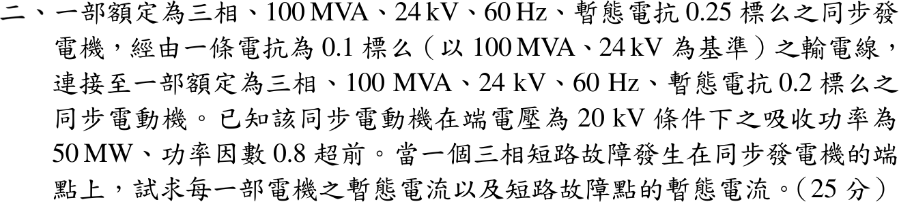

# 113 年電力系統第 2 題｜發電機端三相短路的暫態電流

## 已知與所求

基準 100 MVA、24 kV。發電機 \(X_g'=0.25\)，線路 \(X_l=0.1\)，電動機 \(X_m'=0.2\) pu。電動機端電壓 20 kV、吸收 50 MW、pf 0.8 超前。發電機端點三相短路，求兩機暫態電流與故障點暫態電流。

## 考場標準作答

**故障前狀態**（以電動機端電壓為參考）：
\[
V_m=\frac{20}{24}=0.8333\angle0^\circ,\quad S_m=0.5-j0.375\ \mathrm{pu},\quad
I=\frac{S_m^*}{V_m^*}=0.6+j0.45=0.75\angle36.87^\circ\ \mathrm{pu}
\]
\[
E_g'=V_m+j(0.1+0.25)I=0.6758+j0.21,\qquad E_m'=V_m-j0.2I=0.9233-j0.12\ \mathrm{pu}
\]

**故障後**（發電機端電壓為 0，各電勢分別經自身支路送入故障點）：
\[
\boxed{I_g'=\frac{E_g'}{j0.25}=0.84-j2.7033=2.8308\angle-72.74^\circ\ \mathrm{pu}}
\]
\[
\boxed{I_m'=\frac{E_m'}{j(0.2+0.1)}=-0.4-j3.0778=3.1037\angle-97.40^\circ\ \mathrm{pu}}
\]
\[
\boxed{I_f'=I_g'+I_m'=0.44-j5.7811=5.7978\angle-85.65^\circ\ \mathrm{pu}}
\]
基準電流 \(I_B=\dfrac{100\times10^6}{\sqrt3(24\times10^3)}=2405.6\) A，換算：
\[
\boxed{|I_g'|=6.810\ \mathrm{kA}},\qquad \boxed{|I_m'|=7.466\ \mathrm{kA}},\qquad \boxed{|I_f'|=13.947\ \mathrm{kA}}
\]

## 驗算

戴維寧疊加：故障前發電機端電壓 \(V_f=V_m+j0.1I=0.7883+j0.06\)，\(Z_{th}=j0.25\parallel j0.3=j0.13636\)，\(I_f'=V_f/Z_{th}=0.44-j5.7811\)；依電抗分流再疊加負載電流：\(I_g'=I+I_f'\frac{0.3}{0.55}=0.84-j2.7033\)、\(I_m'=-I+I_f'\frac{0.25}{0.55}=-0.4-j3.0778\)，與上相同。

## 失分點

- 超前功率因數表示電動機吸收 \(Q<0\)，\(S_m=0.5-j0.375\)；符號弄反則兩個電勢都錯。
- 電動機端電壓是 20 kV（0.8333 pu），不可當 1.0 pu。
- 故障電流為相量和 \(5.7978\) pu，不是幅值和 \(2.8308+3.1037\)。
