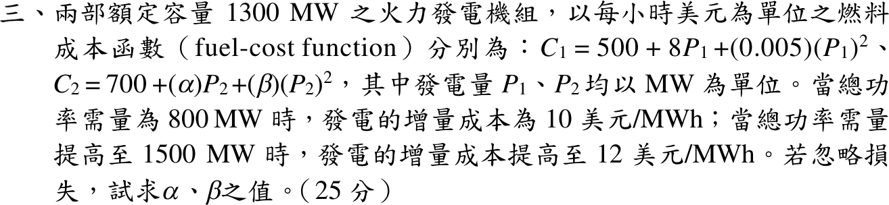

# 113 年電力系統第 3 題｜經濟調度係數辨識

## 已知與所求

兩機各 1300 MW，\(C_1=500+8P_1+0.005P_1^2\)、\(C_2=700+\alpha P_2+\beta P_2^2\)（\$/h）。需求 800 MW 時 \(\lambda=10\)，1500 MW 時 \(\lambda=12\) \$/MWh，忽略損失。求 \(\alpha,\beta\)。

## 考場標準作答

增量成本 \(\mathrm{IC}_1=8+0.01P_1\)、\(\mathrm{IC}_2=\alpha+2\beta P_2\)，等增量成本 \(\mathrm{IC}_1=\mathrm{IC}_2=\lambda\)。

由機組 1 求各點出力：
\[
\lambda=10:\ P_1=200,\ P_2=600\ \mathrm{MW};\qquad
\lambda=12:\ P_1=400,\ P_2=1100\ \mathrm{MW}
\]
皆在 0–1300 MW 內，兩機均為內點。代入機組 2：
\[
\alpha+1200\beta=10,\qquad \alpha+2200\beta=12
\]
\[
\boxed{\beta=0.002\ \$/\mathrm{MW^2h}},\qquad \boxed{\alpha=7.6\ \$/\mathrm{MWh}}
\]

## 驗算

以求得係數重新調度：800 MW 時 \(8+0.01P_1=7.6+0.004(800-P_1)\Rightarrow P_1=200\)，\(\lambda=10\)；1500 MW 時 \(P_1=400\)，\(\lambda=12\)，兩點均重現題給增量成本。

## 失分點

- \(0.005P_1^2\) 微分為 \(0.01P_1\)；誤寫 \(0.005P_1\) 會得 \(P_1=400,800\) MW，係數全錯。
- 未檢查第二點 \(P_2=1100\) MW 是否超過 1300 MW 容量就直接作答。
