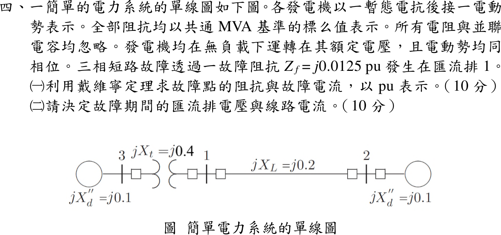

# 114 年電力系統第 4 題｜經故障阻抗之三相短路

## 已知與所求

匯流排 3 發電機 \(X_d''=j0.1\)，經變壓器 \(jX_t=j0.4\) 至匯流排 1；匯流排 1–2 線路 \(jX_L=j0.2\)；匯流排 2 發電機 \(X_d''=j0.1\)。無載、電勢均為 \(1\angle0^\circ\) pu。匯流排 1 經 \(Z_f=j0.0125\) pu 三相短路。求（一）戴維寧阻抗與故障電流；（二）故障期間匯流排電壓與線路電流。

## 考場標準作答

### （一）戴維寧阻抗與故障電流

\[
Z_{左}=j(0.1+0.4)=j0.5,\qquad Z_{右}=j(0.2+0.1)=j0.3
\]
\[
\boxed{Z_{th}=j0.5\parallel j0.3=j0.1875\ \mathrm{pu}},\qquad
\boxed{I_f=\frac{1\angle0^\circ}{Z_{th}+Z_f}=\frac{1}{j0.2}=-j5.0\ \mathrm{pu}}
\]

### （二）匯流排電壓與線路電流

\[
\boxed{V_1=I_fZ_f=(-j5)(j0.0125)=0.0625\ \mathrm{pu}}
\]
題圖未指定線路電流正方向；以下定義 \(I_{31}\) 為匯流排 3 經變壓器流向故障匯流排 1，\(I_{21}\) 為匯流排 2 經線路流向匯流排 1：
\[
\boxed{I_{31}=\frac{1-V_1}{j0.5}=-j1.875\ \mathrm{pu}},\qquad
\boxed{I_{21}=\frac{1-V_1}{j0.3}=-j3.125\ \mathrm{pu}}
\]
若採由故障點向外為正方向，則 \(I_{13}=+j1.875\) pu、\(I_{12}=+j3.125\) pu，只是參考方向反轉。發電機端匯流排電壓：
\[
\boxed{V_3=1-(j0.1)(-j1.875)=0.8125\ \mathrm{pu}},\qquad
\boxed{V_2=1-(j0.1)(-j3.125)=0.6875\ \mathrm{pu}}
\]

## 驗算

- KCL：\(I_{31}+I_{21}=-j1.875-j3.125=-j5.0=I_f\)。
- 沿支路 KVL：\(V_3-V_1=(j0.4)(-j1.875)=0.75=0.8125-0.0625\)；\(V_2-V_1=(j0.2)(-j3.125)=0.625=0.6875-0.0625\)。
- 疊加法：\(\Delta V_i=-Z_{i1}I_f\)，\(Z_{11}=j0.1875\) 給出 \(V_1=1-0.9375=0.0625\)，與上同。

## 失分點

- 漏掉左側變壓器 \(j0.4\)，左支路誤用 \(j0.1\)，\(Z_{th}\) 與 \(I_f\) 全部錯誤。
- 有 \(Z_f\) 時 \(V_1\neq0\)；直接令 \(V_1=0\) 會使兩支路電流都偏大。
- 未先宣告方向就混用 \(I_{31}\) 與 \(I_{13}\)，答案會差一個負號。
