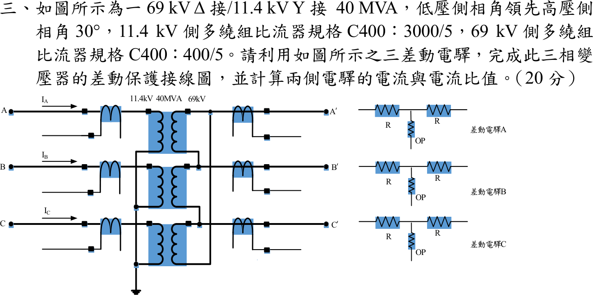
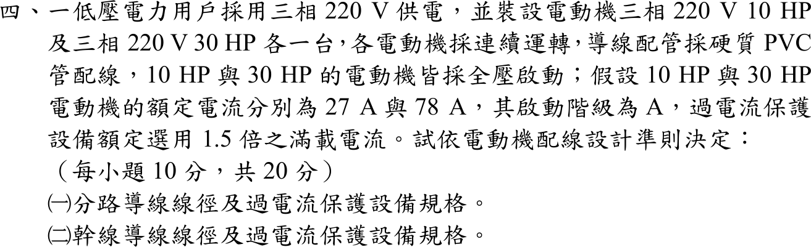
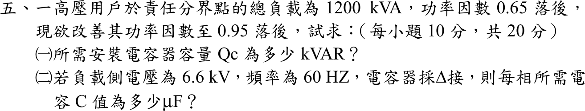

# 📝 107 年電機工程技師｜工業配電逐題詳解

> 本頁由題級 canonical 筆記組合；每題保留官方裁切圖、校驗狀態與可追溯的推導。

## 題目導覽
- [[#一、107 年工業配電第 1 題｜四用戶負載統計|第 1 題：四用戶負載統計]]
- [[#二、107 年工業配電第 2 題｜100 HP 馬達饋線壓降|第 2 題：100 HP 馬達饋線壓降]]
- [[#三、107 年工業配電第 3 題｜Δ–Y 變壓器差動保護|第 3 題：Δ–Y 變壓器差動保護]]
- [[#四、107 年工業配電第 4 題｜多台電動機分路與幹線設計|第 4 題：多台電動機分路與幹線設計]]
- [[#五、107 年工業配電第 5 題｜高壓用戶功率因數改善|第 5 題：高壓用戶功率因數改善]]

---

## 一、107 年工業配電第 1 題｜四用戶負載統計

> 題級識別：EE-107-06-1
> canonical 來源：[[canonical/EE-107-06-1.md]]
> 題級校驗狀態：verified


### 已知與所求

A、B、C、D 四用戶之負載參差因數 \(F_d=1.5\)。設備容量／功率因數（落後）／需量因數／負載因數：A 100 kVA／0.85／50%／45%；B 60／0.80／55%／40%；C 150／0.88／60%／50%；D 120／0.90／40%／35%。求（一）總和最大負載（kW）；（二）總和平均負載（kW）；（三）綜合負載因數；（四）每日用電量（kWh）。

### 考場標準作答

各戶最大需量 \(P_{max,i}=S_i\cdot DF_i\cdot\mathrm{pf}_i\)，平均負載 \(P_{avg,i}=P_{max,i}\cdot LF_i\)：

| 用戶 | \(P_{max}\)（kW） | \(P_{avg}\)（kW） |
|---|---:|---:|
| A | \(100(0.50)(0.85)=42.50\) | \(42.50(0.45)=19.125\) |
| B | \(60(0.55)(0.80)=26.40\) | \(26.40(0.40)=10.560\) |
| C | \(150(0.60)(0.88)=79.20\) | \(79.20(0.50)=39.600\) |
| D | \(120(0.40)(0.90)=43.20\) | \(43.20(0.35)=15.120\) |

#### （一）總和最大負載

個別最大合計 \(191.30\,\mathrm{kW}\)；參差因數 \(F_d=\dfrac{\sum P_{max,i}}{P_{max,\text{同時}}}\)，故
\[
\boxed{P_{max}=\frac{191.30}{1.5}=127.533\ \mathrm{kW}}
\]

#### （二）總和平均負載

\[
\boxed{P_{avg}=19.125+10.560+39.600+15.120=84.405\ \mathrm{kW}}
\]

#### （三）綜合負載因數

\[
\boxed{LF=\frac{P_{avg}}{P_{max}}=\frac{84.405}{127.533}=0.6618=66.18\%}
\]

#### （四）每日用電量

\[
\boxed{E=84.405(24)=2025.72\ \mathrm{kWh/day}}
\]

### 驗算

綜合負載因數可由恆等式 \(LF=F_d\dfrac{\sum P_{avg,i}}{\sum P_{max,i}}=1.5\dfrac{84.405}{191.30}=0.6618\)；逐戶計日電量再加總：\(459.0+253.44+950.4+362.88=2025.72\,\mathrm{kWh}\)，與（四）相同。

### 失分點

- 把設備容量 kVA 直接當 kW；須乘需量因數與功率因數才是各戶最大有功需量。
- 參差因數方向相反：同時最大負載是個別最大合計**除以** 1.5，不是乘 1.5。
- 平均負載應按各戶自己的負載因數算，不可用群組合計再乘單一 \(LF\)。

---

## 二、107 年工業配電第 2 題｜100 HP 馬達饋線壓降

> 題級識別：EE-107-06-2
> canonical 來源：[[canonical/EE-107-06-2.md]]
> 題級校驗狀態：reference_book_verified


### 已知與所求

三相 \(220\,\mathrm V\) 供應一台滿載 \(100\,\mathrm{HP}\) 電動機，功率因數 0.85 落後；100 mm² 銅線 PVC 管，每條線長 \(120\,\mathrm m\)；線路阻抗 \(0.195+j0.0909\,\Omega/\mathrm{km}\)，電抗更正係數 1.2。求（一）線路百分壓降；（二）壓降不超過標稱電壓 5% 時的最大容許長度（各 10 分）。題幹未給滿載電流，取值見「條件與疑義」。

### 考場標準作答

參考書主解（reference_book evidence，not official）：1 HP≈1 kVA，電動機電流 262.43 A：
\[
I=\frac{100\,000}{\sqrt3(220)}=262.43\,\mathrm A
\]
有效電抗 \(X=1.2(0.0909)=0.10908\,\Omega/\mathrm{km}\)，沿電壓軸的單位長壓降係數
\[
K=R\cos\theta+X\sin\theta=0.195(0.85)+0.10908(0.52678)=0.22321\,\Omega/\mathrm{km}
\]

#### （一）百分壓降

\[
\Delta V=\sqrt3\,I\,K\,L=\sqrt3(262.43)(0.22321)(0.120)=12.175\,\mathrm V,\qquad
\boxed{\Delta V\%=\frac{12.175}{220}=5.53\%}
\]

#### （二）最大容許長度

允許壓降 \(0.05(220)=11\,\mathrm V\)，壓降與長度成正比：
\[
\boxed{L_{max}=0.120\frac{11}{12.175}\times1000=108.42\ \mathrm m}
\]

### 驗算

相量法：每相 \(V_r=220/\sqrt3\)，\(\dot I=262.43\angle-31.79^\circ\)，\(\dot V_s=V_r+\dot I(R+jX)L\)，\(\sqrt3(|V_s|-V_r)=12.176\,\mathrm V\)（5.534%），與近似式相同。比例檢查：\(L_{max}\times5.534\%=120\,\mathrm m\times5\%\)。

### 失分點

- 電抗忘記乘更正係數 1.2，使 \(K\) 偏小（\(K\) 會降為 0.2136，壓降低估約 4%）。
- 用 \(\sqrt3IL(R\cos\theta+X\sin\theta)\) 時把長度寫成 120 而非 0.120 km。
- 最大長度不能直接寫 120 m；壓降與長度成正比，應依 \(11\,\mathrm V/12.175\,\mathrm V\) 縮放，且結果小於 120 m（因 120 m 已超過 5%）。

### 條件與疑義

官方裁切沒有列馬達滿載電流、銘牌效率或輸入功率定義；第 152 條只決定馬達負載電流的取值依據：原則上採銘牌全載電流，一般用電動機才可採國家標準值（經濟部 107 年 7 月 17 日歷史版《用戶用電設備裝置規則》第 152 條，<https://law.moea.gov.tw/LawContentHistory.aspx?hid=50617>），因此不能由 100 HP 與功率因數單獨反推出唯一滿載電流。本題的「壓降 5%」是題目給定的壓降門檻，只用來把同一線路模型反算成 \(L_{max}\)，不是由第 152 條法規推導出的電流值。各取值下的結果為：

| 滿載電流取值 | \(I\) | \(\Delta V\%\) | \(L_{max}\) |
|---|---:|---:|---:|
| 參考書 1 HP≈1 kVA（主解） | 262.43 A | 5.53% | 108.42 m |
| 年度詳解常用值 | \(250\,\mathrm A\) | 5.2720% | 113.81 m |
| 107 年歷史表 163-7-3 | \(I=258\,\mathrm{A}\) | 5.4407% | 110.28 m |
| 現行表 258-3（60 HP 以上可採製造廠資料） | \(238\,\mathrm A\) | 5.0189% | 119.55 m |
| 100 HP＝74.6 kW、效率 1 | 230.32 A | 4.8570% | 123.53 m |

各取值下 120 m 的壓降落在 4.86%–5.53%，是否超過 5% 隨取值而變。題圖未指定表號，故 238 A、250 A、258 A 僅為版本交叉檢查，不取代參考書主解與銘牌值。

---

## 三、107 年工業配電第 3 題｜Δ–Y 變壓器差動保護

> 題級識別：EE-107-06-3
> canonical 來源：[[canonical/EE-107-06-3.md]]
> 題級校驗狀態：verified



### 已知與所求

\(69\,\mathrm{kV}\) Δ／\(11.4\,\mathrm{kV}\) Y、\(40\,\mathrm{MVA}\) 三相變壓器，低壓側相角領先高壓側 \(30^\circ\)；\(11.4\,\mathrm{kV}\) 側多繞組 CT C400：\(3000/5\)，\(69\,\mathrm{kV}\) 側 C400：\(400/5\)。用三具差動電驛（各有兩個制動線圈 R 與一個動作線圈 OP）完成差動保護接線圖，並求兩側電驛電流與電流比值。

### 考場標準作答

#### 接線（CT 接法與變壓器相反）

```text
69 kV 側（Δ 繞組）：CT 400/5 二次接 Y，中性點共接接地
   A'、B'、C' 的 CT 二次 → 電驛 A、B、C 的 R₂ 線圈
11.4 kV 側（Y 繞組）：CT 3000/5 二次接 Δ，電驛電流為 i_a−i_c、i_b−i_a、i_c−i_b
   Δ 三個輸出 → 電驛 A、B、C 的 R₁ 線圈
每台電驛：R₁ ── OP ── R₂，OP 接在兩 R 線圈的中點；正常時兩側電流在 OP 中相消
```
低壓側（Y）電流領先 \(30^\circ\)，\(i_a-i_c\) 比 \(i_a\) 滯後 \(30^\circ\)，正好抵銷變壓器相移（相序 a-b-c）；Y 側 CT 若也接 Y，電驛會有 \(30^\circ\) 的假差流。

#### 電驛電流與比值

額定線電流：
\[
I_H=\frac{40\times10^6}{\sqrt3(69\,000)}=334.70\,\mathrm A,\qquad
I_L=\frac{40\times10^6}{\sqrt3(11\,400)}=2025.79\,\mathrm A
\]
69 kV 側 CT 接 Y，電驛電流等於 CT 二次電流；11.4 kV 側 CT 接 Δ，電驛電流為單具二次電流的 \(\sqrt3\) 倍：
\[
\boxed{I_{H,r}=5\frac{334.70}{400}=4.184\ \mathrm A},\qquad
\boxed{I_{L,r}=\sqrt3\left(5\frac{2025.79}{3000}\right)=5.848\ \mathrm A}
\]
\[
\boxed{\frac{I_{L,r}}{I_{H,r}}=\frac{5.848}{4.184}=1.398\quad\left(\frac{I_{H,r}}{I_{L,r}}=0.715\right)}
\]
兩側電驛電流不相等，差距 \(1.664\,\mathrm A\)（約 40%）須以電驛匹配抽頭或輔助 CT 補償約 1.40 倍，否則正常負載即產生假差流。

### 驗算

比值與變壓器容量無關，可直接由匝比與 CT 比求：\(\dfrac{I_{L,r}}{I_{H,r}}=\sqrt3\dfrac{3000^{-1}}{400^{-1}}\dfrac{69}{11.4}=\sqrt3\,(0.13333)(6.0526)=1.398\)。三相相量計算（\(i_a-i_c\)）亦得電驛 A 兩側電流同相、幅值 5.848 A 與 4.184 A。

### 失分點

- 比值方向要註明：低壓／高壓 \(=1.398\)，高壓／低壓 \(=0.715\)；只寫「1.4」不標方向。
- 11.4 kV 側 Δ-CT 的電驛電流漏乘 \(\sqrt3\)，得到 \(3.376\,\mathrm A\) 而誤判兩側已平衡。
- 兩側 CT 都接 Y，沒有補償 \(30^\circ\)。

---

## 四、107 年工業配電第 4 題｜多台電動機分路與幹線設計

> 題級識別：EE-107-06-4
> canonical 來源：[[canonical/EE-107-06-4.md]]
> 題級校驗狀態：needs_manual_review
> [!WARNING] 本題仍有官方資料缺口或事件定義歧義；請以 canonical 條件式解答為準。



### 已知與所求

三相 \(220\,\mathrm V\) 供電；\(10\,\mathrm{HP}\)、\(30\,\mathrm{HP}\) 電動機各一台，連續運轉，硬質 PVC 管配線，全壓啟動；額定電流 \(27\,\mathrm A\)、\(78\,\mathrm A\)，啟動階級 A，過電流保護額定選用 1.5 倍滿載電流。求（一）分路導線線徑及過電流保護規格；（二）幹線導線線徑及過電流保護規格（各 10 分）。導線安培容量與標準 AT 級距題幹未附，取值見「條件與疑義」。

### 考場標準作答

連續運轉：分路導線 \(\ge1.25I_{FL}\)；幹線導線 \(\ge1.25I_{max}+\sum I_{其餘}\)；保護取 1.5 倍後向上取標準 AT。

#### （一）分路

| 電動機 | 導線需求 | 導線 | 保護 \(1.5I_{FL}\) | 規格 |
|---|---|---|---|---|
| 10 HP | \(1.25(27)=33.75\,\mathrm A\) | 8 mm²（40 A） | \(40.5\,\mathrm A\) | 50 AT |
| 30 HP | \(1.25(78)=97.5\,\mathrm A\) | 38 mm²（100 A） | \(117\,\mathrm A\) | 125 AT |

\[
\boxed{\text{10 HP：}8\,\mathrm{mm^2}、50\,\mathrm{AT}；\quad \text{30 HP：}38\,\mathrm{mm^2}、125\,\mathrm{AT}}
\]

#### （二）幹線

\[
I_{w}\ge1.25(78)+27=124.5\,\mathrm A\Rightarrow 60\,\mathrm{mm^2}（150\,\mathrm A）,\qquad
1.5(78)+27=144\,\mathrm A\Rightarrow 150\,\mathrm{AT}
\]
\[
\boxed{\text{幹線 }60\,\mathrm{mm^2}、150\,\mathrm{AT}}
\]

### 驗算

保護協調：幹線 AT 不得超過最大分路保護加其餘電動機電流 \(125+27=152\,\mathrm A\)，\(150\,\mathrm{AT}\le152\,\mathrm A\) 成立，且 \(150\,\mathrm{AT}\ge125\,\mathrm{AT}\) 分路保護。幹線保護以未捨入的 \(144\,\mathrm A\) 再取標準值；若先用 125 AT 再加 27 A 得 152 A，向下取標準仍為 150 AT，結論相同。

### 失分點

- 幹線只取 \(1.25(78+27)=131\,\mathrm A\)；連續負載 125% 只乘最大那台。
- 保護 \(40.5\,\mathrm A\) 取 40 AT（往下取）；題目定的是「選用 1.5 倍」，40 AT 小於 \(40.5\,\mathrm A\)，應取 50 AT。
- 以啟動電流選導線；全壓啟動的啟動電流只影響跳脫曲線，導線依滿載電流 125%。

### 條件與疑義

題幹未附屋內線路裝置規則的安培容量表與 AT 級距，下列為假設值（須以規則表核對）：

| 項目 | 假設值 |
|---|---|
| PVC 管內 3 線安培容量 | \(5.5\,\mathrm{mm^2}\)：30 A；8：40 A；14：55 A；22：70 A；30：90 A；38：100 A；50：120 A；60：150 A |
| 標準 AT | 15、20、30、40、50、60、75、100、125、150、175、200、225 |

結論只要求 \(30\,\mathrm{mm^2}\) 容量 \(<97.5\,\mathrm A\le38\,\mathrm{mm^2}\) 容量，以及 \(50\,\mathrm{mm^2}\) 容量 \(<124.5\,\mathrm A\le60\,\mathrm{mm^2}\) 容量；若所用表的 50 mm² 已達 124.5 A 以上，幹線改為 50 mm²，AT 不變。

---

## 五、107 年工業配電第 5 題｜高壓用戶功率因數改善

> 題級識別：EE-107-06-5
> canonical 來源：[[canonical/EE-107-06-5.md]]
> 題級校驗狀態：verified



### 已知與所求

高壓用戶責任分界點總負載 \(1200\,\mathrm{kVA}\)，功率因數 0.65 落後，改善至 0.95 落後；負載側電壓 \(6.6\,\mathrm{kV}\)、頻率 \(60\,\mathrm{Hz}\)、電容器 Δ 接。求（一）所需電容器容量 \(Q_c\)（kvar）；（二）每相電容 \(C\)（μF），各 10 分。

### 考場標準作答

#### （一）電容器容量

\(P=1200(0.65)=780\,\mathrm{kW}\)：
\[
\boxed{Q_c=780\left[\tan(\cos^{-1}0.65)-\tan(\cos^{-1}0.95)\right]=780(0.84045)=655.547\ \mathrm{kvar}}
\]

#### （二）Δ 接每相電容

Δ 接每相電容承受線電壓 \(6600\,\mathrm V\)，三相 \(Q_c=3\omega CV^2\)：
\[
\boxed{C=\frac{655.547\times10^3}{3(2\pi60)(6600)^2}=13.31\ \mu\mathrm F/\text{相}}
\]

### 驗算

相電流路徑：電容器線電流 \(I_L=Q_c/(\sqrt3V)=57.35\,\mathrm A\)，Δ 相電流 \(I_\phi=I_L/\sqrt3=33.11\,\mathrm A\)，\(C=I_\phi/(\omega V)=33.11/(377\times6600)=13.31\,\mu\mathrm F\)。補償後 \(Q=1200\sin\phi_1-Q_c=911.92-655.547=256.37\,\mathrm{kvar}\)，\(\tan\phi_2=256.37/780=0.3287\)，\(\cos\phi_2=0.950\)。

### 失分點

- \(Q_c=P(\tan\phi_1-\tan\phi_2)\) 用 \(S=1200\) 當 \(P\)；有功是 \(1200\times0.65=780\,\mathrm{kW}\)。
- Δ 接每相電壓是線電壓 6.6 kV，不是 \(6.6/\sqrt3\,\mathrm{kV}\)；用相電壓會得到 \(39.9\,\mu\mathrm F\)。

---
