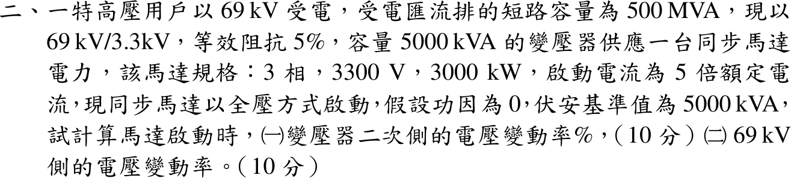
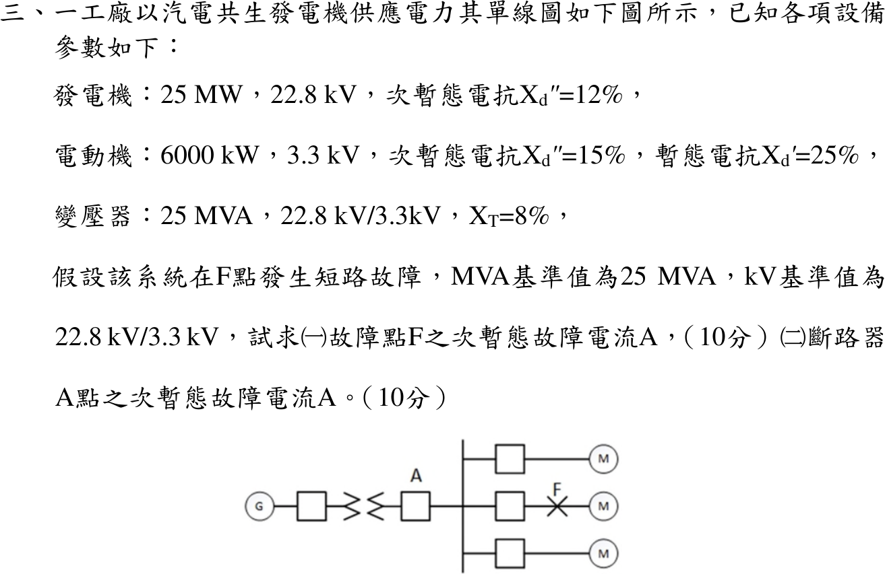
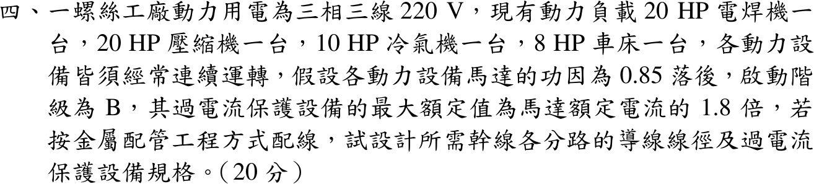

# 📝 111 年電機工程技師｜工業配電逐題詳解

> 本頁由題級 canonical 筆記組合；每題保留官方裁切圖、校驗狀態與可追溯的推導。

## 題目導覽
- [[#一、111 年工業配電第 1 題｜CT 激磁特性與負擔誤差|第 1 題：CT 激磁特性與負擔誤差]]
- [[#二、111 年第 2 題｜同步馬達全壓啟動電壓變動率|第 2 題：同步馬達全壓啟動電壓變動率]]
- [[#三、111 年第 3 題｜汽電共生系統三相短路與斷路器電流|第 3 題：汽電共生系統三相短路與斷路器電流]]
- [[#四、111 年工業配電第 4 題｜多台連續運轉馬達配線與保護|第 4 題：多台連續運轉馬達配線與保護]]
- [[#五、111 年第 5 題｜低電阻接地電阻器額定與短路電流比例|第 5 題：低電阻接地電阻器額定與短路電流比例]]

---

## 一、111 年工業配電第 1 題｜CT 激磁特性與負擔誤差

> 題級識別：EE-111-06-1
> canonical 來源：[[canonical/EE-111-06-1.md]]
> 題級校驗狀態：reference_book_verified

### 已知與所求

CT 變比 \(100/5\)（\(n=20\)），漏阻抗 \(Z'=0.082\,\Omega\)，過流電驛於 \(I'=8\,\mathrm A\) 動作；誤差 \(=I_e/(I'+I_e)\times100\%\)。用圖中 100:5 激磁曲線，求（一）\(Z_B=0.8\,\Omega\)、（二）\(Z_B=3\,\Omega\) 時的 CT 誤差，並判斷能否偵測 \(200\,\mathrm A\) 一次側故障電流。

### 考場標準作答

電驛恰動作時負擔支路電流 \(I'=8\,\mathrm A\)，激磁電壓 \(E'=I'(Z'+Z_B)\)；由曲線讀 \(I_e\)，二次總電流 \(I'+I_e\)，一次側最小動作電流 \(I_{p}=n(I'+I_e)\)。

#### （一）\(Z_B=0.8\,\Omega\)

\[
E'=8(0.082+0.8)=7.056\,\mathrm V\ \xrightarrow{\text{100:5 曲線}}\ I_e\approx0.4\,\mathrm A
\]
\[
\text{誤差}=\frac{0.4}{8+0.4}\times100\%=\boxed{4.76\%}
\]
\[
I_p=20(8+0.4)=\boxed{168\,\mathrm A}<200\,\mathrm A\ \Rightarrow\ \boxed{\text{可偵測 200 A 故障}}
\]

#### （二）\(Z_B=3\,\Omega\)

\[
E'=8(0.082+3)=24.656\,\mathrm V
\]
100:5 曲線已飽和，延伸到圖末 \(I_e=30\,\mathrm A\) 時 \(E'\) 仍只有約 \(22\,\mathrm V\)，故 \(I_e\ge30\,\mathrm A\)：
\[
\text{誤差}\ge\frac{30}{8+30}\times100\%=\boxed{78.9\%}
\]
\[
I_p\ge20(8+30)=\boxed{760\,\mathrm A}>200\,\mathrm A\ \Rightarrow\ \boxed{\text{不能偵測 200 A 故障}}
\]

### 驗算

改用「一次側 200 A 已知」的路線：二次總電流 \(I'+I_e=200/20=10\,\mathrm A\)，負載線 \(E'=(Z'+Z_B)(10-I_e)\) 與曲線聯立。

- \(Z_B=0.8\)：交點 \(I_e\approx0.43\,\mathrm A\)，\(I'\approx9.57\,\mathrm A\ge8\)，動作。
- \(Z_B=3\)：交點 \(I_e\approx3.5\,\mathrm A\)（\(E'\approx20\,\mathrm V\)），\(I'\approx6.5\,\mathrm A<8\)，不動作。

動作門檻為 \(I'\ge8\iff I_e\le2.0\,\mathrm{A}\)，兩條路線結論相同。

### 失分點

- 讀成 50:5 曲線（飽和約 10 V）；100:5 是由右數第二條，飽和約 20～22 V。
- 誤差分母用 \(I'\) 而非 \(I'+I_e\)，（一）會寫成 5.0%。
- （二）在圖外硬讀一個 \(I_e\)；應寫「超出曲線，\(I_e\ge30\,\mathrm A\)」並以下限判斷。

### 條件與疑義

曲線讀值（對數座標，每十倍約 297 px，判讀誤差約 ±2.5%）：

| \(E'\)（V） | 6.4 | 7.06 | 8.5 | 12.5 | 16.6 | 19.3 | 19.7 | 20.3 | 21.9 |
|---|---:|---:|---:|---:|---:|---:|---:|---:|---:|
| \(I_e\)（A） | 0.36 | 0.38 | 0.43 | 0.62 | 0.90 | 1.9 | 3.2 | 5.6 | 29 |

（一）讀值區間 \(0.37\sim0.40\,\mathrm A\)，誤差 \(4.4\sim4.8\%\)、\(I_p=167\sim168\,\mathrm A\)，均小於 200 A。200 A 路線的數位化交點讀值為 \(I_e=0.42\sim0.44\,\mathrm A\)（\(I'=9.56\sim9.58\,\mathrm A\)）與 \(I_e=3.4\sim3.7\,\mathrm A\)（\(I'=6.3\sim6.6\,\mathrm A\)）。兩個區間分別遠低於與遠高於門檻 \(I_e\le2.0\,\mathrm{A}\)，故偵測結論不受圖解誤差影響，受影響的只有誤差百分比的末位。

---

## 二、111 年第 2 題｜同步馬達全壓啟動電壓變動率

> 題級識別：EE-111-06-2
> canonical 來源：[[canonical/EE-111-06-2.md]]
> 題級校驗狀態：reference_book_verified

### 已知與所求

69 kV 受電匯流排短路容量 \(500\,\mathrm{MVA}\)；變壓器 \(69/3.3\,\mathrm{kV}\)、\(5000\,\mathrm{kVA}\)、\(Z=5\%\)；同步馬達 \(3300\,\mathrm V\)、\(3000\,\mathrm{kW}\)，全壓啟動電流 \(5\) 倍額定，啟動功因為 0；基準 \(5000\,\mathrm{kVA}\)。求啟動時（一）變壓器二次側、（二）69 kV 側電壓變動率。

### 考場標準作答

以 \(S_b=5\,\mathrm{MVA}\)：
\[
X_s=\frac{5}{500}=0.01,\qquad X_T=0.05\ \mathrm{pu}
\]
馬達額定容量取 \(S_M=\dfrac{3000}{0.85}=3529\,\mathrm{kVA}\)（\(\eta\,\mathrm{pf}=0.85\)，見條件與疑義），啟動容量 \(5S_M=17.65\,\mathrm{MVA}\)：
\[
X_M=\frac{5}{17.65}=0.2833\,\mathrm{pu}
\]
啟動功因為 0，三段皆為純電抗，電壓變動率即上游電抗占總電抗的比例。

#### （一）變壓器二次側

\[
\Delta V_2=\frac{X_s+X_T}{X_s+X_T+X_M}=\frac{0.06}{0.3433}=\boxed{17.48\%}
\]

#### （二）69 kV 側

\[
\Delta V_{69}=\frac{X_s}{X_s+X_T+X_M}=\frac{0.01}{0.3433}=\boxed{2.913\%}
\]

參考書將 \(X_M\) 取 \(0.283\)，寫成 17.5% 與 2.92%。

### 驗算

相量 KVL：\(I=1/[j(0.01+0.05+0.2833)]=-j2.913\,\mathrm{pu}\)，\(V_2=1-j0.06I=0.8252\)、\(V_{69}=1-j0.01I=0.9709\)，與上式相符；且 \(\Delta V_{69}/\Delta V_2=0.01/0.06=1/6\)。

### 失分點

- 未寫明 \(\eta\,\mathrm{pf}\) 假設即逕取 3000 kVA；若採 \(k=1\)（\(X_M=0.333\)）須註明，結果為 15.25%／2.54%。
- 69 kV 側把變壓器電抗也算在上游；69 kV 母線只跨 \(X_s\)。
- 用額定電流而非 5 倍啟動電流換算 \(X_M\)。

### 條件與疑義

題幹只給 \(3000\,\mathrm{kW}\)，未給額定功因與效率；啟動功因為 0 只說明啟動支路為純電抗，不能代替額定運轉功因。令 \(k=\eta\,\mathrm{pf}_n\)，\(X_M=k/3\)，參數化敏感度如下（主解取參考書 \(k=0.85\)）：

\[
\Delta V_2(k)=\frac{0.06}{0.06+k/3},\qquad \Delta V_{69}(k)=\frac{0.01}{0.06+k/3}
\]

| \(k=\eta\,\mathrm{pf}_n\) | \(\Delta V_2\) | \(\Delta V_{69}\) |
|---:|---:|---:|
| 0.80 | 18.3673% | 3.0612% |
| 0.85 | 17.4757% | 2.9126% |
| 0.90 | 16.6667% | 2.7778% |
| 1.00 | 15.2542% | 2.5424% |

---

## 三、111 年第 3 題｜汽電共生系統三相短路與斷路器電流

> 題級識別：EE-111-06-3
> canonical 來源：[[canonical/EE-111-06-3.md]]
> 題級校驗狀態：reference_book_verified

### 已知與所求

發電機 \(25\,\mathrm{MW}\)、\(22.8\,\mathrm{kV}\)、\(X_d''=12\%\)；電動機 \(6000\,\mathrm{kW}\)、\(3.3\,\mathrm{kV}\)、\(X_d''=15\%\)（\(X_d'=25\%\)）；變壓器 \(25\,\mathrm{MVA}\)、\(22.8/3.3\,\mathrm{kV}\)、\(X_T=8\%\)。單線圖：G—變壓器—斷路器 A—3.3 kV 母線，母線接三個 M 支路，F 在中間馬達支路的斷路器之後。基準 \(25\,\mathrm{MVA}\)、\(22.8/3.3\,\mathrm{kV}\)。求（一）F 點、（二）斷路器 A 點的次暫態故障電流。

### 考場標準作答

採 \(25\,\mathrm{MW}\) 視同 \(25\,\mathrm{MVA}\)（\(PF_G=1\)）、每台馬達 \(6\,\mathrm{MVA}\)、各內電勢 \(E''=1\,\mathrm{pu}\)（條件分支，見條件與疑義）。次暫態計算用 \(X_d''\)，不用 \(X_d'\)。

\[
I_b=\frac{25\times10^6}{\sqrt3(3300)}=4373.9\,\mathrm A
\]
\[
X_{G}+X_T=0.12+0.08=0.20,\qquad X_M''=0.15\frac{25}{6}=0.625\ \mathrm{pu}
\]

#### （一）F 點

F 點同時收到發電機分量與三個 M 支路的馬達反饋（故障支路上的馬達也直接饋入 F）：
\[
I_F''=\left(\frac{1}{0.20}+\frac{3}{0.625}\right)I_b=9.8(4373.9)=\boxed{42.86\,\mathrm{kA}}
\]

#### （二）斷路器 A 點

A 點量測的是發電機支路電流，只含經變壓器流來的發電機分量：
\[
I_A''=\frac{I_b}{0.20}=5(4373.9)=\boxed{21.87\,\mathrm{kA}}
\]
精確值 \(21.8693\,\mathrm{kA}\)；參考書以 \(I_b=4.37\,\mathrm{kA}\) 寫成 42.83／21.85 kA。

### 驗算

戴維寧：\(Z_{th}=0.20\parallel(0.625/3)=\dfrac{1}{5+4.8}=0.10204\,\mathrm{pu}\)，\(I_F''=I_b/Z_{th}=42.86\,\mathrm{kA}\)。故障時母線電壓為 0，發電機支路電流 \(=(1-0)/0.20=5\,\mathrm{pu}\)，與 A 點結果一致；\(I_F''-I_A''=4.8I_b\) 即三台馬達各 \(1.6\,\mathrm{pu}\)。

### 失分點

- 不得把馬達反饋分量加到 A 點；馬達電流由各 M 支路經母線流向 F，不穿過 A。
- 只算一台馬達（\(6.6I_b=28.87\,\mathrm{kA}\)）；圖中三個 M 支路都要列入。
- 用暫態電抗 \(X_d'=25\%\) 求次暫態電流。

### 條件與疑義

題目給的是 \(25\,\mathrm{MW}\) 與 \(6000\,\mathrm{kW}\)，未給額定功因／效率；\(25\,\mathrm{MVA}\) 只是題目指定的基準。圖面確認三個 M 支路，支路數量 N_M=3 已確認。若 \(S_G=25/PF_G\)，則 \(X_G=0.12PF_G\)，A 點條件分支：

| \(PF_G\) | 1.0 | 0.9 | 0.8 |
|---|---:|---:|---:|
| \(I_A''=I_b/(0.12PF_G+0.08)\)（kA） | 21.8693 | 23.2652 | 24.8515 |

若馬達 \(\eta\,\mathrm{pf}_n=0.9\)，\(X_M''=0.5625\)，\(I_F''=10.333I_b=45.20\,\mathrm{kA}\)。主解採 \(PF_G=1\)、馬達 1 kW≈1 kVA 的參考書慣例。

---

## 四、111 年工業配電第 4 題｜多台連續運轉馬達配線與保護

> 題級識別：EE-111-06-4
> canonical 來源：[[canonical/EE-111-06-4.md]]
> 題級校驗狀態：reference_book_verified

### 已知與所求

三相三線 \(220\,\mathrm V\)；20 HP 電焊機、20 HP 壓縮機、10 HP 冷氣機、8 HP 車床各一台，均經常連續運轉；功因 0.85 落後，啟動階級 B，過電流保護最大額定為馬達額定電流 1.8 倍；金屬配管。求幹線與各分路的導線線徑及過電流保護規格。滿載電流、安培容量與 AT 級距須查表，所用表值列於「條件與疑義」。

### 考場標準作答

#### 1. 額定電流（1 HP≈1 kVA）

\[
I_{20}=\frac{20\times10^3}{\sqrt3(220)}=52.49\,\mathrm A,\quad I_{10}=26.24\,\mathrm A,\quad I_{8}=20.99\,\mathrm A
\]

#### 2. 分路（每台一分路）

導線 \(\ge1.25I\)，保護取與導線安培容量相同的標準值，並檢核 \(1.25I\le\mathrm{AT}\le1.8I\)：

| 分路 | \(1.25I\)（A） | 導線 | \(1.8I\)（A） | 保護 |
|---|---:|---|---:|---|
| 20 HP（兩台各一） | 65.6 | 22 mm²（70 A） | 94.5 | 70 AT |
| 10 HP | 32.8 | 8 mm²（40 A） | 47.2 | 40 AT |
| 8 HP | 26.2 | 5.5 mm²（30 A） | 37.8 | 30 AT |

\[
\boxed{\text{20 HP 分路 }22\,\mathrm{mm^2}/70\,\mathrm{AT}；\ 10\text{ HP 分路 }8\,\mathrm{mm^2}/40\,\mathrm{AT}；\ 8\text{ HP 分路 }5.5\,\mathrm{mm^2}/30\,\mathrm{AT}}
\]

#### 3. 幹線

\[
I_{\mathrm{feeder}}\ge1.25(52.49)+52.49+26.24+20.99=165.3\,\mathrm A
\]
\[
\mathrm{AT}_{\mathrm{main}}\le1.8(52.49)+52.49+26.24+20.99=194.2\,\mathrm A\ \Rightarrow\ 175\,\mathrm{AT}
\]
導線並須不小於幹線保護 175 A（參考書準則，見條件與疑義），取
\[
\boxed{\text{幹線 }125\,\mathrm{mm^2}\ (220\,\mathrm A)，\ 175\,\mathrm{AT}/225\,\mathrm{AF}}
\]

### 驗算

由第一原理：\(P=\sqrt3VI\,\mathrm{pf}\,\eta\)，1 HP≈1 kVA 相當於 \(\eta\,\mathrm{pf}=0.746\)，即 pf 0.85 下 \(\eta=0.878\)，\(20(746)/(\sqrt3\cdot220\cdot0.85\cdot0.878)=52.49\,\mathrm A\)。保護協調：\(175\ge70\) AT（幹線大於最大分路）、\(175\le194.2\)、\(175\le220\,\mathrm A\)（導線受保護）。

### 失分點

- 幹線只加總滿載電流（152.2 A）；最大一台須乘 1.25。
- 幹線保護直接取 200 AT：超過 \(1.8I_{\max}+\sum I_{\text{其他}}=194.2\,\mathrm A\) 上限。
- 電焊機與壓縮機各自一分路，不能兩台 20 HP 合用一條 22 mm²。

### 條件與疑義

表值假設（須以屋內線路裝置規則核對）：滿載電流取 1 HP≈1 kVA；金屬管 3 線安培容量 5.5 mm² 30 A、8 mm² 40 A、14 mm² 55 A、22 mm² 70 A、80 mm² 150 A、100 mm² 170 A、125 mm² 220 A（80／100 mm² 為使參考書選 125 mm² 成立的假設值）；標準 AT 含 30、40、70、150、175、200、225。

「幹線導線不小於幹線保護 AT」是參考書的設計準則，不是題給條件；電動機幹線保護主要作短路保護，若只依 \(165.3\,\mathrm A\) 選線，100 mm²（假設 170 A）即足夠。參考書表 100 mm² 以下安培容量 <175 A，故取 125 mm²；若 100 mm² 安培容量 ≥175 A，可取 100 mm²。

效率缺口的參數化結果：若改由題給 pf 0.85 與未知效率 \(\eta\) 換算，\(I_{20}=46.0645/\eta\)、\(I_{10}=23.0323/\eta\)、\(I_{8}=18.4258/\eta\ \mathrm A\)（\(\eta=1\) 時即 46.0645、23.0323、18.4258 A），幹線 \(I_{w,\mathrm{main}}\ge145.1033/\eta\)，保護 \(I_{\mathrm{OCP,max,main}}\le170.4387/\eta\)。

年度解讀 B 採表列 54／28／22 A：幹線 \(\ge171.5\,\mathrm A\)，保護上限 \(1.8(54)+54+28+22=201.2\,\mathrm{A}\)，對應 80 mm²／200 AT。現行表 258-3 只有 7.5 HP（21 A），8 HP 的 22 A 僅是年度解讀 B 的代用值，不得把 7.5 HP 表列值直接套成 8 HP。

---

## 五、111 年第 5 題｜低電阻接地電阻器額定與短路電流比例

> 題級識別：EE-111-06-5
> canonical 來源：[[canonical/EE-111-06-5.md]]
> 題級校驗狀態：verified

### 已知與所求

161 kV 受電，系統短路容量 \(10000\,\mathrm{MVA}\)；主變壓器 \(161/33\,\mathrm{kV}\)、\(100\,\mathrm{MVA}\)、\(Z=12\%\)；二次側中性點經 \(18\,\Omega\) 電阻接地。電阻器額定電流為二次側短路電流的 5%～20% 即符合低電阻接地。求（一）電阻器電壓與電流額定；（二）以 100 MVA 為基準判斷是否符合。

### 考場標準作答

#### （一）電阻器額定

中性點電阻在接地故障時承受相電壓：
\[
V_R=\frac{33}{\sqrt3}=\boxed{19.05\,\mathrm{kV}},\qquad I_R=\frac{19052.6}{18}=\boxed{1058\,\mathrm A}
\]

#### （二）低電阻接地判定

\[
X_s=\frac{100}{10000}=0.01,\quad X_T=0.12,\quad I_b=\frac{100\times10^6}{\sqrt3(33\times10^3)}=1749.5\,\mathrm A
\]
\[
I_{sc}=\frac{I_b}{0.01+0.12}=\boxed{13.46\,\mathrm{kA}}
\]
\[
\frac{I_R}{I_{sc}}=\frac{1058}{13459}=\boxed{7.87\%}\in[5\%,20\%]\ \Rightarrow\ \text{符合低電阻接地}
\]

### 驗算

以對稱分量求經電阻的單線接地電流（Δ-Y 變壓器 \(Z_0=jX_T\)，\(Z_b=33^2/100=10.89\,\Omega\)，\(3R=4.959\,\mathrm{pu}\)）：
\[
I_{SLG}=\frac{3I_b}{|4.959+j(0.13+0.13+0.12)|}=\frac{3(1749.5)}{4.974}=1055\,\mathrm A
\]
與 \(V_R/R=1058\,\mathrm A\) 相差 0.3%，確認電阻主導接地電流。

### 失分點

- 電阻器電壓用線電壓 33 kV；中性點只承受相電壓。
- 漏掉系統電抗 0.01，二次短路電流變為 14.58 kA，比例 7.26%（結論仍符合，但數值錯）。

---
