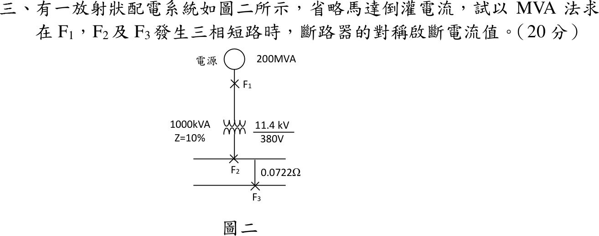
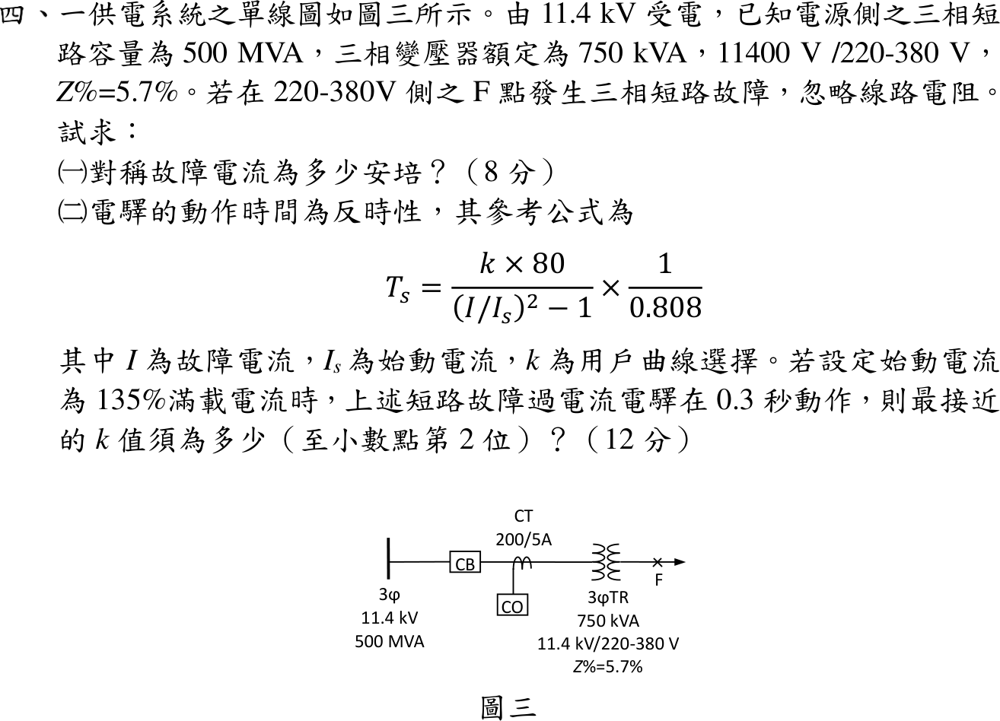

# 📝 112 年電機工程技師｜工業配電逐題詳解

> 本頁由題級 canonical 筆記組合；每題保留官方裁切圖、校驗狀態與可追溯的推導。

## 題目導覽
- [[#一、112 年工業配電第 1 題｜系統接地與設備接地|第 1 題：系統接地與設備接地]]
- [[#二、112 年工業配電第 2 題｜負載特性與需量計算|第 2 題：負載特性與需量計算]]
- [[#三、112 年工業配電第 3 題：放射狀系統三相短路|第 3 題：112 年工業配電第 3 題：放射狀系統三相短路]]
- [[#四、112 年工業配電第 4 題｜低壓側三相短路與反時性電驛|第 4 題：低壓側三相短路與反時性電驛]]
- [[#五、112 年工業配電第 5 題｜高壓受電保護與計量接線|第 5 題：高壓受電保護與計量接線]]

---

## 一、112 年工業配電第 1 題｜系統接地與設備接地

> 題級識別：EE-112-06-1
> canonical 來源：[[canonical/EE-112-06-1.md]]
> 題級校驗狀態：verified


### 已知與所求

（一）試述系統接地與設備接地之方法與目的（10 分）；（二）繪出兩種接地作法（10 分）。

### 考場標準作答

#### （一）方法與目的

**系統接地**：將發電機或變壓器中性點（或以接地變壓器建立的人工中性點）接至接地電極。方法有直接（低阻抗）接地、低／高電阻接地、電抗接地，以及不接地系統（須配絕緣監視）。目的：

- 固定系統對地電位，抑制中性點漂移與暫態過電壓；
- 限制並確定接地故障電流，使 51N／接地電驛能選擇性跳脫；
- 作為絕緣協調與避雷器額定的依據。

**設備接地**：以連續、足夠截面的設備接地導線（PE）把馬達外殼、配電盤體、金屬管、電纜鎧裝等正常不帶電的金屬部分連到接地母排與接地電極，並作等電位連結。目的：

- 絕緣破壞時降低外殼對地電壓，防止感電；
- 提供低阻抗故障回路，使斷路器、熔絲或漏電斷路器迅速動作；
- 降低接觸電壓與跨步電壓，減少火災與電弧危害。

\[
\boxed{\text{系統接地：中性點接地，控制系統電位與故障電流；設備接地：外殼經 PE 接地，保護人員並促成跳脫}}
\]

#### （二）接線作法

```text
系統接地（以電阻接地為例）          設備接地
  變壓器二次 Y 接                   L1 L2 L3 ─── 馬達繞組
   a  b  c                                         │ 外殼
   │  │  │                                         │
   └──┼──┘ N ── R_N ── 接地母排 ── 電極 ⏚          PE（綠色接地線）
      │                                            │
   負載中性線 N（帶負載電流）       配電盤 PE 母排 ── 接地電極 ⏚
```

\[
\boxed{\text{系統接地：中性點 N 經 }R_N\text{ 接地；設備接地：外殼以 PE 連至接地母排與電極}}
\]

### 驗算

故障路徑檢查：相線碰殼時電流 L→外殼→PE→接地母排→變壓器中性點接地→回到電源，兩種接地共同構成迴路；若缺系統接地，碰殼電流無回路，保護不動作；若缺設備接地，外殼帶相電壓。

### 失分點

- 把中性線 N 當作 PE 使用；N 正常有負載電流，PE 正常無電流。
- 只寫「接地」而未分開接地對象（中性點 vs. 外殼）。
- 圖中在下游多處重複連接 N 與 PE，形成並聯迴流路徑。

---

## 二、112 年工業配電第 2 題｜負載特性與需量計算

> 題級識別：EE-112-06-2
> canonical 來源：[[canonical/EE-112-06-2.md]]
> 題級校驗狀態：verified


### 已知與所求

| 變壓器 | 設備 | kVA | PF | 需量因數 | 負載因數 | 設備間參差因數 |
|---|---|---:|---:|---:|---:|---:|
| A | 1 | 300 | 0.95 | 0.80 | 0.70 | 1.2 |
| A | 2 | 250 | 0.85 | 0.60 | 0.60 | 1.2 |
| B | 3 | 500 | 0.80 | 0.50 | 0.40 | 1.4 |
| B | 4 | 250 | 0.70 | 0.70 | 0.50 | 1.4 |

變壓器間參差因數 1.15。求（一）各設備最高需量 kW；（二）各變壓器最小容量 kW；（三）總平均功率 kW；（四）全月用電度數。

### 考場標準作答

#### （一）各設備最高需量

\(P_{\max}=S\cdot\mathrm{PF}\cdot\mathrm{DF}\)：
\[
\boxed{P_1=228,\ P_2=127.5,\ P_3=200,\ P_4=122.5\ \mathrm{kW}}
\]

#### （二）各變壓器最小容量

\[
P_A=\frac{228+127.5}{1.2}=296.25,\qquad P_B=\frac{200+122.5}{1.4}=230.36\ \mathrm{kW}
\]
\[
P_{\text{主}}=\frac{296.25+230.36}{1.15}=457.92\,\mathrm{kW}
\]
\[
\boxed{P_A=296.25\,\mathrm{kW},\ P_B=230.36\,\mathrm{kW},\ P_{\text{主}}=457.92\,\mathrm{kW}}
\]

#### （三）總平均功率

平均功率＝最高需量 × 負載因數，可直接相加（參差因數只影響尖峰）：
\[
\boxed{P_{avg}=228(0.7)+127.5(0.6)+200(0.4)+122.5(0.5)=377.35\,\mathrm{kW}}
\]

#### （四）全月用電度數

以 30 日計：
\[
\boxed{E=377.35\times24\times30=271\,692\,\mathrm{kWh}}
\]

### 驗算

逐設備日電量 \(159.6(24)+76.5(24)+80(24)+61.25(24)=9056.4\,\mathrm{kWh}\)，\(\times30=271\,692\,\mathrm{kWh}\)。系統負載因數 \(377.35/457.92=0.824<1\)，合理。

### 失分點

- 平均功率再除以參差因數；參差因數只用於尖峰需量。
- 變壓器容量用 kVA 作答；題目指定 kW。
- 全月只乘 24 h（漏乘日數）。

### 條件與疑義

「全月」日數題目未給，此處取 30 日；若取 31 日則 \(280\,748\,\mathrm{kWh}\)。

---

## 三、112 年工業配電第 3 題：放射狀系統三相短路

> 題級識別：EE-112-06-3
> canonical 來源：[[canonical/EE-112-06-3.md]]
> 題級校驗狀態：verified



### 已知與所求

電源 \(200\,\mathrm{MVA}\)；變壓器 \(1000\,\mathrm{kVA}\)、\(Z=10\%\)、\(11.4\,\mathrm{kV}/380\,\mathrm V\)；F2（低壓母線）至 F3 線路 \(0.0722\,\Omega\)；省略馬達倒灌。以 MVA 法求 F1、F2、F3 三相短路時斷路器對稱啟斷電流。

### 考場標準作答

各元件短路 MVA：
\[
\mathrm{MVA}_S=200,\qquad \mathrm{MVA}_T=\frac{1}{0.10}=10,\qquad \mathrm{MVA}_L=\frac{0.38^2}{0.0722}=2
\]
串聯元件以倒數相加：
\[
\mathrm{MVA}_{F2}=\frac{200(10)}{210}=9.5238,\qquad \mathrm{MVA}_{F3}=\frac{9.5238(2)}{11.5238}=1.6529
\]
\[
\boxed{I_{F1}=\frac{200}{\sqrt3(11.4)}=10.129\,\mathrm{kA}}
\]
\[
\boxed{I_{F2}=\frac{9.5238}{\sqrt3(0.38)}=14.470\,\mathrm{kA}}
\]
\[
\boxed{I_{F3}=\frac{1.6529}{\sqrt3(0.38)}=2.511\,\mathrm{kA}}
\]

### 驗算

歐姆法（380 V 側）：\(Z_S=0.38^2/200=0.000722\)、\(Z_T=0.1(0.38^2)/1=0.01444\)，F3 總阻抗 \(0.087362\,\Omega\)，\(I_{F3}=380/(\sqrt3\times0.087362)=2511\,\mathrm A\)，一致。

### 失分點

- 串聯元件 MVA 直接相加；MVA 法串聯取倒數和。
- F2、F3 用 11.4 kV 換算電流；應用故障點所在 380 V。
- 線路 \(0.0722\,\Omega\) 未換成 \(V^2/Z=2\,\mathrm{MVA}\) 就與其他 MVA 合成。

---

## 四、112 年工業配電第 4 題｜低壓側三相短路與反時性電驛

> 題級識別：EE-112-06-4
> canonical 來源：[[canonical/EE-112-06-4.md]]
> 題級校驗狀態：verified



### 已知與所求

11.4 kV 受電，電源三相短路容量 \(500\,\mathrm{MVA}\)；變壓器 \(750\,\mathrm{kVA}\)、\(11400\,\mathrm V/220\text{-}380\,\mathrm V\)、\(Z\%=5.7\%\)；CT \(200/5\) 與 CO 電驛在高壓側；F 點在低壓側三相短路，忽略線路電阻。求（一）對稱故障電流（8 分）；（二）始動電流 \(135\%\) 滿載、\(0.3\,\mathrm s\) 動作時的 \(k\)（至小數第 2 位，12 分）。

#### 官方題目公式

\[
T_s=\dfrac{k\times80}{(I/I_s)^2-1}\times\dfrac{1}{0.808}
\]

### 考場標準作答

#### （一）對稱故障電流

取 \(S_b=750\,\mathrm{kVA}\)、低壓線電壓 \(380\,\mathrm V\)（220 V 為相電壓）：
\[
X=\frac{0.75}{500}+0.057=0.0585\,\mathrm{pu},\qquad I_b=\frac{750\,000}{\sqrt3(380)}=1139.507\,\mathrm A
\]
\[
I_F=\frac{1139.507}{0.0585}=19\,478.754\,\mathrm A\approx\boxed{19.48\,\mathrm{kA}}
\]

#### （二）\(k\) 值

CT 在高壓側，故障電流與始動電流都換到 11.4 kV 側：
\[
I_{F,H}=19\,478.754\times\frac{380}{11\,400}=649.292\,\mathrm A,\qquad
I_s=1.35\times\frac{750\,000}{\sqrt3(11\,400)}=1.35(37.9836)=51.2778\,\mathrm A
\]
\[
\frac{I}{I_s}=12.6622349,\qquad \left(\frac{I}{I_s}\right)^2-1=159.3321923
\]
\[
k=\frac{0.3\times0.808\times159.3321923}{80}=0.4827765\Rightarrow\boxed{0.48}
\]

### 驗算

歐姆法（380 V 側）：\(X_s=380^2/(500\times10^6)=0.000289\,\Omega\)、\(X_T=0.057(380^2/750\,000)=0.010974\,\Omega\)，\(I_F=380/[\sqrt3(0.011263)]=19\,479\,\mathrm A\)。比值與側別無關：\(I/I_s=1/(0.0585\times1.35)=12.662\)，回代 \(T_s=0.48(80)/159.33/0.808=0.298\,\mathrm s\approx0.3\,\mathrm s\)。

### 失分點

- 用相電壓 220 V 計算三相故障電流（會放大 \(\sqrt3\) 倍）。
- 故障電流用低壓側、始動電流用高壓側，\(I/I_s\) 差 30 倍。
- 把 \(\times\dfrac{1}{0.808}\) 看成 \(\times0.808\)。

---

## 五、112 年工業配電第 5 題｜高壓受電保護與計量接線

> 題級識別：EE-112-06-5
> canonical 來源：[[canonical/EE-112-06-5.md]]
> 題級校驗狀態：verified


### 已知與所求

圖四：母線—虛線區—CB—虛線區—負載。在虛線範圍加入 50/51、51N、CT、PT、AS、VS、V、A、27、kW，繪出合理接線（20 分）。

### 考場標準作答

一次側配置：電源側虛線區放 PT（電壓取樣，CB 跳脫後仍可監視電源電壓，供 27 判斷）；負載側虛線區放三相 CT（CB 的保護區）。

```text
母線 ─┬───────────── CB ────┬──────────→ 負載
      │                      │
     PT(V-V 或 Y-Y)         CT ×3（a、b、c）
      │ 二次 110 V           │ 二次 5 A
      │                      │
  Fuse ─ VS ─ V              ├─ AS ─ A
      ├──── 27 ──┐           ├─ 50/51（a、b、c 各一）
      └── kW 電壓線圈        ├─ 51N（三相 CT 殘流點，或零序 CT）
                 │           └─ kW 電流線圈（兩瓦特計：a、c 相）
                 └── 50/51、51N、27 跳脫接點 ── CB 跳脫線圈（TC）
```

接線原則：

- CT 二次為電流源，A、50/51、kW 電流線圈全部**串聯**；51N 接在三相 CT 共點的殘流路徑 \(I_a+I_b+I_c\)；AS 切換時不得使 CT 開路。
- PT 二次為電壓源，V、27、kW 電壓線圈全部**並聯**，二次側加熔絲；VS 選取 \(V_{ab}\)、\(V_{bc}\)、\(V_{ca}\)。
- kW 表三相三線用兩瓦特計：電流取 a、c 相 CT，電壓取 \(V_{ab}\)、\(V_{cb}\)。
- CT、PT 二次各單點接地；保護電驛接點並聯接至 CB 跳脫線圈。

\[
\boxed{\text{PT 在 CB 電源側、CT 在負載側；CT 二次串接 A、50/51、51N（殘流）、kW；PT 二次並接 V（經 VS）、27、kW}}
\]

### 驗算

兩瓦特計檢查：\(P=V_{ab}I_a\cos(30^\circ+\phi)+V_{cb}I_c\cos(30^\circ-\phi)=\sqrt3V_LI_L\cos\phi\)，確認 kW 表取 a、c 相電流與 \(V_{ab}\)、\(V_{cb}\) 的接法正確。51N 正常時 \(I_a+I_b+I_c=0\) 不動作，接地故障時殘流 \(3I_0\) 流入，動作邏輯正確。

### 失分點

- CT 二次開路（AS 切換或抽換儀表時），會產生高壓危險；須用短路片。
- 把 V、27 串聯接在 PT 二次；電壓元件必須並聯。
- 51N 接在單相 CT 上；應接殘流路徑或零序 CT。

---
