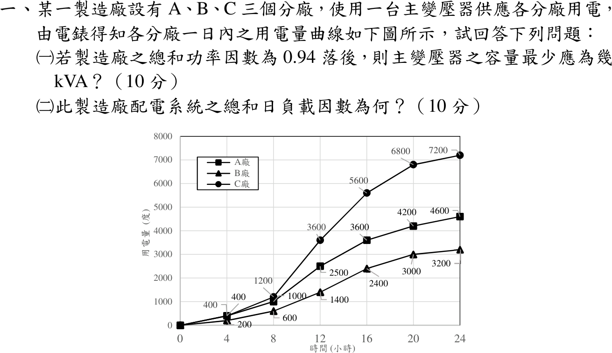
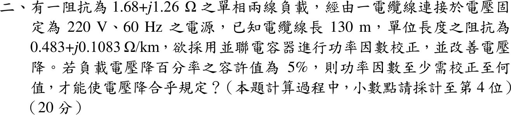
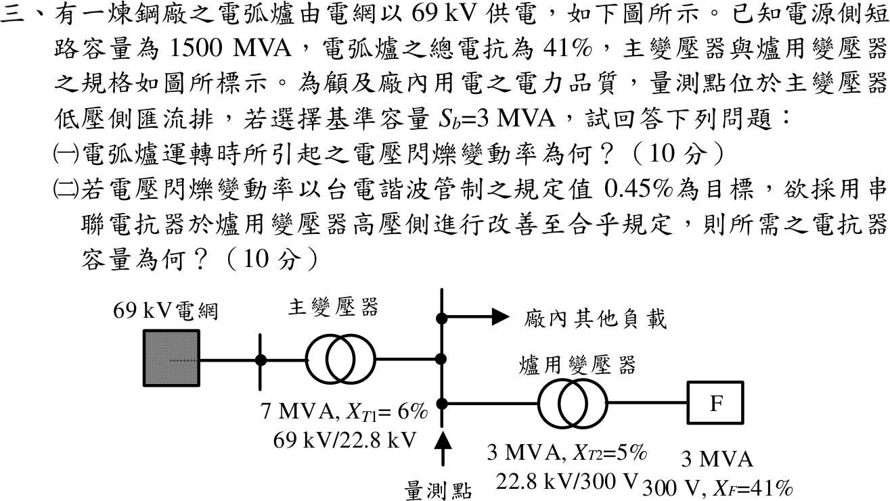
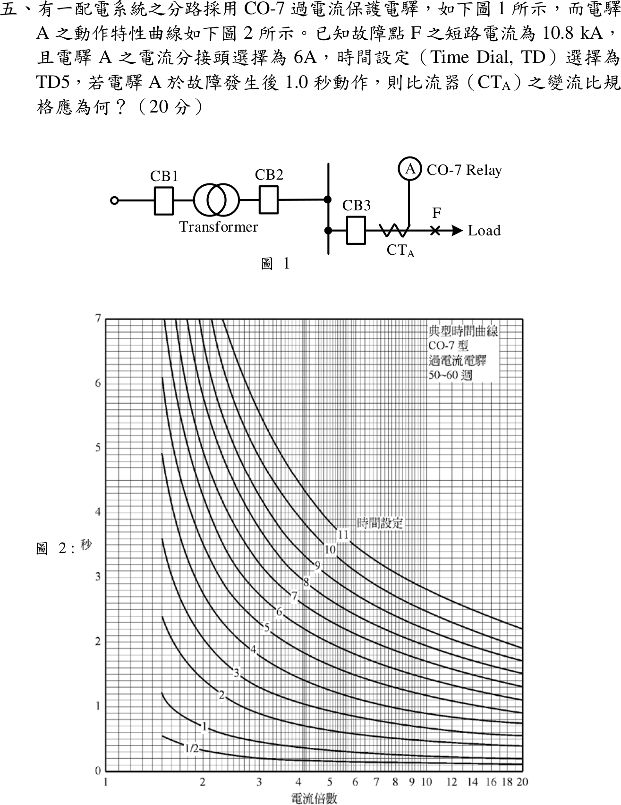

# 📝 113 年電機工程技師｜工業配電逐題詳解

> 本頁由題級 canonical 筆記組合；每題保留官方裁切圖、校驗狀態與可追溯的推導。

## 題目導覽
- [[#一、113 年第 1 題｜日負載曲線與主變壓器容量|第 1 題：日負載曲線與主變壓器容量]]
- [[#二、113 年第 2 題｜單相線路壓降與功率因數校正|第 2 題：單相線路壓降與功率因數校正]]
- [[#三、113 年第 3 題｜電弧爐電壓閃爍與串聯電抗器|第 3 題：電弧爐電壓閃爍與串聯電抗器]]
- [[#四、113 年第 4 題｜480 V 匯流排三相短路啟斷容量|第 4 題：480 V 匯流排三相短路啟斷容量]]
- [[#五、113 年第 5 題｜CO-7 過電流電驛與 CT 比流器|第 5 題：CO-7 過電流電驛與 CT 比流器]]

---

## 一、113 年第 1 題｜日負載曲線與主變壓器容量

> 題級識別：EE-113-06-1
> canonical 來源：[[canonical/EE-113-06-1.md]]
> 題級校驗狀態：verified

### 已知與所求

圖為 A、B、C 三分廠電錶的累積用電量（度）曲線，0–24 h 每 4 h 一點；總和 PF \(0.94\) 落後。求（一）主變壓器最小容量 kVA；（二）總和日負載因數。

| 時間（h） | 0 | 4 | 8 | 12 | 16 | 20 | 24 |
|---|---:|---:|---:|---:|---:|---:|---:|
| A 廠 | 0 | 400 | 1000 | 2500 | 3600 | 4200 | 4600 |
| B 廠 | 0 | 200 | 600 | 1400 | 2400 | 3000 | 3200 |
| C 廠 | 0 | 400 | 1200 | 3600 | 5600 | 6800 | 7200 |
| 合計 | 0 | 1000 | 2800 | 7500 | 11600 | 14000 | 15000 |

### 考場標準作答

#### （一）主變壓器容量

縱軸為累積電能，相鄰讀值相減除以 4 h 得區間平均需量（總和）：

| 區間（h） | 0–4 | 4–8 | 8–12 | 12–16 | 16–20 | 20–24 |
|---|---:|---:|---:|---:|---:|---:|
| 增量（kWh） | 1000 | 1800 | 4700 | 4100 | 2400 | 1000 |
| 需量（kW） | 250 | 450 | 1175 | 1025 | 600 | 250 |

最大總和需量 \(P_{\max}=4700/4=1175\,\mathrm{kW}\)（8–12 h），
\[
S_{\min}=\frac{1175}{0.94}=\boxed{1250\,\mathrm{kVA}}
\]

#### （二）總和日負載因數

\[
\mathrm{LF}=\frac{15000/24}{1175}=\frac{625}{1175}=\boxed{53.19\%}
\]

### 驗算

各廠全日用電 \(4600+3200+7200=15000\,\mathrm{kWh}\)，等於六區間增量和 \(1000+1800+4700+4100+2400+1000\)。8–12 h 分廠增量 \(1500+800+2400=4700\,\mathrm{kWh}\)，確為最大區間。

### 失分點

- 把累積讀值（如 24 h 的 7200）當瞬時 kW。
- 各廠個別最大需量相加（\(375+250+600=1225\,\mathrm{kW}\)）不是總和需量；B 廠最大在 12–16 h，與 A、C 不同時。
- 8 h 讀值為 A 1000、B 600、C 1200（合計 2800）；讀錯會使 8–12 h 增量偏離 4700。

---

## 二、113 年第 2 題｜單相線路壓降與功率因數校正

> 題級識別：EE-113-06-2
> canonical 來源：[[canonical/EE-113-06-2.md]]
> 題級校驗狀態：verified

### 已知與所求

單相兩線負載 \(Z=1.68+j1.26\,\Omega\)，電源固定 \(220\,\mathrm V\)、\(60\,\mathrm{Hz}\)；電纜長 \(130\,\mathrm m\)，\(0.483+j0.1083\,\Omega/\mathrm{km}\)；並聯電容校正功率因數。負載電壓降百分率容許 \(5\%\)，求至少需校正到的功率因數（計算至小數第 4 位）。

### 考場標準作答

來回線路阻抗：
\[
Z_\ell=2(0.130)(0.483+j0.1083)=0.12558+j0.028158\,\Omega
\]
未校正時 \(I=220/|1.8056+j1.2882|=99.19\,\mathrm A\)，\(V_L=99.19(2.1)=208.30\,\mathrm V\)，壓降 \((220-208.30)/208.30=5.62\%>5\%\)。

壓降百分率以負載電壓為分母：\(V_L\ge220/1.05=209.5238\,\mathrm V\)，\(\Delta V\le10.4762\,\mathrm V\)。此時負載實功率（電容不吸收實功率）
\[
P=\frac{V_L^2R}{|Z|^2}=\frac{209.5238^2(1.68)}{4.41}=16723.90\,\mathrm W,\qquad I\cos\phi=\frac{P}{V_L}=79.8186\,\mathrm A
\]
由 \(\Delta V\approx I(R_\ell\cos\phi+X_\ell\sin\phi)=I\cos\phi(R_\ell+X_\ell\tan\phi)\)：
\[
\tan\phi=\frac{10.4762/79.8186-0.12558}{0.028158}=\frac{0.131250-0.12558}{0.028158}=0.2014
\]
\[
\boxed{\mathrm{PF}_{\min}=\frac1{\sqrt{1+0.2014^2}}=0.9803\text{ 落後}}
\]

### 驗算

精確相量解：令電容電納 \(B\)，\(Z_{eq}=1/(Y_L+jB)\)，\(V_L=220\,|Z_{eq}/(Z_\ell+Z_{eq})|\)。二分法解 \(V_L=209.5238\,\mathrm V\) 得 \(B=0.2090\,\mathrm S\)（\(Q_c=9.18\,\mathrm{kvar}\)），\(Z_{eq}\) 的功率因數 \(0.98033\)，與近似式 \(0.9803\) 一致。

### 失分點

- 線長 130 m 未乘 2；單相兩線來回皆有阻抗。另 \(\Delta V/(I\cos\phi)=0.131250\) 與 \(R_\ell\) 幾乎相消，\(Z_\ell\) 若捨入成 \(0.1256+j0.0282\) 會得 PF \(0.9805\)，須保留 \(0.12558+j0.028158\)。
- 負載為定阻抗，\(P\) 須用校正後負載電壓 \(209.5238\,\mathrm V\) 計算，不能直接用 \(220\,\mathrm V\) 而不同時調整 \(\Delta V\) 的基準。
- 若把壓降百分率改以電源電壓為分母（\(V_L\ge209\,\mathrm V\)），精確解 PF 約 \(0.9147\)；本題「負載電壓降百分率」以負載端電壓為分母。

---

## 三、113 年第 3 題｜電弧爐電壓閃爍與串聯電抗器

> 題級識別：EE-113-06-3
> canonical 來源：[[canonical/EE-113-06-3.md]]
> 題級校驗狀態：verified

### 已知與所求

69 kV 電網短路容量 \(1500\,\mathrm{MVA}\)；主變 \(7\,\mathrm{MVA}\)、\(X_{T1}=6\%\)、\(69/22.8\,\mathrm{kV}\)；爐用變壓器 \(3\,\mathrm{MVA}\)、\(X_{T2}=5\%\)、\(22.8\,\mathrm{kV}/300\,\mathrm V\)；電弧爐 \(3\,\mathrm{MVA}\)、\(X_F=41\%\)；量測點在主變低壓側匯流排；\(S_b=3\,\mathrm{MVA}\)。求（一）電壓閃爍變動率；（二）以 \(0.45\%\) 為目標，在爐變高壓側加串聯電抗器所需容量。

### 考場標準作答

#### （一）閃爍變動率

\[
X_s=\frac{3}{1500}=0.002,\qquad X_{T1}=0.06\cdot\frac37=0.025714,\qquad X_{T2}=0.05,\qquad X_F=0.41
\]
量測點上游 \(X_u=0.027714\)，下游 \(X_d=0.46\,\mathrm{pu}\)。斷弧時量測點 \(1\,\mathrm{pu}\)，電弧爐運轉（電極短路）時 \(X_d/(X_u+X_d)\)：
\[
\Delta V=\frac{X_u}{X_u+X_d}=\frac{0.027714}{0.487714}=\boxed{5.6825\%}
\]

#### （二）串聯電抗器

\[
0.0045=\frac{0.027714}{0.487714+X_R}\Rightarrow X_R=\frac{0.027714}{0.0045}-0.487714=\boxed{5.6710\,\mathrm{pu}}
\]
電抗器以爐用變壓器額定電流（即 \(3\,\mathrm{MVA}\) 基準電流）標示容量：
\[
\boxed{Q_R=X_RS_b=5.6710(3)=17.01\,\mathrm{MVA}}
\]
歐姆值 \(X_R=5.6710\times\dfrac{22.8^2}{3}=982.7\,\Omega\)（22.8 kV 側）。

### 驗算

加入 \(X_R\) 後電流 \(I=1/(0.487714+5.6710)=0.16237\,\mathrm{pu}\)，母線電壓變動 \(IX_u=0.16237(0.027714)=0.00450\)，即 \(0.45\%\)。

### 失分點

- 爐用變壓器算入量測點上游，分子錯誤。
- \(0.45\%\) 代成 \(0.045\) 或 \(0.45\)。
- 只寫 pu 值而未換成容量或歐姆值。

### 條件與疑義

「電抗器容量」依慣例以額定電流（此處等於 3 MVA 基準電流）下的 \(I^2X\) 標示為 \(17.01\,\mathrm{MVA}\)；若指改善後實際電弧短路時的無效功率，則為 \(I^2X_RS_b=0.16237^2(5.6710)(3)=0.449\,\mathrm{Mvar}\)。

---

## 四、113 年第 4 題｜480 V 匯流排三相短路啟斷容量

> 題級識別：EE-113-06-4
> canonical 來源：[[canonical/EE-113-06-4.md]]
> 題級校驗狀態：needs_manual_review
> [!WARNING] 本題仍有官方資料缺口或事件定義歧義；請以 canonical 條件式解答為準。

### 已知與所求

22.8 kV 匯流排短路容量 \(250\,\mathrm{MVA}\)；主變 \(3000\,\mathrm{kVA}\)、\(22.8/6.6\,\mathrm{kV}\)、\(X_{T1}=5\%\)；6.6 kV 母線接同步馬達 \(6.3\,\mathrm{kV}\)、\(1000\,\mathrm{HP}\)、\(X_d''=15\%\)、\(X_d'=25\%\)，及配電變壓器 \(750\,\mathrm{kVA}\)、\(6.6\,\mathrm{kV}/480\,\mathrm V\)、\(X_{T2}=3.5\%\)；其後 CB—F—感應馬達 \(480\,\mathrm V\)、\(500\,\mathrm{HP}\)、\(X_m''=25\%\)；\(1\,\mathrm{HP}\approx1\,\mathrm{kVA}\)，\(S_b=3000\,\mathrm{kVA}\)。求 480 V 斷路器啟斷容量。

以下為初始對稱次暫態條件解（各內電勢 \(1\angle0^\circ\)、忽略電阻），見「條件與疑義」。

### 考場標準作答

\[
X_s=\frac{3}{250}=0.012,\quad X_{T1}=0.05,\quad X_{SM}''=0.15\cdot\frac31\left(\frac{6.3}{6.6}\right)^2=0.410021,\quad X_{T2}=0.035\cdot\frac{3}{0.75}=0.14,\quad X_{IM}''=0.25\cdot\frac{3}{0.5}=1.50
\]
經 CB 的上游支路：
\[
X_u=(0.062\parallel0.410021)+0.14=0.193856\,\mathrm{pu}
\]
低壓基準電流 \(I_b=\dfrac{3\times10^6}{\sqrt3(480)}=3608.44\,\mathrm A\)。CB 支路（上游貢獻）：
\[
\boxed{S_{\mathrm{CB}}=\frac{3}{0.193856}=15.475381\,\mathrm{MVA}},\qquad
\boxed{I_{\mathrm{CB}}=\frac{3608.44}{0.193856}=18.613991\,\mathrm{kA}}
\]
感應馬達倒灌 \(3/1.50=2\,\mathrm{MVA}\)、\(2.405626\,\mathrm{kA}\)，F 點總量：
\[
\boxed{S_F=17.475381\,\mathrm{MVA}},\qquad \boxed{I_F=21.019617\,\mathrm{kA}}
\]
依圖 CB 位於 \(T_2\) 與 F 之間，馬達倒灌不流經此 CB；若依慣例取斷路器任一側故障的最大值選額定，則以 F 點總量 \(17.48\,\mathrm{MVA}\) 選用。

### 驗算

節點法：6.6 kV 母線電壓 \(V_1=\dfrac{1/0.062+1/0.410021}{1/0.062+1/0.410021+1/0.14}=0.72218\,\mathrm{pu}\)，\(I_{\mathrm{CB}}=V_1/0.14=5.1585\,\mathrm{pu}\)，\(\times3=15.4754\,\mathrm{MVA}\)；\(X_u\parallel1.50=0.171670\)，\(3/0.171670=17.4754\,\mathrm{MVA}\)，與支路相加一致。

### 失分點

- 同步馬達換基準漏乘 \((6.3/6.6)^2\)；未修正得 \(0.45\,\mathrm{pu}\)。
- 把 \(250\,\mathrm{MVA}\) 與馬達 kVA 直接相加，未先換成標么電抗。
- CB 支路量與 F 點總量混稱。

### 條件與疑義

題面未指定啟斷電流的計算程序、接點分離時間、衰減時間常數與故障前運轉狀態，故上列只是初始次暫態估算，不宣稱為唯一官方口徑；單有 \(X_d'=25\%\) 也不能決定接點分離時刻的電流。

---

## 五、113 年第 5 題｜CO-7 過電流電驛與 CT 比流器

> 題級識別：EE-113-06-5
> canonical 來源：[[canonical/EE-113-06-5.md]]
> 題級校驗狀態：verified

### 已知與所求

故障點 F 短路電流 \(10.8\,\mathrm{kA}\)；電驛 A 分接頭 \(6\,\mathrm A\)、時間設定 TD5；故障後 \(1.0\,\mathrm s\) 動作；圖 2 為 CO-7 時間曲線（橫軸電流倍數 1–20 對數刻度，縱軸 0–7 s）。求 \(\mathrm{CT_A}\) 變流比。

### 考場標準作答

在圖 2 沿 \(t=1.0\,\mathrm s\) 水平線找 TD5 曲線：TD5 在倍數 14 約 \(1.04\,\mathrm s\)、15 約 \(1.01\,\mathrm s\)、18 約 \(0.95\,\mathrm s\)，故交點
\[
M=\frac{I_{\text{relay}}}{I_{\text{tap}}}\approx15
\]
電驛二次電流與變流比：
\[
I_{\text{relay}}=15(6)=90\,\mathrm A,\qquad \mathrm{CTR}=\frac{10800}{90}=120
\]
\[
\boxed{\mathrm{CT_A}=600/5\,\mathrm A}
\]

### 驗算

回代：\(10800\times5/600=90\,\mathrm A\)，\(90/6=15\) 倍，圖上 TD5 在 15 倍約 \(1.0\,\mathrm s\)。鄰近標準比 \(500/5\) 得 18 倍（約 \(0.95\,\mathrm s\)）、\(750/5\) 得 12 倍（約 \(1.10\,\mathrm s\)），皆偏離 1.0 s 較多。

### 失分點

- 讀錯曲線：倍數 6 在 TD5 上約 \(1.5\,\mathrm s\)（1.0 s 附近的是 TD3–TD4），若取 \(M=6\) 會得 \(1500/5\)。
- 電流倍數是相對分接頭 \(6\,\mathrm A\)，不是相對 CT 二次額定 \(5\,\mathrm A\)。
- 只答 CTR \(=120\) 未寫成標準規格 \(600/5\,\mathrm A\)。

---
