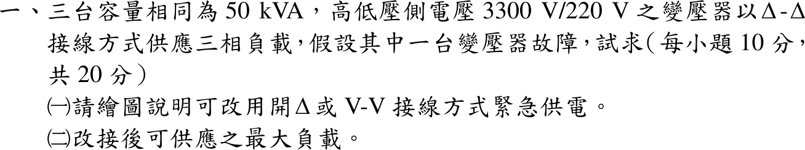
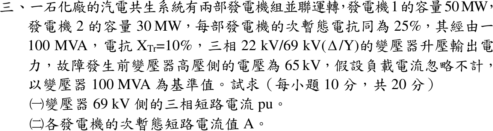
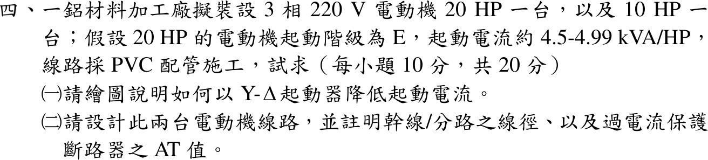

# 📝 114 年電機工程技師｜工業配電逐題詳解

> 本頁由題級 canonical 筆記組合；每題保留 QID、官方裁切、校驗狀態與完整得分型解答。

## 題目導覽
- [[#一、114 年工業配電第 1 題｜開三角（V-V）緊急供電|第 1 題：開三角（V-V）緊急供電]]
- [[#二、114 年工業配電第 2 題｜電弧爐壓降與閃爍電壓變動|第 2 題：電弧爐壓降與閃爍電壓變動]]
- [[#三、114 年工業配電第 3 題｜汽電共生系統三相短路|第 3 題：汽電共生系統三相短路]]
- [[#四、114 年工業配電第 4 題｜Y-Δ 起動與電動機線路設計|第 4 題：Y-Δ 起動與電動機線路設計]]
- [[#五、114 年工業配電第 5 題｜APFR 電容器分段投入|第 5 題：APFR 電容器分段投入]]

---

## 一、114 年工業配電第 1 題｜開三角（V-V）緊急供電

> 題級識別：`EE-114-06-1`
> canonical 來源：`canonical/EE-114-06-1.md`
> 題級校驗狀態：`verified`

![[01_原始試題/依考科/06_工業配電/images/questions/PE_114年_工業配電_Q01.png]]

> 官方裁切來源：`01_原始試題/依考科/06_工業配電/images/questions/PE_114年_工業配電_Q01.png`



### 已知與所求

三台單相變壓器各 \(50\,\mathrm{kVA}\)、\(3300/220\,\mathrm{V}\)，原為 \(\Delta\text{-}\Delta\) 供三相負載；其中一台故障。求（一）繪圖說明改接開 \(\Delta\)（V-V）；（二）改接後可供應之最大負載。

### 考場標準作答

#### （一）開三角接線

拆除故障單元，一次側兩台仍接於 AB、BC 兩線電壓，二次側同名端對應接成 ab、bc 兩邊；ca 邊空缺（不可短接）。

```text
一次 3300 V        二次 220 V
A ──┐               ┌── a
    T1(AB)          T1(ab)
B ──┤               ├── b
    T2(BC)          T2(bc)
C ──┘               └── c
   （CA 邊空缺）     （ca 邊空缺，Vca = -(Vab+Vbc)）
```

兩邊電壓相差 \(120^\circ\)，相量和 \(V_{ca}=-(V_{ab}+V_{bc})\) 自動補出第三個線電壓，故仍得平衡三相 \(220\,\mathrm{V}\)。

\[
\boxed{\text{兩台單相變壓器接成開 }\Delta\text{（V-V），第三邊開路，仍輸出三相 }220\,\mathrm{V}}
\]

#### （二）最大負載

開三角中，線 a、c 各只連一個繞組，故線電流＝繞組電流，上限為繞組額定電流：
\[
I_{2N}=\frac{50\,000}{220}=227.2727\,\mathrm{A}
\]
\[
S_{3\phi,\max}=\sqrt3\,V_LI_{2N}=\sqrt3(220)(227.2727)=\boxed{86.60\,\mathrm{kVA}}
\]
即原 \(150\,\mathrm{kVA}\) 的 \(57.7\%\)，剩餘兩台設備容量 \(100\,\mathrm{kVA}\) 的 \(86.6\%\)。題目未給功率因數，故答案以 kVA 表示，不寫成 kW。

### 驗算

#### 獨立驗算

容量公式 \(S_{VV}=\sqrt3S_{1\phi}=\sqrt3(50)=86.60\,\mathrm{kVA}\)，與繞組電流法一致。平衡線電流 \(I_a=I\angle0^\circ\)、\(I_c=I\angle120^\circ\) 由 KCL 各自全部流經 ab、bc 繞組，兩繞組電流大小皆為 \(I\)，同時達額定，無一台先過載。

### 失分點

- 把剩餘兩台直接相加成 \(100\,\mathrm{kVA}\)；兩台各輸出 \(50\,\mathrm{kVA}\)，但複功率相角差 \(60^\circ\)，合成只得 \(2(50)\cos30^\circ=86.6\,\mathrm{kVA}\)。
- \(57.7\%\) 與 \(86.6\%\) 的分母不同（原三台 \(150\) 與剩餘兩台 \(100\,\mathrm{kVA}\)），須標明。
- 圖中把空缺的第三邊畫成導線，會造成短路。


---

## 二、114 年工業配電第 2 題｜電弧爐壓降與閃爍電壓變動

> 題級識別：`EE-114-06-2`
> canonical 來源：`canonical/EE-114-06-2.md`
> 題級校驗狀態：`needs_manual_review`

![[01_原始試題/依考科/06_工業配電/images/questions/PE_114年_工業配電_Q02.png]]

> 官方裁切來源：`01_原始試題/依考科/06_工業配電/images/questions/PE_114年_工業配電_Q02.png`

> [!WARNING] 本題仍有官方資料缺口或事件定義歧義；以下條件分支不得視為唯一無條件答案。


### 已知與所求

基準 \(25\,\mathrm{MVA}\)；系統短路容量 \(2000\,\mathrm{MVA}\)，\(Z_L=j0.01\)、\(Z_{MTr}=j0.06\)、\(Z_{FTr}=j0.05\)、電弧爐及其配線 \(Z_F=j0.4\,\mathrm{pu}\)，電阻忽略。圖示串聯順序：電源—\(Z_s\)—\(Z_L\)—主變—二次側母線—爐變—\(Z_F\)—爐 F。求（一）電極短路與斷弧時主變二次側百分壓降；（二）二次側閃爍電壓變動率。

本題 \(Z_F\) 在電極短路時剩餘多少未明定，以下為條件主解，見「條件與疑義」。

### 考場標準作答

#### （一）百分壓降

\(X_s=25/2000=0.0125\,\mathrm{pu}\)。量測點上游、下游電抗：
\[
X_u=0.0125+0.01+0.06=0.0825,\qquad X_d=0.05+0.4=0.45\ \mathrm{pu}
\]
電極短路（電弧電壓為零、\(Z_F\) 全數保留），取 \(\underline E=1\angle0^\circ\)：
\[
\underline I_{sc}=\frac1{j0.5325}=-j1.87793\,\mathrm{pu},\qquad
\underline V_2=1-\underline I_{sc}(j0.0825)=0.84507\,\mathrm{pu}
\]
電極短路時壓降 \(\boxed{15.49\%}\)；斷弧時 \(I=0\)、\(V_2=1\,\mathrm{pu}\)，壓降 \(\boxed{0\%}\)。

#### （二）閃爍電壓變動率

以額定電壓為分母，兩狀態電壓差：
\[
\boxed{\Delta V\%=\frac{1-0.84507}{1}\times100\%=15.49\%}
\]
此為最大電壓變動率，不是閃爍嚴重度 \(P_{st}\)。

### 驗算

下游分壓：\(V_2=\dfrac{j0.45}{j0.5325}=0.84507\,\mathrm{pu}\)；\(IX_u+IX_d=1.87793(0.0825+0.45)=1.0000\,\mathrm{pu}\)，KVL 成立。

### 失分點

- \(X_s\) 寫成 \(2000/25\)，或未換到 \(25\,\mathrm{MVA}\) 共同基準。
- 把爐變算在量測點上游；量測點在主變二次側，分子只含 \(X_s+X_L+X_{MTr}\)。
- 把母線電壓誤當電極電壓；短路時電極電壓為零，母線電壓為 \(0.845\,\mathrm{pu}\)。

### 條件與疑義

原題稱 \(Z_F\) 為「電弧爐及其配線之等效阻抗」，未拆分固定配線與隨電弧狀態改變的部分，因此不能據此宣稱唯一答案。官方圖將 \(Z_F\) 畫在爐 F 前方，且沒有畫出繞過 \(Z_F\) 的短接支路，支持全部保留的條件主解 \(15.49\%\)（總電抗 \(0.5325\,\mathrm{pu}\)）。

令短路時剩餘電抗為 \(X_{F,sc}\)，共同式為
\[
\Delta V\%=\frac{0.0825}{0.0825+0.05+X_{F,sc}}\times100\%
\]
\(X_{F,sc}=0.4\) 得 \(15.49\%\)；\(X_{F,sc}=0\) 得 \(62.26\%\)。兩值都不是取得官方評分答案；取得 \(Z_F\) 的短路定義後應依該證據定案。


---

## 三、114 年工業配電第 3 題｜汽電共生系統三相短路

> 題級識別：`EE-114-06-3`
> canonical 來源：`canonical/EE-114-06-3.md`
> 題級校驗狀態：`needs_manual_review`

![[01_原始試題/依考科/06_工業配電/images/questions/PE_114年_工業配電_Q03.png]]

> 官方裁切來源：`01_原始試題/依考科/06_工業配電/images/questions/PE_114年_工業配電_Q03.png`

> [!WARNING] 本題仍有官方資料缺口或事件定義歧義；以下條件分支不得視為唯一無條件答案。



### 已知與所求

發電機 1 為 \(50\,\mathrm{MW}\)、發電機 2 為 \(30\,\mathrm{MW}\)，\(X''_d\) 均為 \(25\%\)（各自額定基準），並聯後經 \(100\,\mathrm{MVA}\)、\(X_{Tr}=10\%\)、\(22/69\,\mathrm{kV}\ (\Delta/\mathrm Y)\) 變壓器升壓；故障前高壓側 \(65\,\mathrm{kV}\)，忽略負載電流；基準 \(100\,\mathrm{MVA}\)。求（一）69 kV 側三相短路電流 pu；（二）各發電機次暫態短路電流 A。

題目未給額定 MVA 或功率因數；以下主解採 \(c_1=c_2=1.0\)（MW 數值＝MVA）條件，見「條件與疑義」。

### 考場標準作答

#### （一）69 kV 側短路電流

換至 \(100\,\mathrm{MVA}\) 基準：
\[
X_1=0.25\frac{100}{50}=0.5,\qquad X_2=0.25\frac{100}{30}=0.8333\ \mathrm{pu}
\]
\[
X_{th}=\frac{0.5(0.8333)}{0.5+0.8333}+0.1=0.3125+0.1=0.4125\,\mathrm{pu}
\]
故障前電壓 \(V_F=65/69=0.94203\,\mathrm{pu}\)：
\[
I_{sc}=\frac{0.94203}{0.4125}=\boxed{2.2837\,\mathrm{pu}}
\]

#### （二）各發電機電流

22 kV 側基準電流 \(I_b=\dfrac{100\times10^6}{\sqrt3(22\times10^3)}=2624.32\,\mathrm A\)；並聯支路依電抗反比分流（\(\Delta/\mathrm Y\) 相移不影響大小）：
\[
I_{G1}=\frac{0.8333}{1.3333}(2.2837)(2624.32)=\boxed{3745.7\,\mathrm A}
\]
\[
I_{G2}=\frac{0.5}{1.3333}(2.2837)(2624.32)=\boxed{2247.4\,\mathrm A}
\]

### 驗算

節點法：令兩機內電勢均為 \(0.94203\,\mathrm{pu}\)、69 kV 母線短路，解得發電機母線電壓 \(V_g=I_{sc}X_T=0.22837\,\mathrm{pu}\)；\((0.94203-0.22837)/0.5=1.4273\)、\((0.94203-0.22837)/0.8333=0.8564\)，和為 \(2.2837\,\mathrm{pu}\)，KCL 成立。

### 失分點

- 兩機直接以 \(0.25\,\mathrm{pu}\) 並聯，未換到 \(100\,\mathrm{MVA}\) 基準。
- 用 \(V_F=1\) 而忽略 \(65/69=0.94203\,\mathrm{pu}\)。
- 發電機電流用 69 kV 基準電流 \(836.7\,\mathrm A\) 換算；機組電流應在 22 kV 側。

### 條件與疑義

標么電抗的機組基準是額定 MVA，但題面只給 \(50\,\mathrm{MW}\)、\(30\,\mathrm{MW}\)。若額定 MVA 為 \(S_1,S_2\)：
\[
I_{sc}=\frac{65/69}{0.1+25/(S_1+S_2)},\qquad I_{Gi}=\frac{S_i}{S_1+S_2}I_{sc}I_b
\]

| 額定功率因數假設 | \((S_1,S_2)\) | \(I_{sc}\) | \(I_{G1}\) | \(I_{G2}\) |
| --- | --- | ---: | ---: | ---: |
| \(c_1=c_2=1.0\) | \((50,30)\,\mathrm{MVA}\) | \(2.2837\,\mathrm{pu}\) | \(3745.7\,\mathrm A\) | \(2247.4\,\mathrm A\) |
| \(c_1=c_2=0.8\) | \((62.5,37.5)\,\mathrm{MVA}\) | \(2.6915\,\mathrm{pu}\) | \(4414.6\,\mathrm A\) | \(2648.8\,\mathrm A\) |

未取得額定功率因數前，不選任一列為唯一答案。


---

## 四、114 年工業配電第 4 題｜Y-Δ 起動與電動機線路設計

> 題級識別：`EE-114-06-4`
> canonical 來源：`canonical/EE-114-06-4.md`
> 題級校驗狀態：`needs_manual_review`

![[01_原始試題/依考科/06_工業配電/images/questions/PE_114年_工業配電_Q04.png]]

> 官方裁切來源：`01_原始試題/依考科/06_工業配電/images/questions/PE_114年_工業配電_Q04.png`

> [!WARNING] 本題仍有官方資料缺口或事件定義歧義；以下條件分支不得視為唯一無條件答案。



### 已知與所求

三相 \(220\,\mathrm V\) 電動機 \(20\,\mathrm{HP}\) 與 \(10\,\mathrm{HP}\) 各一台；20 HP 起動階級 E，起動 \(4.5\text{–}4.99\,\mathrm{kVA/HP}\)；PVC 配管。求（一）繪圖說明 Y-Δ 起動降低起動電流；（二）設計兩台線路，註明幹線／分路線徑與過電流保護斷路器 AT。滿載電流、安培容量與保護倍率須查表，所用表值列於「條件與疑義」。

### 考場標準作答

#### （一）Y-Δ 起動

```text
        MC(主)        ┌─ MC-Y：U2、V2、W2 短接成 Y（起動）
L1/L2/L3 ── OL ── U1 V1 W1 ┤
                      └─ MC-Δ：U1-W2、V1-U2、W1-V2（運轉）
  計時器 T：MC + MC-Y 起動 → 延時 → 斷 MC-Y → 投 MC-Δ（Y、Δ 機械＋電氣互鎖）
```

Y 接時每相繞組電壓 \(V_L/\sqrt3\)，繞組電流降為 \(1/\sqrt3\)；且 Y 接線電流＝繞組電流，Δ 接線電流＝\(\sqrt3\) 倍繞組電流，故
\[
\frac{I_{L,Y}}{I_{L,\Delta}}=\frac{1/\sqrt3}{\sqrt3}=\frac13,\qquad \frac{T_Y}{T_\Delta}=\frac13
\]
20 HP 全壓起動 \(I_{st}=\dfrac{(4.5\text{–}4.99)(20)\times10^3}{\sqrt3(220)}=236.2\text{–}261.9\,\mathrm A\)，Y 起動降為
\[
\boxed{I_{st,Y}=78.7\text{–}87.3\,\mathrm A}
\]

#### （二）線路設計

以滿載電流 \(I_{20}=54\,\mathrm A\)、\(I_{10}=28\,\mathrm A\)：

- 分路導線 \(\ge1.25I_{FL}\)：\(1.25(54)=67.5\,\mathrm A\)、\(1.25(28)=35\,\mathrm A\)。
- 幹線導線 \(\ge1.25I_{\max}+\sum I_{\text{其他}}=67.5+28=95.5\,\mathrm A\)。
- 分路斷路器：20 HP 階級 E 取 \(200\%\)：\(108\,\mathrm A\to125\,\mathrm{AT}\)；10 HP 未給階級，取 \(250\%\)：\(70\,\mathrm A\to75\,\mathrm{AT}\)。
- 幹線斷路器 \(\le\) 最大分路保護＋其他滿載：\(125+28=153\,\mathrm A\to150\,\mathrm{AT}\)（往下取標準值）。

\[
\boxed{\text{20 HP 分路 }22\,\mathrm{mm^2}\text{、}125\,\mathrm{AT}；\ \text{10 HP 分路 }8\,\mathrm{mm^2}\text{、}75\,\mathrm{AT}；\ \text{幹線 }38\,\mathrm{mm^2}\text{、}150\,\mathrm{AT}}
\]

### 驗算

Y 接相阻抗 \(Z_w\) 不變：Δ 全壓線電流 \(\sqrt3V_L/Z_w\)，Y 接線電流 \((V_L/\sqrt3)/Z_w\)，比值 \(1/3\)；\(261.9/3=87.3\,\mathrm A\)。幹線 \(150\,\mathrm{AT}\ge125\,\mathrm{AT}\) 分路，且 \(\le153\,\mathrm A\) 上限，保護協調成立。

### 失分點

- Y 起動線電流寫成 \(1/\sqrt3\)；漏掉 Δ 線電流為繞組電流 \(\sqrt3\) 倍，正確為 \(1/3\)。
- 幹線斷路器取「往上」標準值（175 AT）會超過分路保護＋其他滿載的上限。
- 以起動電流選導線；導線依滿載電流 125%，起動電流只影響斷路器倍率。

### 條件與疑義

題幹未附屋內線路裝置規則的表格，下列為假設值（須以規則表核對），作答時應註明所依表別：

| 項目 | 假設值 |
|---|---|
| 220 V 三相滿載電流 | 20 HP：\(54\,\mathrm A\)；10 HP：\(28\,\mathrm A\) |
| PVC 管內 3 線安培容量 | \(5.5\,\mathrm{mm^2}\)：30 A；\(8\)：40 A；\(14\)：55 A；\(22\)：70 A；\(30\)：90 A；\(38\)：100 A |
| 反時限斷路器倍率 | 起動階級 B–E：200%；F–V：250%；10 HP 未給階級取 250% |
| 標準 AT | 50、60、75、100、125、150、175、200 |

選線取安培容量不小於需求的最小線徑：\(35\,\mathrm A\to8\,\mathrm{mm^2}\)（\(5.5\) 僅 30 A）、\(67.5\,\mathrm A\to22\,\mathrm{mm^2}\)（\(14\) 僅 55 A）、\(95.5\,\mathrm A\to38\,\mathrm{mm^2}\)（\(30\) 僅 90 A）。若 10 HP 同為階級 E，則 \(56\,\mathrm A\to60\,\mathrm{AT}\)，幹線仍為 150 AT。查表值不同時，線徑與 AT 須依同一方法重選。


---

## 五、114 年工業配電第 5 題｜APFR 電容器分段投入

> 題級識別：`EE-114-06-5`
> canonical 來源：`canonical/EE-114-06-5.md`
> 題級校驗狀態：`verified`

![[01_原始試題/依考科/06_工業配電/images/questions/PE_114年_工業配電_Q05.png]]

> 官方裁切來源：`01_原始試題/依考科/06_工業配電/images/questions/PE_114年_工業配電_Q05.png`


### 已知與所求

經常性負載 \(200\,\mathrm{kW}\)、PF \(0.85\) 落後（1–24 時）；新增 \(100\,\mathrm{kW}\)、PF \(0.7\) 落後（8–17 時）。目標全天 PF \(\ge0.95\) 落後；電容器 \(6\times50\,\mathrm{kvar}\) 可獨立投切。求（一）各時段需補償 kvar；（二）各時段實際投入組數、容量與實際 PF。

### 考場標準作答

#### （一）需補償無效功率

\(\tan\theta_t=\tan(\cos^{-1}0.95)=0.32868\)，\(\tan(\cos^{-1}0.85)=0.61974\)，\(\tan(\cos^{-1}0.7)=1.02020\)。

8–17 時以外（\(P=200\,\mathrm{kW}\)）：
\[
Q_c=200(0.61974-0.32868)=\boxed{58.21\,\mathrm{kvar}}
\]
8–17 時（\(P=300\,\mathrm{kW}\)，\(Q=123.95+102.02=225.97\,\mathrm{kvar}\)）：
\[
Q_c=225.97-300(0.32868)=\boxed{127.36\,\mathrm{kvar}}
\]

#### （二）實際投入與 PF

取不小於需求的最少組數（且不過補償）：

8–17 時以外：投 \(\boxed{2\text{ 組}=100\,\mathrm{kvar}}\)，\(Q'=123.95-100=23.95\,\mathrm{kvar}\)，
\[
\mathrm{PF}=\frac{200}{\sqrt{200^2+23.95^2}}=\boxed{0.9929\text{ 落後}}
\]
8–17 時：投 \(\boxed{3\text{ 組}=150\,\mathrm{kvar}}\)，\(Q'=225.97-150=75.97\,\mathrm{kvar}\)，
\[
\mathrm{PF}=\frac{300}{\sqrt{300^2+75.97^2}}=\boxed{0.9694\text{ 落後}}
\]

### 驗算

少投一組：200 kW 時 \(Q'=73.95\)，PF \(=0.9379<0.95\)；300 kW 時 \(Q'=125.97\)，PF \(=0.9220<0.95\)。故 2 組、3 組為最少組數，且 \(Q'>0\) 未過補償。

### 失分點

- 8–17 時只算新增 100 kW 的 kvar，漏掉原 200 kW 的 \(123.95\,\mathrm{kvar}\)。
- 把 \(127.36\) 四捨五入成 2 組（100 kvar），PF 僅 \(0.922\)，未達 0.95。
- 只答理論 kvar，未答實際組數與投入後 PF。
