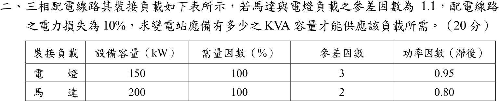

# 104 年工業配電第 2 題｜參差因數與變電站容量

## 已知與所求

三相配電線路，馬達與電燈負載間參差因數 \(1.1\)，配電線路電力損失 \(10\%\)。裝接負載表：

| 負載 | 設備容量 | 需量因數 | 參差因數 | 功因（滯後） |
| --- | --- | --- | --- | --- |
| 電燈 | 150 kW | 100% | 3 | 0.95 |
| 馬達 | 200 kW | 100% | 2 | 0.80 |

求變電站應備 kVA 容量（20 分）。

## 考場標準作答

各類負載的最大需量 \(=\) 設備容量 \(\times\) 需量因數 \(\div\) 該類參差因數：
\[
P_L=\frac{150(1.0)}{3}=50\ \mathrm{kW},\quad Q_L=50\tan(\cos^{-1}0.95)=16.434\ \mathrm{kvar}
\]
\[
P_M=\frac{200(1.0)}{2}=100\ \mathrm{kW},\quad Q_M=100\tan(\cos^{-1}0.80)=75\ \mathrm{kvar}
\]
兩類負載的最大需量相加（複數功率）：
\[
S_{sum}=\sqrt{(50+100)^2+(16.434+75)^2}=175.67\ \mathrm{kVA}
\]
電燈與馬達間參差因數 1.1，同時最大需量：
\[
S_{coin}=\frac{175.67}{1.1}=159.70\ \mathrm{kVA}
\]
線路損失為變電站輸出功率的 10%，變電站容量：
\[
\boxed{S_{sub}=\frac{159.70}{1-0.10}=177.45\ \mathrm{kVA}}
\]
向上取標準容量（例如 200 kVA）。

## 驗算

分別算 kW 與 kvar：
\[
P=\frac{150}{1.1(0.9)}=151.52\ \mathrm{kW},\quad Q=\frac{91.434}{1.1(0.9)}=92.36\ \mathrm{kvar},\quad
\sqrt{P^2+Q^2}=177.45\ \mathrm{kVA}
\]
上限檢查：各負載 kVA 直接相加 \((50/0.95+100/0.80)/0.99=179.4\ \mathrm{kVA}\) 大於 177.45，符合「相量和不大於算術和」。

## 失分點

- 漏用表內參差因數 3 與 2、以 350 kW 的設備容量直接計算，會得約 407 kVA，為正確值的 2.3 倍。
- 將電燈與馬達的 kVA 以算術和相加（\(50/0.95+100/0.80\)，再除 \(1.1\times0.9\) 得 179.4 kVA），忽略兩者功因角不同，結果偏大。
- 1.1 是參差因數，須除而非乘；誤乘會得 \(175.67\times1.1/0.9=214.7\ \mathrm{kVA}\)，反而偏大。

## 條件與疑義

1. 題目未定義表內「參差因數 3、2」；本解採通用定義：參差因數 \(=\) 各負載最大需量總和 \(\div\) 該群同時最大需量，故表內值為各類負載內部的參差因數，1.1 為電燈與馬達兩群之間的參差因數。
2. 「電力損失 10%」未說明分母。本解取變電站輸出的 10%（\(\div0.9\)）；若指負載端需量的 10%（\(\times1.1\)），則為 \(159.70\times1.1=175.67\ \mathrm{kVA}\)。
