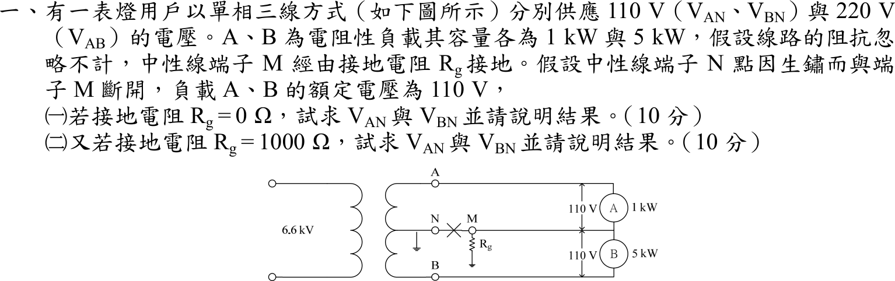

# 105 年工業配電第 1 題｜單相三線中性線開路與接地電阻

## 已知與所求

單相三線 110／220 V，A、B 為電阻性負載 1 kW 與 5 kW（額定 110 V）；線路阻抗忽略。中性線端子 N 與 M 斷開，M（負載中點）經 \(R_g\) 接地，變壓器中心抽頭 N 接地。求（一）\(R_g=0\)、（二）\(R_g=1000\,\Omega\) 時負載電壓 \(V_{AN}\)、\(V_{BN}\)（圖中 A 在上、B 在下，各量取負載兩端電壓）並說明結果。

## 考場標準作答

\[
R_A=\frac{110^2}{1000}=12.1\ \Omega,\qquad R_B=\frac{110^2}{5000}=2.42\ \Omega
\]
以變壓器中心抽頭 N 為參考，A 端 \(+110\,\mathrm V\)、B 端 \(-110\,\mathrm V\)；設負載中點電位 \(V_M\)，在 M 點列 KCL（A、B 流入的電流經 \(R_g\) 流向大地）：
\[
\frac{110-V_M}{R_A}+\frac{-110-V_M}{R_B}=\frac{V_M}{R_g}
\]

### （一）\(R_g=0\)

\(V_M=0\)，M 點被拉到大地電位，與 N 同電位：
\[
\boxed{V_{AN}=+110\,\mathrm V},\qquad \boxed{V_{BN}=-110\,\mathrm V}
\]
兩負載皆為額定 110 V（大小）；N–M 斷開但 \(R_g=0\) 等同接地線補回中性線，負載不受影響。

### （二）\(R_g=1000\,\Omega\)

\[
V_M\left(\frac1{12.1}+\frac1{2.42}+\frac1{1000}\right)=\frac{110}{12.1}-\frac{110}{2.42}
\Rightarrow V_M=-73.186\ \mathrm V
\]
\[
\boxed{V_{AN}=110-V_M=183.186\ \mathrm V},\qquad \boxed{V_{BN}=-110-V_M=-36.8143\ \mathrm V}
\]
即 A 負載承受 183.19 V（約額定的 1.67 倍，過電壓），B 負載僅 36.81 V（欠電壓）。輕載 A 過壓、重載 B 欠壓，是中性線開路、接地回路阻抗過大的典型危險。

## 驗算

\(I_A=183.186/12.1=15.139\ \mathrm A\)，\(I_B=36.814/2.42=15.213\ \mathrm A\)，接地電流 \(I_g=I_B-I_A=0.0731\ \mathrm A\)，且 \(I_gR_g=73.1\ \mathrm V=|V_M|\)。
極限：\(R_g\to\infty\) 時為單純串聯分壓 \(220\times12.1/(12.1+2.42)=183.33\ \mathrm V\)，\(R_g=1000\,\Omega\) 的 183.19 V 略低且趨近此值。

## 失分點

- \(R_g=0\) 時仍照浮接串聯分壓（183.33 V／36.67 V），忽略接地線已把 M 點鉗位在 0 V。
- KCL 中 \(R_g\) 電流方向反號會得 \(183.482\,\mathrm V\)／\(36.5185\,\mathrm V\)，且比 \(R_g=\infty\) 的 183.33 V 還大，不合物理。
- 只寫大小不說明 A 過壓、B 欠壓。

## 條件與疑義

若 \(V_{AN}\)、\(V_{BN}\) 解讀為變壓器端子 A、B 對中心抽頭 N 的電壓，則恆為 \(\pm110\,\mathrm V\)；題意著眼於負載是否承受額定電壓，故本解取負載兩端電壓。
