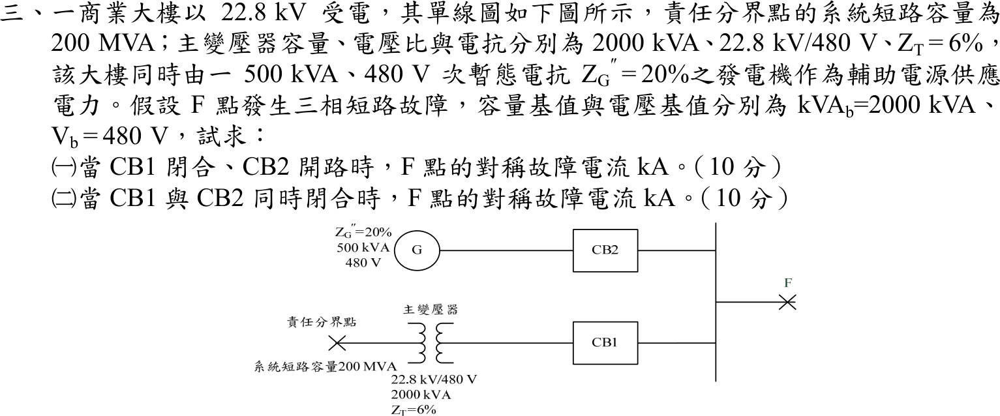

# 105 年工業配電第 3 題｜低壓匯流排三相短路與電源並聯

## 已知與所求

22.8 kV 受電，責任分界點短路容量 \(200\,\mathrm{MVA}\)；主變 \(2000\,\mathrm{kVA}\)、\(22.8\,\mathrm{kV}/480\,\mathrm V\)、\(Z_T=6\%\)；發電機 \(500\,\mathrm{kVA}\)、\(480\,\mathrm V\)、\(Z_G''=20\%\)。F 點為 480 V 匯流排三相短路，基準 \(2000\,\mathrm{kVA}\)、\(480\,\mathrm V\)。求（一）CB1 閉合、CB2 開路，（二）CB1、CB2 皆閉合時的對稱故障電流（kA）（各 10 分）。

## 考場標準作答

\[
I_b=\frac{2000}{\sqrt3(0.48)}=2405.63\ \mathrm A,\qquad
X_{sys}=\frac{2000}{200\,000}=0.01\ \mathrm{pu}
\]
CB1 支路（系統＋主變）：\(X_1=0.01+0.06=0.07\ \mathrm{pu}\)；
CB2 支路（發電機換基準）：\(X_2=0.20\times\dfrac{2000}{500}=0.80\ \mathrm{pu}\)。

### （一）CB1 閉合、CB2 開路
\[
\boxed{I_{F1}=\frac{1}{0.07}I_b=14.2857(2405.63)=34.37\ \mathrm{kA}}
\]

### （二）CB1、CB2 皆閉合
\[
X_{eq}=0.07\parallel0.80=0.0643678\ \mathrm{pu},\qquad
\boxed{I_{F2}=\frac{I_b}{0.0643678}=15.5357(2405.63)=37.37\ \mathrm{kA}}
\]

## 驗算

支路電流疊加：\(1/0.07+1/0.80=14.2857+1.25=15.5357\ \mathrm{pu}\)，與 \(1/X_{eq}\) 相同；CB1 單獨 34.366 kA、加上發電機貢獻 \(1.25(2.40563)=3.007\ \mathrm{kA}\)，合計 37.373 kA。

## 失分點

- 未先換到題給 2000 kVA 基準就把標么電抗相加；發電機 20% 須乘 \(2000/500\)。
- CB2 開路時仍把發電機電抗併入，或兩斷路器閉合時忘記並聯。
- 480 V 為線電壓，基準電流用 \(S_b/(\sqrt3V_b)\)。

## 條件與疑義

題目只給電抗，採正序純電抗、故障前各電源內電勢皆為 \(1\angle0^\circ\,\mathrm{pu}\)、不計負載電流；若需計入電阻或電源相角差，應以完整相量重算。
