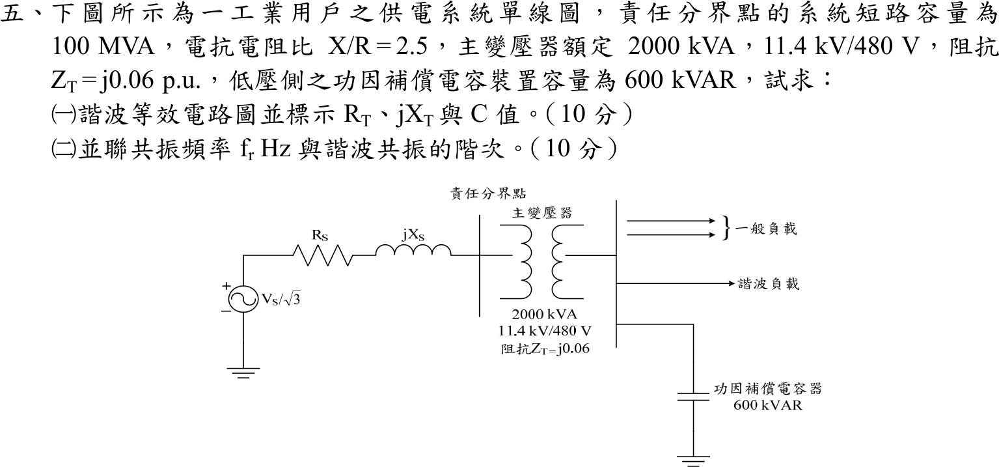

# 105 年工業配電第 5 題｜諧波等效電路與並聯共振



## 已知與所求

責任分界點短路容量 \(100\,\mathrm{MVA}\)、\(X/R=2.5\)；主變壓器 \(2000\,\mathrm{kVA}\)、\(11.4\,\mathrm{kV}/480\,\mathrm V\)、\(Z_T=j0.06\,\mathrm{pu}\)；低壓側功因補償電容 \(600\,\mathrm{kvar}\)。求（一）諧波等效電路並標示 \(R_T\)、\(jX_T\)、\(C\)（10 分）；（二）並聯共振頻率 \(f_r\) 與諧波階次（10 分）。

## 考場標準作答

### （一）等效電路

基準 \(2\,\mathrm{MVA}\)、\(480\,\mathrm V\)：\(Z_b=0.48^2/2=0.1152\ \Omega\)。
\[
Z_s=\frac{2}{100}=0.02\ \mathrm{pu},\quad R_s=\frac{0.02}{\sqrt{1+2.5^2}}=0.007428,\quad X_s=2.5R_s=0.018570
\]
折算到 480 V 側（變壓器電阻忽略）：
\[
R_T=0.007428(0.1152)=0.000856\ \Omega,\qquad X_T=(0.018570+0.06)(0.1152)=0.00905\ \Omega
\]
電容器：
\[
X_C=\frac{0.48^2}{0.6}=0.384\ \Omega,\qquad C=\frac1{2\pi(60)(0.384)}=6908\ \mu\mathrm F
\]
等效電路：諧波電流源（諧波負載）接在匯流排；電源側 \(R_T+jX_T\)（由 \(R_S+jX_S\) 加變壓器 \(jX_{Tr}\)）與電容 \(C\)（\(-jX_C/h\)）並聯於 480 V 匯流排。
```
 諧波負載 I_h ──┬──────────┬────────── 480 V 匯流排
                │          │
           R_T + jX_T      C (X_C = 0.384 Ω @60 Hz)
                │          │
              電源(短路)    地
```

### （二）並聯共振

\(h\) 次諧波電感抗 \(hX_T\)，電容抗 \(X_C/h\)，並聯共振：
\[
\boxed{h_r=\sqrt{\frac{X_C}{X_T}}=\sqrt{\frac{0.384}{0.0090512}}=6.5135}
\]
\[
\boxed{f_r=h_rf_1=6.5135\times60=390.8\ \mathrm{Hz}\approx391\ \mathrm{Hz}}
\]
\(h_r\approx6.5\) 介於 6、7 次之間，最接近的整數特徵諧波為**第 7 次**。

## 驗算

kVA 公式：匯流排短路容量 \(2000/(0.01857+0.06)=25\,455\ \mathrm{kVA}\)，\(h_r=\sqrt{25\,455/600}=6.51\)，與上式一致。含 \(R_T\) 時令導納虛部為零，\(h_r\) 無可辨差異（\(R_T^2\ll X_TX_C\)）。

## 失分點

- 只用變壓器 \(X_T=0.06\) 而漏掉系統電抗 \(0.0186\)，\(h_r\) 會高估為 \(\sqrt{0.384/0.00691}=7.45\)。
- \(X_C\) 須以線電壓 \(V_{LL}^2/Q_C\) 計算，不可混用相電壓。
- 只寫 \(f_r\) 不說明階次與第 7 次特徵諧波的關係。

## 條件與疑義

變壓器電阻未給，視為零；\(R_T\) 僅來自系統 \(X/R\)。\(h_r=6.51\) 恰超過 6.5，視為最接近第 7 次，但實務上 6 次與 7 次附近均有放大風險。
