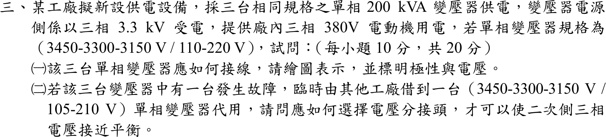

# 106 年工業配電第 3 題｜三相變壓器組接線與分接頭選擇



## 已知與所求

三台相同單相 \(200\,\mathrm{kVA}\) 變壓器，規格 \((3450\text{-}3300\text{-}3150)\,\mathrm V/(110\text{-}220)\,\mathrm V\)，電源側三相 \(3.3\,\mathrm{kV}\)，供三相 \(380\,\mathrm V\) 電動機。求（一）接線圖、極性與電壓；（二）一台故障，借用 \((3450\text{-}3300\text{-}3150)\,\mathrm V/(105\text{-}210)\,\mathrm V\) 單相變壓器代用時，如何選分接頭使二次側三相電壓接近平衡（各 10 分）。

## 考場標準作答

### （一）Δ–Y 接線

```text
一次側 Δ（3300 V 分接頭）                       二次側 Y（220 V 繞組）
L1 ─┬─ T1[H1 ─ H2] ─┬─ L2     a ── X1[T1]X2 ─┐
L2 ─┬─ T2[H1 ─ H2] ─┬─ L3     b ── X1[T2]X2 ─┼── N（中性點，可接地）
L3 ─┬─ T3[H1 ─ H2] ─┬─ L1     c ── X1[T3]X2 ─┘
減極性：H1 與 X1 同名端；Δ 由 T1.H2→T2.H1、T2.H2→T3.H1、T3.H2→T1.H1 首尾相接
```
一次繞組各承受線電壓 \(3300\,\mathrm V\)，選 3300 V 分接頭；匝比 \(3300/220=15\)。二次三個 220 V 繞組同名端共接成 Y：
\[
\boxed{\text{Δ–Y；一次每繞組 }3300\,\mathrm V，\ V_{\phi}=220\,\mathrm V，\ V_{LL}=\sqrt3(220)=381\,\mathrm V\approx380\,\mathrm V}
\]

### （二）代用機分接頭

另兩台匝比為 15，代用機的有效匝比也須為 15：

| 一次分接頭 | 二次分接頭 | 匝比 | 3.3 kV 時二次電壓 |
|---|---|---:|---:|
| 3150 V | 210 V | 15.00 | 220 V |
| 3300 V | 210 V | 15.71 | 210 V |
| 3450 V | 210 V | 16.43 | 200.9 V |

\[
\boxed{\text{一次 }3150\,\mathrm V\text{ 分接頭、二次 }210\,\mathrm V\text{ 分接頭}}
\]
3150 V 分接頭承受 3300 V 為額定的 104.8%，仍在一般 105% 容許內。

## 驗算

選 3150 V 一次分接頭、210 V 二次分接頭時，代用機二次電壓 \(3300\times\dfrac{210}{3150}=220\,\mathrm V\)，與另兩台相等，三個相電壓 \(220\,\mathrm V\)、線電壓 \(381\,\mathrm V\) 平衡。若用 3300 V／210 V，一相只有 210 V（低 4.5%），線電壓出現不平衡。

## 失分點

- 一次側接 Y：每繞組只承受 \(3300/\sqrt3=1905\,\mathrm V\)，僅額定的 58%，二次電壓不足。
- 代用機仍選 3300 V 一次分接頭，二次只有 210 V，三相電壓不平衡。
- 把 \(\sqrt3\times220=381\,\mathrm V\) 寫成 \(220\,\mathrm V\) 線電壓；380 V 動力負載要接線電壓端。
