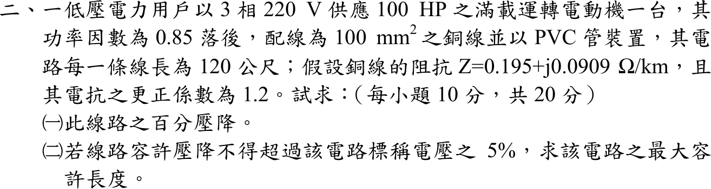

# 107 年工業配電第 2 題｜100 HP 馬達饋線壓降

## 已知與所求

三相 \(220\,\mathrm V\) 供應一台滿載 \(100\,\mathrm{HP}\) 電動機，功率因數 0.85 落後；100 mm² 銅線 PVC 管，每條線長 \(120\,\mathrm m\)；線路阻抗 \(0.195+j0.0909\,\Omega/\mathrm{km}\)，電抗更正係數 1.2。求（一）線路百分壓降；（二）壓降不超過標稱電壓 5% 時的最大容許長度（各 10 分）。題幹未給滿載電流，取值見「條件與疑義」。

## 考場標準作答

參考書主解（reference_book evidence，not official）：1 HP≈1 kVA，電動機電流 262.43 A：
\[
I=\frac{100\,000}{\sqrt3(220)}=262.43\,\mathrm A
\]
有效電抗 \(X=1.2(0.0909)=0.10908\,\Omega/\mathrm{km}\)，沿電壓軸的單位長壓降係數
\[
K=R\cos\theta+X\sin\theta=0.195(0.85)+0.10908(0.52678)=0.22321\,\Omega/\mathrm{km}
\]

### （一）百分壓降

\[
\Delta V=\sqrt3\,I\,K\,L=\sqrt3(262.43)(0.22321)(0.120)=12.175\,\mathrm V,\qquad
\boxed{\Delta V\%=\frac{12.175}{220}=5.53\%}
\]

### （二）最大容許長度

允許壓降 \(0.05(220)=11\,\mathrm V\)，壓降與長度成正比：
\[
\boxed{L_{max}=0.120\frac{11}{12.175}\times1000=108.42\ \mathrm m}
\]

## 驗算

相量法：每相 \(V_r=220/\sqrt3\)，\(\dot I=262.43\angle-31.79^\circ\)，\(\dot V_s=V_r+\dot I(R+jX)L\)，\(\sqrt3(|V_s|-V_r)=12.176\,\mathrm V\)（5.534%），與近似式相同。比例檢查：\(L_{max}\times5.534\%=120\,\mathrm m\times5\%\)。

## 失分點

- 電抗忘記乘更正係數 1.2，使 \(K\) 偏小（\(K\) 會降為 0.2136，壓降低估約 4%）。
- 用 \(\sqrt3IL(R\cos\theta+X\sin\theta)\) 時把長度寫成 120 而非 0.120 km。
- 最大長度不能直接寫 120 m；壓降與長度成正比，應依 \(11\,\mathrm V/12.175\,\mathrm V\) 縮放，且結果小於 120 m（因 120 m 已超過 5%）。

## 條件與疑義

官方裁切沒有列馬達滿載電流、銘牌效率或輸入功率定義；第 152 條只決定馬達負載電流的取值依據：原則上採銘牌全載電流，一般用電動機才可採國家標準值（經濟部 107 年 7 月 17 日歷史版《用戶用電設備裝置規則》第 152 條，<https://law.moea.gov.tw/LawContentHistory.aspx?hid=50617>），因此不能由 100 HP 與功率因數單獨反推出唯一滿載電流。本題的「壓降 5%」是題目給定的壓降門檻，只用來把同一線路模型反算成 \(L_{max}\)，不是由第 152 條法規推導出的電流值。各取值下的結果為：

| 滿載電流取值 | \(I\) | \(\Delta V\%\) | \(L_{max}\) |
|---|---:|---:|---:|
| 參考書 1 HP≈1 kVA（主解） | 262.43 A | 5.53% | 108.42 m |
| 年度詳解常用值 | \(250\,\mathrm A\) | 5.2720% | 113.81 m |
| 107 年歷史表 163-7-3 | \(I=258\,\mathrm{A}\) | 5.4407% | 110.28 m |
| 現行表 258-3（60 HP 以上可採製造廠資料） | \(238\,\mathrm A\) | 5.0189% | 119.55 m |
| 100 HP＝74.6 kW、效率 1 | 230.32 A | 4.8570% | 123.53 m |

各取值下 120 m 的壓降落在 4.86%–5.53%，是否超過 5% 隨取值而變。題圖未指定表號，故 238 A、250 A、258 A 僅為版本交叉檢查，不取代參考書主解與銘牌值。
