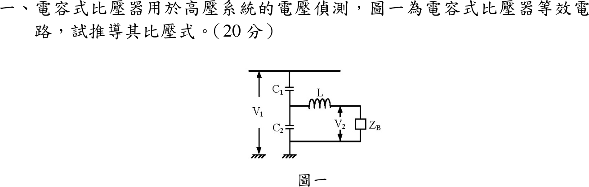

# 108 年工業配電第 1 題｜電容式比壓器比壓式

## 已知與所求

圖一：\(V_1\) 加在串聯的 \(C_1\)（上）與 \(C_2\)（下）兩端，下端接地；\(C_1\)、\(C_2\) 的中點經補償電抗器 \(L\) 串接負載 \(Z_B\) 到地，輸出 \(V_2\) 跨在 \(Z_B\) 兩端。求比壓式 \(V_2/V_1\)。

## 考場標準作答

令 \(Z_1=\dfrac1{sC_1}\)、\(Z_2=\dfrac1{sC_2}\)。把 \(L\)–\(Z_B\) 支路拿掉，對 \(C_1,C_2\) 中點作戴維寧等效：
\[
V_{th}=V_1\frac{Z_2}{Z_1+Z_2}=V_1\frac{C_1}{C_1+C_2},\qquad
Z_{th}=Z_1\parallel Z_2=\frac1{s(C_1+C_2)}
\]
接回 \(L\) 與 \(Z_B\) 串聯支路，\(V_2\) 為 \(Z_B\) 的分壓：
\[
\boxed{\frac{V_2}{V_1}=\frac{C_1}{C_1+C_2}\cdot\frac{Z_B}{Z_{th}+sL+Z_B}
=\frac{sC_1Z_B}{1+s(C_1+C_2)Z_B+s^2L(C_1+C_2)}}
\]
工頻 \(s=j\omega\) 時分母為 \(1-\omega^2L(C_1+C_2)+j\omega(C_1+C_2)Z_B\)。取
\[
\boxed{L=\frac{1}{\omega^2(C_1+C_2)}}
\]
則 \(Z_{th}+j\omega L=0\)，\(V_2/V_1=C_1/(C_1+C_2)\) 且與 \(Z_B\) 無關，負載不再造成比差與角差。

## 驗算

直接對中點節點列 KCL（與上面的戴維寧法不同）：
\[
\frac{V_a-V_1}{Z_1}+\frac{V_a}{Z_2}+\frac{V_a}{sL+Z_B}=0,\qquad V_2=V_a\frac{Z_B}{sL+Z_B}
\]
解得 \(V_2/V_1=\dfrac{Z_2Z_B}{Z_1Z_2+(Z_1+Z_2)(sL+Z_B)}\)，分子分母同乘 \(s^2C_1C_2\) 即得上式。極限 \(Z_B\to\infty\) 時 \(V_2/V_1\to C_1/(C_1+C_2)\)，為理想電容分壓。

## 失分點

- 把 \(L\) 與 \(Z_B\) 畫成並聯；圖中兩者串聯在同一支路。
- 以電容值直接分壓寫成 \(C_2/(C_1+C_2)\)；阻抗分壓 \(Z_2/(Z_1+Z_2)\) 化簡後是 \(C_1/(C_1+C_2)\)。
- 只寫 \(C_1/(C_1+C_2)\)，沒有交代它只在 \(Z_B\to\infty\) 或補償諧振時成立。
