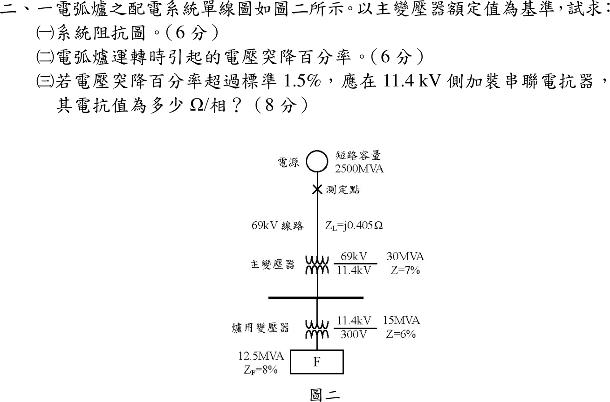

# 108 年工業配電第 2 題｜電弧爐電壓突降與串聯電抗器



## 已知與所求

電源短路容量 \(2500\,\mathrm{MVA}\)；測定點位於 69 kV 電源側、主變壓器之前；69 kV 線路 \(Z_L=j0.405\,\Omega\)；主變壓器 \(30\,\mathrm{MVA}\)、69/11.4 kV、\(Z=7\%\)；爐用變壓器 \(15\,\mathrm{MVA}\)、11.4 kV/300 V、\(Z=6\%\)；電弧爐 \(12.5\,\mathrm{MVA}\)、\(Z_F=8\%\)。以主變額定 \(S_b=30\,\mathrm{MVA}\) 為基準，求（一）系統阻抗圖（6 分）；（二）電弧爐運轉的電壓突降百分率（6 分）；（三）突降超過 1.5% 時，11.4 kV 側串聯電抗器之 \(\Omega\)/相（8 分）。

## 考場標準作答

### （一）系統阻抗圖

\(Z_{b,69}=69^2/30=158.7\,\Omega\)、\(Z_{b,11.4}=11.4^2/30=4.332\,\Omega\)：
\[
X_S=\frac{30}{2500}=0.012,\quad X_L=\frac{0.405}{158.7}=0.002552,\quad X_{T1}=0.07,\quad
X_{T2}=0.06\frac{30}{15}=0.12,\quad X_F=0.08\frac{30}{12.5}=0.192
\]

```text
E=1∠0° ─ j0.012 ─(測定點，69 kV)─ j0.002552 ─ j0.07 ─(11.4 kV 母線)─ j0.12 ─ j0.192 ─ 地
          X_S                       X_L        X_T1                    X_T2    X_F
```
\[
\boxed{X_S=0.012,\ X_L=0.002552,\ X_{T1}=0.07,\ X_{T2}=0.12,\ X_F=0.192\ \mathrm{pu}}
\]

### （二）電壓突降

測定點位於 69 kV 電源側，其上游只有電源電抗 \(X_S\)；下游 \(X_{down}=0.002552+0.07+0.12+0.192=0.384552\)。電弧爐以定阻抗代表，source/PCC 電壓為分壓：
\[
\boxed{\frac{\Delta V}{V}=\frac{X_S}{X_S+X_{down}}=\frac{0.012}{0.396552}=3.0261\%}
\]

### （三）11.4 kV 側串聯電抗器

電抗器加在下游，令突降為 1.5%：
\[
0.015=\frac{0.012}{0.396552+X_R}\Rightarrow X_R=0.403448\ \mathrm{pu}
\]
\[
\boxed{X_R=0.403448(4.332)=1.748\ \Omega/\text{相}}
\]

## 驗算

不經標么，全部折算到 11.4 kV 側的歐姆值：電源 \(11.4^2/2500=0.05198\,\Omega\)；下游 \(0.405(11.4/69)^2+0.07\dfrac{11.4^2}{30}+0.06\dfrac{11.4^2}{15}+0.08\dfrac{11.4^2}{12.5}=1.6659\,\Omega\)。突降 \(=0.05198/(0.05198+1.6659)=3.0261\%\)。降到 1.5% 需總電抗 \(0.05198/0.015=3.4656\,\Omega\)，故 \(X_R=3.4656-1.7179=1.748\,\Omega\)，與標么法相同。

## 失分點

- 把測定點放到主變二次側，上游阻抗與分壓位置全錯；圖上 × 在 69 kV 電源之後、主變之前。
- 15 MVA 爐用變壓器與 12.5 MVA 電弧爐阻抗未換到 30 MVA 基準。
- 串聯電抗器裝在 11.4 kV 側，屬測定點下游，應加進分母；只加到 \(X_S\) 會得到相反方向的結果。

## 條件與疑義

題圖只給電抗值，全部忽略電阻；突降定義為測定點（source/PCC）電壓相對於電源電動勢的下降，電弧爐以其標示阻抗 \(Z_F=8\%\) 的定阻抗負載代表，所得 3.0261% 為此模型值，並非閃爍（flicker）量測值。
