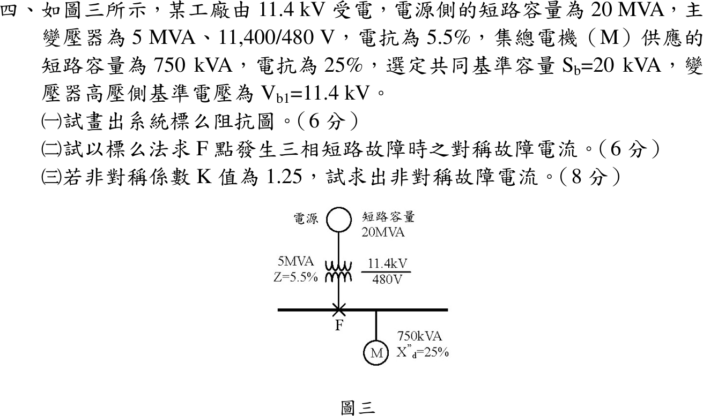

# 108 年工業配電第 4 題｜F 點三相短路



## 已知與所求

11.4 kV 電源短路容量 \(20\,\mathrm{MVA}\)；主變壓器 \(5\,\mathrm{MVA}\)、11,400/480 V、\(X=5.5\%\)；F 點（480 V 母線）接集總電機 \(750\,\mathrm{kVA}\)、\(X''_d=25\%\)；\(V_{b1}=11.4\,\mathrm{kV}\)，低壓側 \(V_{b2}=480\,\mathrm V\)。求（一）標么阻抗圖；（二）F 點三相短路對稱故障電流；（三）\(K=1.25\) 時的非對稱故障電流。基準容量的讀法見「條件與疑義」。

## 考場標準作答

### （一）標么阻抗圖（\(S_b=20\,\mathrm{MVA}\)）

\[
X_S=\frac{20}{20}=1.000,\quad X_T=0.055\frac{20}{5}=0.220,\quad X_M=0.25\frac{20}{0.75}=6.6667\ \mathrm{pu}
\]

```text
E=1∠0° ─ j1.000 ─ j0.220 ─┬─ F（480 V 母線）
(電源)    X_S      X_T    │
E=1∠0° ───── j6.6667 ─────┘   (電機 X''d 支路，與電源支路在 F 並聯)
```
\[
\boxed{X_S=1.000,\ X_T=0.220,\ X_M=6.6667\ \mathrm{pu}}
\]

### （二）對稱故障電流

\(X_{th}=(1.000+0.220)\parallel6.6667=\dfrac{1.22(6.6667)}{7.8867}=1.03128\), \(I_{f,pu}=0.96967\)。\(I_b=\dfrac{20\times10^6}{\sqrt3(480)}=24\,056\,\mathrm A\)：
\[
\boxed{I_{f,sym}=0.96967(24.056)=23.327\ \mathrm{kA}}
\]

### （三）非對稱故障電流

\[
\boxed{I_{f,asym}=K\,I_{f,sym}=1.25(23.327)=29.158\ \mathrm{kA}}
\]

## 驗算

不用標么，直接用 480 V 側歐姆：\(X_S=480^2/20\mathrm{M}=0.01152\,\Omega\)、\(X_T=0.055(480^2)/5\mathrm{M}=0.002534\,\Omega\)、\(X_M=0.25(480^2)/750\mathrm{k}=0.0768\,\Omega\)。電源支路電流 \((277.13)/0.014054=19.72\,\mathrm{kA}\)，電機支路 \(277.13/0.0768=3.608\,\mathrm{kA}\)，KCL 相加 \(=23.33\,\mathrm{kA}\)，與標么法一致。

## 失分點

- 用 11.4 kV 的基準電流 \(1013\,\mathrm A\)（\(20\,\mathrm{MVA}\)）回答；F 點在 480 V 側，須乘 480 V 的 \(I_b\)。
- 電機 \(25\%\) 是以 750 kVA 為基準，要乘 \(S_b/0.75\,\mathrm{MVA}\) 換算；漏換會使電機支路電抗偏小。
- 把電源支路與電機支路串聯；故障時兩者各自供電，在 F 並聯。

## 條件與疑義

題幹將共同基準容量 \(S_b\) 印成 \(20\,\mathrm{kVA}\)，但電源短路容量為 \(20\,\mathrm{MVA}\)，本解讀為 \(S_b=20\,\mathrm{MVA}\)。基準容量只是換算尺度：以 \(20\,\mathrm{kVA}\) 為基準時 \(X_S=0.001\)、\(X_T=0.00022\)、\(X_M=0.006667\ \mathrm{pu}\)，\(I_b=24.056\,\mathrm A\)，故障電流同為 \(23.327\,\mathrm{kA}\)，答案不受影響。
