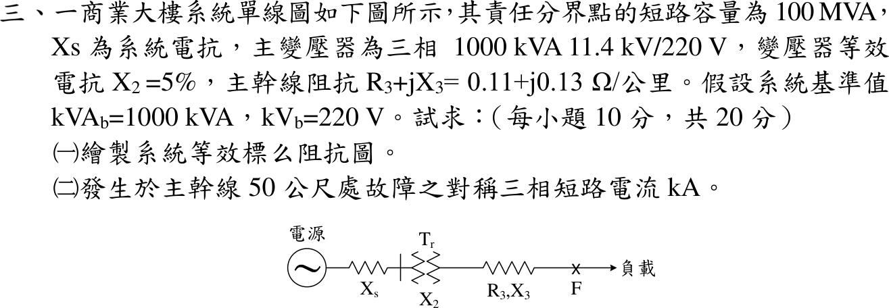

# 109 年工業配電第 3 題｜主幹線三相短路

## 已知與所求

責任分界點短路容量 \(100\,\mathrm{MVA}\)；主變壓器 \(1000\,\mathrm{kVA}\)、\(11.4\,\mathrm{kV}/220\,\mathrm V\)、\(X_2=5\%\)；主幹線 \(0.11+j0.13\,\Omega/\mathrm{km}\)；基準 \(1000\,\mathrm{kVA}\)、\(220\,\mathrm V\)。求（一）等效標么阻抗圖；（二）主幹線 50 m 處對稱三相短路電流。

## 考場標準作答

### （一）標么阻抗圖

\[
Z_b=\frac{220^2}{1000\times10^3}=0.0484\,\Omega,\qquad X_s=\frac{1}{100}=0.01,\qquad X_2=0.05
\]
\[
Z_3=\frac{(0.11+j0.13)(0.05)}{0.0484}=0.113636+j0.134298\,\mathrm{pu}
\]
\[
\boxed{E=1\angle0^\circ\to j0.01\to j0.05\to(0.113636+j0.134298)\to F}
\]

### （二）三相短路電流

\[
Z_{th}=0.113636+j0.194298,\qquad |Z_{th}|=0.225088\,\mathrm{pu}
\]
\[
I_b=\frac{1000}{\sqrt3(0.22)}=2.62432\,\mathrm{kA},\qquad I_{3\phi}=\frac{2.62432}{0.225088}=\boxed{11.659\,\mathrm{kA}}
\]

## 驗算

改用歐姆值：\(Z=0.0055+j(0.000484+0.00242+0.0065)=0.0055+j0.009404\,\Omega\)，\(|Z|=0.010894\,\Omega\)，\(I=\dfrac{220/\sqrt3}{0.010894}=11.659\,\mathrm{kA}\)。

## 失分點

- 50 m 未換成 0.05 km，或線路歐姆值未除以 \(Z_b\)。
- 忽略線路電阻只取電抗和，得 \(2.624/0.194=13.51\,\mathrm{kA}\)。
- 把標么電流當 kA，漏乘 \(I_b\)。
