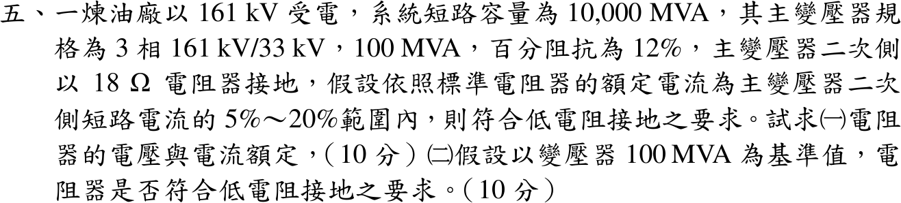

# 111 年工業配電第 5 題｜低電阻接地電阻器額定與短路電流比例

## 已知與所求

161 kV 受電，系統短路容量 \(10000\,\mathrm{MVA}\)；主變壓器 \(161/33\,\mathrm{kV}\)、\(100\,\mathrm{MVA}\)、\(Z=12\%\)；二次側中性點經 \(18\,\Omega\) 電阻接地。電阻器額定電流為二次側短路電流的 5%～20% 即符合低電阻接地。求（一）電阻器電壓與電流額定；（二）以 100 MVA 為基準判斷是否符合。

## 考場標準作答

### （一）電阻器額定

中性點電阻在接地故障時承受相電壓：
\[
V_R=\frac{33}{\sqrt3}=\boxed{19.05\,\mathrm{kV}},\qquad I_R=\frac{19052.6}{18}=\boxed{1058\,\mathrm A}
\]

### （二）低電阻接地判定

\[
X_s=\frac{100}{10000}=0.01,\quad X_T=0.12,\quad I_b=\frac{100\times10^6}{\sqrt3(33\times10^3)}=1749.5\,\mathrm A
\]
\[
I_{sc}=\frac{I_b}{0.01+0.12}=\boxed{13.46\,\mathrm{kA}}
\]
\[
\frac{I_R}{I_{sc}}=\frac{1058}{13459}=\boxed{7.87\%}\in[5\%,20\%]\ \Rightarrow\ \text{符合低電阻接地}
\]

## 驗算

以對稱分量求經電阻的單線接地電流（Δ-Y 變壓器 \(Z_0=jX_T\)，\(Z_b=33^2/100=10.89\,\Omega\)，\(3R=4.959\,\mathrm{pu}\)）：
\[
I_{SLG}=\frac{3I_b}{|4.959+j(0.13+0.13+0.12)|}=\frac{3(1749.5)}{4.974}=1055\,\mathrm A
\]
與 \(V_R/R=1058\,\mathrm A\) 相差 0.3%，確認電阻主導接地電流。

## 失分點

- 電阻器電壓用線電壓 33 kV；中性點只承受相電壓。
- 漏掉系統電抗 0.01，二次短路電流變為 14.58 kA，比例 7.26%（結論仍符合，但數值錯）。
