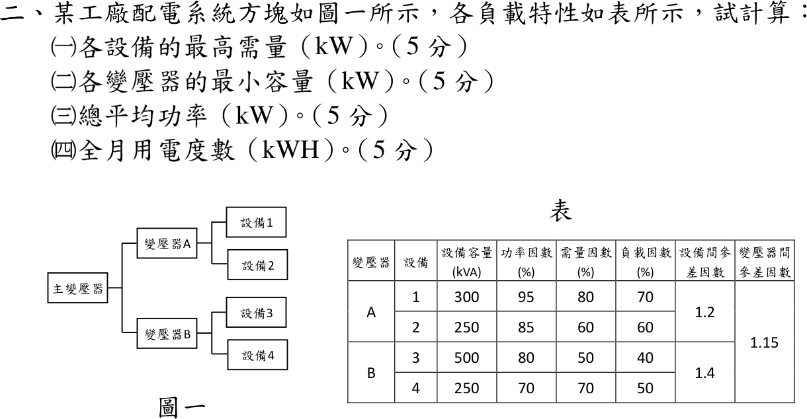

# 112 年工業配電第 2 題｜負載特性與需量計算

## 已知與所求

| 變壓器 | 設備 | kVA | PF | 需量因數 | 負載因數 | 設備間參差因數 |
|---|---|---:|---:|---:|---:|---:|
| A | 1 | 300 | 0.95 | 0.80 | 0.70 | 1.2 |
| A | 2 | 250 | 0.85 | 0.60 | 0.60 | 1.2 |
| B | 3 | 500 | 0.80 | 0.50 | 0.40 | 1.4 |
| B | 4 | 250 | 0.70 | 0.70 | 0.50 | 1.4 |

變壓器間參差因數 1.15。求（一）各設備最高需量 kW；（二）各變壓器最小容量 kW；（三）總平均功率 kW；（四）全月用電度數。

## 考場標準作答

### （一）各設備最高需量

\(P_{\max}=S\cdot\mathrm{PF}\cdot\mathrm{DF}\)：
\[
\boxed{P_1=228,\ P_2=127.5,\ P_3=200,\ P_4=122.5\ \mathrm{kW}}
\]

### （二）各變壓器最小容量

\[
P_A=\frac{228+127.5}{1.2}=296.25,\qquad P_B=\frac{200+122.5}{1.4}=230.36\ \mathrm{kW}
\]
\[
P_{\text{主}}=\frac{296.25+230.36}{1.15}=457.92\,\mathrm{kW}
\]
\[
\boxed{P_A=296.25\,\mathrm{kW},\ P_B=230.36\,\mathrm{kW},\ P_{\text{主}}=457.92\,\mathrm{kW}}
\]

### （三）總平均功率

平均功率＝最高需量 × 負載因數，可直接相加（參差因數只影響尖峰）：
\[
\boxed{P_{avg}=228(0.7)+127.5(0.6)+200(0.4)+122.5(0.5)=377.35\,\mathrm{kW}}
\]

### （四）全月用電度數

以 30 日計：
\[
\boxed{E=377.35\times24\times30=271\,692\,\mathrm{kWh}}
\]

## 驗算

逐設備日電量 \(159.6(24)+76.5(24)+80(24)+61.25(24)=9056.4\,\mathrm{kWh}\)，\(\times30=271\,692\,\mathrm{kWh}\)。系統負載因數 \(377.35/457.92=0.824<1\)，合理。

## 失分點

- 平均功率再除以參差因數；參差因數只用於尖峰需量。
- 變壓器容量用 kVA 作答；題目指定 kW。
- 全月只乘 24 h（漏乘日數）。

## 條件與疑義

「全月」日數題目未給，此處取 30 日；若取 31 日則 \(280\,748\,\mathrm{kWh}\)。
