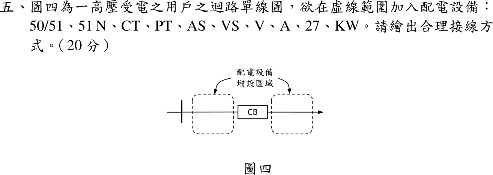

# 112 年工業配電第 5 題｜高壓受電保護與計量接線



## 已知與所求

圖四：母線—虛線區—CB—虛線區—負載。在虛線範圍加入 50/51、51N、CT、PT、AS、VS、V、A、27、kW，繪出合理接線（20 分）。

## 考場標準作答

一次側配置：電源側虛線區放 PT（電壓取樣，CB 跳脫後仍可監視電源電壓，供 27 判斷）；負載側虛線區放三相 CT（CB 的保護區）。

```text
母線 ─┬───────────── CB ────┬──────────→ 負載
      │                      │
     PT(V-V 或 Y-Y)         CT ×3（a、b、c）
      │ 二次 110 V           │ 二次 5 A
      │                      │
  Fuse ─ VS ─ V              ├─ AS ─ A
      ├──── 27 ──┐           ├─ 50/51（a、b、c 各一）
      └── kW 電壓線圈        ├─ 51N（三相 CT 殘流點，或零序 CT）
                 │           └─ kW 電流線圈（兩瓦特計：a、c 相）
                 └── 50/51、51N、27 跳脫接點 ── CB 跳脫線圈（TC）
```

接線原則：

- CT 二次為電流源，A、50/51、kW 電流線圈全部**串聯**；51N 接在三相 CT 共點的殘流路徑 \(I_a+I_b+I_c\)；AS 切換時不得使 CT 開路。
- PT 二次為電壓源，V、27、kW 電壓線圈全部**並聯**，二次側加熔絲；VS 選取 \(V_{ab}\)、\(V_{bc}\)、\(V_{ca}\)。
- kW 表三相三線用兩瓦特計：電流取 a、c 相 CT，電壓取 \(V_{ab}\)、\(V_{cb}\)。
- CT、PT 二次各單點接地；保護電驛接點並聯接至 CB 跳脫線圈。

\[
\boxed{\text{PT 在 CB 電源側、CT 在負載側；CT 二次串接 A、50/51、51N（殘流）、kW；PT 二次並接 V（經 VS）、27、kW}}
\]

## 驗算

兩瓦特計檢查：\(P=V_{ab}I_a\cos(30^\circ+\phi)+V_{cb}I_c\cos(30^\circ-\phi)=\sqrt3V_LI_L\cos\phi\)，確認 kW 表取 a、c 相電流與 \(V_{ab}\)、\(V_{cb}\) 的接法正確。51N 正常時 \(I_a+I_b+I_c=0\) 不動作，接地故障時殘流 \(3I_0\) 流入，動作邏輯正確。

## 失分點

- CT 二次開路（AS 切換或抽換儀表時），會產生高壓危險；須用短路片。
- 把 V、27 串聯接在 PT 二次；電壓元件必須並聯。
- 51N 接在單相 CT 上；應接殘流路徑或零序 CT。
