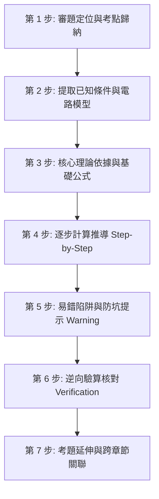

# 📐 電機工程技師 考古題標準題解 SOP 與解題規範 (CLAUDE-SOLVE.md)

本文件定義本知識庫所有考古題解析的**標準解題 SOP（Standard Operating Procedure）**、格式規範與評分維度，確保所有試題解析達到「國家考試閱卷委員滿分標準」與「教科書級嚴謹度」。

---

## 🎯 一、標準解題 7 步 SOP 推導架構

每道試題的 Markdown 詳解應遵循以下 7 步架構進行撰寫：



### 1. 審題定位與考點歸納 (Topic & Core Concepts)
- 明確標註本科目代號、年份、題號（如 `EE-114-04-1`）。
- 歸納本題考察之核心章節與概念（例如：變壓器開路/短路試驗、標么值阻抗換算、電壓調整率）。
- 標註難度星級（★☆☆☆☆ 至 ★★★★★）與預估作答時間（建議 20~25 分鐘）。

### 2. 提取已知條件與電路模型 (Given Parameters & Diagram)
- 條列所有題目給定之已知數據（如 $V_1 = 3300\text{ V}, V_2 = 220\text{ V}, S_n = 50\text{ kVA}, f = 60\text{ Hz}$）。
- 附上或對照原題電路圖、相量圖或等效模型。

### 3. 核心理論依據與基礎公式 (Governing Equations)
- 明確列出解答此題所需之所有關鍵公理、定理與基礎方程式（如 $VR = \frac{|V_{2,NL}| - |V_{2,FL}|}{|V_{2,FL}|} \times 100\%$、$S = V I^* = P + jQ$）。
- 禁止直接跳入帶數字計算，必須先寫出符號公式。

### 4. 逐步計算推導 (Step-by-Step Detailed Solution)
- 分小題（(一)、(二)、(三)）清晰推進。
- 每一步代入數據皆須保留清楚運算脈絡。
- 最終數值標註物理單位（如 $\text{kW}, \text{kVAR}, \Omega, \text{pu}, \text{rad/s}, \text{N}\cdot\text{m}$），並以粗體標示或方框標出答案。

### 5. 易錯陷阱與防坑提示 (⚠️ Common Traps & Pitfalls)
- 條列考生最常失分的盲點：
  - 是否漏乘或誤除 $\sqrt{3}$（線電壓 vs 相電壓、三相功率 vs 單相功率）。
  - 功因超前（Leading）與落後（Lagging）在無效功率 $Q$ 正負號之定義。
  - 阻抗由低壓側折合至高壓側時，變比平方 $a^2$ 乘除顛倒。
  - 矩陣對角化時特徵向量未進行正交歸一化 (Orthonormalization)。

### 6. 逆向驗算核對 (Verification & Consistency Checks)
- 透過第二種物理定律進行獨立驗算（如以功率守恆 $\sum P_{\text{in}} = \sum P_{\text{out}} + \sum P_{\text{loss}}$ 檢核、以戴維寧等效驗算節點電壓、以矩陣跡 $\text{tr}(A) = \sum \lambda_i$ 與行列式 $\det(A) = \prod \lambda_i$ 驗證特徵值）。

### 7. 考題延伸與跨章節關聯 (Related Concepts & Cross-References)
- 標註同類型歷史考題（如「本題與 110 年第 2 題、107 年第 4 題完全同型」）。
- 附上核心考點知識庫觀念卡連結。

---

## 📝 二、國考閱卷滿分標準範例

```markdown
### 題目解析：EE-114-04-1 (電機機械 第 1 題)

#### 🎯 考點定位與難度評級
- **核心考點**：單相變壓器標么值換算、短路試驗阻抗分離、電壓調整率 (VR)
- **難度星級**：⭐⭐⭐☆☆ (標準題型，必須全拿)
- **建議作答時間**：22 分鐘

#### 📋 已知條件
- 額定容量：$S_n = 100\text{ kVA}$
- 額定電壓：$2400\text{ V} / 240\text{ V}，f = 60\text{ Hz}$
- 短路試驗數據（高壓側）：$V_{sc} = 120\text{ V}, I_{sc} = 41.67\text{ A}, P_{sc} = 1200\text{ W}$

#### 📐 核心公式
1. 高壓側額定電流：$I_{1,n} = \frac{S_n}{V_{1,n}}$
2. 等效電阻與阻抗：$R_{eq1} = \frac{P_{sc}}{I_{sc}^2},\quad Z_{eq1} = \frac{V_{sc}}{I_{sc}},\quad X_{eq1} = \sqrt{Z_{eq1}^2 - R_{eq1}^2}$
3. 電壓調整率（落後功因 $\cos\theta$）：
   $$VR \approx \left( R_{pu}\cos\theta + X_{pu}\sin\theta \right) \times 100\%$$

#### 🧮 逐步計算推導
**(一) 求等效電阻與等效漏抗（折合至高壓側）：**
$$I_{1,n} = \frac{100\times 10^3}{2400} = 41.67\text{ A}$$
$$R_{eq1} = \frac{1200}{(41.67)^2} \approx 0.6912\ \Omega$$
$$Z_{eq1} = \frac{120}{41.67} \approx 2.880\ \Omega$$
$$X_{eq1} = \sqrt{(2.880)^2 - (0.6912)^2} = \sqrt{8.2944 - 0.4778} \approx 2.796\ \Omega$$

**(二) 滿載且功因 $0.8$ 落後時之電壓調整率 $VR$：**
$$Z_{base1} = \frac{V_{1,n}^2}{S_n} = \frac{(2400)^2}{100\times 10^3} = 57.6\ \Omega$$
R_{pu} = \frac{0.6912}{57.6} = 0.012\text{ pu (即 } 1.2\%\text{)}
X_{pu} = \frac{2.796}{57.6} = 0.0485\text{ pu (即 } 4.85\%\text{)}
$$VR = (0.012 \times 0.8 + 0.0485 \times 0.6) \times 100\% = (0.0096 + 0.0291) \times 100\% = \mathbf{3.87\%}$$

#### ⚠️ 易錯防坑提醒
> [!WARNING]
> 1. **試驗側判斷**：短路試驗通常於高壓側進行（電流較小，儀表易量測），若在低壓側進行，阻抗折合需乘以變比平方 $a^2 = (2400/240)^2 = 100$。
> 2. **功因超前注意**：若功因為超前（Leading），$VR$ 公式中虛部應帶負號：$VR \approx (R_{pu}\cos\theta - X_{pu}\sin\theta)$。

#### 🔍 逆向驗算核對
- 嚴格相量法精確計算：
  $$V_{1,pu} = |(1 + R_{pu}\cos\theta + X_{pu}\sin\theta) + j(X_{pu}\cos\theta - R_{pu}\sin\theta)|$$
  $$V_{1,pu} = |(1 + 0.0387) + j(0.0485\times 0.8 - 0.012\times 0.6)| = |1.0387 + j0.0316| = \sqrt{1.0387^2 + 0.0316^2} = 1.0392\text{ pu}$$
  $$VR_{\text{exact}} = (1.0392 - 1) \times 100\% = 3.92\%$$
  近似公式誤差 $< 0.05\%$，驗算完全吻合。
```
