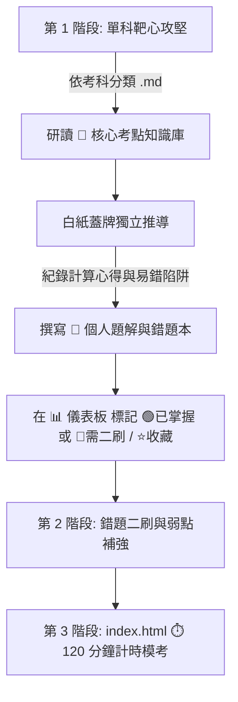

# ⚡ 專門職業及技術人員高等考試：電機工程技師 歷屆試題與 AI 詳解知識庫（104 ~ 114 年）

本知識庫完整收錄考選部官方公布之**近 11 年（民國 104 年 ~ 114 年，共 11 個年度、66 份完整官方試題 PDF 與 130+ 張高解析度原卷圖檔，總計 318 道大題）**，並已全數標準化為 **LaTeX 數學公式、電路圖檔對照、深淺色離線 Web 儀表板、全真 120 分鐘計時模考與 AI 協同批改系統**。

---

## 🌟 核心規範與 AI 協同 Runbooks (Inspired by exam-wiki)

本專案採用結構工程技師 `exam-wiki-SA` 規格化知識工程體系打造：

| 檔案名稱 | 核心功能與說明 | 快速入口 |
| :--- | :--- | :--- |
| **[`CLAUDE.md`](./CLAUDE.md)** | **冷啟動導覽與協作指引**：AI 助手角色定義、資料流架構與品質標準 | [🔗 開啟 CLAUDE.md](./CLAUDE.md) |
| **[`CLAUDE-SOLVE.md`](./CLAUDE-SOLVE.md)** | **7 步標準題解推導 SOP**：考點定位、公式列式、步驟推導、防坑提醒與驗算 | [🔗 開啟 CLAUDE-SOLVE.md](./CLAUDE-SOLVE.md) |
| **[`CLAUDE-SPEC.md`](./CLAUDE-SPEC.md)** | **資料庫規格與 Metadata 規範**：QID 命名、KaTeX 語法、標籤與驗證狀態 | [🔗 開啟 CLAUDE-SPEC.md](./CLAUDE-SPEC.md) |
| **[`CLAUDE-CODE.md`](./CLAUDE-CODE.md)** | **指令集與維護 Runbook**：資料庫編譯、語法審計與自動化命令手冊 | [🔗 開啟 CLAUDE-CODE.md](./CLAUDE-CODE.md) |
| **[`知識庫使用說明書.md`](./知識庫使用說明書.md)** | **考生完整操作手冊**：離線 Web 儀表板、120 分鐘模考、AI 批改指令引導 | [🔗 開啟 知識庫使用說明書.md](./知識庫使用說明書.md) |
| **[`檔案架構索引表.md`](./檔案架構索引表.md)** | **全景雙向目錄索引地圖**：66 份試卷、318 道試題與全部題解快速跳轉 | [🔗 開啟 檔案架構索引表.md](./檔案架構索引表.md) |

---

## 🖥️ 離線 Web 互動儀表板 ([`index.html`](./index.html)) 特色功能

- **⚡ 100% 離線免伺服器**：直接以瀏覽器雙擊開啟 [`index.html`](./index.html)，0 毫秒載入。
- **🌓 深淺色主題無縫切換**：莫蘭迪暖白紙感與極客午夜深藍隨心切換，自動持久化偏好。
- **🔍 多維度交叉搜尋與即時快篩**：全文關鍵字、考科、年度、難度星級（★~★★★★★）、掌握狀態（🟢已掌握/🔴需二刷/⭐收藏）。
- **⏱️ 全真 120 分鐘計時模考**：支援單科全卷或隨機 4 題模考，具備倒數計時器與成績自評卡。
- **🤖 AI 提示詞發射台**：一鍵複製「📸手寫解答 AI 批改」、「💡觀念白話剖析」、「🔄變形題生成」Prompt。
- **⌨️ 快速鍵與極致閱讀**：支援 `j`/`k` 切換題目、`Esc` 關閉、原卷圖檔 Lightbox 放大與 KaTeX 高清數學排版。
- **💾 數據備份與可攜性**：一鍵匯出/匯入個人刷題進度 JSON。

---

## 📚 6 大考科 Markdown 題庫快速導覽（點擊直接線上刷題）

| 科目代號 | 考科名稱 | 收錄年份 | 份數 | 📖 完整 Markdown 題庫 | 🧠 核心考點卡 | 📂 考科資料夾 |
| :---: | :--- | :---: | :---: | :--- | :--- | :--- |
| **01** | **電路學** | 104 ~ 114 年 | 11 份 | [📘 **電路學.md**](./依考科分類/01_電路學.md) | [⚡ 核心考點](./🧠%20核心考點知識庫/01_電路學/) | [`01_電路學/`](./依考科分類/01_電路學/) |
| **02** | **電子學（含電力電子）** | 104 ~ 114 年 | 11 份 | [📗 **電子學_含電力電子.md**](./依考科分類/02_電子學_含電力電子.md) | [⚡ 核心考點](./🧠%20核心考點知識庫/02_電子學_含電力電子/) | [`02_電子學_含電力電子/`](./依考科分類/02_電子學_含電力電子/) |
| **03** | **工程數學（線代/微方/複變/機率）** | 104 ~ 114 年 | 11 份 | [📕 **工程數學.md**](./依考科分類/03_工程數學.md) | [📐 核心考點](./🧠%20核心考點知識庫/03_工程數學/) | [`03_工程數學/`](./依考科分類/03_工程數學/) |
| **04** | **電機機械** | 104 ~ 114 年 | 11 份 | [📙 **電機機械.md**](./依考科分類/04_電機機械.md) | [⚙️ 核心考點](./🧠%20核心考點知識庫/04_電機機械/) | [`04_電機機械/`](./依考科分類/04_電機機械/) |
| **05** | **電力系統** | 104 ~ 114 年 | 11 份 | [📘 **電力系統.md**](./依考科分類/05_電力系統.md) | [⚡ 核心考點](./🧠%20核心考點知識庫/05_電力系統/) | [`05_電力系統/`](./依考科分類/05_電力系統/) |
| **06** | **工業配電** | 104 ~ 114 年 | 11 份 | [📗 **工業配電.md**](./依考科分類/06_工業配電.md) | [⚡ 核心考點](./🧠%20核心考點知識庫/06_工業配電/) | [`06_工業配電/`](./依考科分類/06_工業配電/) |

---

## 📅 各年度全真模擬試卷快速索引（含計時規範與成績自評卡）

| 年度 | 試卷總覽與自評卡 | 收錄科目 | 建議用途 |
| :---: | :--- | :---: | :--- |
| **114 年** | [📄 **114 年全真模擬試卷與計時自評卡**](./依年度分類/114年/README.md) | 完整 6 科 | 🎯 考前全真計時模擬 |
| **113 年** | [📄 **113 年全真模擬試卷與計時自評卡**](./依年度分類/113年/README.md) | 完整 6 科 | 🎯 考前全真計時模擬 |
| **112 年** | [📄 **112 年全真模擬試卷與計時自評卡**](./依年度分類/112年/README.md) | 完整 6 科 | 🎯 考前全真計時模擬 |
| **111 年** | [📄 **111 年全真模擬試卷與計時自評卡**](./依年度分類/111年/README.md) | 完整 6 科 | 🎯 考前全真計時模擬 |
| **110 年** | [📄 **110 年全真模擬試卷與計時自評卡**](./依年度分類/110年/README.md) | 完整 6 科 | 📚 章節靶心鞏固 |
| **109 年** | [📄 **109 年全真模擬試卷與計時自評卡**](./依年度分類/109年/README.md) | 完整 6 科 | 📚 章節靶心鞏固 |
| **108 年** | [📄 **108 年全真模擬試卷與計時自評卡**](./依年度分類/108年/README.md) | 完整 6 科 | 📚 章節靶心鞏固 |
| **107 年** | [📄 **107 年全真模擬試卷與計時自評卡**](./依年度分類/107年/README.md) | 完整 6 科 | 📚 章節靶心鞏固 |
| **106 年** | [📄 **106 年全真模擬試卷與計時自評卡**](./依年度分類/106年/README.md) | 完整 6 科 | 📚 題型廣度擴充 |
| **105 年** | [📄 **105 年全真模擬試卷與計時自評卡**](./依年度分類/105年/README.md) | 完整 6 科 | 📚 題型廣度擴充 |
| **104 年** | [📄 **104 年全真模擬試卷與計時自評卡**](./依年度分類/104年/README.md) | 完整 6 科 | 📚 題型廣度擴充 |

---

## 💡 推薦備考作戰工作流

1. **第一階段（單科靶心攻堅，約 60 天）**：
   - 進入 [`依考科分類/`](./依考科分類/) 逐科刷題，對照 [`🧠 核心考點知識庫/`](./🧠%20核心考點知識庫/) 鞏固解題 SOP 與公式推導。
2. **第二階段（錯題沉澱與二刷，約 30 天）**：
   - 在 [`index.html`](./index.html) 或 [`📊 備考進度儀表板.md`](./📊%20備考進度儀表板.md) 標記狀態，點擊「🔴 我的錯題本」定期二刷。
3. **第三階段（全真計時模考，考前 15 天）**：
   - 開啟 [`index.html`](./index.html) 切換至「⏱️ 全真計時模考」，進行近 4 年完整 6 科計時模擬（每科 120 分鐘）。
   - 點擊「📸 呼叫 AI 批改手寫解答」讓 AI 評分並抓出計算瑕疵。
