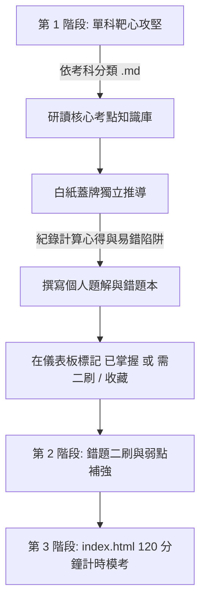

# 電機工程技師歷屆試題與 AI 詳解工作庫

> **104～114 年｜6 大考科｜官方原卷可追溯｜離線即可使用**

這是一套把「歷屆試題、官方原卷、逐題詳解、考點分類與複習工具」放在一起的電機工程技師備考工作庫。它不只收集題目，也保留每題的來源裁切圖、題號級詳解、公式回代與驗證狀態，讓使用者能從原題一路追到答案，而不是只看到一個沒有來源的數字。

## 先從這裡開始

| 你想做的事 | 直接入口 |
| :--- | :--- |
| 開始刷題、搜尋題目、做計時模考 | [開啟離線 Web 工作台](./index.html) · [GitHub Pages 線上版](https://db2bd.github.io/ee-exam-workbench/) |
| 依考科閱讀完整題庫 | [6 大考科題庫](#6-大考科-markdown-題庫快速導覽) |
| 依年度做整份模擬試卷 | [年度模擬試卷索引](#各年度全真模擬試卷快速索引含計時規範與成績自評卡) |
| 了解操作方式 | [知識庫使用說明書](./知識庫使用說明書.md) |
| 查驗證狀態與人工覆核 | [稽核報告](./reports/pe-solution-audit-2026-08-30.md) · [人工覆核索引](./reports/manual-review-index.md) |
| 查看本次版本變更 | [v1.0.5 發版紀錄](./docs/發版紀錄_v1.0.5.md) |

## 目前版本與資料範圍

目前版本：**v1.0.5**（2026-09-06）

| 資料集 | 規模 | 用途 |
| :--- | :---: | :--- |
| **PE／EE 技師題庫** | 104～114 年、6 科、321 題 | 技師歷屆申論題、原卷對照與逐題詳解 |
| **PE 題解稽核** | 256 題有題級稽核記錄 | 239 題 `verified`、15 題 `reference_book_verified`、2 題保留人工覆核 |
| **GK 公務高考三級** | 110～114 年、161 筆 | 101 道申論題與 60 道工程數學測驗題 |

### 驗證標籤怎麼看

- `verified`：依官方題圖／題幹建立推導，並完成獨立回代或交叉檢核。
- `reference_book_verified`：使用者提供的參考書已交叉核對，仍會標明它不是官方公布答案；若來源衝突，詳解會保留各分支並說明原因。
- `needs_manual_review`：題幹缺參數、圖形需估讀或官方資料互相矛盾；系統會保留條件式計算，不把猜測升級成唯一答案。

## 這個工作庫適合誰？

- 想依年度或考科快速刷完技師歷屆題的人。
- 需要對照原卷、公式、電路圖與逐步回代，避免只背答案的人。
- 想用離線儀表板管理「已掌握、需二刷、收藏」與錯題的人。
- 想把參考書解答與官方題幹分開比對，清楚看見題目瑕疵與假設的人。

本專案收錄考選部官方公布之**近 11 年（民國 104 年～114 年，共 11 個年度、66 份完整官方試題 PDF 與原卷圖檔）**，並擴充收錄 110～114 年公務高考三級 **GK 161 筆題目記錄（101 道申論題、60 道工程數學測驗題；23 份已下載官方試卷、2 份未提供試卷）**。資料標準化為 **LaTeX 數學公式、電路圖檔對照、深淺色離線 Web 儀表板、全真 120 分鐘計時模考與 AI 協同批改系統**。

---

## 核心規範與 AI 協同 Runbooks (Inspired by exam-wiki)

本專案採用結構工程技師 `exam-wiki-SA` 規格化知識工程體系打造：

| 檔案名稱 | 核心功能與說明 | 快速入口 |
| :--- | :--- | :--- |
| **[`AGENT-GUIDE.md`](./AGENT-GUIDE.md)** | **冷啟動導覽與協作指引**：模型中立的資料流架構、品質標準與交接方式 | [開啟 AGENT-GUIDE.md](./AGENT-GUIDE.md) |
| **[`AGENT-SOLVE.md`](./AGENT-SOLVE.md)** | **7 步標準題解推導 SOP**：考點定位、公式列式、步驟推導、防坑提醒與驗算 | [開啟 AGENT-SOLVE.md](./AGENT-SOLVE.md) |
| **[`AGENT-SPEC.md`](./AGENT-SPEC.md)** | **資料庫規格與 Metadata 規範**：QID 命名、KaTeX 語法、標籤與驗證狀態 | [開啟 AGENT-SPEC.md](./AGENT-SPEC.md) |
| **[`AGENT-CODE.md`](./AGENT-CODE.md)** | **指令集與維護 Runbook**：資料庫編譯、語法審計與自動化命令手冊 | [開啟 AGENT-CODE.md](./AGENT-CODE.md) |
| **[`知識庫使用說明書.md`](./知識庫使用說明書.md)** | **考生完整操作手冊**：離線 Web 儀表板、120 分鐘模考、AI 批改指令引導 | [開啟 知識庫使用說明書.md](./知識庫使用說明書.md) |
| **[`檔案架構索引表.md`](./檔案架構索引表.md)** | **全景雙向目錄索引地圖**：PE 66 份試卷／321 道題，及 GK 25 筆來源紀錄／161 筆題目快速跳轉 | [開啟 檔案架構索引表.md](./檔案架構索引表.md) |

### 題庫資料契約與品質分層

雙資料庫各自保留既有相容格式：PE `dashboard-data.js` 為 321 筆、每筆 12 欄；GK `national-exams-data.js` 為 161 筆、每筆 18 欄。GK 的 `QuestionRecord` 以五層理解：識別層（QID／科目／年度／題號）、`taxonomy` 分類層（考點／公式標籤／難度）、`provenance` 來源層（官方 PDF、題目與圖形裁切、頁碼、SHA-256）、`verification` 驗證層（題解狀態與專屬詳解旗標），以及跨題關聯層。資料仍以 tuple 儲存，但可透過命名欄位檢視使用 `id`、`subjectId`、`stem`、`solutionLink`、`sourceLink`、`solutionStatus` 等語意名稱；如此可在維持既有前端索引的同時，追溯每筆 GK 題目的官方來源與驗證狀態。

| 考別 | 題目記錄 | 收錄範圍 | 來源狀態 |
| :--- | :---: | :--- | :--- |
| **PE／EE** | 321 筆、12 欄 | 104 ~ 114 年、6 科 | 既有技師題庫 |
| **GK** | 161 筆、18 欄 | 110 ~ 114 年、5 科 | 23 份已下載、2 份 unavailable |

---

## 離線 Web 互動儀表板 ([`index.html`](./index.html)) 特色功能

- **100% 離線免伺服器**：直接以瀏覽器雙擊開啟 [`index.html`](./index.html)，0 毫秒載入。
- **深淺色主題無縫切換**：莫蘭迪暖白紙感與極客午夜深藍隨心切換，自動持久化偏好。
- **多維度交叉搜尋與即時快篩**：全文關鍵字、考科、年度、難度星級（★~★★★★★）、掌握狀態（已掌握 / 需二刷 / 收藏）。
- **全真 120 分鐘計時模考**：支援單科全卷或隨機 4 題模考，具備倒數計時器與成績自評卡。
- **AI 提示詞發射台**：一鍵複製「手寫解答 AI 批改」、「觀念白話剖析」、「變形題生成」Prompt。
- **快速鍵與極致閱讀**：支援 `j`/`k` 切換題目、`Esc` 關閉、原卷圖檔 Lightbox 放大與 KaTeX 高清數學排版。
- **數據備份與可攜性**：一鍵匯出/匯入個人刷題進度 JSON。

### 蓋牌提取訓練（建議每日 60 分鐘）

複習頁的「開始提取訓練」會依序提供四層揭示：**章節 → 起手式 → 核心公式／陷阱 → 完整推導**。每題完成後選擇 SM-2 評分，並記錄「題型辨識錯、起手式不會、公式忘記、計算錯、觀念混淆」之一；提取掌握度 L1～L4 連續兩次達標才升級，失敗只退一級。建議每次完成 8 題新題＋12 題到期／錯題，並維持 60 秒起手式限制。

分類器採科目限定、專有術語／公式加權、alias 正規化與信心門檻；最高分低於 0.65 或與次高分差距小於 0.15 的題目會留在「待人工複核」，不會污染章節統計。

### 人工覆核逐題標注

若要處理待人工複核題，開啟儀表板的「複習中心」，按「逐題標注題型」。視窗會依目前考科列出待覆核題，並同時顯示本題裁切圖、題幹、自動候選章節、阻擋原因與詳解入口；選定教科書章節後按「儲存並下一題」即可逐題完成。標注會保存在瀏覽器的 `localStorage`，也會隨「備份／還原」JSON 一併匯出；人工標注只修正題型索引，不會在未完成答案查核前把題目升級為 `verified`。

---

## 6 大考科 Markdown 題庫快速導覽（點擊直接線上刷題）

| 科目代號 | 考科名稱 | 收錄年份 | 份數 | 完整 Markdown 題庫 | 核心考點卡 | 考科資料夾 |
| :---: | :--- | :---: | :---: | :--- | :--- | :--- |
| **01** | **電路學** | 104 ~ 114 年 | 11 份 | [**電路學.md**](./依考科分類/01_電路學.md) | [核心考點](./🧠%20核心考點知識庫/01_電路學/) | [`01_電路學/`](./依考科分類/01_電路學/) |
| **02** | **電子學（含電力電子）** | 104 ~ 114 年 | 11 份 | [**電子學_含電力電子.md**](./依考科分類/02_電子學_含電力電子.md) | [核心考點](./🧠%20核心考點知識庫/02_電子學_含電力電子/) | [`02_電子學_含電力電子/`](./依考科分類/02_電子學_含電力電子/) |
| **03** | **工程數學（線代/微方/複變/機率）** | 104 ~ 114 年 | 11 份 | [**工程數學.md**](./依考科分類/03_工程數學.md) | [核心考點](./🧠%20核心考點知識庫/03_工程數學/) | [`03_工程數學/`](./依考科分類/03_工程數學/) |
| **04** | **電機機械** | 104 ~ 114 年 | 11 份 | [**電機機械.md**](./依考科分類/04_電機機械.md) | [核心考點](./🧠%20核心考點知識庫/04_電機機械/) | [`04_電機機械/`](./依考科分類/04_電機機械/) |
| **05** | **電力系統** | 104 ~ 114 年 | 11 份 | [**電力系統.md**](./依考科分類/05_電力系統.md) | [核心考點](./🧠%20核心考點知識庫/05_電力系統/) | [`05_電力系統/`](./依考科分類/05_電力系統/) |
| **06** | **工業配電** | 104 ~ 114 年 | 11 份 | [**工業配電.md**](./依考科分類/06_工業配電.md) | [核心考點](./🧠%20核心考點知識庫/06_工業配電/) | [`06_工業配電/`](./依考科分類/06_工業配電/) |

---

## 各年度全真模擬試卷快速索引（含計時規範與成績自評卡）

| 年度 | 試卷總覽與自評卡 | 收錄科目 | 建議用途 |
| :---: | :--- | :---: | :--- |
| **114 年** | [**114 年全真模擬試卷與計時自評卡**](./依年度分類/114年/README.md) | 完整 6 科 | 考前全真計時模擬 |
| **113 年** | [**113 年全真模擬試卷與計時自評卡**](./依年度分類/113年/README.md) | 完整 6 科 | 考前全真計時模擬 |
| **112 年** | [**112 年全真模擬試卷與計時自評卡**](./依年度分類/112年/README.md) | 完整 6 科 | 考前全真計時模擬 |
| **111 年** | [**111 年全真模擬試卷與計時自評卡**](./依年度分類/111年/README.md) | 完整 6 科 | 考前全真計時模擬 |
| **110 年** | [**110 年全真模擬試卷與計時自評卡**](./依年度分類/110年/README.md) | 完整 6 科 | 章節靶心鞏固 |
| **109 年** | [**109 年全真模擬試卷與計時自評卡**](./依年度分類/109年/README.md) | 完整 6 科 | 章節靶心鞏固 |
| **108 年** | [**108 年全真模擬試卷與計時自評卡**](./依年度分類/108年/README.md) | 完整 6 科 | 章節靶心鞏固 |
| **107 年** | [**107 年全真模擬試卷與計時自評卡**](./依年度分類/107年/README.md) | 完整 6 科 | 章節靶心鞏固 |
| **106 年** | [**106 年全真模擬試卷與計時自評卡**](./依年度分類/106年/README.md) | 完整 6 科 | 題型廣度擴充 |
| **105 年** | [**105 年全真模擬試卷與計時自評卡**](./依年度分類/105年/README.md) | 完整 6 科 | 題型廣度擴充 |
| **104 年** | [**104 年全真模擬試卷與計時自評卡**](./依年度分類/104年/README.md) | 完整 6 科 | 題型廣度擴充 |

---

## 推薦備考作戰工作流

1. **第一階段（單科靶心攻堅，約 60 天）**：
   - 進入 [`依考科分類/`](./依考科分類/) 逐科刷題，對照 [`核心考點知識庫/`](./🧠%20核心考點知識庫/) 鞏固解題 SOP 與公式推導。
2. **第二階段（錯題沉澱與二刷，約 30 天）**：
   - 在 [`index.html`](./index.html) 或 [`備考進度儀表板.md`](./📊%20備考進度儀表板.md) 標記狀態，點擊「我的錯題本」定期二刷。
3. **第三階段（全真計時模考，考前 15 天）**：
   - 開啟 [`index.html`](./index.html) 切換至「全真計時模考」，進行近 4 年完整 6 科計時模擬（每科 120 分鐘）。
   - 點擊「呼叫 AI 批改手寫解答」讓 AI 評分並抓出計算瑕疵。
