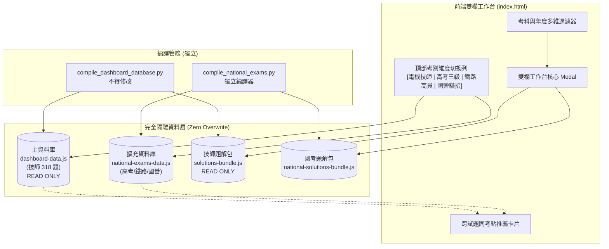

# 技術規格架構書：國考同級參考題庫擴充系統 (National Exam Cross-Reference Bank)

**檔案識別**：`SPEC-EXAM-EXT-002`
**建立時間**：2026-08-24
**本次同步**：2026-08-30（依現有 161 筆 GK 編譯資料與 18 欄 QuestionRecord 校正）
**遵循規範**：[`CLAUDE.md`](./CLAUDE.md) · [`CLAUDE-SPEC.md`](./CLAUDE-SPEC.md) · [`to-spec`](./.agents/skills/to-spec/SKILL.md) · [`to-tickets`](./.agents/skills/to-tickets/SKILL.md)

---

## 一、問題陳述與核心目標 (Problem Statement & Goals)

### 1.1 現狀與痛點
1. **考點命題重疊率高達 85%**：考選部「專技高考電機技師」之命題委員群與「公務高考三級（電力/電子）」、「鐵路特考高員三級」、「地方特考三級」高度重疊，同一個觀念（如：NR 潮流計算、變壓器等效、SVD 矩陣特徵值、Buck/Boost BCM、短路容量）常在同年度或隔年在不同國考中交互換皮出題。
2. **跨考別資料仍需持續擴充**：工作台目前已有 104~114 年電機技師 318 題及 110~114 年公務高考 161 筆記錄；鐵路特考、地方特考與國營聯招仍保留獨立擴充介面，避免把尚未取得的資料誤宣告為已收錄。
3. **資料庫防覆蓋剛性要求**：原有 318 題電機技師題庫、進度記錄、雙欄工作台、SVG 向量電路圖已全面通過 SymPy 與 LaTeX 驗證，**任何擴充模組必須 100% 零污染、零覆蓋、獨立解耦**。

### 1.2 核心目標 (Goals)
1. **獨立資料層架構 (Isolated Data Architecture)**：
   - 維持獨立的 `national-exams-data.js`（GK 161 筆）與 `national-solutions-bundle.js`，原 `dashboard-data.js`（PE 318 題）與 `solutions-bundle.js` 保持完全不變。
2. **頂部考別維度切換列 (Exam Category Dimension Switcher)**：
   - **專技高考：電機工程技師**（主戰場・預設 318 題）
   - **公務高考三級：電力工程 / 電子工程**
   - **鐵路特考高員三級：電力工程**
   - **地方特考三級：電力工程**
   - **國營事業聯招：台電/中油/中鋼 電機類**
3. **跨試題同考點穿梭機制 (Cross-Exam Topic Bridge)**：
   - 在閱讀技師詳解時，右欄底端提供「同考點公務高考 / 鐵路特考推薦題」，點擊後原地無縫切換，並提供「返回原技師試題」歷史堆疊。
4. **零覆蓋與向後相容性保證**：
   - 原有 318 題之 `qid`（如 `EE-114-01-1`）格式完全不變。
   - 國考題目採用前綴隔離 ID（如 `GK-114-01-1`、`RW-113-05-2`、`SOE-112-05-1`）。

### 1.3 非目標 (Non-Goals)
- 不改動原有的 `index.html` 核心評分邏輯與 localStorage 進度欄位名稱。
- 僅收錄與電機技師 6 大考科對應之同級考科；目前 GK 來源實際涵蓋 01～05，06 工業配電沒有資料時保持空集合，不以合成檔補足。

---

## 二、系統架構與資料解耦模型 (Architecture & Data Model)



---

## 三、資料結構規格 (Schema Specification)

### 3.1 題庫 ID 前綴與命名規範

| 考試類別代碼 | 完整中文名稱 | 考題 ID 格式 | 範例 |
| :--- | :--- | :--- | :--- |
| `EE` (既有) | 專技高考 — 電機工程技師 | `EE-{年度}-{科號}-{題號}` | `EE-114-01-1` |
| `GK` | 公務高考三級 — 電力/電子工程 | `GK-{年度}-{科號}-{題號}` | `GK-114-01-1` |
| `RW` | 鐵路特考高員三級 — 電力工程 | `RW-{年度}-{科號}-{題號}` | `RW-113-05-2` |
| `LOC` | 地方特考三等 — 電力工程 | `LOC-{年度}-{科號}-{題號}` | `LOC-112-04-3` |
| `SOE` | 國營事業聯招 — 電機(甲) | `SOE-{年度}-{科號}-{題號}` | `SOE-114-05-1` |

### 3.2 QuestionRecord 序列化格式（GK 18 欄位；PE 維持 12 欄位）

`QuestionRecord` 是前端使用的單題標準記錄。為維持既有 `item[index]` 呼叫端相容性，編譯輸出目前仍是陣列，而非 JavaScript 物件。GK 的 18 欄依下列五層組織：

資料層之上提供穩定的命名欄位檢視（`question_record_view`）：`id`、`examFamily`、`subjectId`、`year`、`number`、`stem`、`tags`、`solutionLink`、`sourceLink`、`difficulty`、`solutionStatus`、`formulaTags`、`hasDedicatedSolution`；GK 另有 `categoryId`、`relatedPEId`、`questionCrop`、`figureCrops`、`sourcePages`、`sourcePdfSha256`。這些名稱是 domain view，並不改寫既有 tuple 的位置契約。

| 分層 | 欄位 | 用途 |
| :--- | :--- | :--- |
| **識別層** | `qid`、`sid`、`year`、`qnum`（[0]–[3]） | 全域題號、考科、年度與應用題號；工程數學測驗題的 `qnum` 為 101–120，QID 使用 `MC01`–`MC20`。 |
| **Taxonomy 分類層** | `topic`、`tags`、`difficulty`、`ftags`（[4]、[5]、[8]、[10]） | 題幹摘要、考點標籤、1–5 難度與公式標籤，供搜尋、章節分類與複習中心使用。 |
| **Provenance 來源層** | `solLink`、`pdfLink`、`questionCrop`、`figureCrops`、`sourcePages`、`sourcePdfSha256`（[6]、[7]、[14]–[17]） | 題解與官方 PDF 連結、題目／圖形裁切、來源頁碼及官方 PDF SHA-256。 |
| **Verification 驗證層** | `vstatus`、`hasDedicated`（[9]、[11]） | 題解驗證狀態與是否存在逐題專屬詳解；目前 GK 實際使用 `verified`、`in_progress`，保留 `pending`、`ambiguous`、`unavailable` 供後續來源狀態。 |
| **關聯層** | `examCategory`、`relatedPEQid`（[12]、[13]） | 考試類別及 PE 跨題推薦關聯。 |

```javascript
// national-exams-data.js 內 questions 陣列之每一元素：
[
  qid,           // [0]  "GK-114-01-1"；測驗題例："GK-112-03-MC01"
  sid,           // [1]  "01"
  year,          // [2]  114
  qnum,          // [3]  1；測驗題於應用層為 101–120
  topic,         // [4]  "節點電壓法與戴維寧等效電路分析"
  tags,          // [5]  ["電路學", "等效定理"]
  solLink,       // [6]  "📝 個人題解與錯題本/🏛️_國考同級題解/01_電路學/GK_114年_電路學_全卷完整詳細題解.md"
  pdfLink,       // [7]  "依考科分類/🏛️_國考同級參考題庫/01_電路學/GK_114年_電路學.pdf"
  difficulty,    // [8]  3
  vstatus,       // [9]  "verified" | "in_progress"
  ftags,         // [10] ["戴維寧等效", "S = VI*"]
  hasDedicated,  // [11] true/false
  examCategory,  // [12] "GK"  ← 考試類別代碼
  relatedPEQid,  // [13] "EE-114-01-2"  ← 關聯技師題目 QID（可為空字串）
  questionCrop,  // [14] 官方題目裁切路徑
  figureCrops,   // [15] 官方圖形裁切路徑陣列
  sourcePages,   // [16] [{ page, crop_rect }] 來源頁面與裁切座標
  sourcePdfSha256// [17] 官方 PDF SHA-256（64 字元）
]
```

### 3.3 檔案系統架構

```
技師考試/歷屆試題_104-114年/
├── dashboard-data.js              (唯讀/不變)
├── solutions-bundle.js            (唯讀/不變)
├── national-exams-data.js         (國考擴充資料庫・獨立)
├── national-solutions-bundle.js   (國考題解包・獨立)
│
├── 依考科分類/
│   ├── 01_電路學/                 (既有技師試題與 PDF・不變)
│   ├── 01_電路學.md               (既有技師索引・不變)
│   ├── ...
│   └── 🏛️_國考同級參考題庫/      (獨立國考資料夾)
│       ├── README.md              (本擴充模組說明)
│       ├── 01_電路學/
│       │   ├── GK_114年_電路學.md  (高考電路學試題 Markdown)
│       │   ├── GK_113年_電路學.md
│       │   ├── RW_114年_電路學.md  (鐵路特考)
│       │   └── images/            (試卷圖檔)
│       ├── 02_電子學_含電力電子/
│       ├── 03_工程數學/
│       ├── 04_電機機械/
│       ├── 05_電力系統/
│       └── 06_工業配電/
│
├── 📝 個人題解與錯題本/
│   ├── 01_電路學/                 (既有技師題解・不變)
│   ├── ...
│   └── 🏛️_國考同級題解/          (國考獨立題解)
│       ├── 01_電路學/
│       │   ├── GK_114年_電路學_全卷完整詳細題解.md
│       │   └── ...
│       ├── 02_電子學_含電力電子/
│       └── ...
│
├── scripts/
│   ├── compile_dashboard_database.py   (唯讀/不變)
│   └── compile_national_exams.py       (獨立編譯器・已建立)
```

### 3.4 Markdown 試題檔案命名慣例

```
{考別代碼}_{年度}年_{科目名}.md
```
範例：`GK_114年_電路學.md`、`RW_113年_電力系統.md`、`SOE_114年_電機機械.md`

內部結構完全遵循既有技師索引格式（`依考科分類/01_電路學.md` 為模板），使用：
- `#### 一、` ~ `#### 十、` 作為題號分隔
- 雙中括號圖片嵌入語法（例如 `! [ [ 圖檔名稱 | 750 ] ]`，支援指定寬度）作為圖檔嵌入
- `> **等別**` blockquote 作為考試 metadata header

---

## 四、安全與隔離規範 (Safety & Boundary Constraints)

1. **資料層完全唯讀分離**：
   - `compile_national_exams.py` 的 `safety_check()` 在執行前後計算 `dashboard-data.js` 與 `solutions-bundle.js` 的 SHA-256，任何不符即 abort。
2. **UI 漸進增強（Progressive Enhancement）**：
   - 若 `national-exams-data.js` 尚未加載或不存在，前端自動優雅降級（Graceful Degradation），僅顯示技師題庫，主功能 100% 正常運行。
   - 使用 `<script src="./national-exams-data.js" defer></script>` 非同步加載，不阻塞首頁渲染。
3. **快取與記憶隔離**：
   - 技師題庫進度：`localStorage key = 'ee_progress_v1'`（既有）
   - 國考參考題庫進度：`localStorage key = 'ee_nat_progress_v1'`（新增）
   - 考別維度選擇：`localStorage key = 'exam_category_tab'`（新增）

---

## 五、開發工單清單 (Ticket Breakdown by `/to-tickets`)


### 工單詳細規格

#### `TICKET-01`：高考三級 110~114 年試題爬取與 Markdown 建檔
- **目標**：從考選部歷屆試題下載區建立 110~114 年、5 科 × 5 年共 25 筆來源紀錄；其中 23 份官方 PDF 已下載、2 份工程數學試卷標示為 unavailable，不以合成檔補足。現有 GK 題庫編譯為 161 筆記錄（含 101 道申論題與 60 道工程數學測驗題）。
- **輸出位置**：`依考科分類/🏛️_國考同級參考題庫/{科號}_{科名}/GK_{年度}年_{科名}.md`
- **圖檔位置**：`依考科分類/🏛️_國考同級參考題庫/{科號}_{科名}/images/`
- **驗收標準**：已下載試卷的 Markdown 使用 `#### 一、` 或測驗題標記，可被 `compile_national_exams.py` 正確掃描解析；來源清冊保留 23/2 可得性狀態。

#### `TICKET-02`：試題 Markdown 標準化與 LaTeX 格式化
- **目標**：對已取得來源的 GK Markdown 進行 LaTeX 公式精修（確保 KaTeX 相容）、圖檔嵌入語法 `![[]]` 統一；2 份 unavailable 試卷保留可得性註記。
- **驗收標準**：在 Obsidian 與 index.html 雙欄工作台中可正確渲染公式與圖片。

#### `TICKET-03`：compile_national_exams.py 編譯全量驗證
- **目標**：執行 `python3 scripts/compile_national_exams.py`，確認產出 `national-exams-data.js` 含 161 筆 GK `QuestionRecord`，每筆含 18 欄與題目來源 provenance，且零覆蓋驗證通過。
- **驗收標準**：
  - `national-exams-data.js` 含 `NATIONAL_EXAMS_DATA.questions` 陣列，長度為 161；GK 每筆 record 長度為 18
  - `national-solutions-bundle.js` 含 `NATIONAL_BUNDLED_MD` 映射
  - GK 161 筆均有題目裁切、圖形裁切陣列、來源頁碼與 PDF SHA-256；`dashboard-data.js` SHA-256 前後一致

#### `TICKET-04`：前端工作台考別維度切換 UI
- **目標**：在 `index.html` 頂部 `<nav class="tabs">` 之上方新增一組膠囊標籤切換器（`電機技師`、`公務高考`、`鐵路特考`、`國營聯招`），切換時動態替換 `renderQuestions()` 的資料來源。
- **載入方式**：按需 async `<script>` 注入 `national-exams-data.js`，首次切換到非 PE 標籤時才載入。
- **驗收標準**：
  - 預設「電機技師」顯示原 318 題（使用既有 `DB_DATA`）
  - 切換「公務高考」時使用 `NATIONAL_EXAMS_DATA.questions`
  - 重整頁面後 `localStorage` 記憶上次考別選擇
  - 若 `national-exams-data.js` 不存在或載入失敗，僅顯示技師題庫不報錯

#### `TICKET-05`：跨試題同考點推薦穿梭卡片 (Cross-Exam Bridge)
- **目標**：在雙欄對照工作台右欄底部，若當前技師題目有 `relatedPEQid` 反向關聯到國考題，顯示推薦卡片。
- **UX**：點擊後原地切換為高考題目與詳解（markdown 從 `NATIONAL_BUNDLED_MD` 取得），並顯示 **「返回原技師試題」** 按鈕（使用 JS 歷史堆疊，非瀏覽器 back）。
- **驗收標準**：考生可在不離開當前視窗下，秒開高考對應考點之題目與詳解。

#### `TICKET-06`：回歸測試與零覆蓋嚴格驗證
- **目標**：自動化腳本核對 318 題技師資料庫之 SHA-256 與題目數量，確保 100% 無變動。
- **驗收標準**：全項測試通過，`git diff dashboard-data.js solutions-bundle.js` 為空。

---

## 六、架構問答與決策共識記錄 (Grill-Me Consensus Log)

1. **第一波收錄範疇**：
   - 先以 **110～114 年 公務高考三級（電力工程 / 電子工程）** 作為首波旗艦試點，驗證零覆蓋隔離與同考點關聯機制。
2. **資源加載策略**：
   - 採用 **「按需動態非同步加載（Dynamic Async Loading）」**，首頁載入保持 0 負擔，切換至國考維度或點開推薦題時動態載入資料包。
3. **同考點穿梭互動 (Bridge UX)**：
   - 在雙欄工作台右欄底端嵌入 **「同考點推薦卡片」**，點擊後原地切換為高考題目與詳解，並提供 **「返回原技師試題」** 快捷歷史堆疊。

---

## 七、已建置基礎設施 (Pre-Built Infrastructure)

以下架構已由 Claude Opus 4.6 完成建置，Gemini 3.7 可直接使用：

### 已建立的目錄

```
依考科分類/🏛️_國考同級參考題庫/
├── README.md
├── 01_電路學/ (GK 5 年、20 筆)
├── 02_電子學_含電力電子/ (GK 5 年、23 筆)
├── 03_工程數學/ (GK 3 年、72 筆；113/114 年 unavailable)
├── 04_電機機械/ (GK 5 年、24 筆)
├── 05_電力系統/ (GK 5 年、22 筆)
└── 06_工業配電/ (目前無 GK 記錄)

📝 個人題解與錯題本/🏛️_國考同級題解/
├── 01_電路學/ (5 份 GK 題解)
├── 02_電子學_含電力電子/ (5 份 GK 題解)
├── 03_工程數學/ (3 份 GK 題解)
├── 04_電機機械/ (5 份 GK 題解)
├── 05_電力系統/ (5 份 GK 題解)
└── 06_工業配電/ (目前無 GK 題解)
```

### 已建立的腳本

| 檔案 | 狀態 | 說明 |
| :--- | :---: | :--- |
| [`scripts/compile_national_exams.py`](./scripts/compile_national_exams.py) | 已建立 | 獨立編譯器，含 SHA-256 零覆蓋安全檢查，已通過空跑測試 |

### 已建立的輸出檔案

| 檔案 | 狀態 | 說明 |
| :--- | :---: | :--- |
| `national-exams-data.js` | 已編譯 | 含 161 筆 GK `QuestionRecord`；每筆 18 欄，含 taxonomy、provenance、verification 與跨題關聯欄位 |
| `national-solutions-bundle.js` | 已編譯 | 含 GK 題庫 Markdown、題解與官方裁切圖映射；未取得的 2 份試卷維持 unavailable 狀態 |
