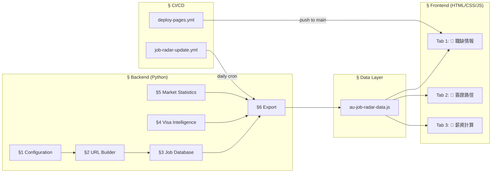

# 🇦🇺 澳洲重電工程師求職情報戰情室 — 架構規格書 (Architecture Spec)

> **版本**: v1.0 · **鎖定日期**: 2026-08-22
> **用途**: 任何後續修改 **必須遵守** 本 Spec 中的契約，若需破壞性變更，須先更新本 Spec 並獲得 review。

---

## 1. 系統總覽



---

## 2. 檔案清單與職責邊界

| 檔案 | 職責 | 可修改範圍 |
| :--- | :--- | :--- |
| `scripts/au_job_radar_crawler.py` | 資料產生器 (6 個模組) | 新增職缺/更新簽證數據/新增平台 URL。**禁止** 移除模組邊界或合併模組。 |
| `au-job-radar-data.js` | 自動產生的中間層資料檔 | **禁止手動編輯** — 由 crawler.py `§6 Export` 自動覆寫。 |
| `australia-job-radar.html` | 前端儀表板 (Single HTML + inline CSS/JS) | 可修改 UI/UX 細節，**禁止** 移除三大分頁架構或變更 JS 全域常數名稱。 |
| `.github/workflows/job-radar-update.yml` | 每日 08:00 AM (Taipei) 自動執行 crawler | 可調整 cron 排程，**禁止** 移除 `git commit` guard (`git diff --staged --quiet`)。 |
| `.github/workflows/deploy-pages.yml` | push-to-main 自動部署 GitHub Pages | **禁止** 變更 `path: '.'` (整倉庫部署)。 |

> [!CAUTION]
> `au-job-radar-data.js` 是自動產生檔，手動編輯會在下次 crawler 執行時被覆蓋。所有資料變更必須在 `au_job_radar_crawler.py` 中進行。

---

## 3. 後端模組契約 (au_job_radar_crawler.py)

### 3.1 模組邊界（6 個 Section，不可合併或刪除）

| Section | 行範圍 | 職責 | 不變量 (Invariants) |
| :--- | :--- | :--- | :--- |
| `§1 Configuration` | L24-33 | 路徑常數、GeoID 常數 | `WORKSPACE` 必須自動偵測。GeoID 必須為 LinkedIn 驗證過的數值 ID。 |
| `§2 URL Builder` | L35-100 | 5 個平台的 URL 建構函式 + `build_links()` 聚合函式 | 每個函式 **只負責一個平台**。`build_links()` 是唯一的聚合入口。 |
| `§3 Job Database` | L102-310 | `curated_jobs` 職缺清單 | 每筆職缺 **必須** 透過 `**build_links(...)` 展開連結。**禁止** 手動硬編碼 URL。 |
| `§4 Visa Intelligence` | L312-385 | `visa_pathways` 簽證路徑資料 | **必須** 包含 482/190/189/491 四大路徑。每個路徑的 key 格式為 `subclass{number}`。 |
| `§5 Market Statistics` | L388-437 | `radar_stats` 市場統計 + 獵頭名冊 | `skillsDemand` 陣列不得少於 5 項。`recruiters` 陣列不得少於 3 家。 |
| `§6 Export` | L440-462 | 輸出 `au-job-radar-data.js` | **必須** 同時輸出 `AU_RADAR_JOBS`、`AU_RADAR_STATS`、`AU_VISA_PATHWAYS` 三個 `const`。 |

### 3.2 URL Builder 規格（不可變更的 URL 格式）

| 平台 | 函式 | URL 格式 | 關鍵參數 |
| :--- | :--- | :--- | :--- |
| **Seek AU** | `seek_url()` | `https://www.seek.com.au/jobs?keywords={kw}&where={loc}` | `kw`: URL-encoded 關鍵字, `loc`: `Perth+WA` 或 `Brisbane+QLD` |
| **LinkedIn** | `linkedin_url()` | `https://www.linkedin.com/jobs/search/?keywords={kw}&geoId={id}&sortBy=DD` | `geoId` **必須** 為數值 ID (Perth: `101902409`, Brisbane: `101471505`) |
| **Indeed AU** | `indeed_url()` | `https://au.indeed.com/jobs?q={q}&l={l}` | **必須** 使用 `au.indeed.com` 子域名 |
| **Google Jobs** | `google_jobs_url()` | `https://www.google.com/search?q={q}&ibp=htl;jobs` | **必須** 包含 `&ibp=htl;jobs` 觸發 Jobs 面板 |
| **Career Portal** | `CAREER_PORTALS` dict | 各公司官方 `/careers` 頁面 | 新增公司時 **必須** 驗證 URL 可達性 |

### 3.3 Job Entry Schema（每筆職缺的必填欄位）

```json5
{
    "id":                str,      # 格式: "MID-{nn}" 或 "SNR-{nn}"
    "title":             str,      # 客觀職稱，不含特定企業偏見用語
    "company":           str,      # 公司簡稱 (必須存在於 CAREER_PORTALS 或有 fallback)
    "location":          str,      # 格式: "{City}, {State}" (e.g. "Perth, WA")
    "workType":          str,      # e.g. "Full-time", "Full-time (Hybrid)"
    "expLevel":          str,      # 只能為 "mid" 或 "senior" (enum)
    "expText":           str,      # 顯示用中文，e.g. "⚡ 中階 (2~4 年)"
    "salaryMin":         int,      # AUD 年薪下限
    "salaryMax":         int,      # AUD 年薪上限
    "salaryText":        str,      # 顯示用文字
    "visaSponsorship":   bool,     # 是否支援 482 擔保
    "visaType":          str,      # 簽證類型描述
    "relocationSupport": bool,     # 是否提供搬遷補助
    "industry":          str,      # 產業分類
    "skills":            list[str],# 技能標籤 (3~6 個)
    "summary":           str,      # 客觀工作描述 (英文，2~3 句)
    "posted":            str,      # ISO 日期 "YYYY-MM-DD"
    "tier":              str,      # 公司層級 (e.g. "Tier-1 Global EPC")
    "seekUrl":           str,      # ← 由 build_links() 自動產生
    "linkedInUrl":       str,      # ← 由 build_links() 自動產生
    "indeedUrl":         str,      # ← 由 build_links() 自動產生
    "googleJobsUrl":     str,      # ← 由 build_links() 自動產生
    "careersUrl":        str,      # ← 由 build_links() 自動產生
```

---

## 4. 前端架構契約 (australia-job-radar.html)

### 4.1 三大分頁架構（不可刪除或合併）

| Tab ID | 分頁名稱 | DOM ID | 職責 |
| :--- | :--- | :--- | :--- |
| `jobs` | 💼 職缺情報 | `#sec-jobs` | KPI 摘要 + 篩選器 + 職缺卡片串流 + 技能熱度 + 獵頭名冊 |
| `visa` | 🛂 簽證路徑 | `#sec-visa` | 482/190/189/491 四路徑比較卡片 + 積分估算器 |
| `salary` | 🧮 薪資計算 | `#sec-salary` | ATO Stage 3 稅率精算 + TWD 換算 |

### 4.2 JavaScript 全域常數名稱（不可變更）

| 常數名稱 | 來源檔案 | 說明 |
| :--- | :--- | :--- |
| `AU_RADAR_JOBS` | `au-job-radar-data.js` | 職缺陣列 |
| `AU_RADAR_STATS` | `au-job-radar-data.js` | 市場統計 + 技能熱度 + 獵頭 |
| `AU_VISA_PATHWAYS` | `au-job-radar-data.js` | 簽證路徑資料 |

---

## 5. 內容政策

1. **禁止企業特定字眼**: 嚴禁在職缺、標籤、統計或篩選中出現「中鼎」、「CTCI」等字眼。
2. **客觀英文描述**: 職缺 `summary` 統一使用客觀工程英語。
