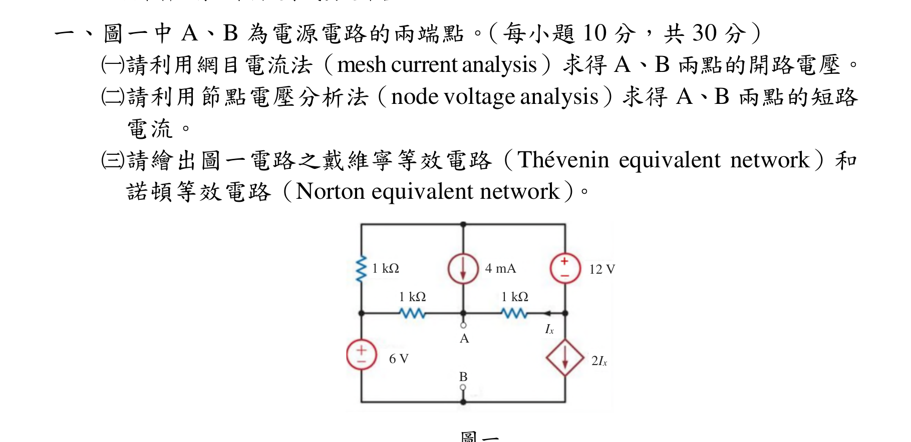
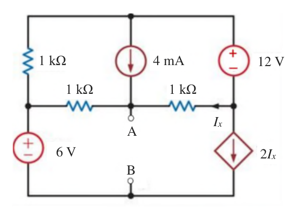
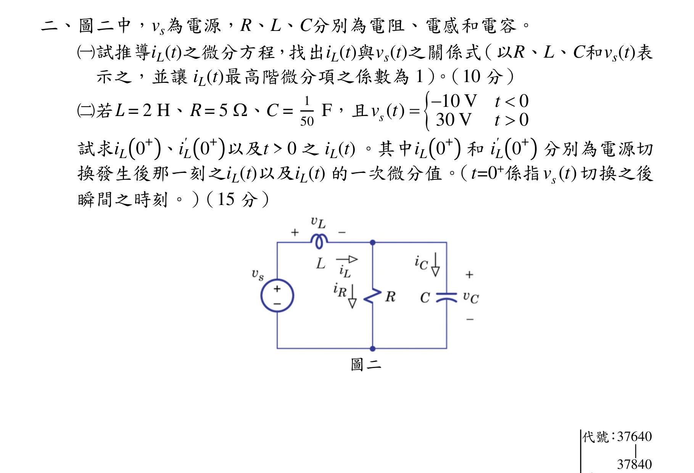
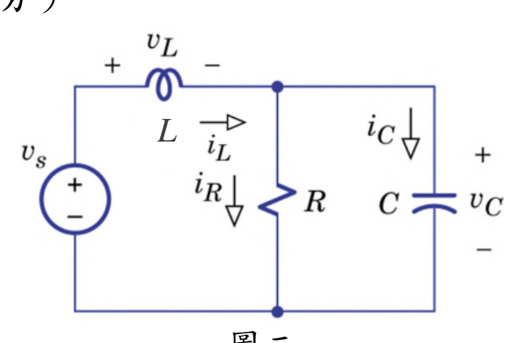
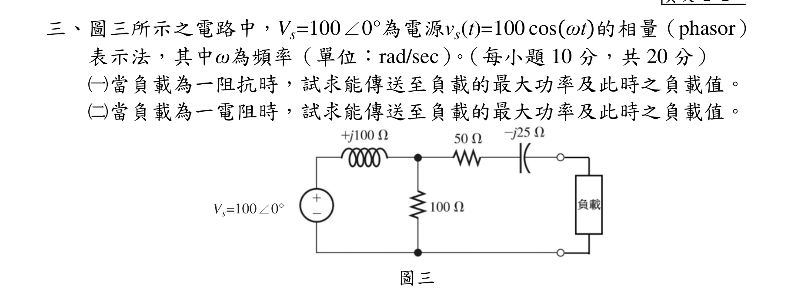
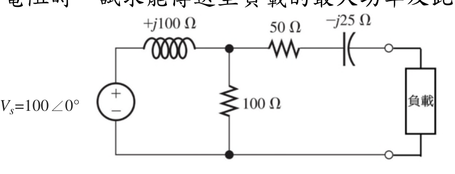
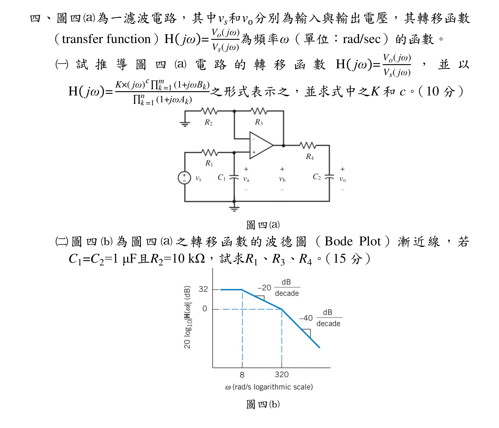
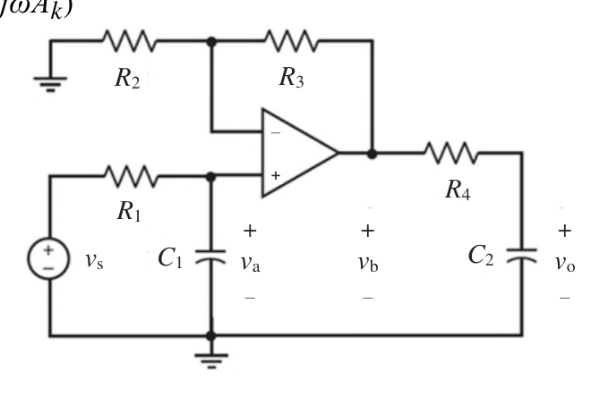
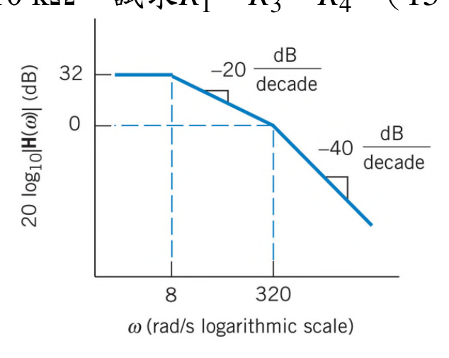

# 公務人員高等考試三級（110年）電路學 原始試題

> 本檔只保存考選部原始試題的轉錄與裁切圖，不含解答。數學符號、電路接線與圖中文字以原始題目裁切圖為準。

#### 一、（三）本科
得
本國
字或英
作答
一、圖一中A、B 為電源電路的兩端點。（每小題10 分，共30 分）
（一）請利用網目電流法（mesh current analysis）求得A、B 兩點的開路電壓。
（二）請利用節點電壓分析法（node voltage analysis）求得A、B 兩點的短路
電流。
（三）請繪出圖一電路之戴維寧等效電路（Thévenin equivalent network）和
諾頓等效電路（Norton equivalent network）。
圖一
2Ix
Ix
1 kΩ
1 kΩ
1 kΩ
4 mA
6 V
A
B
12 V

<!-- question_kind: essay; question_number: 1; app_question_number: 1 -->

### 原始題目裁切

### 原始圖形裁切

#### 二、圖二中，vs為電源，R、L、C分別為電阻、電感和電容。
（一）試推導iL(t)之微分方程，找出iL(t)與vs(t)之關係式（以R、L、C和vs(t)表
示之，並讓iL(t)最高階微分項之係數為1）。（10 分）
（二）若L = 2 H、R = 5 W、C =
1
50 F，且
10 V
0
( )
30 V
0
s
t
v t
t




試求iL൫0+൯、iL
' ൫0+൯以及t > 0 之iL(t) 。其中iL൫0+൯和iL
' ൫0+൯分別為電源切
換發生後那一刻之iL(t)以及iL(t) 的一次微分值。（t=0+係指
( )
sv t 切換之後
瞬間之時刻。）（15 分）
圖二
L
代號：37640
|
37840
頁

<!-- question_kind: essay; question_number: 2; app_question_number: 2 -->

### 原始題目裁切

### 原始圖形裁切

#### 三、頁次2 2
三、圖三所示之電路中，Vs=100∠0°為電源vs(t)=100 cos(ωt)的相量（phasor）
表示法，其中ω為頻率（單位：rad/sec）。（每小題10 分，共20 分）
（一）當負載為一阻抗時，試求能傳送至負載的最大功率及此時之負載值。
（二）當負載為一電阻時，試求能傳送至負載的最大功率及此時之負載值。
圖三
Vs=100∠0°

<!-- question_kind: essay; question_number: 3; app_question_number: 3 -->

### 原始題目裁切

### 原始圖形裁切

#### 四、圖四為一濾波電路，其中vs和vo分別為輸入與輸出電壓，其轉移函數
（transfer function）H( jω)=
Vo( jω)
Vs( jω)為頻率ω（單位：rad/sec）的函數。
（一）試推導圖四電路的轉移函數H( jω)=
Vo( jω)
Vs( jω) ，並以
H( jω)=
K×( jω)c ∏
(1+jωBk)
m
k =1
∏
(1+jωAk)
n
k =1
之形式表示之，並求式中之K 和c。（10 分）
圖四
（二）圖四為圖四之轉移函數的波德圖（Bode Plot）漸近線，若
C1=C2=1 μF且R2=10 kΩ，試求R1、R3、R4。（15 分）
圖四
+
vo
－
+
va
－
+
vb
－
R1
R2
R3
R4
C1
C2
vs
－
+

<!-- question_kind: essay; question_number: 4; app_question_number: 4 -->

### 原始題目裁切

### 原始圖形裁切

