# 公務人員高等考試三級（111年）電路學 原始試題

> 本檔只保存考選部原始試題的轉錄與裁切圖，不含解答。數學符號、電路接線與圖中文字以原始題目裁切圖為準。

#### 一、某電路圖(a)及其等效電路圖(b)，如下圖所示，試計算：
（一）該電路中圓形及菱形符號各是屬於那一種電源？（5 分）
（二）電路圖(a)中v1、i2、ia 及ib 之值？（8 分）
（三）等效電路圖(b)中Ra、Rb 及va、i1 之值？（7 分）
(a)
(b)
5 Ω
8 Ω
2 Ω
i2
i1
6 V
6 V
12 Ω
24 Ω
ia
ib
20 Ω
2ia
Rb
va
v1
2ia
Ra

<!-- question_kind: essay; question_number: 1; app_question_number: 1 -->

### 原始題目裁切

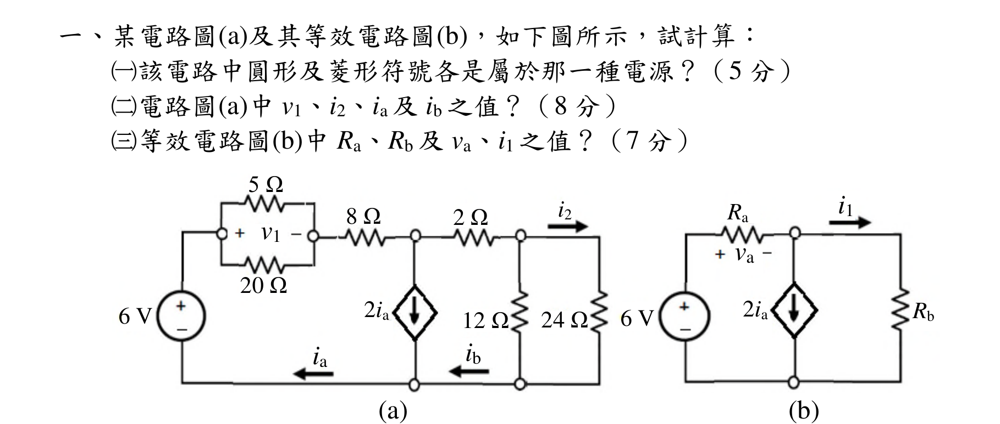

### 原始圖形裁切

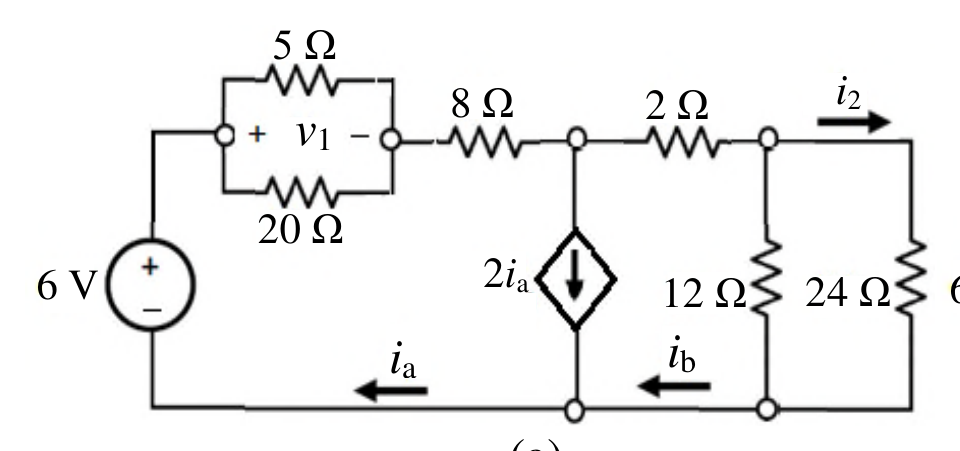
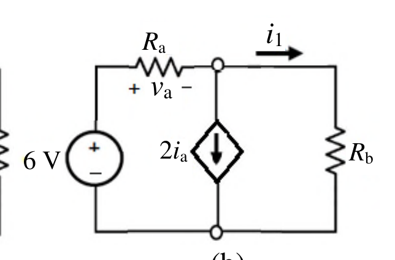

#### 二、某開關電路如下圖所示，此開關在時間t = 0 前已經關閉很長一段時間，
試計算：（hint：ν(t) = Voc + (ν(0) Voc)et/(RC)）
（一）該電路中電容器兩端之初始電壓v(0)、儲存於電容器之初始能量W(0)
及開關打開後之穩態電壓Voc 值？（10 分）
（二）該電路在時間t > 0 後之時間常數（time constant）值？（5 分）
（三）該電路在時間t > 0 後電容器之響應函數ν(t)？（10 分）
（四）該電路中電容器之能量釋放至原初始能量之25%所需要的時間？（5 分）
20 kΩ
0.2 mF
7.5 mA
80 kΩ
50 kΩ
t > 0
ν(t)

<!-- question_kind: essay; question_number: 2; app_question_number: 2 -->

### 原始題目裁切

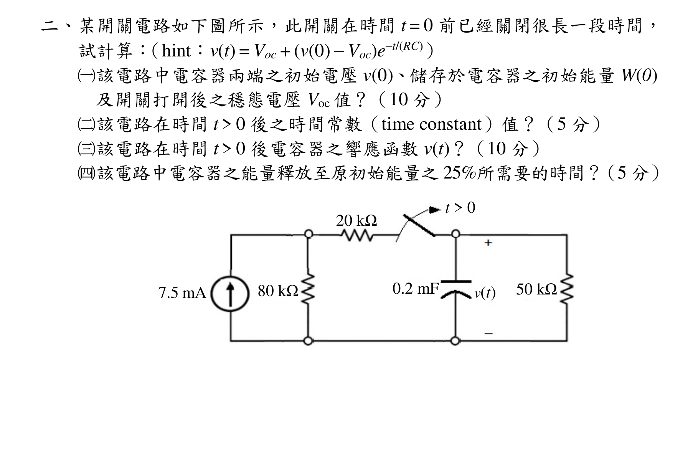

### 原始圖形裁切

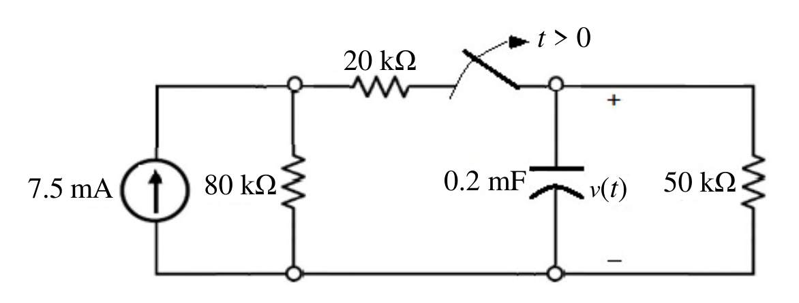

#### 三、某具有弦波輸入之電路圖如下圖所示，此開關在時間t = 0 前已經關閉很
長一段時間，試計算該電路中之流經電容器之電流ix 值。（20 分）（hint：
可將電路之元件轉換至頻域）
10 Ω
0.1 F
2ix
1 H
5 H
20 cos 4t V
ix

<!-- question_kind: essay; question_number: 3; app_question_number: 3 -->

### 原始題目裁切

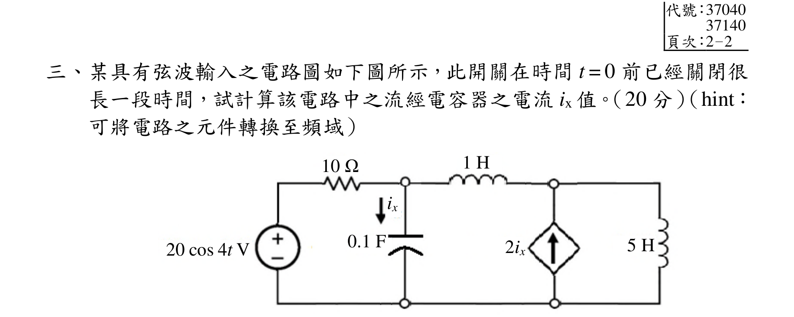

### 原始圖形裁切

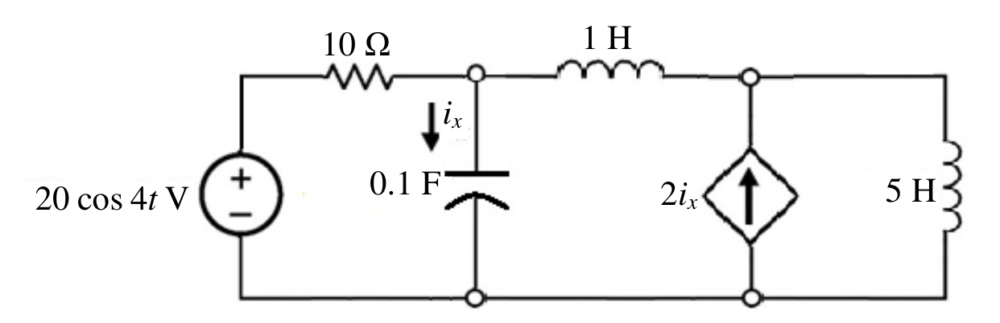

#### 四、下列所示(a)、(b)及(c)三個電路為運算放大器（OPA）加上RC 選頻網路
所組合而成之主動濾波器電路，請分別計算三個電路之輸入Vi 與輸出Vo
之轉移函數及截止頻率，並說明其為何種濾波器電路及其原因？（30 分）
(a)
(b)
(c)
Vi
R
C
A
Vo
R1
R2
Vi
R
C
A
Vo
R1
R2
R1
R1
R
C
Vi
Vo
A

<!-- question_kind: essay; question_number: 4; app_question_number: 4 -->

### 原始題目裁切

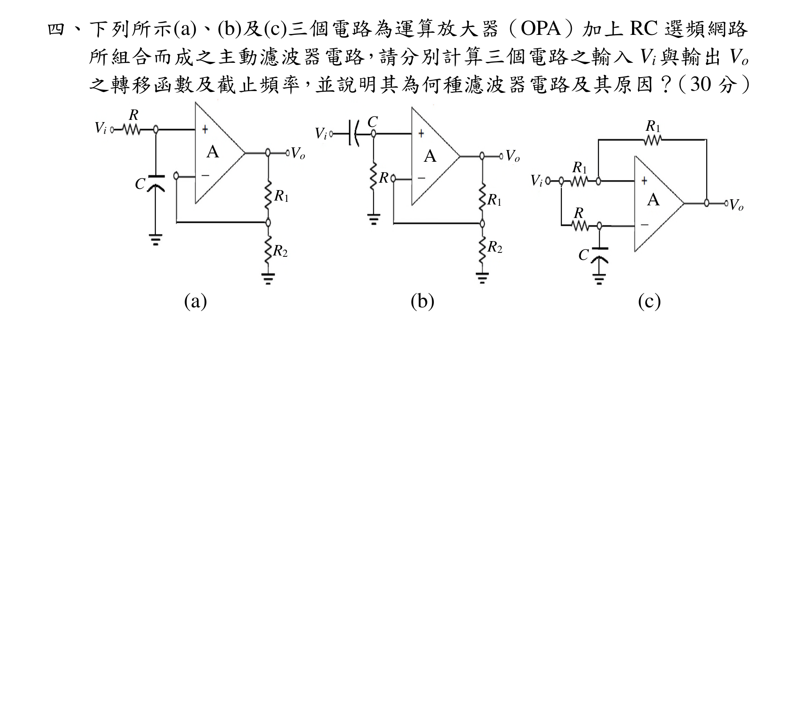

### 原始圖形裁切

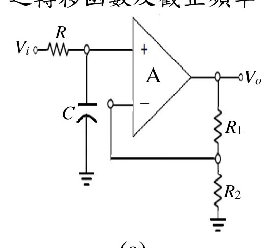
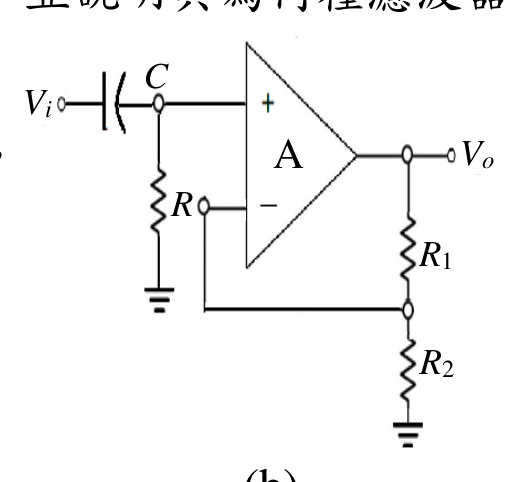
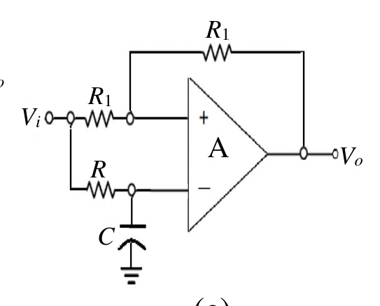
