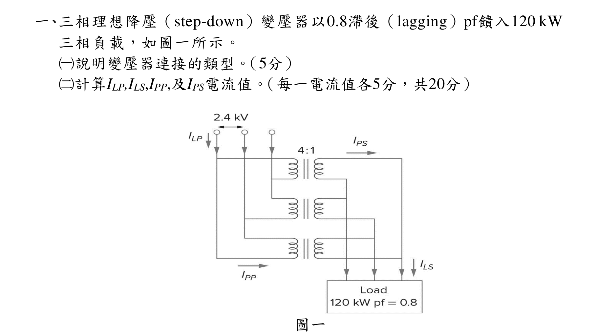
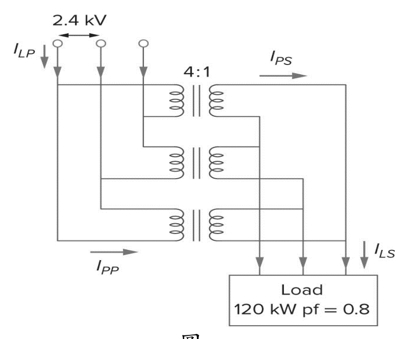
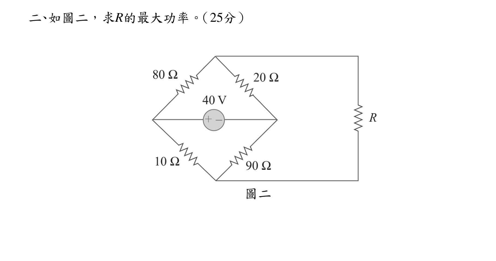
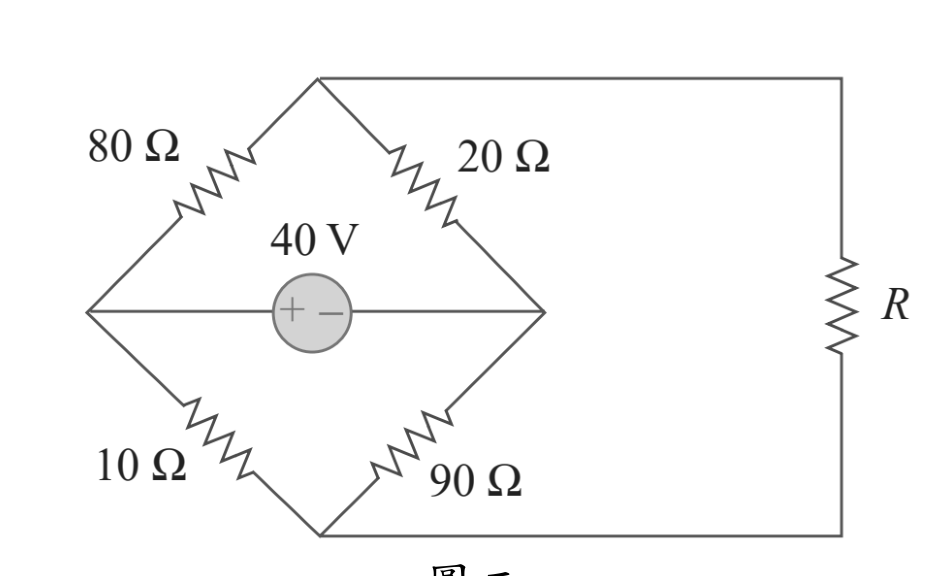
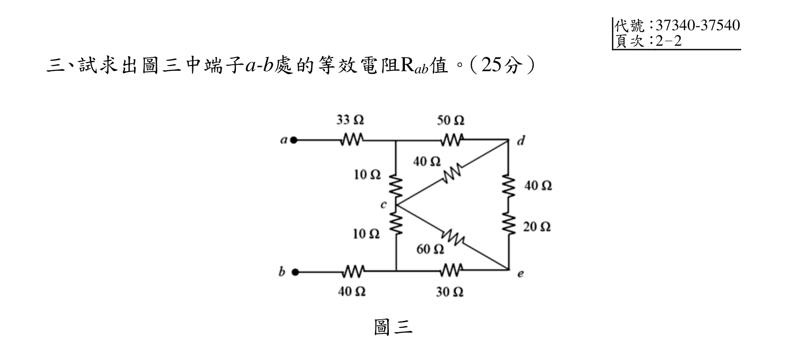
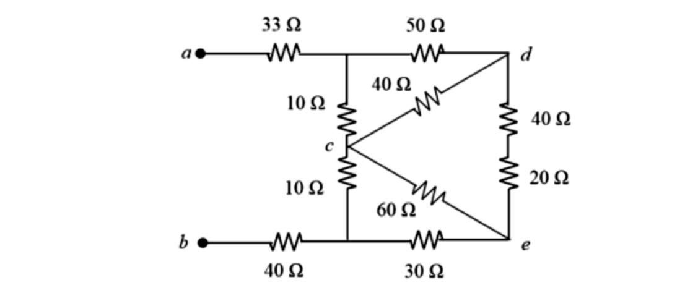
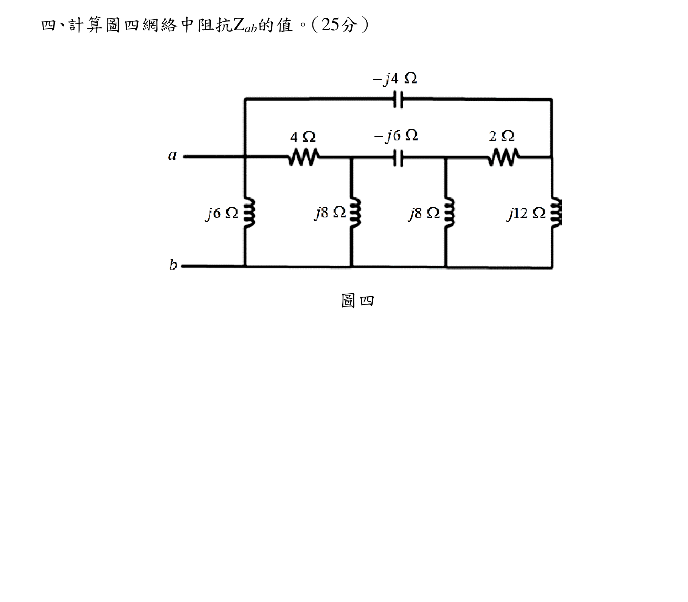
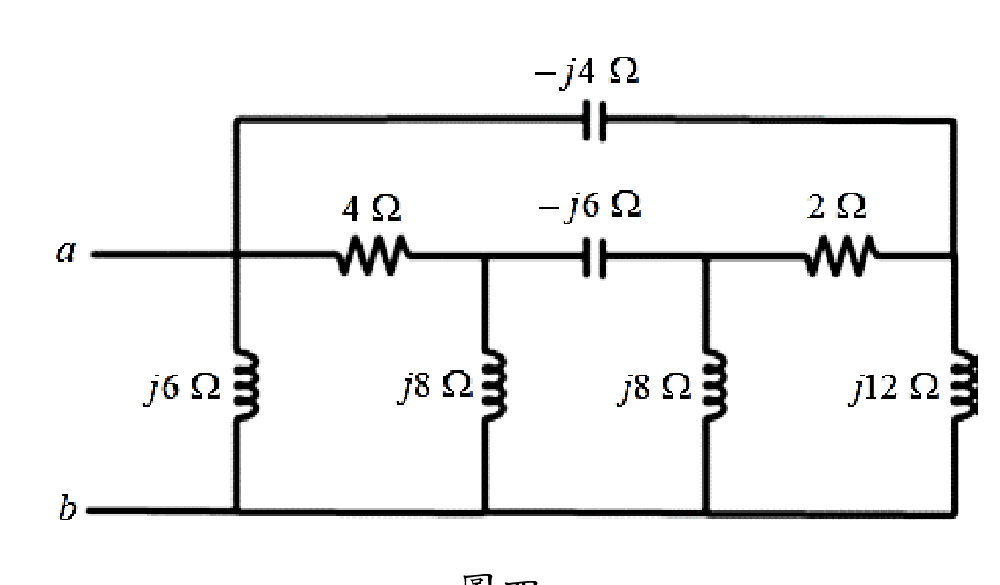

# 公務人員高等考試三級（112年）電路學 原始試題

> 本檔只保存考選部原始試題的轉錄與裁切圖，不含解答。數學符號、電路接線與圖中文字以原始題目裁切圖為準。

#### 一、三相理想降壓（step-down）變壓器以0.8滯後（lagging）pf饋入120 kW
三相負載，如圖一所示。
（一）說明變壓器連接的類型。（5分）
（二）計算ILP,ILS,IPP,及IPS電流值。（每一電流值各5分，共20分）
圖一

<!-- question_kind: essay; question_number: 1; app_question_number: 1 -->

### 原始題目裁切

### 原始圖形裁切

#### 二、如圖二，求R的最大功率。（25分）
圖二

<!-- question_kind: essay; question_number: 2; app_question_number: 2 -->

### 原始題目裁切

### 原始圖形裁切

#### 三、試求出圖三中端子a-b處的等效電阻Rab值。（25分）
圖三

<!-- question_kind: essay; question_number: 3; app_question_number: 3 -->

### 原始題目裁切

### 原始圖形裁切

#### 四、計算圖四網絡中阻抗Zab的值。（25分）
圖四

<!-- question_kind: essay; question_number: 4; app_question_number: 4 -->

### 原始題目裁切

### 原始圖形裁切

