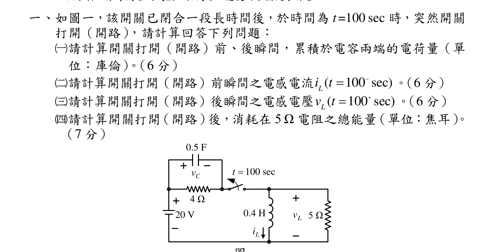
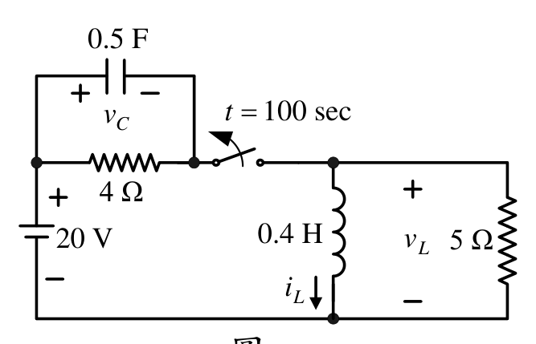
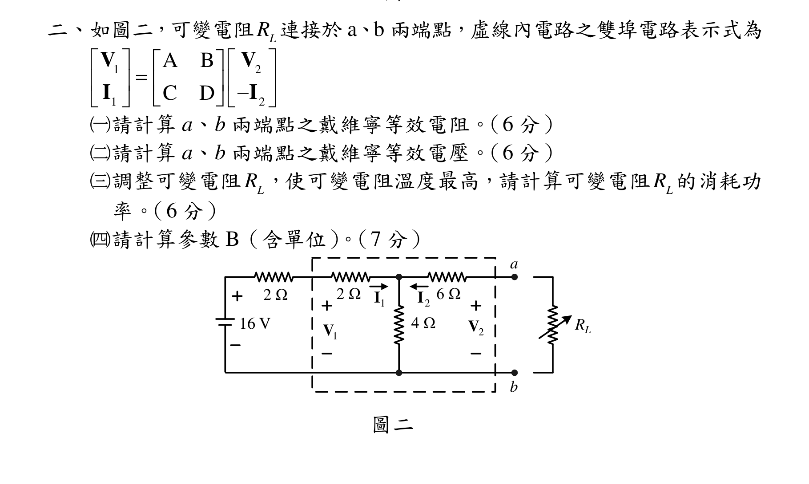
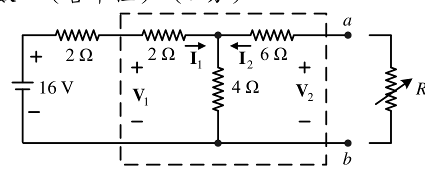
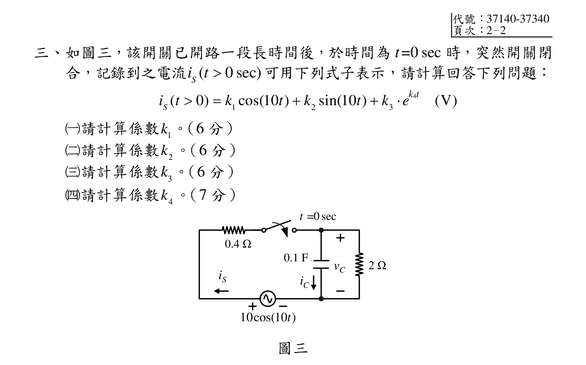
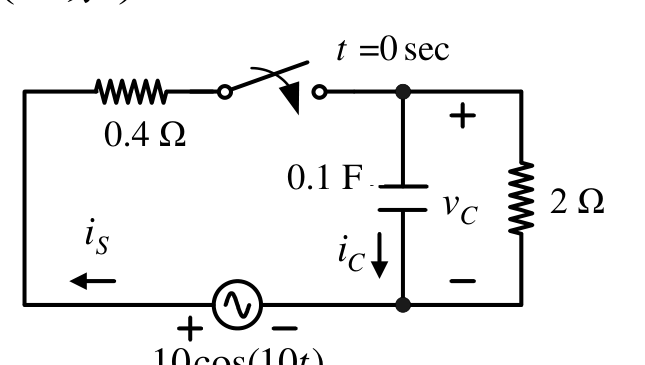
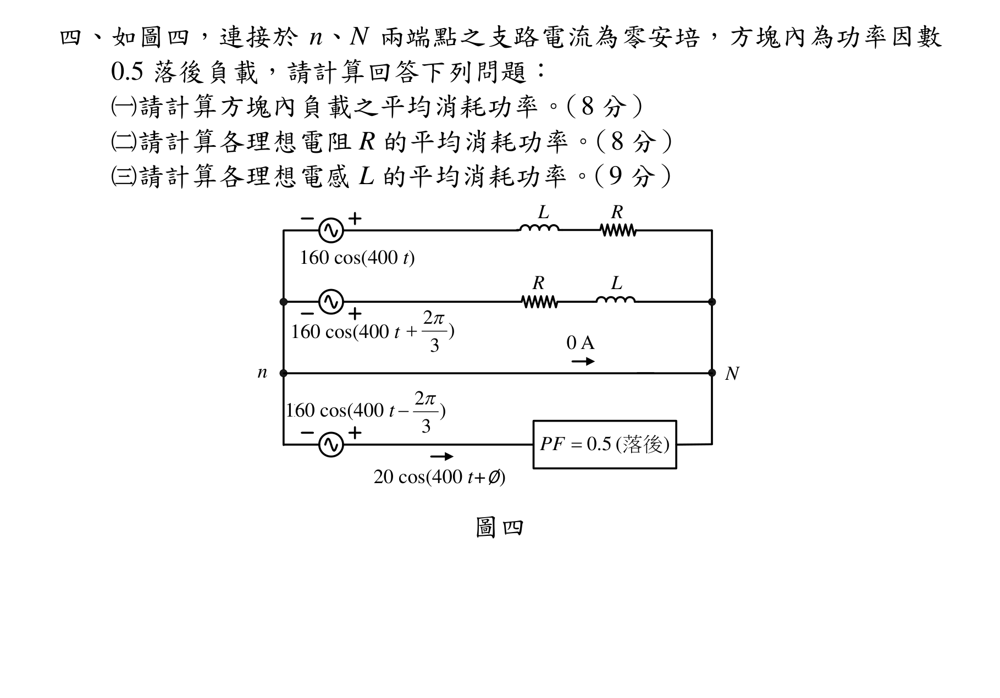
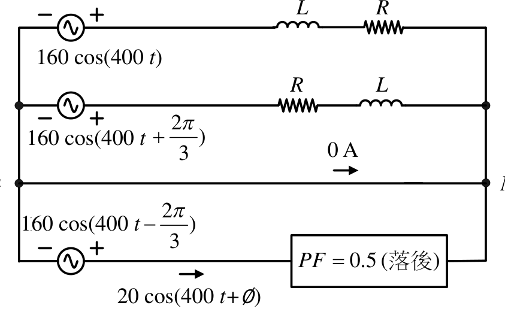

# 公務人員高等考試三級（113年）電路學 原始試題

> 本檔只保存考選部原始試題的轉錄與裁切圖，不含解答。數學符號、電路接線與圖中文字以原始題目裁切圖為準。

#### 一、（三）本科目除專門名詞或數理公式外
應使用本國文字作答
一、如圖一，該開關已閉合一段長時間後，於時間為t=100 sec 時，突然開關
打開（開路），請計算回答下列問題：
（一）請計算開關打開（開路）前、後瞬間，累積於電容兩端的電荷量（單
位：庫倫）。（6 分）
（二）請計算開關打開（開路）前瞬間之電感電流(
100 sec)
Li t


。（6 分）
（三）請計算開關打開（開路）後瞬間之電感電壓
(
100 sec)
Lv t


。（6 分）
（四）請計算開關打開（開路）後，消耗在5 Ω 電阻之總能量（單位：焦耳）。
（7 分）
圖
V
20

4
H
4.0

5
Li
L
v
sec
100

t
0.5F
C
v
0.5 F
100 sec
4 Ω
5 Ω
0.4 H
20 V

<!-- question_kind: essay; question_number: 1; app_question_number: 1 -->

### 原始題目裁切

### 原始圖形裁切

#### 二、圖
二、如圖二，可變電阻
L
R 連接於a、b 兩端點，虛線內電路之雙埠電路表示式為
1
2
1
2
A
B
C
D



















V
V
I
I
（一）請計算a、b 兩端點之戴維寧等效電阻。（6 分）
（二）請計算a、b 兩端點之戴維寧等效電壓。（6 分）
（三）調整可變電阻
L
R ，使可變電阻溫度最高，請計算可變電阻
L
R 的消耗功
率。（6 分）
（四）請計算參數B（含單位）。（7 分）
圖二
6V
1

2

2

4

6
L
R
1
V
2
V
1I
2I
a
b
2 Ω
2 Ω
6 Ω
4 Ω
16 V

<!-- question_kind: essay; question_number: 2; app_question_number: 2 -->

### 原始題目裁切

### 原始圖形裁切

#### 三、如圖三，該開關已開路一段長時間後，於時間為t=0 sec 時，突然開關閉
合，記錄到之電流(
0 sec)
Si t 
可用下列式子表示，請計算回答下列問題：
4
1
2
3
(
0)
cos(10 )
sin(10 )
(V)
k t
Si t
k
t
k
t
k
e





（一）請計算係數
1k 。（6 分）
（二）請計算係數
2k 。（6 分）
（三）請計算係數
3k 。（6 分）
（四）請計算係數
4k 。（7 分）
圖三

4.0
)
10
cos(
10
t

2
F
1.0
sec
0

t
C
v
Si
Ci
t =0 sec
2 Ω
0.4 Ω
0.1 F
k4t

<!-- question_kind: essay; question_number: 3; app_question_number: 3 -->

### 原始題目裁切

### 原始圖形裁切

#### 四、如圖四，連接於n、N 兩端點之支路電流為零安培，方塊內為功率因數
0.5 落後負載，請計算回答下列問題：
（一）請計算方塊內負載之平均消耗功率。（8 分）
（二）請計算各理想電阻R 的平均消耗功率。（8 分）
（三）請計算各理想電感L 的平均消耗功率。（9 分）
圖四
)
400
cos(
160
t
)
3
2
400
cos(
160


t
)
3
2
400
cos(
160


t
)
400
cos(
20


t
)
(
5.0
落後

PF
R
L
0A
n
N
L
R
160 cos(400 t)
160 cos(400 t
160 cos(400 t
20 cos(400 t+∅)
0 A

<!-- question_kind: essay; question_number: 4; app_question_number: 4 -->

### 原始題目裁切

### 原始圖形裁切

