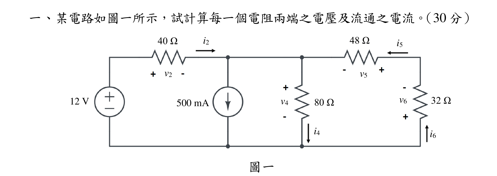
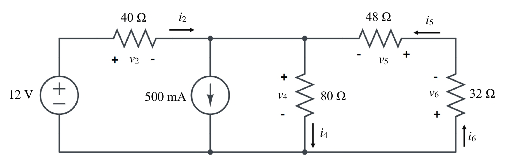
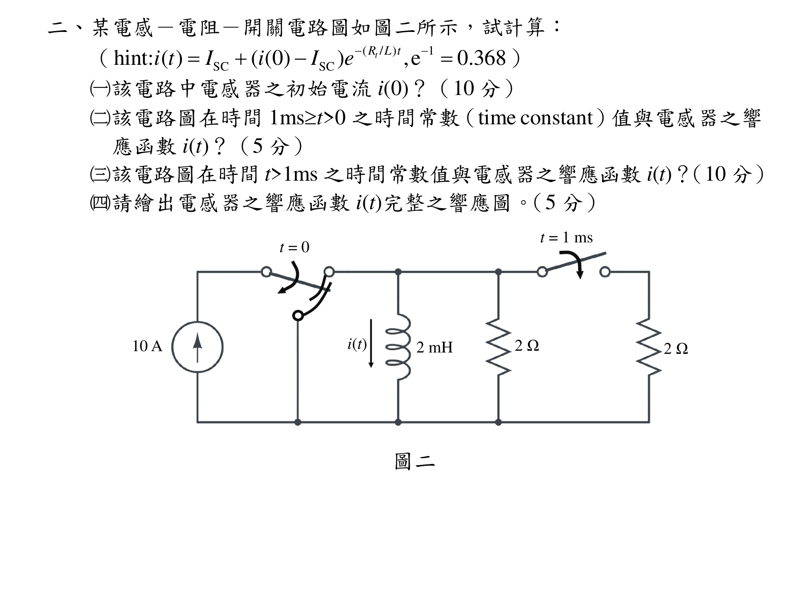
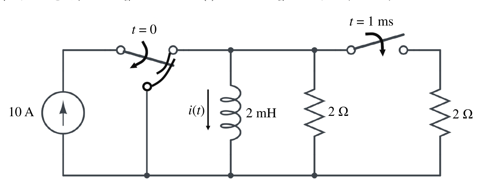
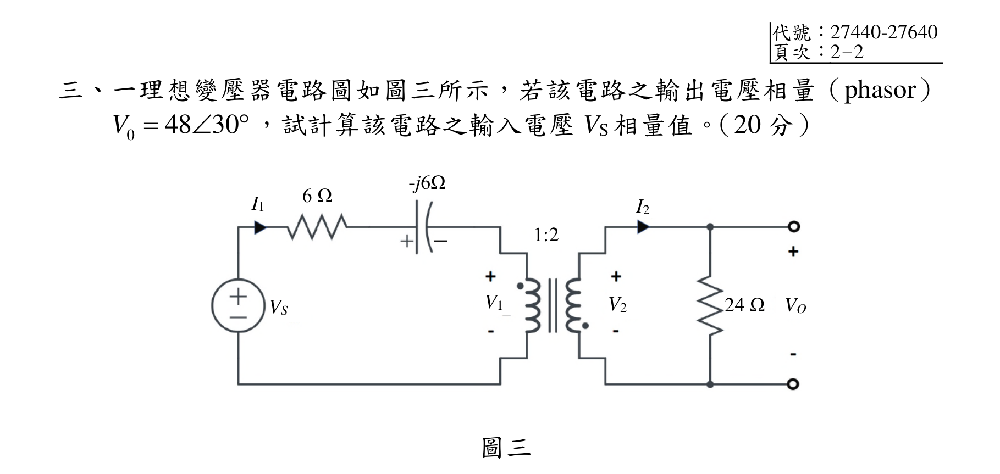
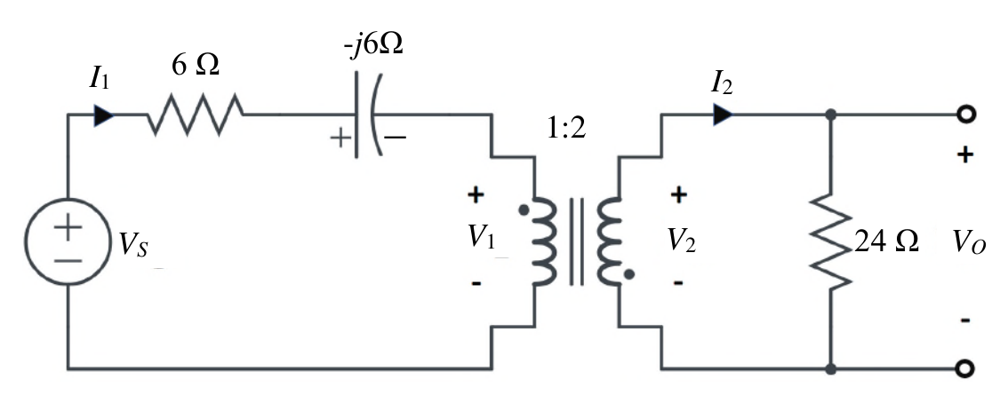
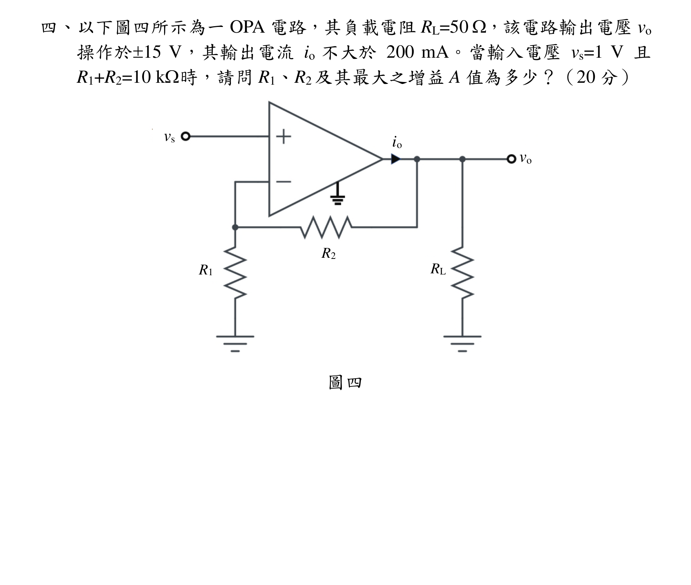
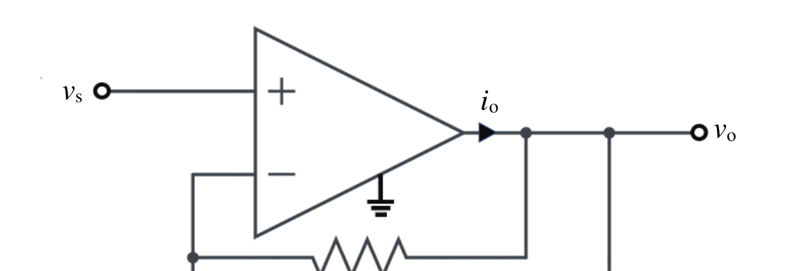
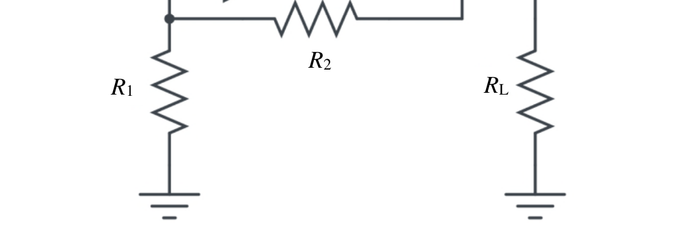

# 公務人員高等考試三級（114年）電路學 原始試題

> 本檔只保存考選部原始試題的轉錄與裁切圖，不含解答。數學符號、電路接線與圖中文字以原始題目裁切圖為準。

#### 一、某電路如圖一所示，試計算每一個電阻兩端之電壓及流通之電流。（30 分）
圖一
12 V
40 Ω
i2
v2
500 mA
v4
80 Ω
i4
i5
48 Ω
v6
32 Ω
i6
v5

<!-- question_kind: essay; question_number: 1; app_question_number: 1 -->

### 原始題目裁切

### 原始圖形裁切

#### 二、某電感－電阻－開關電路圖如圖二所示，試計算：
（
(
/ )
1
SC
SC
hint: ( )
( (0)
)
,e
0.368
tR L t
i t
I
i
I
e






）
（一）該電路中電感器之初始電流i(0)？（10 分）
（二）該電路圖在時間1mst>0 之時間常數（time constant）值與電感器之響
應函數i(t)？（5 分）
（三）該電路圖在時間t>1ms 之時間常數值與電感器之響應函數i(t)？（10 分）
（四）請繪出電感器之響應函數i(t)完整之響應圖。（5 分）
圖二
10 A
t = 0
t = 1 ms
2 Ω
2 Ω
2 mH
i(t)

<!-- question_kind: essay; question_number: 2; app_question_number: 2 -->

### 原始題目裁切

### 原始圖形裁切

#### 三、一理想變壓器電路圖如圖三所示，若該電路之輸出電壓相量（phasor）
0
48 30
V 

，試計算該電路之輸入電壓VS 相量值。（20 分）
圖三
I1
6 Ω
-j6Ω
VS
1:2
I2
24 Ω
V2
V1
VO


<!-- question_kind: essay; question_number: 3; app_question_number: 3 -->

### 原始題目裁切

### 原始圖形裁切

#### 四、以下圖四所示為一OPA 電路，其負載電阻RL=50 ，該電路輸出電壓vo
操作於15 V，其輸出電流io 不大於200 mA。當輸入電壓vs=1 V 且
R1+R2=10 k時，請問R1、R2 及其最大之增益A 值為多少？（20 分）
圖四
vs
vo
io
R1
R2
RL

<!-- question_kind: essay; question_number: 4; app_question_number: 4 -->

### 原始題目裁切

### 原始圖形裁切

