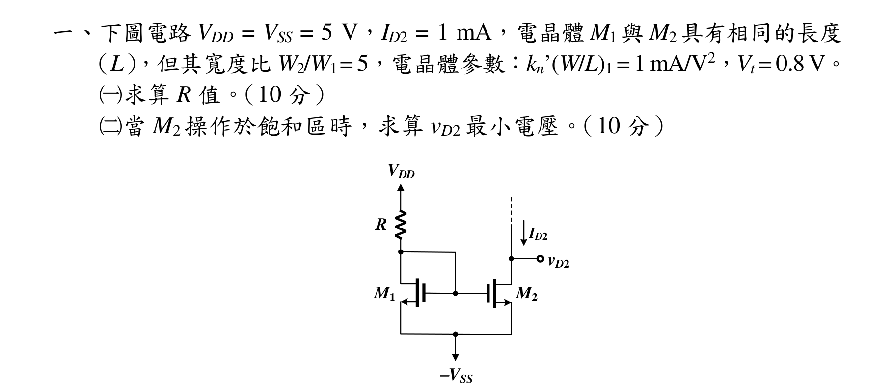
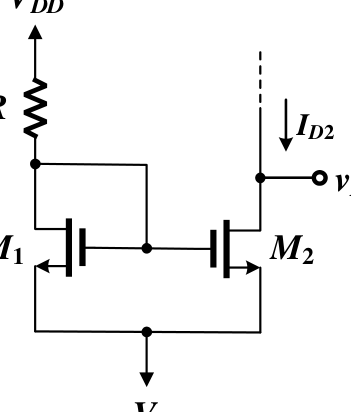
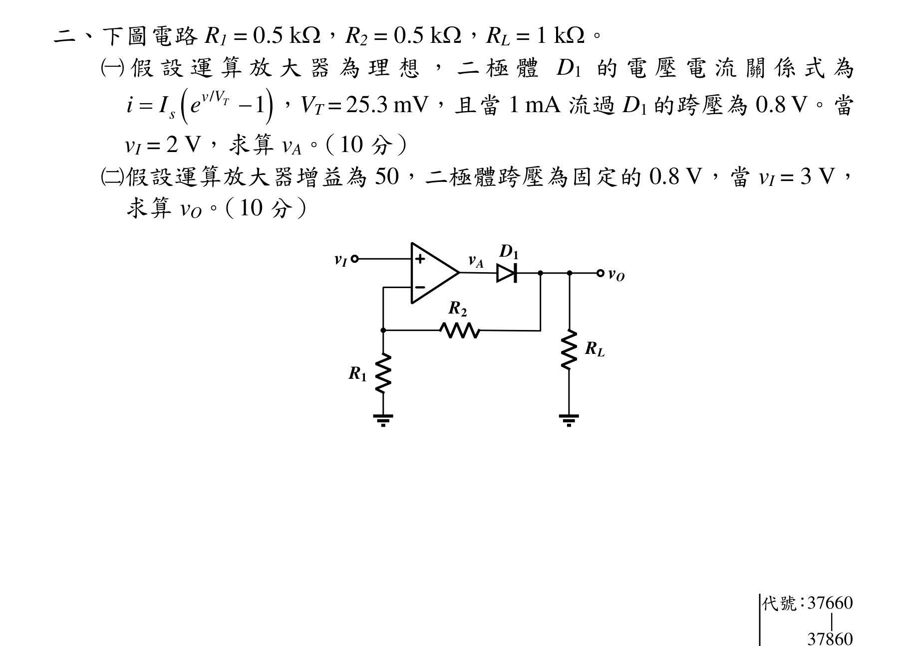
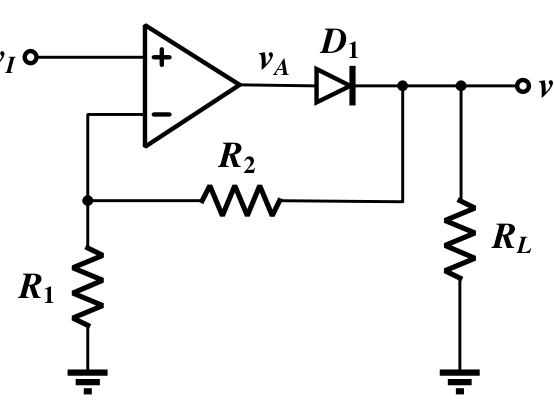
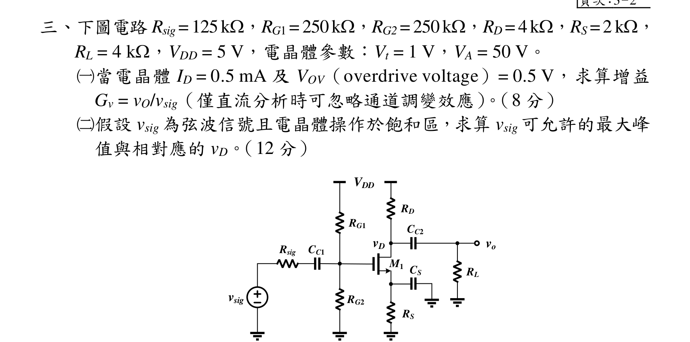
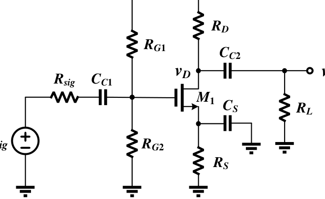
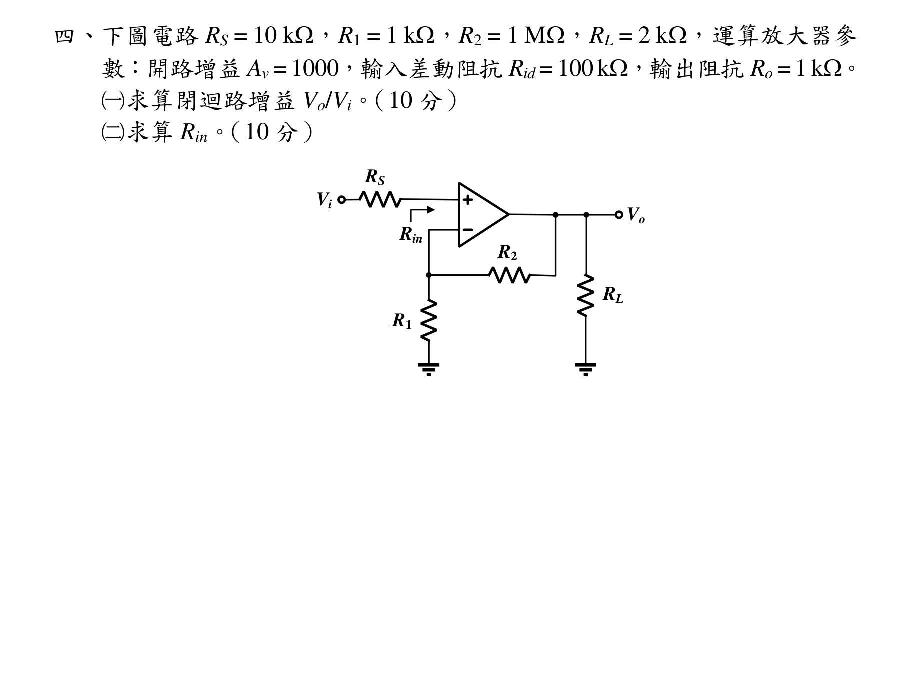
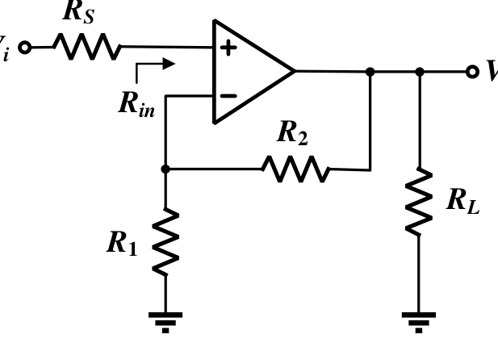
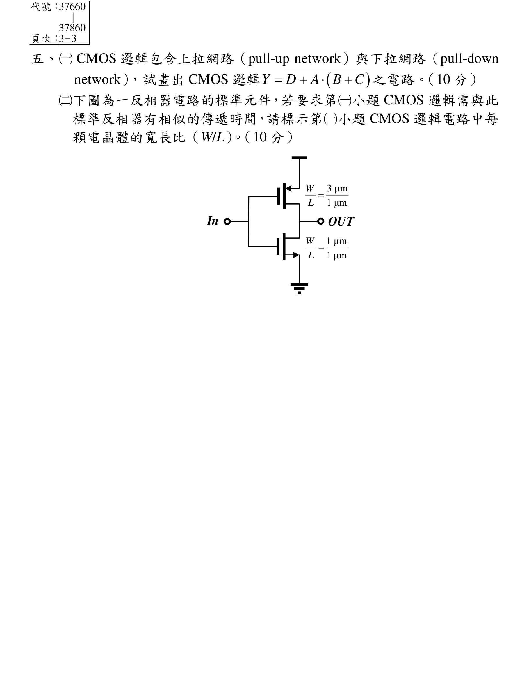
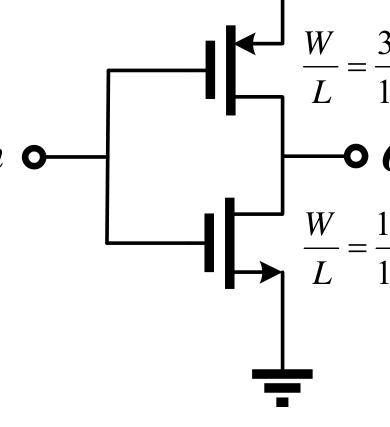

# 公務人員高等考試三級（110年）電子學 原始試題

> 本檔只保存考選部原始試題的轉錄與裁切圖，不含解答。數學符號、電路接線與圖中文字以原始題目裁切圖為準。

#### 一、下圖電路VDD = VSS = 5 V，ID2 = 1 mA，電晶體M1與M2具有相同的長度
（L），但其寬度比W2/W1= 5，電晶體參數：kn’(W/L)1 = 1 mA/V2，Vt = 0.8 V。
（一）求算R 值。（10 分）
（二）當M2 操作於飽和區時，求算vD2 最小電壓。（10 分）
M1
M2
R
VDD
-VSS
ID2
vD2

<!-- question_kind: essay; question_number: 1; app_question_number: 1 -->

### 原始題目裁切

### 原始圖形裁切

#### 二、下圖電路R1 = 0.5 k，R2 = 0.5 k，RL = 1 k。
（一）假設運算放大器為理想，二極體D1 的電壓電流關係式為


/
1
T
v V
s
i
I
e


，VT = 25.3 mV，且當1 mA 流過D1 的跨壓為0.8 V。當
vI = 2 V，求算vA。（10 分）
（二）假設運算放大器增益為50，二極體跨壓為固定的0.8 V，當vI = 3 V，
求算vO。（10 分）
vI
vA
R1
R2
RL
vO
D1
代號：37660
|
37860

<!-- question_kind: essay; question_number: 2; app_question_number: 2 -->

### 原始題目裁切

### 原始圖形裁切

#### 三、頁次：3－2
三、下圖電路Rsig=125k，RG1=250k，RG2=250k，RD=4k，RS=2k，
RL = 4 k，VDD = 5 V，電晶體參數：Vt = 1 V，VA = 50 V。
（一）當電晶體ID = 0.5 mA 及VOV（overdrive voltage）= 0.5 V，求算增益
Gv = vO/vsig（僅直流分析時可忽略通道調變效應）。（8 分）
（二）假設vsig 為弦波信號且電晶體操作於飽和區，求算vsig 可允許的最大峰
值與相對應的vD。（12 分）
vo
vsig
Rsig
CC1
RG1
RG2
RD
CC2
CS
RL
RS
VDD
M1
vD

<!-- question_kind: essay; question_number: 3; app_question_number: 3 -->

### 原始題目裁切

### 原始圖形裁切

#### 四、下圖電路RS = 10 k，R1 = 1 k，R2 = 1 M，RL = 2 k，運算放大器參
數：開路增益Av = 1000，輸入差動阻抗Rid = 100 k，輸出阻抗Ro = 1 k。
（一）求算閉迴路增益Vo/Vi。（10 分）
（二）求算Rin。（10 分）
Vi
R1
R2
RL
Vo
RS
Rin

<!-- question_kind: essay; question_number: 4; app_question_number: 4 -->

### 原始題目裁切

### 原始圖形裁切

#### 五、（一）CMOS 邏輯包含上拉網路（pull-up network）與下拉網路（pull-down
network），試畫出CMOS 邏輯


Y
D
A
B
C




之電路。（10 分）
（二）下圖為一反相器電路的標準元件，若要求第（一）小題CMOS 邏輯需與此
標準反相器有相似的傳遞時間，請標示第（一）小題CMOS 邏輯電路中每
顆電晶體的寬長比（W/L）。（10 分）
In
OUT
3 μm
1 μm
W
L 
1 μm
1 μm
W
L 

<!-- question_kind: essay; question_number: 5; app_question_number: 5 -->

### 原始題目裁切

### 原始圖形裁切

