# 公務人員高等考試三級（111年）電子學 原始試題

> 本檔只保存考選部原始試題的轉錄與裁切圖，不含解答。數學符號、電路接線與圖中文字以原始題目裁切圖為準。

#### 一、圖一(a) 電晶體Q 之參數kn’(W/L) = 1 mA/V2 ，Vt = 1 V ，VA = ，
Cgs = Cgd = 0；VDD = +5 V，C1 = C2 = 1 F，RG1 = 90 k，RG2 = 60 k，
RD = 1 k，RL = 35 k。vs(t = –) = 0；t 0，vs(t)為–5 V 步級波如圖一
(b)。t = 0–時，電容C1 與C2 均無電流通過；t = 0+時Q 截止，且t = t1 時
Q 導通進入三極區或飽和區。先分析t = 0–時之閘極、汲極電壓與vo，再
求算t1 以及0 < t t1 之vo(t)，列出必要的過程計算式。（20 分）

<!-- question_kind: essay; question_number: 1; app_question_number: 1 -->

### 原始題目裁切

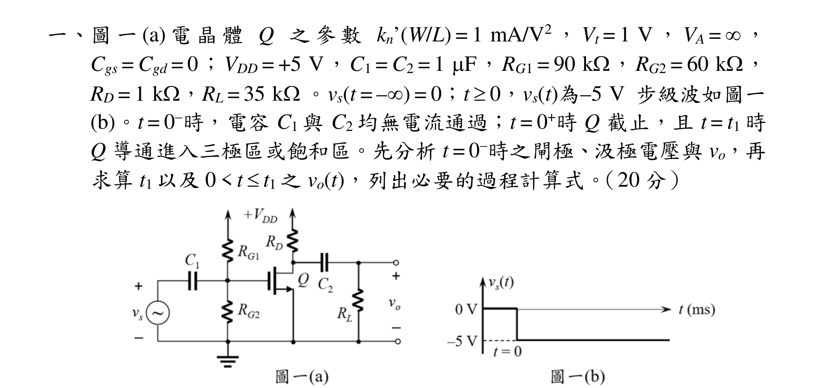

### 原始圖形裁切

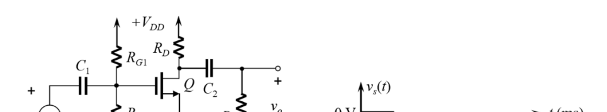
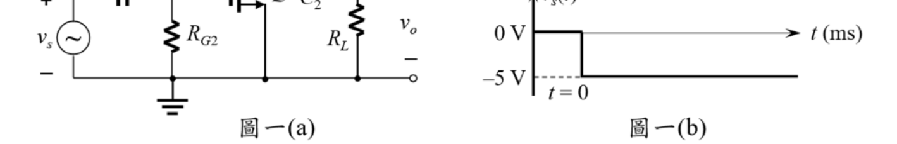

#### 二、圖二放大器中R1 + R2 = 3 k，所有晶體VA = 5 V ；Q1 與Q2 ：
nCox = 200 A/V2，W/L = 40，Vt = 0.8 V；Q3 ~ Q5：= 100 >>1，直流分
析時忽略基極電流。求算Q2 之偏壓電流以及放大器輸出電阻Ro。（20 分）

<!-- question_kind: essay; question_number: 2; app_question_number: 2 -->

### 原始題目裁切

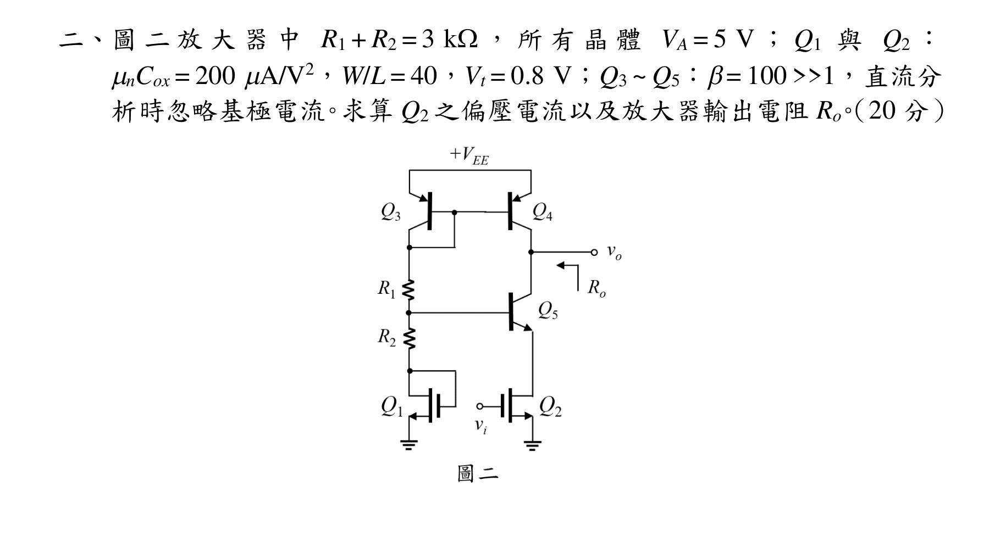

### 原始圖形裁切

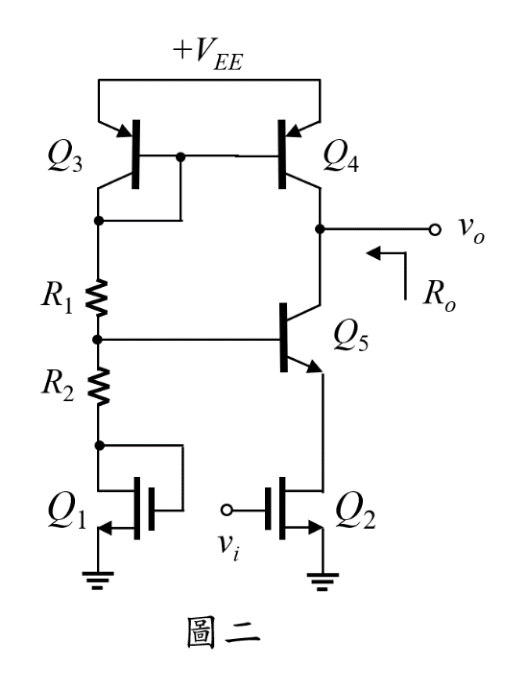

#### 三、圖三BJT 工作於主動區，= 48 >>1，r= 1.2 k，rx = 0，ro = ，
C= 1.25 pF，C= 0.3 pF；CC1 = 2.2 F，CE = 4 F，RS = 3 k，RB1 = 30 k，
RB2 = 20 k，RC = 0.8 k，IE 為理想偏壓電流。以短路常數法與開路常數
法分別估算放大器電壓增益響應之高頻3-dB 頻率H 與低頻3-dB 頻率
L，必須列出過程計算式。（20 分）

<!-- question_kind: essay; question_number: 3; app_question_number: 3 -->

### 原始題目裁切

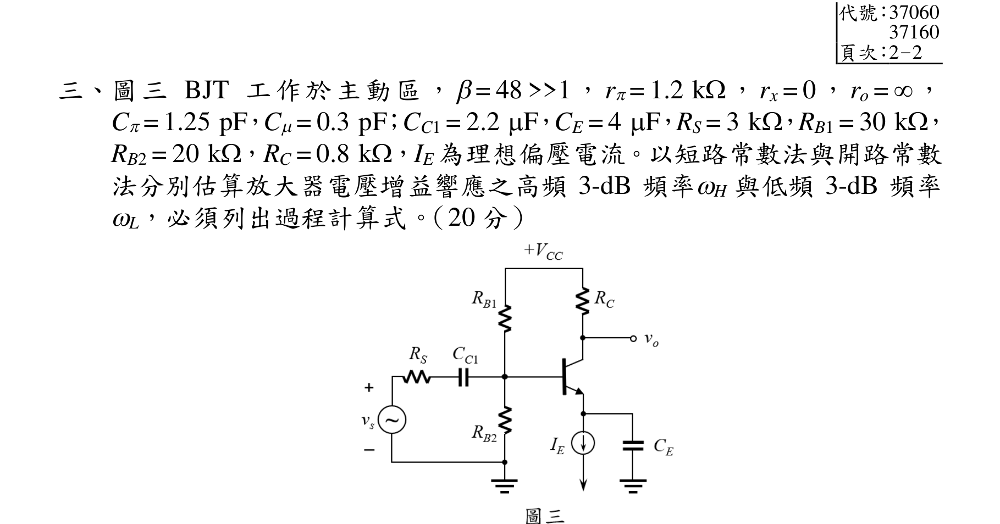

### 原始圖形裁切

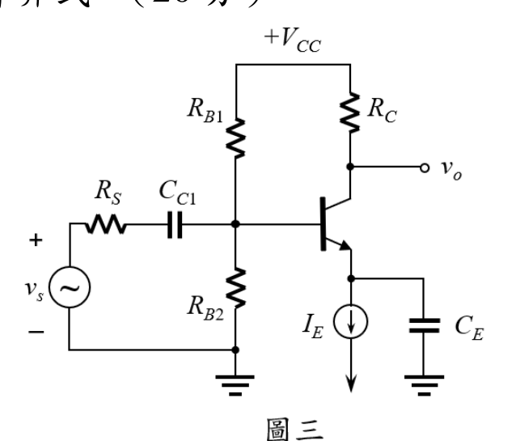

#### 四、圖四電路使用理想運算放大器，R = 1 k，C = 0.1 F，R2 = aR1 = 3 k，
其3-dB 頻寬為104 rad/sec，利用所標示之v1 與v2 推導其轉移函數
H(s) = vo(s) /vi(s)，s = j，並求算|H( j)|之極大值與a 之值。（20 分）

<!-- question_kind: essay; question_number: 4; app_question_number: 4 -->

### 原始題目裁切

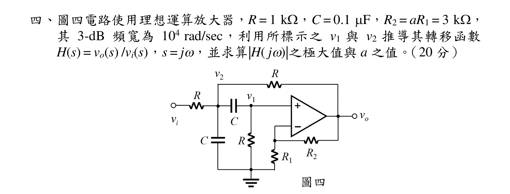

### 原始圖形裁切

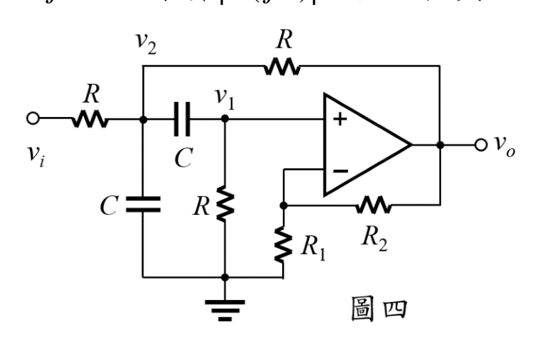

#### 五、圖五為一數位電路的狀態圖（state diagram），圖中箭頭表示狀態改變的
方向，並以①②③④編號。先依編號順序畫出此電路的輸入A、B 與輸
出Q 對應的狀態改變時序圖（timing diagram），再以NAND 邏輯閘設計
此電路，以真值表說明工作原理。（20 分）

<!-- question_kind: essay; question_number: 5; app_question_number: 5 -->

### 原始題目裁切

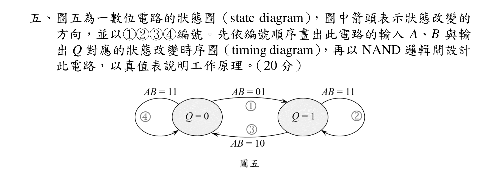

### 原始圖形裁切

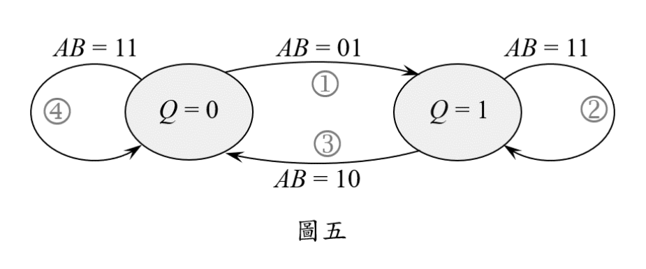
