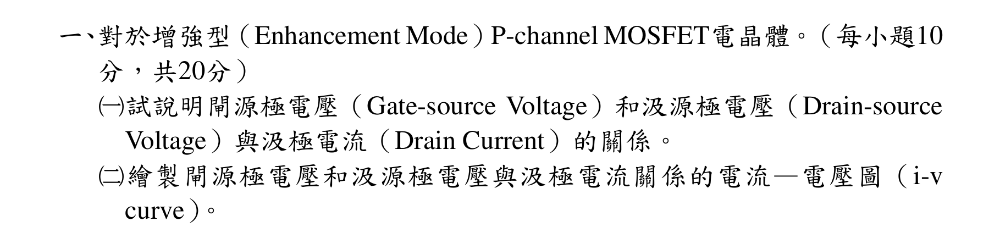
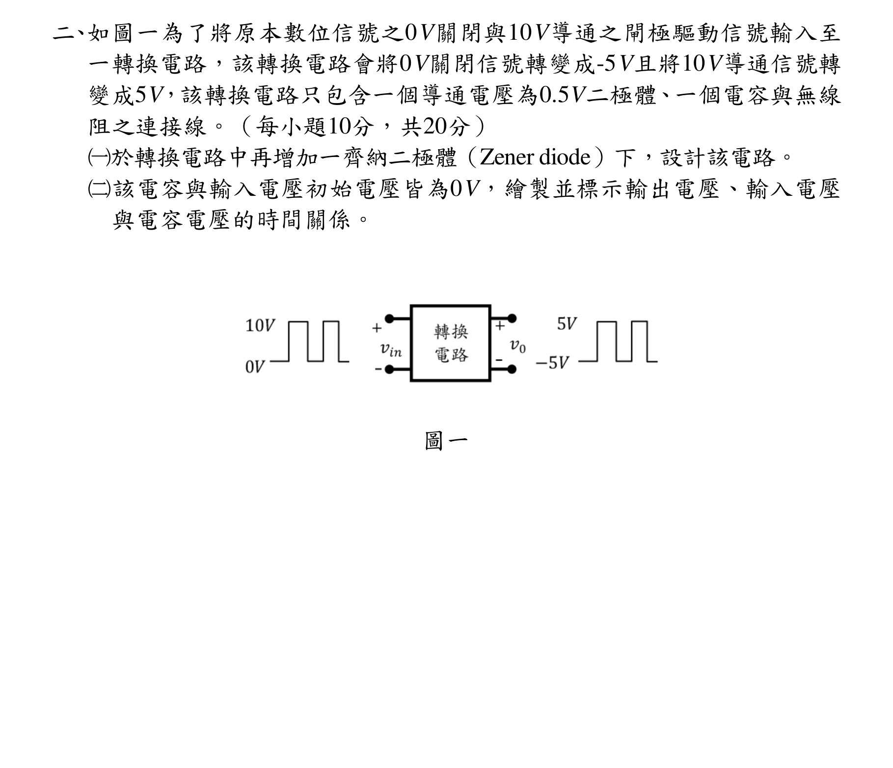
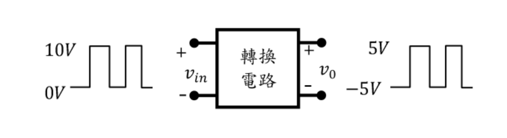
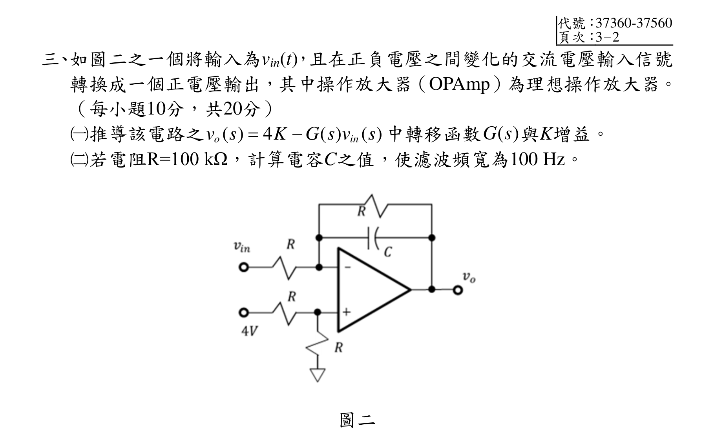
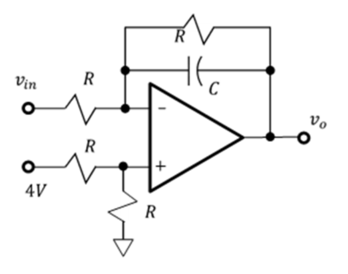
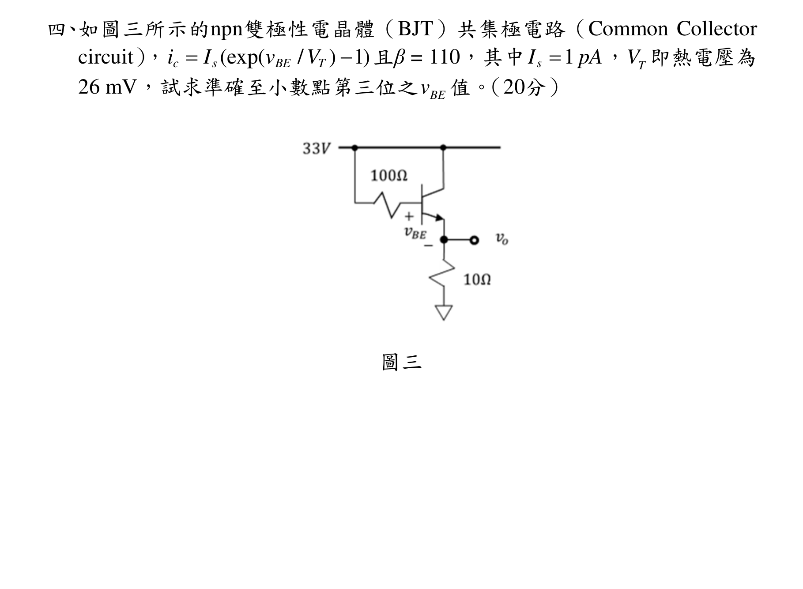
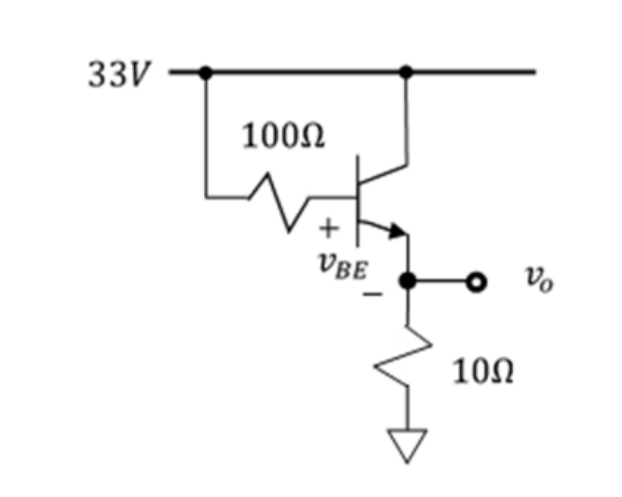
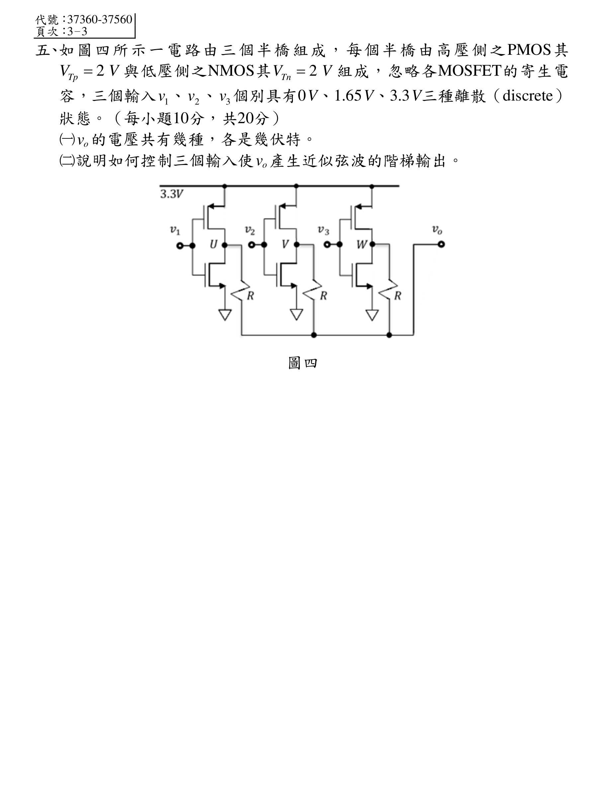
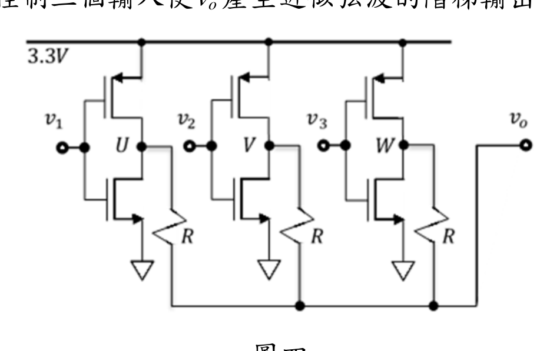

# 公務人員高等考試三級（112年）電子學 原始試題

> 本檔只保存考選部原始試題的轉錄與裁切圖，不含解答。數學符號、電路接線與圖中文字以原始題目裁切圖為準。

#### 一、對於增強型（Enhancement Mode）P-channel MOSFET電晶體。（每小題10
分，共20分）
（一）試說明閘源極電壓（Gate-source Voltage）和汲源極電壓（Drain-source
Voltage）與汲極電流（Drain Current）的關係。
（二）繪製閘源極電壓和汲源極電壓與汲極電流關係的電流—電壓圖（i-v
curve）。

<!-- question_kind: essay; question_number: 1; app_question_number: 1 -->

### 原始題目裁切

### 原始圖形裁切

本題原始 PDF 未含獨立嵌入圖形。

#### 二、如圖一為了將原本數位信號之0V關閉與10V導通之閘極驅動信號輸入至
一轉換電路，該轉換電路會將0V關閉信號轉變成-5V且將10V導通信號轉
變成5V，該轉換電路只包含一個導通電壓為0.5V二極體、一個電容與無線
阻之連接線。（每小題10分，共20分）
（一）於轉換電路中再增加一齊納二極體（Zener diode）下，設計該電路。
（二）該電容與輸入電壓初始電壓皆為0V，繪製並標示輸出電壓、輸入電壓
與電容電壓的時間關係。
圖一

<!-- question_kind: essay; question_number: 2; app_question_number: 2 -->

### 原始題目裁切

### 原始圖形裁切

#### 三、如圖二之一個將輸入為vin(t)，且在正負電壓之間變化的交流電壓輸入信號
轉換成一個正電壓輸出，其中操作放大器（OPAmp）為理想操作放大器。
（每小題10分，共20分）
（一）推導該電路之
( )
4
( )
( )
o
in
v s
K
G s v
s


中轉移函數
( )
G s 與K增益。
（二）若電阻R=100 kΩ，計算電容C之值，使濾波頻寬為100 Hz。
圖二

<!-- question_kind: essay; question_number: 3; app_question_number: 3 -->

### 原始題目裁切

### 原始圖形裁切

#### 四、如圖三所示的npn雙極性電晶體（BJT）共集極電路（Common Collector
circuit），
(exp(
/
) 1)
c
s
BE
T
i
I
v
V


且β = 110，其中
1
sI
pA

，
T
V 即熱電壓為
26 mV，試求準確至小數點第三位之
BE
v
值。（20分）
圖三

<!-- question_kind: essay; question_number: 4; app_question_number: 4 -->

### 原始題目裁切

### 原始圖形裁切

#### 五、如圖四所示一電路由三個半橋組成，每個半橋由高壓側之PMOS其
2
Tp
V
V

與低壓側之NMOS其
2
Tn
V
V

組成，忽略各MOSFET的寄生電
容，三個輸入
1v 、
2v 、
3v 個別具有0V、1.65V、3.3V三種離散（discrete）
狀態。（每小題10分，共20分）
（一）
ov 的電壓共有幾種，各是幾伏特。
（二）說明如何控制三個輸入使
ov 產生近似弦波的階梯輸出。
圖四

<!-- question_kind: essay; question_number: 5; app_question_number: 5 -->

### 原始題目裁切

### 原始圖形裁切

