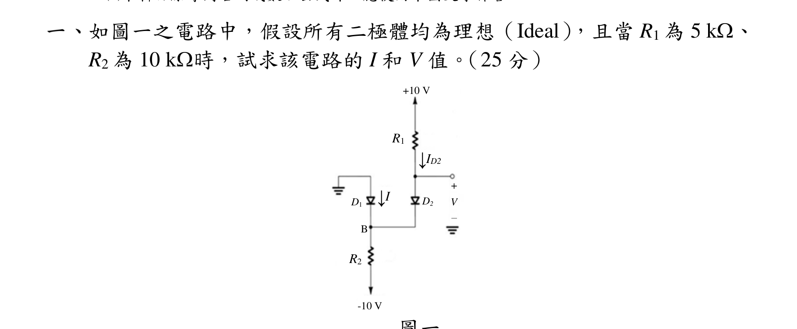
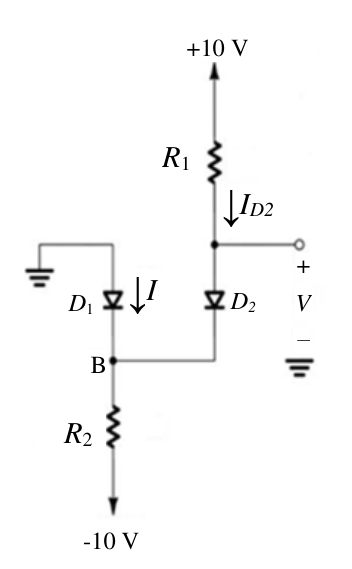
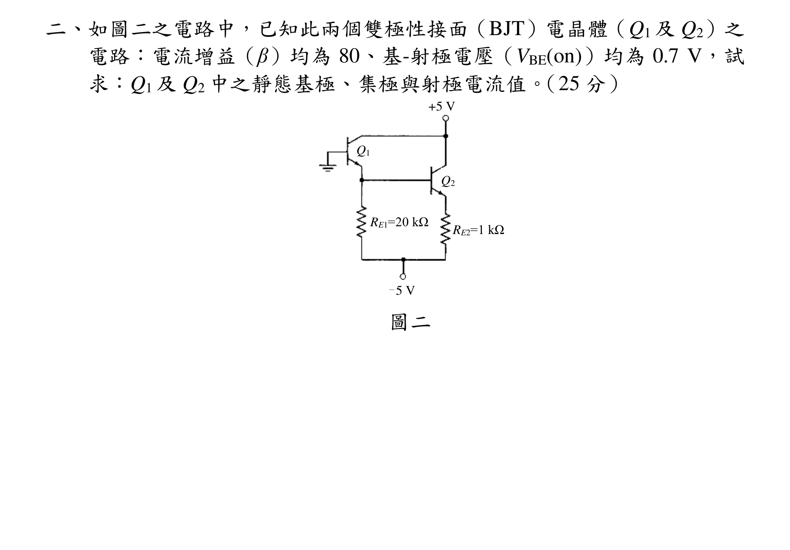
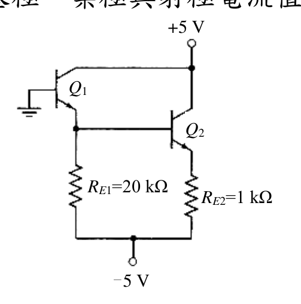
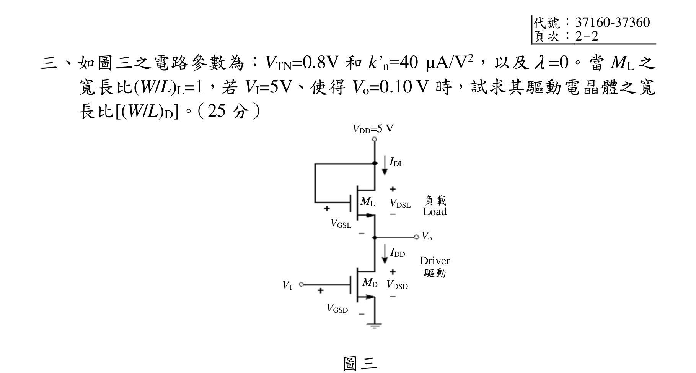
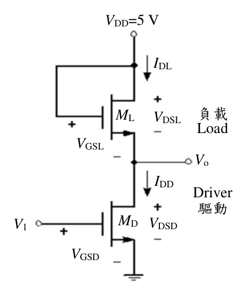
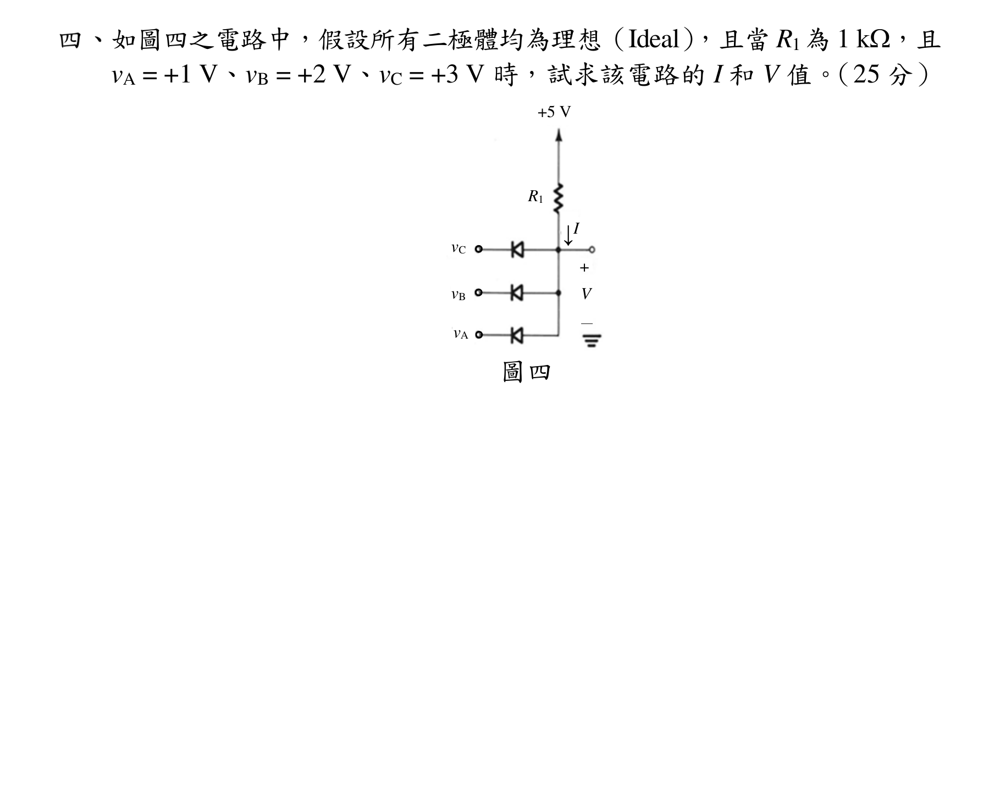
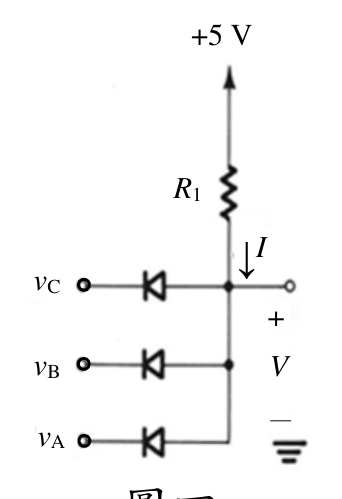

# 公務人員高等考試三級（113年）電子學 原始試題

> 本檔只保存考選部原始試題的轉錄與裁切圖，不含解答。數學符號、電路接線與圖中文字以原始題目裁切圖為準。

#### 一、（三）本科目除專門名詞或數理公式外
應使用本國文字作答
如圖一之電路中，假設所有二極體均為理想（Ideal），且當R1 為5 k、
R2 為10 k時，試求該電路的I 和V 值。（25 分）
圖一
↓ID2
↓I
D2
V
+
－
D1
R2
+10 V
-10 V
R1
R2
B

<!-- question_kind: essay; question_number: 1; app_question_number: 1 -->

### 原始題目裁切

### 原始圖形裁切

#### 二、如圖二之電路中，已知此兩個雙極性接面（BJT）電晶體（Q1 及Q2）之
電路：電流增益（β）均為80、基-射極電壓（VBE(on)）均為0.7 V，試
求：Q1 及Q2 中之靜態基極、集極與射極電流值。（25 分）
圖二
+5 V
Q2
Q1
－5 V
RE2=1 kΩ
RE1=20 kΩ

<!-- question_kind: essay; question_number: 2; app_question_number: 2 -->

### 原始題目裁切

### 原始圖形裁切

#### 三、代號：37160-37360
頁次：2－2
如圖三之電路參數為：VTN=0.8V 和k’n=40 μA/V2，以及λ=0。當ML 之
寬長比(W/L)L=1，若VI=5V、使得Vo=0.10 V 時，試求其驅動電晶體之寬
長比[(W/L)D]。（25 分）
圖三
負載
Load
Driver
驅動
VDD=5 V
IDL
VDSL
ML
IDD
VDSD
MD
VGSL
VGSD
V1
Vo

<!-- question_kind: essay; question_number: 3; app_question_number: 3 -->

### 原始題目裁切

### 原始圖形裁切

#### 四、如圖四之電路中，假設所有二極體均為理想（Ideal），且當R1為1 k，且
vA = +1 V、vB = +2 V、vC = +3 V 時，試求該電路的I 和V 值。（25 分）
圖四
V
+
－
↓I
+5 V
R1
vC
vB
vA

<!-- question_kind: essay; question_number: 4; app_question_number: 4 -->

### 原始題目裁切

### 原始圖形裁切

