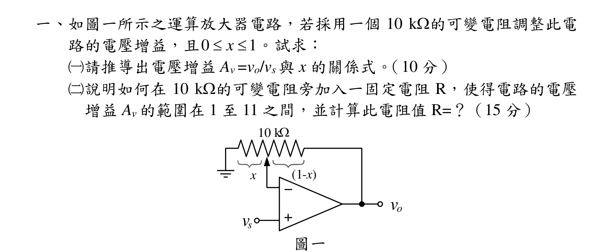
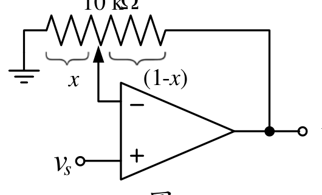
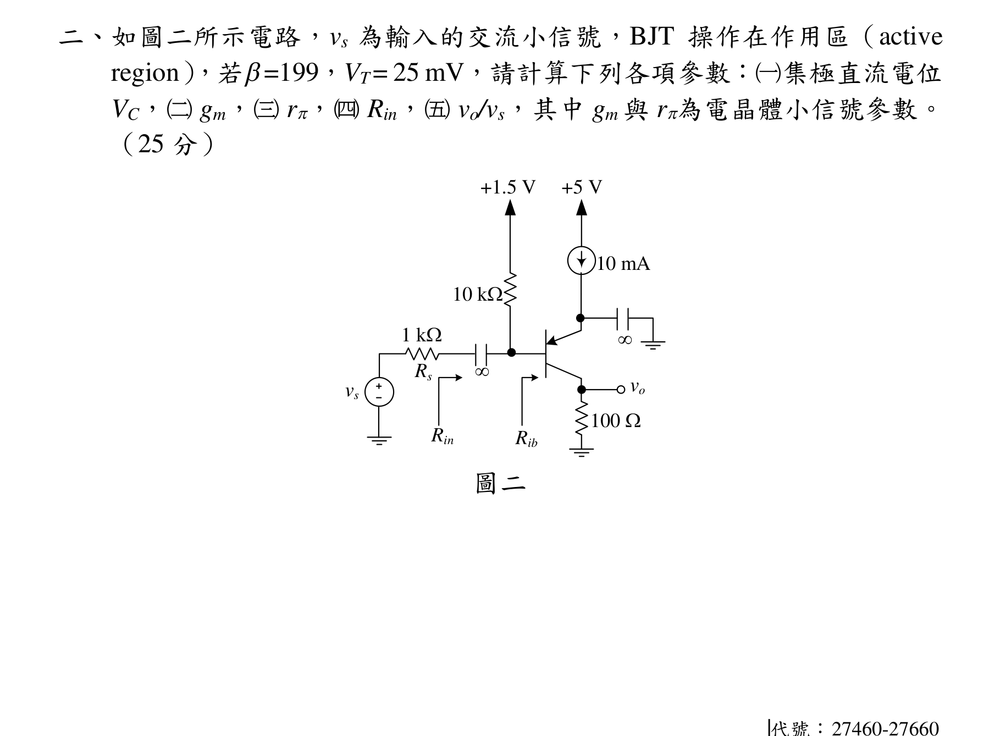
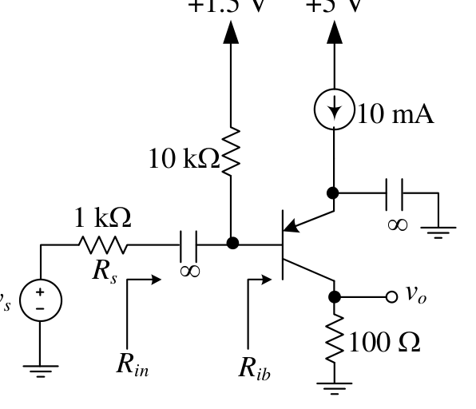
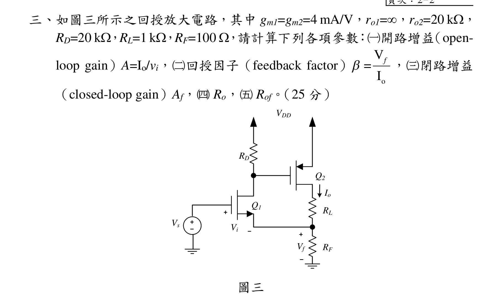
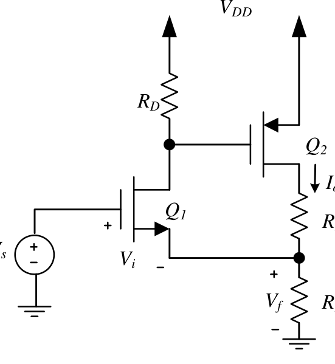
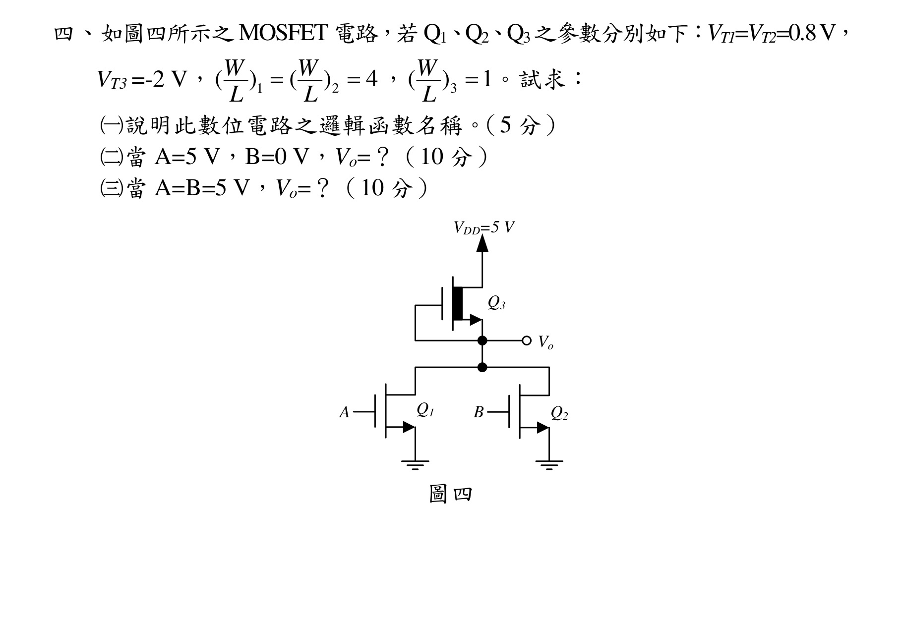
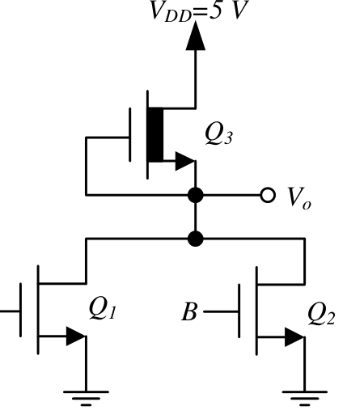

# 公務人員高等考試三級（114年）電子學 原始試題

> 本檔只保存考選部原始試題的轉錄與裁切圖，不含解答。數學符號、電路接線與圖中文字以原始題目裁切圖為準。

#### 一、如圖一所示之運算放大器電路，若採用一個10 k的可變電阻調整此電
路的電壓增益，且0
1
x

。試求：
（一）請推導出電壓增益Av =vo/vs 與x 的關係式。（10 分）
（二）說明如何在10 k的可變電阻旁加入一固定電阻R，使得電路的電壓
增益Av 的範圍在1 至11 之間，並計算此電阻值R=？（15 分）
vs
vo
10 kW
x
(1-x)
圖一

<!-- question_kind: essay; question_number: 1; app_question_number: 1 -->

### 原始題目裁切

### 原始圖形裁切

#### 二、如圖二所示電路，vs 為輸入的交流小信號，BJT 操作在作用區（active
region），若=199，VT= 25 mV，請計算下列各項參數：（一）集極直流電位
VC，（二）gm，（三）r，（四）Rin，vo/vs，其中gm 與r為電晶體小信號參數。
（25 分）
+5 V
+1.5 V
vs
vo
10 mA
10 kW
Rs
1 kW
100 W
Rin
Rib


圖二
代號：27460-27660

<!-- question_kind: essay; question_number: 2; app_question_number: 2 -->

### 原始題目裁切

### 原始圖形裁切

#### 三、頁次：2－2
三、如圖三所示之回授放大電路，其中gm1=gm2=4 mA/V，ro1=，ro2=20 k，
RD=20 k，RL=1 k，RF=100 ，請計算下列各項參數：（一）開路增益（open-
loop gain）A=Io/vi，（二）回授因子（feedback factor）=
o
V
I
f ，（三）閉路增益
（closed-loop gain）Af，（四）Ro，Rof。（25 分）
VDD
Vs
Io
RD
Vi
RF
RL
Vf
Q1
Q2
圖三

<!-- question_kind: essay; question_number: 3; app_question_number: 3 -->

### 原始題目裁切

### 原始圖形裁切

#### 四、如圖四所示之MOSFET 電路，若Q1、Q2、Q3之參數分別如下：VT1=VT2=0.8V，
VT3 =-2 V，
1
2
(
)
(
)
4
W
W
L
L


，
3
(
)
1
W
L
。試求：
（一）說明此數位電路之邏輯函數名稱。（5 分）
（二）當A=5 V，B=0 V，Vo=？（10 分）
（三）當A=B=5 V，Vo=？（10 分）
VDD=5 V
Q3
Vo
Q1
Q2
A
B
圖四

<!-- question_kind: essay; question_number: 4; app_question_number: 4 -->

### 原始題目裁切

### 原始圖形裁切

