# 公務人員高等考試三級（110年）工程數學 原始試題

> 本檔只保存考選部原始試題的轉錄與裁切圖，不含解答。數學符號、電路接線與圖中文字以原始題目裁切圖為準。

#### 一、求
4
8
16
1
x
y
xy +
y
+e




的通解（general solution）。（15 分）

<!-- question_kind: essay; question_number: 1; app_question_number: 1 -->

### 原始題目裁切

### 原始圖形裁切

本題原始 PDF 未含獨立嵌入圖形。

#### 二、求
2z dz

，其中
2
t
i t

，0t 1。（10 分）

<!-- question_kind: essay; question_number: 2; app_question_number: 2 -->

### 原始題目裁切

### 原始圖形裁切

本題原始 PDF 未含獨立嵌入圖形。

#### 三、一副標準52 張的撲克牌，隨意抽出3 張。求其為同花（3 張為同一花色）的機率。
（5 分）

<!-- question_kind: essay; question_number: 3; app_question_number: 3 -->

### 原始題目裁切

### 原始圖形裁切

本題原始 PDF 未含獨立嵌入圖形。

#### 四、5
4
4
12
11 12
4
4
5
A












，
（一）求其行列式值（determinant）。（5 分）
（二）求特徵值（eigenvalues）與其對應的特徵向量（eigenvectors）。（10 分）
（三）求P，使
1
P AP

為A 之對角化（diagonalized）矩陣。（5 分）
乙、測驗題部分：（50 分）
代號：2376
（一）本測驗試題為單一選擇題，請選出一個正確或最適當的答案，複選作答者，該題不予計分。
每

<!-- question_kind: essay; question_number: 4; app_question_number: 4 -->

### 原始題目裁切

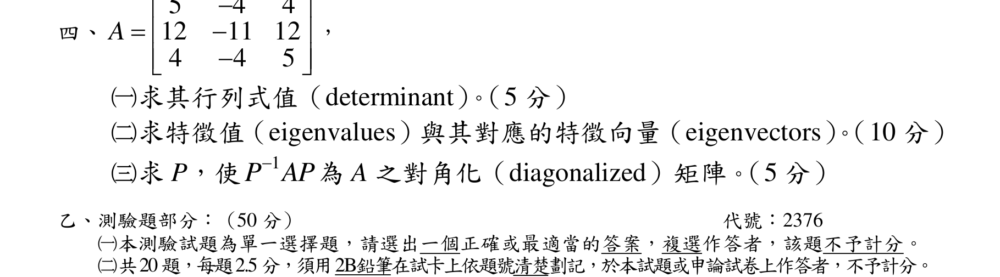

### 原始圖形裁切

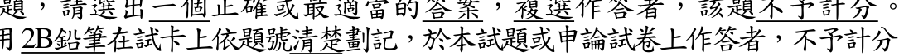

#### 測驗題 1、（二）共20題每題2.5分須用2B鉛筆在試卡上依題號清楚劃記於本試題或申論試卷上作答者不予計分
1
2 2
實數矩陣Q 的特徵值為2
、3
。若定義矩陣跡（trace）為對角線元素相加，則Q 的跡（trace）
為何值？
5
3

<!-- question_kind: multiple_choice; question_number: 1; app_question_number: 101 -->

### 原始題目裁切

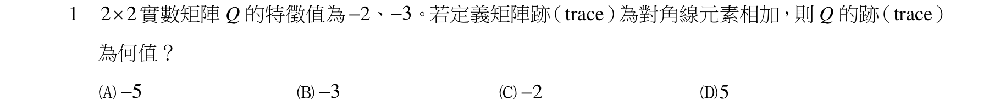

### 原始圖形裁切

本題原始 PDF 未含獨立嵌入圖形。

#### 測驗題 2、5
3
2
5
2
令T 和S 為
3
R 映射至
2
R 的線性轉換（linear transformation），其中
( , , )
(
,
)
T x y z
x
y z
y



，
( , , )
(
,
)
S x y z
x
z x
y



。下列向量何者屬於T
S

的零空間（nullspace）？
(6,2, 10)

(3,2, 5)

(3, 2,5)

( 6, 2, 10)




<!-- question_kind: multiple_choice; question_number: 2; app_question_number: 102 -->

### 原始題目裁切

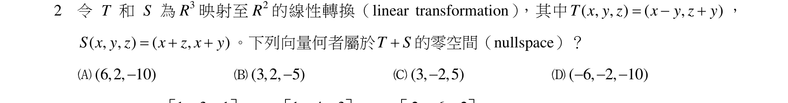

### 原始圖形裁切

本題原始 PDF 未含獨立嵌入圖形。

#### 測驗題 3、給定矩陣
1
3
1
5
0
2
4
4
1
A








，
1
4
3
5
7
9
4
2
6
B








，
2
6
2
10
0
4
8
8
2
C








。則矩陣
1
ABC的行列式值為何？
6

0.75

0.25
0.75
代號：37620
|
37820

<!-- question_kind: multiple_choice; question_number: 3; app_question_number: 103 -->

### 原始題目裁切

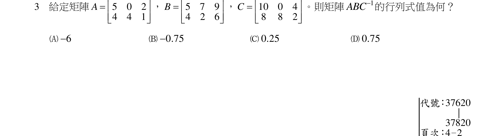

### 原始圖形裁切

本題原始 PDF 未含獨立嵌入圖形。

#### 測驗題 4、頁次：4 2
4
考慮如下所示之過度限制（over-determined）線性聯立方程式：
x+y
3
x+2y
1
x+3y
2
x+4y
7









如果這個聯立方程式的最小平方誤差解（least-squared-error solution）為x=α, y=β，那麼在下列敘
述之中，何者為正確？

β
2
β
+β
β
3 +2β
0

<!-- question_kind: multiple_choice; question_number: 4; app_question_number: 104 -->

### 原始題目裁切

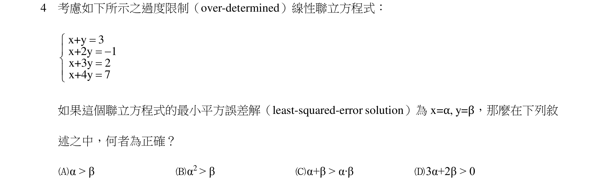

### 原始圖形裁切

本題原始 PDF 未含獨立嵌入圖形。

#### 測驗題 5、β
β
β
β
β
5
考慮一個作用在




2
,
,
x y x y



的線性轉換（linear transformation）T。已知T(1, 1)
(3,2)


、
T(1,1)
(1, 5)


。若是S 表示T 的反轉換（inverse transformation），而且S(2, 7)
(p,q)


，那麼p+q
與下列那一個數值最接近（也就是說差值的絕對值最小）？
3
4
5
6

<!-- question_kind: multiple_choice; question_number: 5; app_question_number: 105 -->

### 原始題目裁切

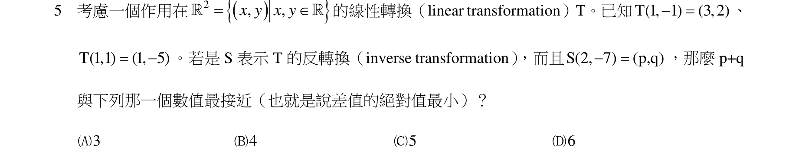

### 原始圖形裁切

本題原始 PDF 未含獨立嵌入圖形。

#### 測驗題 6、考慮如下所示之線性聯立方程式：
1
2
3
4
1
2
3
4
1
2
3
4
1
2
3
4
2x +0x +0x
3x =1
0x +5x +αx +0x =
7
1x +6x +2x +0x =13
0x +1x
2x +3x =
2









若是已知此聯立方程式無解，那麼在下列有關於α 之敘述，何者正確？
∞ < α ≤ 5
5 < α ≤ 0
0 < α ≤ 5
5 < α < ∞

<!-- question_kind: multiple_choice; question_number: 6; app_question_number: 106 -->

### 原始題目裁切

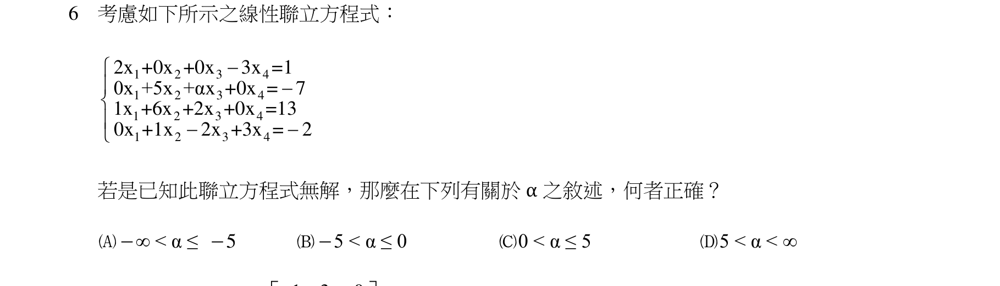

### 原始圖形裁切

本題原始 PDF 未含獨立嵌入圖形。

#### 測驗題 7、我們考慮一個矩陣：
1
3
0
2
x
1
0
2
1











，若已知此矩陣為不可逆（notinvertible），那麼請問x 的數值為何？
3
12
2 3
4

<!-- question_kind: multiple_choice; question_number: 7; app_question_number: 107 -->

### 原始題目裁切

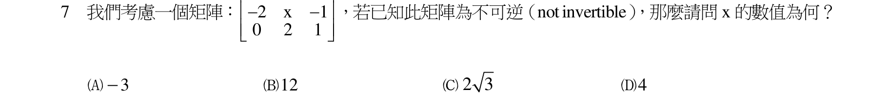

### 原始圖形裁切

本題原始 PDF 未含獨立嵌入圖形。

#### 測驗題 8、有一條三維空間中的曲線，曲線上的點的坐標(x,y,z)以參數式來表示為：x(t)=2sin(t)、y(t)=2cos(t)、
z(t)=5t 。請問此曲線在(0,2,0)到
π
3,1,5 3







這個區間內的長度與下列那一個數值最接近（也就是
說差值的絕對值最小）？
2
4
6
8
代號：37620
|
37820

<!-- question_kind: multiple_choice; question_number: 8; app_question_number: 108 -->

### 原始題目裁切

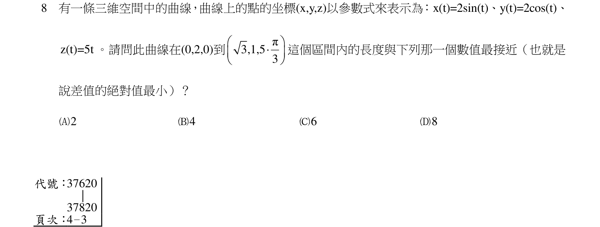

### 原始圖形裁切

本題原始 PDF 未含獨立嵌入圖形。

#### 測驗題 9、頁次：4－3
9
如果


iπ/3
-iπ/4
iπ
3e
+5e
+2e =x+iy
i=
1

，那麼下列有關於x、y 之敘述，何者正確？
x∙y < 0
x+y < 0
x < y （x
y 分別代表x 與y 之絕對值）xy < x+y

<!-- question_kind: multiple_choice; question_number: 9; app_question_number: 109 -->

### 原始題目裁切

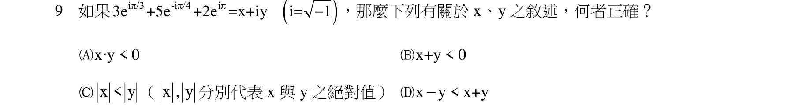

### 原始圖形裁切

本題原始 PDF 未含獨立嵌入圖形。

#### 測驗題 10、令i 為單位虛數，則sin(
)i

的實部（real part）為何？

1
1
0

<!-- question_kind: multiple_choice; question_number: 10; app_question_number: 110 -->

### 原始題目裁切

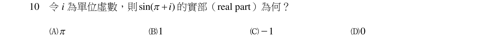

### 原始圖形裁切

本題原始 PDF 未含獨立嵌入圖形。

#### 測驗題 11、若積分路徑C 為逆時鐘方向且滿足
1
z ，則複變函數積分
2
2
4
2
3
(4
17
4)
C
z
z
dz
z
z
z





之值為何？
i


i

2 i

13 i


<!-- question_kind: multiple_choice; question_number: 11; app_question_number: 111 -->

### 原始題目裁切

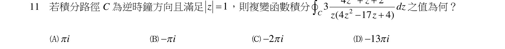

### 原始圖形裁切

本題原始 PDF 未含獨立嵌入圖形。

#### 測驗題 12、我們考慮複變函數
2
f(z)=z +1
(z=x+iy) 沿著曲線Γ 作線積分（line integral），其中Γ 代表在複數平
面上由
2
y=x 來描述的曲線；我們的積分範圍是從0+i0 到1+i1。我們用α+iβ 來代表這一個線積分
的結果，此結果可以看成複數平面上的一個點。若是採用這個觀點，那麼α+iβ 與下列複數平面上
的四個點之中的那一個最接近（也就是距離最小）？
0+i0
1+i1
1+i0
0+i1

<!-- question_kind: multiple_choice; question_number: 12; app_question_number: 112 -->

### 原始題目裁切

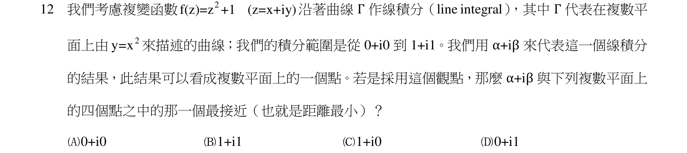

### 原始圖形裁切

本題原始 PDF 未含獨立嵌入圖形。

#### 測驗題 13、考慮如下所示之初始值問題（initial-value problem）：
2
y
x y
3xy
0 ; (0)
1, y (0)
2
y








如果我們將解（solution）寫成冪級數（power series）型式：
n
n
n=0
y(x)=
a x


那麼，下列選項何者正確？（可以試著套用函數的泰勒級數展開表示法（Taylor-series expansion）。）

0
a =2

1
1
a = 3

2
3
a = 2

3
1
a = 2

<!-- question_kind: multiple_choice; question_number: 13; app_question_number: 113 -->

### 原始題目裁切

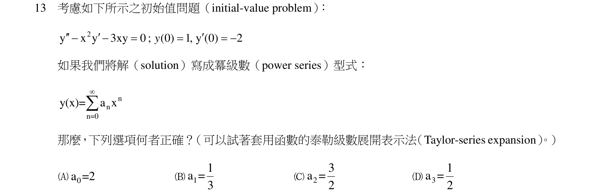

### 原始圖形裁切

本題原始 PDF 未含獨立嵌入圖形。

#### 測驗題 14、假設y(x)可以由下列微分方程來描述：
2
dy
3x
1
=
dx
2y+5

而且合乎初始條件：y(1)
1
。請問y(0)=？
2
或3
或5
2
4
或1

3 或4
代號：37620
|
37820

<!-- question_kind: multiple_choice; question_number: 14; app_question_number: 114 -->

### 原始題目裁切

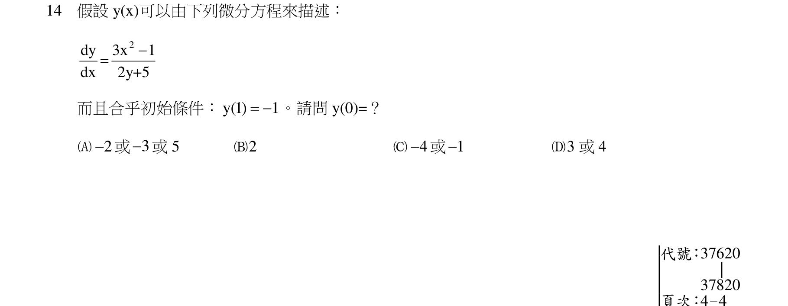

### 原始圖形裁切

本題原始 PDF 未含獨立嵌入圖形。

#### 測驗題 15、頁次：4 4
15
下列選項之中，何者屬於線性（linear）微分方程式？



2
2
y (t)+t
y (t)+cos(t)
y(t)
=0





t
y (t)+2y (t)+e
y(t)=sin(2t)





2
y(t) y (t)+t
y (t)+cos(t) y(t)=0



t
y (t)+2t y (t)+e
y(t)= y(t)






<!-- question_kind: multiple_choice; question_number: 15; app_question_number: 115 -->

### 原始題目裁切

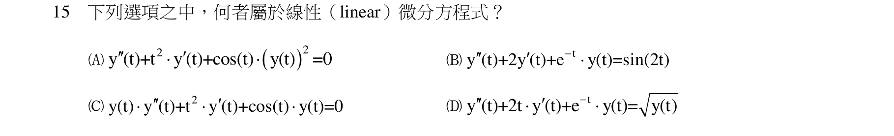

### 原始圖形裁切

本題原始 PDF 未含獨立嵌入圖形。

#### 測驗題 16、給定微分方程式
2
(
2)
dy
y
t
t
dt




，初始值為(0)
0
y

，( )t

為脈衝函數（impulse function）。則
( )
y t 的拉氏轉換（Laplace transform）為何？

2
2
2
s
e


2
2
1
(
2)
s
e

2
2
2(
2)
s
s
e

2
2
2
2
(
2)
s
s
e

<!-- question_kind: multiple_choice; question_number: 16; app_question_number: 116 -->

### 原始題目裁切

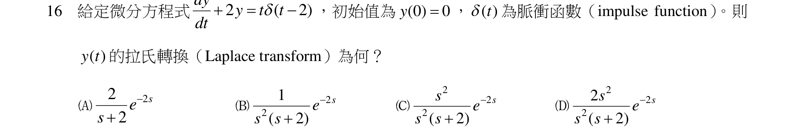

### 原始圖形裁切

本題原始 PDF 未含獨立嵌入圖形。

#### 測驗題 17、(
)
(
)
(
)
17
考慮微分方程式
5
6
y
y
y
x





，初始值為
(0)
y
A

和
(0)
y
B


。若其解為
2
3
1
1
1
2
3
6
x
x
y
e
e
x
C






，則A
B
C


為下列何值？
2
1
3
1
18
1
36

<!-- question_kind: multiple_choice; question_number: 17; app_question_number: 117 -->

### 原始題目裁切

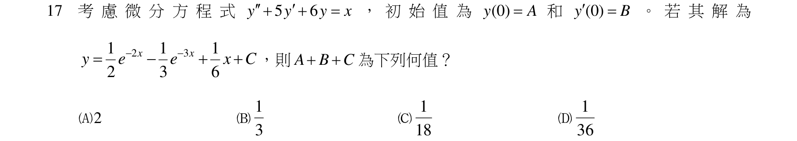

### 原始圖形裁切

本題原始 PDF 未含獨立嵌入圖形。

#### 測驗題 18、有兩位桌球選手，根據以往的經驗，在每一局的比賽之中兩人的勝率比例為6 比4。如果他們進
行一場五戰三勝的比賽（也就是搶先贏得三局的選手為整場比賽的勝利者），那麼請問這場比賽會
剛好在打完第四局的時候分出勝負的機率為何？
75
625
162
625
234
625
375
625

<!-- question_kind: multiple_choice; question_number: 18; app_question_number: 118 -->

### 原始題目裁切

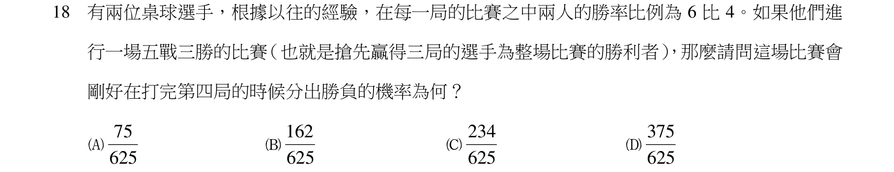

### 原始圖形裁切

本題原始 PDF 未含獨立嵌入圖形。

#### 測驗題 19、有兩個隨機變數X 與Y，我們以
XY
P
(x,y)=Prob(X=x,Y=y) 來代表其合併機率函數（joint probability
function），且其值如下所示：
XY
P
(1,1)=0.07 、
XY
P
(1,2)=0.09 、
XY
P
(1,3)=0.12 、
XY
P
(2,1)=0.25 、
XY
P
(2,2)=0.07、
XY
P
(2,3)=0.18、
XY
P
(3,1)=0.06、
XY
P
(3,2)=0.07、
XY
P
(3,3)=0.09。請計算下列條件
機率之值：Prob(Y=3 X=2)= ？
0 25
0 36
0 60
0 84

<!-- question_kind: multiple_choice; question_number: 19; app_question_number: 119 -->

### 原始題目裁切

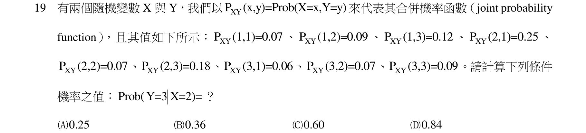

### 原始圖形裁切

本題原始 PDF 未含獨立嵌入圖形。

#### 測驗題 20、設X 為一連續隨機變數（random variable），機率密度函數（probability density function）為常態分
布（normal distribution），平均值為45，標準差為15。若欲將X 轉換為Y，其機率密度函數仍為
常態分布，平均值為65，標準差為10。則X 與Y 的關係式為下列何者？

1
50
3
Y
X



2
35
3
Y
X



2
47
5
Y
X



20
Y
X



<!-- question_kind: multiple_choice; question_number: 20; app_question_number: 120 -->

### 原始題目裁切

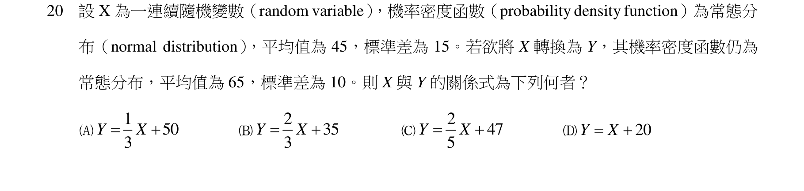

### 原始圖形裁切

本題原始 PDF 未含獨立嵌入圖形。
