# 公務人員高等考試三級（111年）工程數學 原始試題

> 本檔只保存考選部原始試題的轉錄與裁切圖，不含解答。數學符號、電路接線與圖中文字以原始題目裁切圖為準。

#### 一、（三）本科目除專門名詞或數理公式外，應使用本國文字作答。
一、我們考慮空間中的三個向量：a
( 3, 2,1)



、b
(2,4, 5)



、c
( 1, 1,3)


。
（每小題6 分，共12 分）
（一）請計算a、b

所圍出的平行四邊形的面積。
（二）請計算a、b

、c所圍出的平行六面體的體積。

<!-- question_kind: essay; question_number: 1; app_question_number: 1 -->

### 原始題目裁切

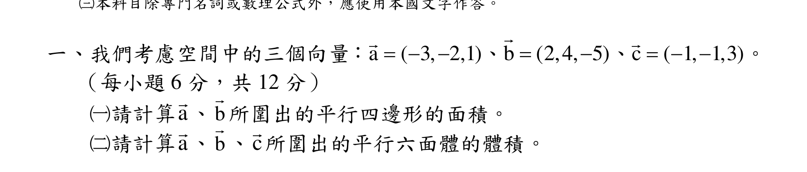

### 原始圖形裁切

本題原始 PDF 未含獨立嵌入圖形。

#### 二、考慮如下所示之初始值問題（initial-value problem）：
2
2
,
dy
d y
y
y
dx
dx










y + 3y + 2y = x
y(0) = 0 y (0) = 0






：
：
微分方程式
初始條件
、
（每小題7 分，共14 分）
（一）請求出本題目中之微分方程式的齊次解（homogeneous solution），該齊
次解應為一般形式（general form）解。
（二）請求出本初始值問題的精確解（exact solution）。

<!-- question_kind: essay; question_number: 2; app_question_number: 2 -->

### 原始題目裁切

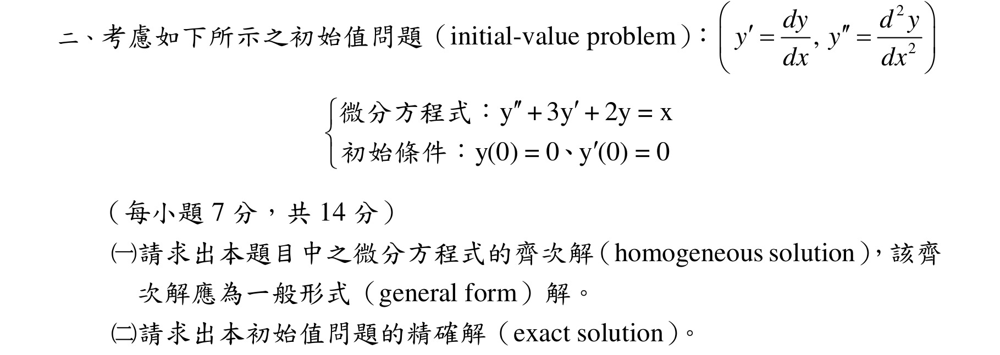

### 原始圖形裁切

本題原始 PDF 未含獨立嵌入圖形。

#### 三、我們準備從一疊標準的撲克牌[共52 張牌，沒有鬼牌（Joker）]裡面來隨
機抽牌。（每小題6 分，共12 分）
（一）假設我們的抽牌方式是：抽牌看了結果以後會把牌再放回原來那疊撲
克牌裡面；在這種情況之下，我們會剛好在第6 次抽牌的時候首度抽
到王牌（ACE）的機率為何？
（二）假設我們的抽牌方式是：抽牌看了結果以後不會把牌放回原來那疊撲
克牌裡面（也就是會把牌往旁邊擺）；在這種情況之下，我們會剛好在
第6 次抽牌的時候首度抽到王牌（ACE）的機率為何？
代號：37020
37120
頁次：4 2

<!-- question_kind: essay; question_number: 3; app_question_number: 3 -->

### 原始題目裁切

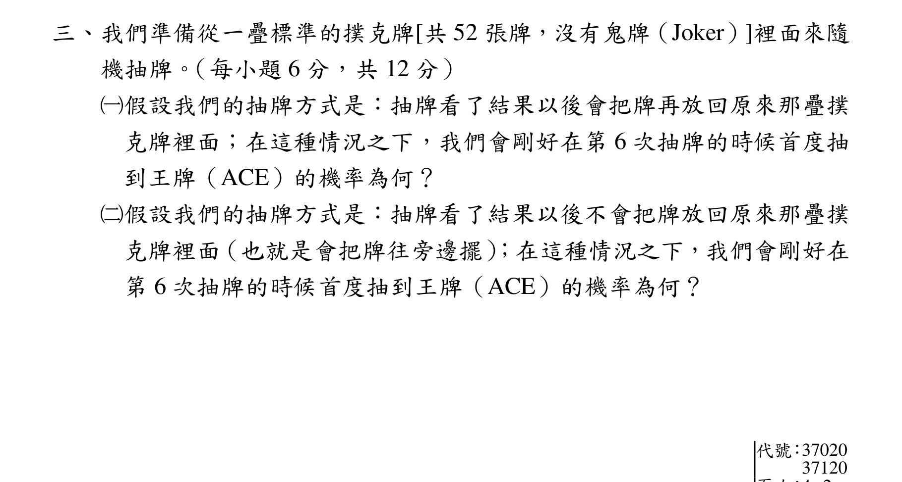

### 原始圖形裁切

本題原始 PDF 未含獨立嵌入圖形。

#### 四、頁
四、在本題目中，我們考慮複變函數（complex-valued function）沿著曲線
（contour）做積分（integral）的問題。我們用代表在複數平面上的單位
圓（也就是以座標系的原點為圓心而且半徑為1 的圓）之中從
1
0(
1)
i
i



以逆時針方向繞一圈走回到原出發點的曲線。請計算下列
兩個積分的結果。（每小題6 分，共12 分）
（一）
Γ z z
d 

？
（二）
Γ
1 z
z d 

？
乙、測驗題部分：（50 分）
代號：2370
（一）本測驗試題為單一選擇題，請選出一個正確或最適當的答案。
（二）共20題，每題25分，須用2B鉛筆在試卡上依題號清楚劃記，於本試題或申論試卷上作答者，不予計分。

<!-- question_kind: essay; question_number: 4; app_question_number: 4 -->

### 原始題目裁切

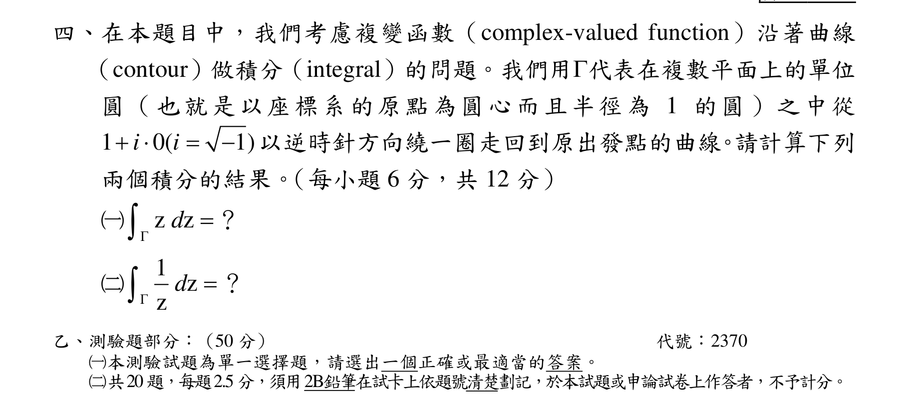

### 原始圖形裁切

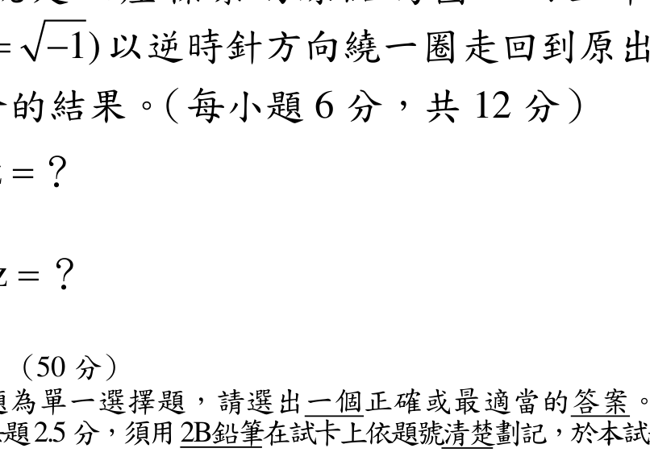

#### 測驗題 1、假設A 與B 為維度相同之方陣（square matrix）且
,
,
A B A
B

均為可逆（invertible）矩陣，則下列
何者不一定為可逆矩陣？

T
A B
I
AB


1
I
A B



1
I
AB


<!-- question_kind: multiple_choice; question_number: 1; app_question_number: 101 -->

### 原始題目裁切

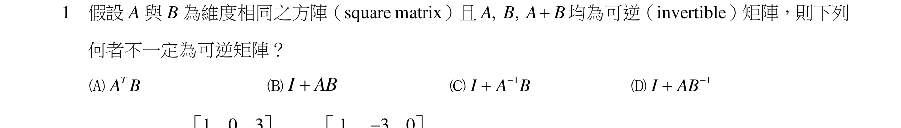

### 原始圖形裁切

本題原始 PDF 未含獨立嵌入圖形。

#### 測驗題 2、假設矩陣
1
0
3
2
2
6
0
7
3
A










，
1
3
0
2
4
1
5
2
2
B













，則行列式值


1
det 2
T
A B
為何？
12
17

12
17


48
17

48
17

<!-- question_kind: multiple_choice; question_number: 2; app_question_number: 102 -->

### 原始題目裁切

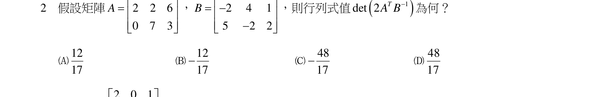

### 原始圖形裁切

本題原始 PDF 未含獨立嵌入圖形。

#### 測驗題 3、若
2
0
1
0
1
3
1
1
0
B
B
P












為從
3
R 的基底B 轉換至基底


(1,1,1),(1,1,0),(1,0,0)
B
之轉移矩陣（transition
matrix），則B ？


(3,2,2),(2,1,0),(4,4,1)


(3,4,2),(2,1,2),(2,0,1)


(3 1 2) (1 2 1) (4 1 4)


(3 2 1) (1 2 0) (2 1 0)

<!-- question_kind: multiple_choice; question_number: 3; app_question_number: 103 -->

### 原始題目裁切

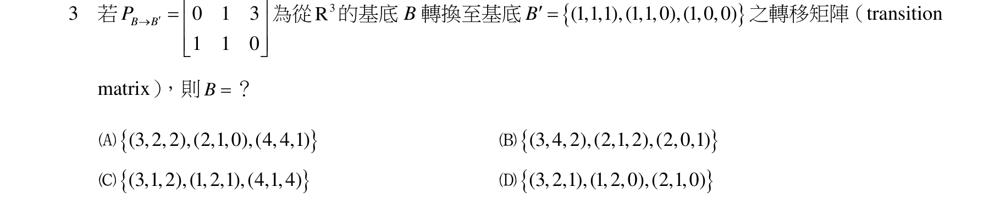

### 原始圖形裁切

本題原始 PDF 未含獨立嵌入圖形。

#### 測驗題 4、



4
下列那一個矩陣無法被對角化（diagonalizable）？

4
0
1
2
1
0
2
0
1













0
1
0
0
0
1
2
5
1












4
0
1
0
3
0
1
0
2












1
0
2
0
0
0
2
0
4












代號：37020
37120
頁次：4 3

<!-- question_kind: multiple_choice; question_number: 4; app_question_number: 104 -->

### 原始題目裁切

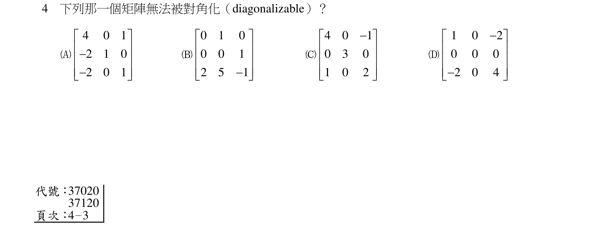

### 原始圖形裁切

本題原始 PDF 未含獨立嵌入圖形。

#### 測驗題 5、下列那一組
3
R 中之向量基於歐幾里得內積（Euclidean inner product）可作為規格化正交基底
（orthonormal basis）？

1
1
,0,
2
2






，
1
1
1
,
,
3
3
3







，
1
1
,0,
2
2







1 1 1
,
,
5 5 5






，
1 1
,
,0
2 2







，1 1
2
,
,
3 3
3








1
1
1
,
,
3
3
3







，
1
1
,
,0
2
2







2
2 1
,
,
3
3 3







，2 1
2
,
,
3 3
3







，1 2 2
,
,
3 3 3







<!-- question_kind: multiple_choice; question_number: 5; app_question_number: 105 -->

### 原始題目裁切

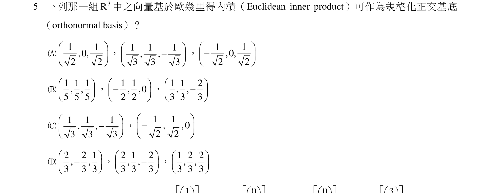

### 原始圖形裁切

本題原始 PDF 未含獨立嵌入圖形。

#### 測驗題 6、設T 是
3
R 到
2
R 的線性轉換，
1
3
0
2
0
T

















，
0
4
1
0
0
T





















，
0
0
0
1
1
T

















，
3
a
2
b
1
T

















，下列
何者正確？
a
b
8


a
b
10


a
b
10


a
b
8



<!-- question_kind: multiple_choice; question_number: 6; app_question_number: 106 -->

### 原始題目裁切

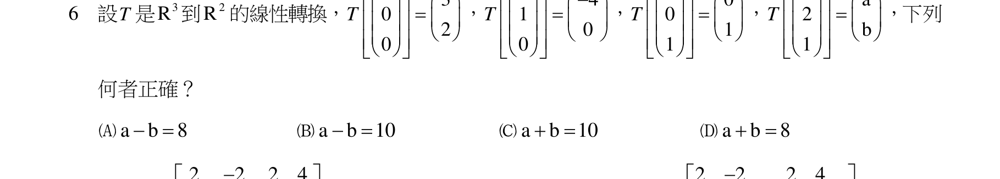

### 原始圖形裁切

本題原始 PDF 未含獨立嵌入圖形。

#### 測驗題 7、矩陣
2
2
2
4
2
4
2
1
6
2
4
14
A














的LU 分解（LU decomposition），可化為
2
2
2
4
0
2
4
3
0
0
10
2x













，x ？
x
1
x
2
x
3
x
4

<!-- question_kind: multiple_choice; question_number: 7; app_question_number: 107 -->

### 原始題目裁切

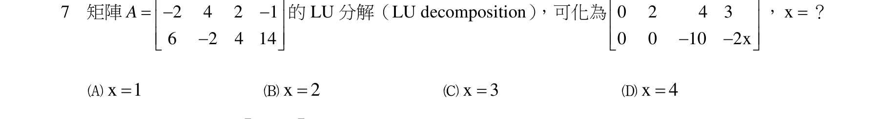

### 原始圖形裁切

本題原始 PDF 未含獨立嵌入圖形。

#### 測驗題 8、設和為矩陣
1
2
2
0
A







之特徵值（eigenvalues），則




？

<!-- question_kind: multiple_choice; question_number: 8; app_question_number: 108 -->

### 原始題目裁切

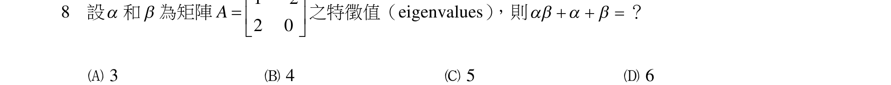

### 原始圖形裁切

本題原始 PDF 未含獨立嵌入圖形。

#### 測驗題 9、3
4
5
6
9
定義
1
i 
，若z
a
bi


為
2
(6
2 ) +17
6
0
z
i z
i




之一解，且
0
ab 
，則
2
2
?
a
b



<!-- question_kind: multiple_choice; question_number: 9; app_question_number: 109 -->

### 原始題目裁切

### 原始圖形裁切

本題原始 PDF 未含獨立嵌入圖形。

#### 測驗題 10、13
15
18
20
10
定義
1
i 
，複變數z
x
iy


與其共軛複數z
x
iy


。下列那一個複變函數為完整（entire），即
在整個複數平面皆為可解析（analytic）？

( )
f z
izz


2
2
( )
2
f z
x
y
i xy




( )
(cos
sin )
x
f z
e
y
i
y


( )
f

<!-- question_kind: multiple_choice; question_number: 10; app_question_number: 110 -->

### 原始題目裁切

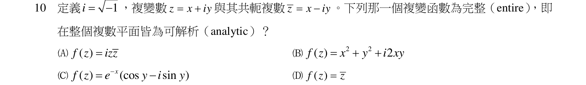

### 原始圖形裁切

本題原始 PDF 未含獨立嵌入圖形。

#### 測驗題 11、複變級數
0
(
)n
n
n
z
i
n




之收斂半徑（radius of convergence）為何？

1
i 

1

0
1
2
代號：37020
37120

<!-- question_kind: multiple_choice; question_number: 11; app_question_number: 111 -->

### 原始題目裁切

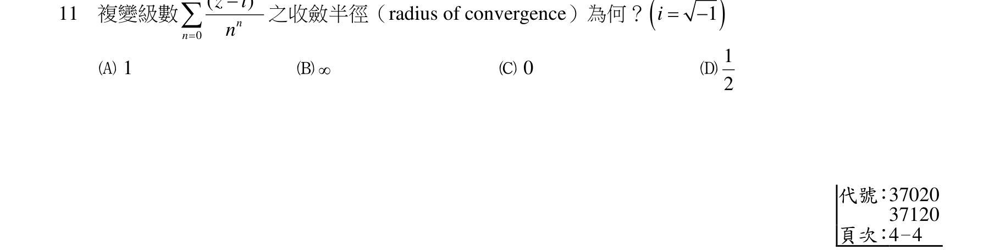

### 原始圖形裁切

本題原始 PDF 未含獨立嵌入圖形。

#### 測驗題 12、頁次：4－4
12
計算
zdz



？其中軌跡( )
it
t
e


, 0
t


。

1
i 


i

i

2 i

2 i


<!-- question_kind: multiple_choice; question_number: 12; app_question_number: 112 -->

### 原始題目裁切

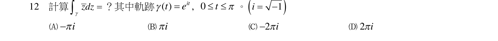

### 原始圖形裁切

本題原始 PDF 未含獨立嵌入圖形。

#### 測驗題 13、一階常微分方程式
'
3
x y
e
y
x


，下列何者為正確的解答？
dy
y
dx










3
1
y
x
e
e
x
c





，其中c 為常數



3
2
y
x
e
e
x
c


，其中c 為常數

<!-- question_kind: multiple_choice; question_number: 13; app_question_number: 113 -->

### 原始題目裁切

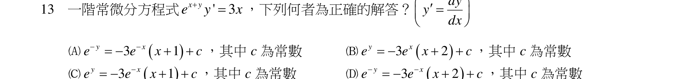

### 原始圖形裁切

本題原始 PDF 未含獨立嵌入圖形。

#### 測驗題 14、


3
1
y
x
e
e
x
c



，其中c 為常數



3
2
y
x
e
e
x
c





，其中c 為常數
14
二階微分方程式


2 '' 9
' 24
0,
1
1,
' 1
10
x y
xy
y
y
y





，設
6
5
4
3
a
b
c
d
y
x
x
x
x




為其解，下列何
者正確？
2
2
,
dy
d y
y
y
dx
dx










a
1

b
1

c
2

d
4


<!-- question_kind: multiple_choice; question_number: 14; app_question_number: 114 -->

### 原始題目裁切

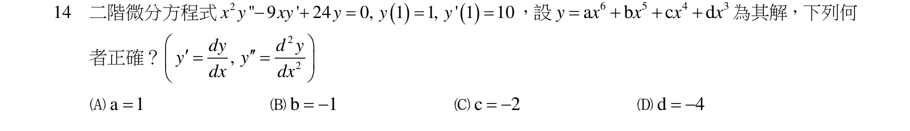

### 原始圖形裁切

本題原始 PDF 未含獨立嵌入圖形。

#### 測驗題 15、反拉普拉斯轉換（inverse Laplace transform）
1
2
2
3
(a cos
bsin
c
d)
2
2
2
1
t
s
s
e
t
t
t
s
s
s
s


















L
，
a, b, c, d 為常數，則：
a
b
c
d
3



a
b
c
d
4



a
b
c
d
3



a
b
c
d
4




<!-- question_kind: multiple_choice; question_number: 15; app_question_number: 115 -->

### 原始題目裁切

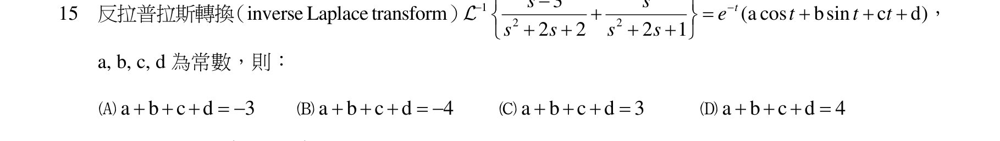

### 原始圖形裁切

本題原始 PDF 未含獨立嵌入圖形。

#### 測驗題 16、假設
1
2
1
( )
(
1)
f t
s s








L
，其中
1

L 為反拉普拉斯轉換（inverse Laplace transform），下列何者正確？

(0)
1
f


(0)
1
f


(1)
1
f


(1)
1
f


<!-- question_kind: multiple_choice; question_number: 16; app_question_number: 116 -->

### 原始題目裁切

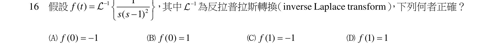

### 原始圖形裁切

本題原始 PDF 未含獨立嵌入圖形。

#### 測驗題 17、定義傅立葉轉換
( )
( )
i x
F
f x e
dx






，令
5
, 3
3
( )
0
,
3
3
x
f x
x
x







或
，
( )
F ？

1
i 

6 sin
)
(5
6 cos
)
(5
10 sin
)
(3
10 cos
)
(3

<!-- question_kind: multiple_choice; question_number: 17; app_question_number: 117 -->

### 原始題目裁切

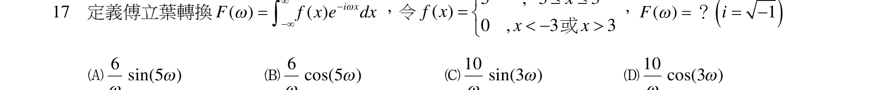

### 原始圖形裁切

本題原始 PDF 未含獨立嵌入圖形。

#### 測驗題 18、



18
若X 為一連續均勻分布（uniformly distributed）在區間(0, 20) 之隨機變數，可計算得知
10
X 
之
機率為a，
12
X 
之機率為b，8
16
X


之機率為c，則a
b
c

？
11
6
13
7

<!-- question_kind: multiple_choice; question_number: 18; app_question_number: 118 -->

### 原始題目裁切

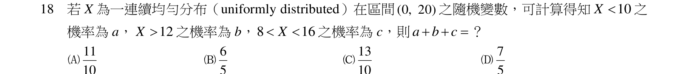

### 原始圖形裁切

本題原始 PDF 未含獨立嵌入圖形。

#### 測驗題 19、10
5
10
5
19
將一副正常的撲克牌（52 張牌包含四種花色：黑桃、方塊、紅心、梅花，每種花色各13 張牌，
ACE 為各花色點數1 的牌）隨機均分為4 疊，每疊各13 張牌。這四疊牌每疊恰好包含一張ACE
牌的機率為何？
1
13
927
2550
783
2450
2197
20825

<!-- question_kind: multiple_choice; question_number: 19; app_question_number: 119 -->

### 原始題目裁切

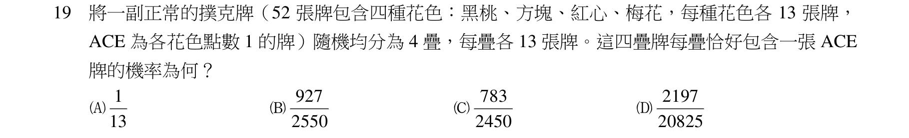

### 原始圖形裁切

本題原始 PDF 未含獨立嵌入圖形。

#### 測驗題 20、設X 和Y 為連續隨機變數，其聯合機率密度函數（joint probability density function ）
,
2
,0
1
( , )
0
,
X Y
y
x
f
x y






其他，令W
Y/X

，期望值
(
)
E W
？
1/2
1
3/2
2

<!-- question_kind: multiple_choice; question_number: 20; app_question_number: 120 -->

### 原始題目裁切

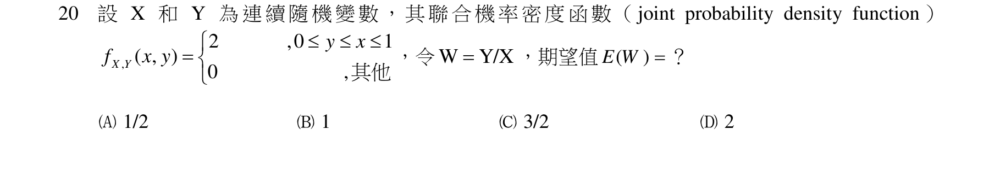

### 原始圖形裁切

本題原始 PDF 未含獨立嵌入圖形。
