# 公務人員高等考試三級（112年）工程數學 原始試題

> 本檔只保存考選部原始試題的轉錄與裁切圖，不含解答。數學符號、電路接線與圖中文字以原始題目裁切圖為準。

#### 一、（三）本科目除專門名詞或數理公式外
應使用本國文字作答
一、求
2
''
( ')
yy
y

的通解（general solution）。（15分）

<!-- question_kind: essay; question_number: 1; app_question_number: 1 -->

### 原始題目裁切

### 原始圖形裁切

本題原始 PDF 未含獨立嵌入圖形。

#### 二、求
c zdz

，其中c代表複數平面上逆時針方向繞一圈的單位圓（圓點為圓心
且半徑為1的圓）。（10分）

<!-- question_kind: essay; question_number: 2; app_question_number: 2 -->

### 原始題目裁切

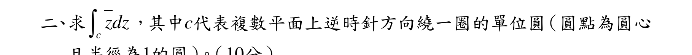

### 原始圖形裁切

本題原始 PDF 未含獨立嵌入圖形。

#### 三、求平面2
2
1
x
y
z


與平面
2
x
y


之夾角（
0
0
90



）。（10分）
2
0
0



<!-- question_kind: essay; question_number: 3; app_question_number: 3 -->

### 原始題目裁切

### 原始圖形裁切

本題原始 PDF 未含獨立嵌入圖形。

#### 四、2
0
0
1
0
2
0
0
3
A










，求特徵值（eigenvalues ）與其對應的特徵向量
（eigenvectors）。（15分）
乙、測驗題部分：（50分）
代號：2373
（一）本試題為單一選擇題，請選出一個正確或最適當答案。
（二）共20題
每題25分須用2B鉛筆在試卡上依題號清楚劃記於本試題或申論試卷上作答者不予計分

<!-- question_kind: essay; question_number: 4; app_question_number: 4 -->

### 原始題目裁切

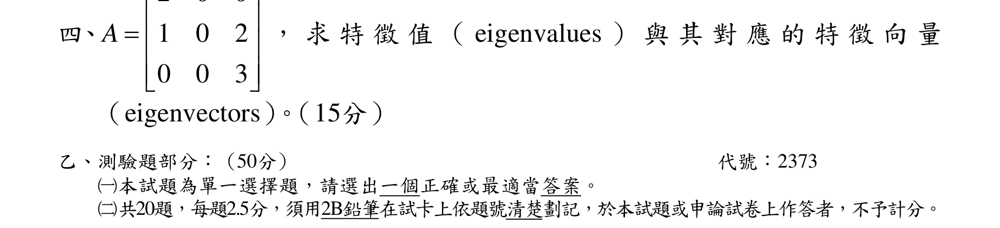

### 原始圖形裁切

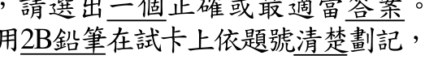

#### 測驗題 1、（二）共題
每題
分須用
筆在試卡
依題號清楚劃
本試題或申論試卷作答者不予計分
1
二階微分方程
2
''
' 12
2sinh ( )
y
y
y
x



，初始值未知，試問其全解（通解加特解）為何？

4
3
2
2
1
2
1
1
(1
)
6
12
x
x
x
x
C e
C e
e
e







4
3
2
2
1
2
1
1
(1
)
12
20
x
x
x
x
C e
C e
e
e







4
3
2
2
1
1
1
(
)
x
x
x
x
C e
C e
e
e





4
3
2
2
1
1
x
x
x
x
C e
C e
e
e





<!-- question_kind: multiple_choice; question_number: 1; app_question_number: 101 -->

### 原始題目裁切

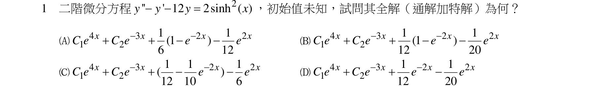

### 原始圖形裁切

本題原始 PDF 未含獨立嵌入圖形。

#### 測驗題 2、12
10
6
12
20
2
二階微分方程3 '' 12
2tan(2 )
y
y
x


，試問其特解為何？

1 sin(2 )
sec(2 )
tan(2 )
6
x
ln
x
x




1 sin(2 )
csc(2 )
cot(2 )
2
x
ln
x
x




1 cos(2 )
csc(2 )
tan(2 )
x
ln
x
x




1 cos(2 )
sec(2 )
tan(2 )
x
ln
x
x




<!-- question_kind: multiple_choice; question_number: 2; app_question_number: 102 -->

### 原始題目裁切

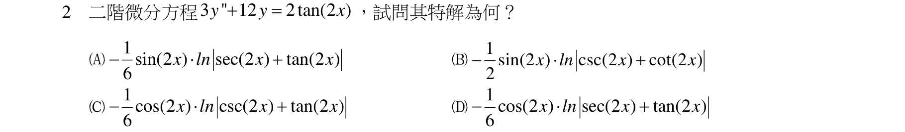

### 原始圖形裁切

本題原始 PDF 未含獨立嵌入圖形。

#### 測驗題 3、6
6
3
函數
2
f(t)
t
ωt
t
e
sin


，請問其經過拉式轉換（Laplace Transform）後為下列何者？

2
2 2
2(
2)
F(s)
[(
2)
]
S
S







2
2 2
2(
2)
F(s)
[(
2)
]
S
S






2
2 2
(
2)
F(s)
[(
2)
]
S
S






2
2 2
2(
2)
F(s)
[(
2)
]
S
S







代號：37320-37520
頁次：4－2

<!-- question_kind: multiple_choice; question_number: 3; app_question_number: 103 -->

### 原始題目裁切

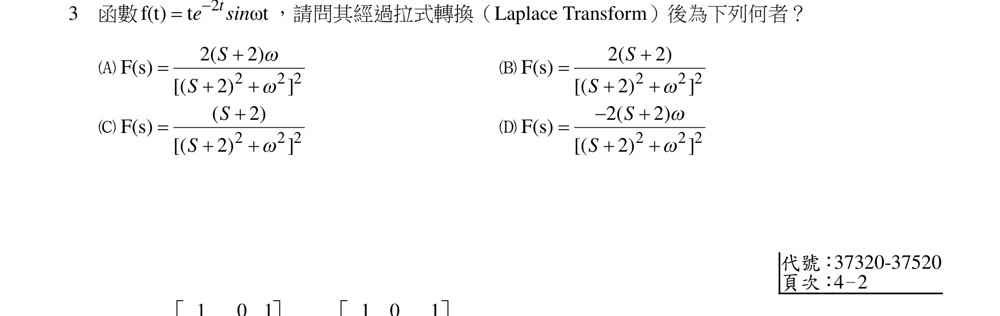

### 原始圖形裁切

本題原始 PDF 未含獨立嵌入圖形。

#### 測驗題 4、矩陣
1
0
1
A
1
1
1
2
1 1












，
1
0
1
B
2
1
0
3
2
5












，試問
1
A？，
1
B？

1
2
1
1
1
1
2
1
1
1
A














，
1
3.5
1
1.5
5.5
1
1
3.5
1
0.5
B

















1
2
1
1
3
1
2
1
1
1
A
















，
1
2.5
1
0.5
5
1
1
3.5
1
0.5
B
















1
2
1
1
3
1
2
1
1
1
A














，
1
2.5
1
0.5
1.5
1
1.5
3.5
1
0.5
B















1
2.5
1
1.5
5
1
1
A











，
1
2
1
1
3
1
2
B













<!-- question_kind: multiple_choice; question_number: 4; app_question_number: 104 -->

### 原始題目裁切

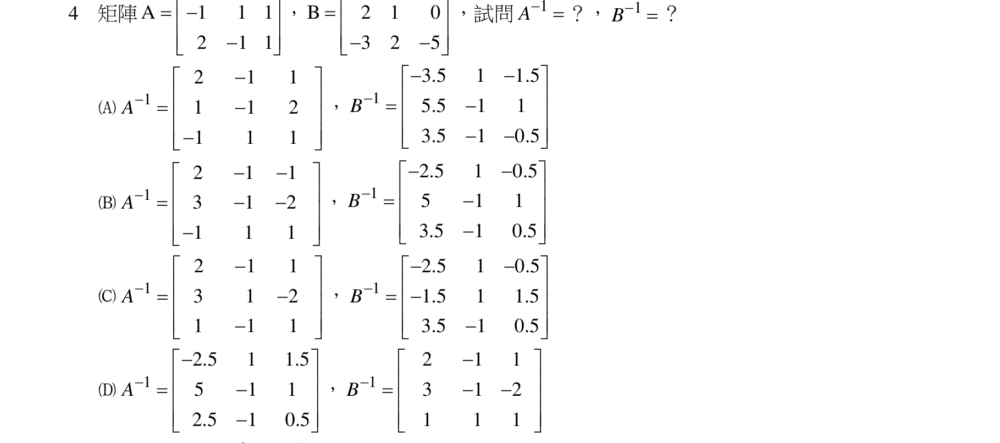

### 原始圖形裁切

本題原始 PDF 未含獨立嵌入圖形。

#### 測驗題 5、2.5
1
0.5




1
1
1




5
若
( )
f x {
, 0
1
0, 1
2
x
x
x




，且



2
f x
f x


。若

f x 之傅立葉級數（Fourier Series ）為
0
1
( )
(
cos
sin
)
k
k
k
f x
a
a
kx
b
kx







，下列何者為非？
0
1
a 
1
2
2
a 

2
2
1
a 
3
2
2
a 

<!-- question_kind: multiple_choice; question_number: 5; app_question_number: 105 -->

### 原始題目裁切

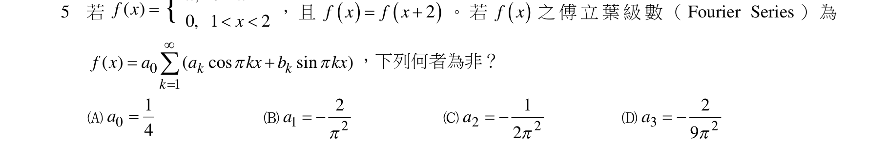

### 原始圖形裁切

本題原始 PDF 未含獨立嵌入圖形。

#### 測驗題 6、4

2
9
6
一組聯立方程式以A
B
x 
的方式表示如下：
2
1
2
3
4
1
11
2
4
1
2
1
4
6
7
6
T
x
T
x
x































其中T為常數，若上式之增廣矩陣（augmented matrix）為C，又此一聯立方程式已知有無限多組解，
試問rank(C)之最大值為何？T又為何？
rank(C)之最大值為3，T=-3
rank(C)之最大值為4，T=3

<!-- question_kind: multiple_choice; question_number: 6; app_question_number: 106 -->

### 原始題目裁切

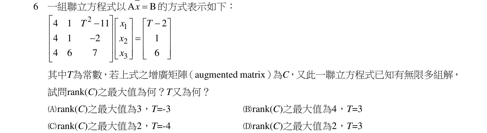

### 原始圖形裁切

本題原始 PDF 未含獨立嵌入圖形。

#### 測驗題 7、rank(C)之最大值為2，T=-4
rank(C)之最大值為2，T=3
7
兩向量分別為
2 ˆ
ˆ
ˆ
( )
2
8
H t
i
tj
t k




，
ˆ
ˆ
ˆ
( )
3
2
( )
t
G t
ti
e j
ln t k




，請求出
( )
( )
d
H t
G t
dt







=？（其中ˆi，
ˆj ，ˆk 為三度空間R3各座標軸之單位向量符號，亦即
(1,0,0)
i 

，
(0,1,0)
j 
，
(0,0,1)
k 
）

2
2
2
ˆ
ˆ
ˆ
8(1
)
(2
4 )
(9
)
(48
4
)
t
t
lnt
t
t e
i
t
j
t
e k
t












2
2
2
ˆ
ˆ
ˆ
(1
)
(2
4 )
( 9
)
(48
4
)
t
t
lnt
t
t e
i
t
j
t
e k
t












2
2
2
ˆ
ˆ
ˆ
8(1
)
(2
4 )
( 9
)
(24
2
)
t
t
lnt
t
t e
i
t
j
t
e k
t












2
2
2
ˆ
ˆ
ˆ
8(1
)
(2
4 )
(9
)
(48
4
)
t
t
lnt
t
t e
i
t
j
t
e k
t











代號：37320-37520

<!-- question_kind: multiple_choice; question_number: 7; app_question_number: 107 -->

### 原始題目裁切

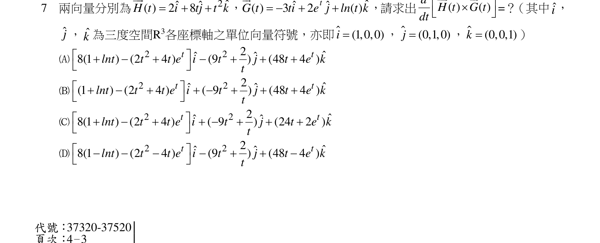

### 原始圖形裁切

本題原始 PDF 未含獨立嵌入圖形。

#### 測驗題 8、頁次：4－3
8
一曲線參數式為x( )
cos
t
t
e
t

，y( )
sin
t
t
e
t

，z( )
t
t
e

，0
π
t


，其單位切線向量為何？（其中
ˆi ，ˆj ，ˆk 為三度空間R3之單位向量，
(1,0,0)
i 

，
(0,1,0)
j 
，
(0,0,1)
k 
）
1
1
1
ˆ
ˆ
ˆ
(cos
sin )
(cos -sin )
sin
3
3
3
t
t i
t
t j
t k



1
1
1 ˆ
ˆ
ˆ
(cos
sin )
(cos +sin )
3
3
3
t
t i
t
t j
k



1
1
1 ˆ
ˆ
ˆ
cos
sin
3
3
3
ti
tj
k


1
1
1
ˆ
ˆ
ˆ
sin
cos
3
3
3
ti
j
tk



<!-- question_kind: multiple_choice; question_number: 8; app_question_number: 108 -->

### 原始題目裁切

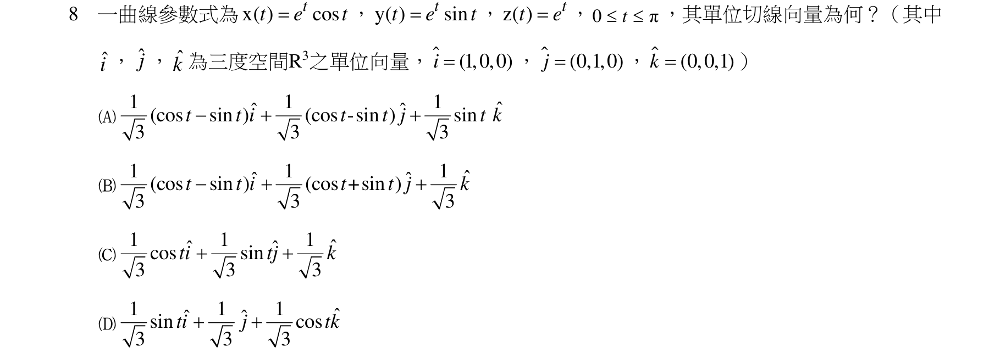

### 原始圖形裁切

本題原始 PDF 未含獨立嵌入圖形。

#### 測驗題 9、利用梯度求解曲面φ ：
3 2
4
xy z 
在(-1, -1, 2)點之法向量的過程與結果，以下何者錯誤？（其中ˆi ，
ˆj ，ˆk 為三度空間R3之單位向量，
(1,0,0)
i 

，
(0,1,0)
j 
，
(0,0,1)
k 
）

3 2
2 2
3 ˆ
ˆ
ˆ
φ=
3
2
y z i
xy z j
xy zk



曲面φ 在點(-1, -1, 2)上之法向量為
ˆ
ˆ
ˆ
4
12
4
i
j
k



曲面φ 在點(-1, -1, 2)之單位法向量為
1
ˆ
ˆ
ˆ
( 1
3
1 )
11
i
j
k





ˆ
ˆ
ˆ
8
24
24
i
j
k

為曲面φ 在點( 1
1 2)之法向量

<!-- question_kind: multiple_choice; question_number: 9; app_question_number: 109 -->

### 原始題目裁切

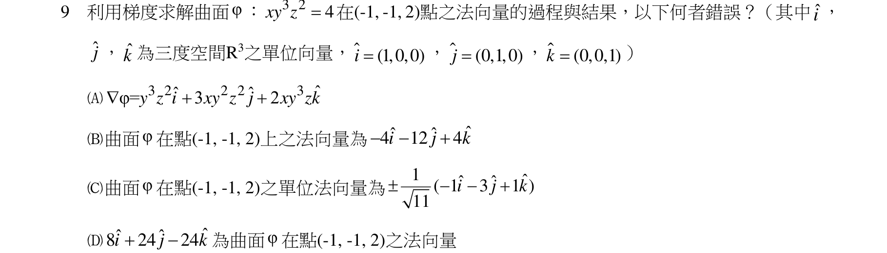

### 原始圖形裁切

本題原始 PDF 未含獨立嵌入圖形。

#### 測驗題 10、j
為曲面
在點(
,
, )
法向
10
某大學111學年度第二學期工程數學某班共有男生6人，女生5人，期中考試成績如下：
男生：88, 77, 40, 58, 72, 92
女生：84, 60, 74, 50, 95
試求以男、女生做為區分條件時之標準差（standard deviation）各為何？（請選數值最接近者）
男生：16.95；女生：15.78
男生：17.78；女生：16.14
男生：17 78；女生：15 78
男生：16 95；女生：16 14

<!-- question_kind: multiple_choice; question_number: 10; app_question_number: 110 -->

### 原始題目裁切

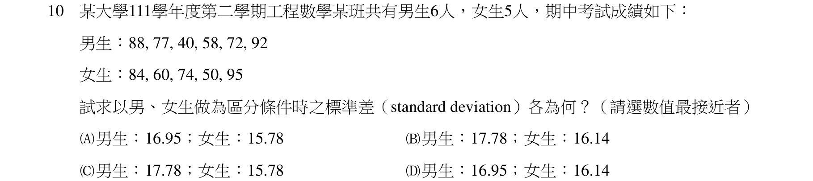

### 原始圖形裁切

本題原始 PDF 未含獨立嵌入圖形。

#### 測驗題 11、男生
女生
男生
女生
11
請利用柯西—里曼方程式（Cauchy-Riemann Equation）驗證下列何者非可解析函數（non-analytic
function）？（其中Z為複數）
f(z)
z

f(z)
sin z


2
f(z)
2
1
z
z



f(z)
z
e

1
2
1
2
1




1
0
0
0
0





<!-- question_kind: multiple_choice; question_number: 11; app_question_number: 111 -->

### 原始題目裁切

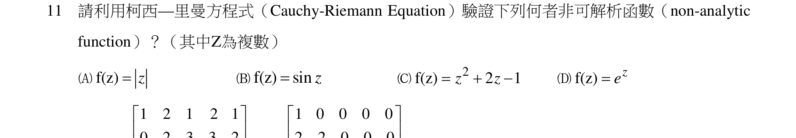

### 原始圖形裁切

本題原始 PDF 未含獨立嵌入圖形。

#### 測驗題 12、矩陣A=
0
2
3
3
2
0
0
3
1
2
0
0
0
1
3
0
0
0
0
4














，B=
2
2
0
0
0
3
1
3
0
0
1
2
1
4
0
2
1 1 1 1














，試問行列式det(AB)=？
0
576
22
121
代號：37320-37520

<!-- question_kind: multiple_choice; question_number: 12; app_question_number: 112 -->

### 原始題目裁切

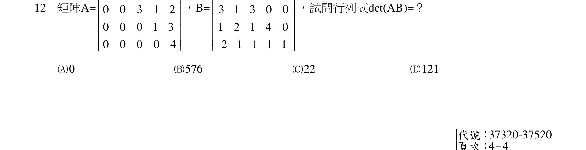

### 原始圖形裁切

本題原始 PDF 未含獨立嵌入圖形。

#### 測驗題 13、頁次：4－4
13
定義
1
i 
，求
12
(1
)i

的運算結果為何？
-64
-128
-512
-256

<!-- question_kind: multiple_choice; question_number: 13; app_question_number: 113 -->

### 原始題目裁切

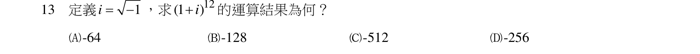

### 原始圖形裁切

本題原始 PDF 未含獨立嵌入圖形。

#### 測驗題 14、函數
( )
f t 經拉式轉換後為
2
1
[ ( )]
(
3)(
2
2)
S
f t
S
S
S





L
，試問
( )
f t 應為？

3
4
3
4
( sin
cos )
5
5
5
t
t
e
e
t
t






3
4
3
4
( sin
cos )
5
5
5
t
t
e
e
t
t





3
4
4
4
( sin
cos )
5
5
5
t
t
e
e
t
t





3
4
4
3
( sin
cos )
5
5
5
t
t
e
e
t
t




0
2
0
2




<!-- question_kind: multiple_choice; question_number: 14; app_question_number: 114 -->

### 原始題目裁切

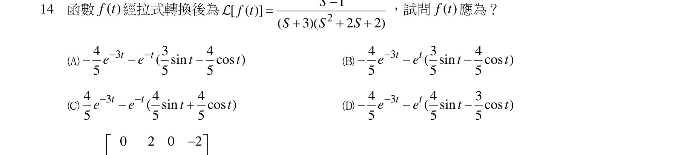

### 原始圖形裁切

本題原始 PDF 未含獨立嵌入圖形。

#### 測驗題 15、若
1
5
3
5
2
7
6
4
1
3
2
2
A














且
1
B
A

，請問行列式
2
det(
)
B
為下列何者？
1/900
1/700
1/500
1/300

<!-- question_kind: multiple_choice; question_number: 15; app_question_number: 115 -->

### 原始題目裁切

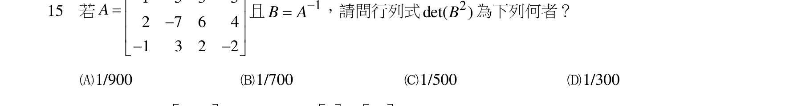

### 原始圖形裁切

本題原始 PDF 未含獨立嵌入圖形。

#### 測驗題 16、已知矩陣
5
4
1
2
A






具有特徵向量
4
1



及
1
1







，請問下列何者可為其對角化（Diagonalization）矩陣？

6
0
0
1







5
0
0
2







4
0
0
3







3
0
0
2







<!-- question_kind: multiple_choice; question_number: 16; app_question_number: 116 -->

### 原始題目裁切

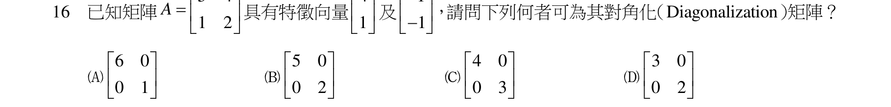

### 原始圖形裁切

本題原始 PDF 未含獨立嵌入圖形。

#### 測驗題 17、







17
方程式x
2
e y'
2(x+1)y , y(0)
1/ 6


之解為下列何者？

1
y
(2
4)
2
x



1
y
(2
4)
2
x




1
y
( 2
4)
2
x



1
y
(2
4)
2
x


<!-- question_kind: multiple_choice; question_number: 17; app_question_number: 117 -->

### 原始題目裁切

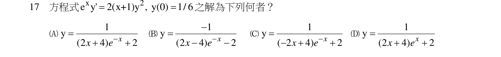

### 原始圖形裁切

本題原始 PDF 未含獨立嵌入圖形。

#### 測驗題 18、(
)
(
)
(
)
(
)
18
求
2
1
1
(
)
1
s
s
s


之反拉式轉換（Inverse Laplace Transform）為下列何者？

t
2
2


t
2
2


t
2
2


t
2
2


<!-- question_kind: multiple_choice; question_number: 18; app_question_number: 118 -->

### 原始題目裁切

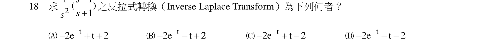

### 原始圖形裁切

本題原始 PDF 未含獨立嵌入圖形。

#### 測驗題 19、



19
求cosh(at)cos(at) 之拉式轉換為下列何者？（其中a為實數）

2
4
4
2a s

2
2
4
4
2a +s

2
2
4
4
s
2a


3
4
4
s

<!-- question_kind: multiple_choice; question_number: 19; app_question_number: 119 -->

### 原始題目裁切

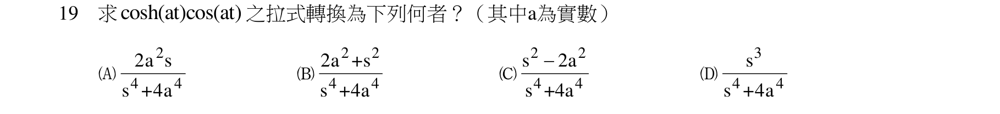

### 原始圖形裁切

本題原始 PDF 未含獨立嵌入圖形。

#### 測驗題 20、s +4a
s +4a
s +4a
s +4a
20
已知
sin8
( )
t
f t
t

，
5
( )
j t
f t e
dt




之值為下列何者？（
1
j 
）
j

2
j 
2



<!-- question_kind: multiple_choice; question_number: 20; app_question_number: 120 -->

### 原始題目裁切

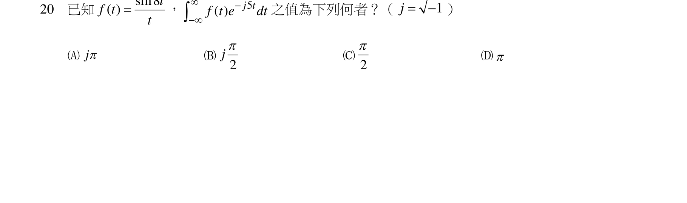

### 原始圖形裁切

本題原始 PDF 未含獨立嵌入圖形。
