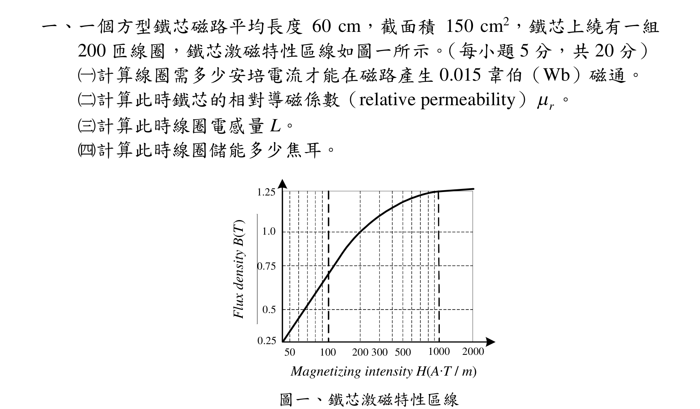
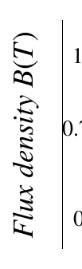
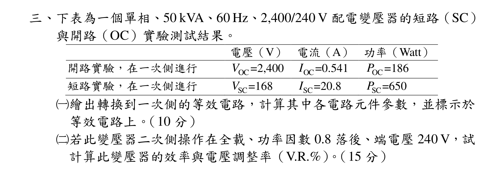
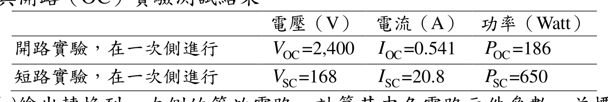
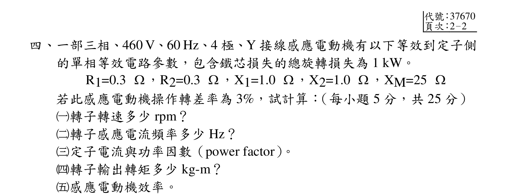
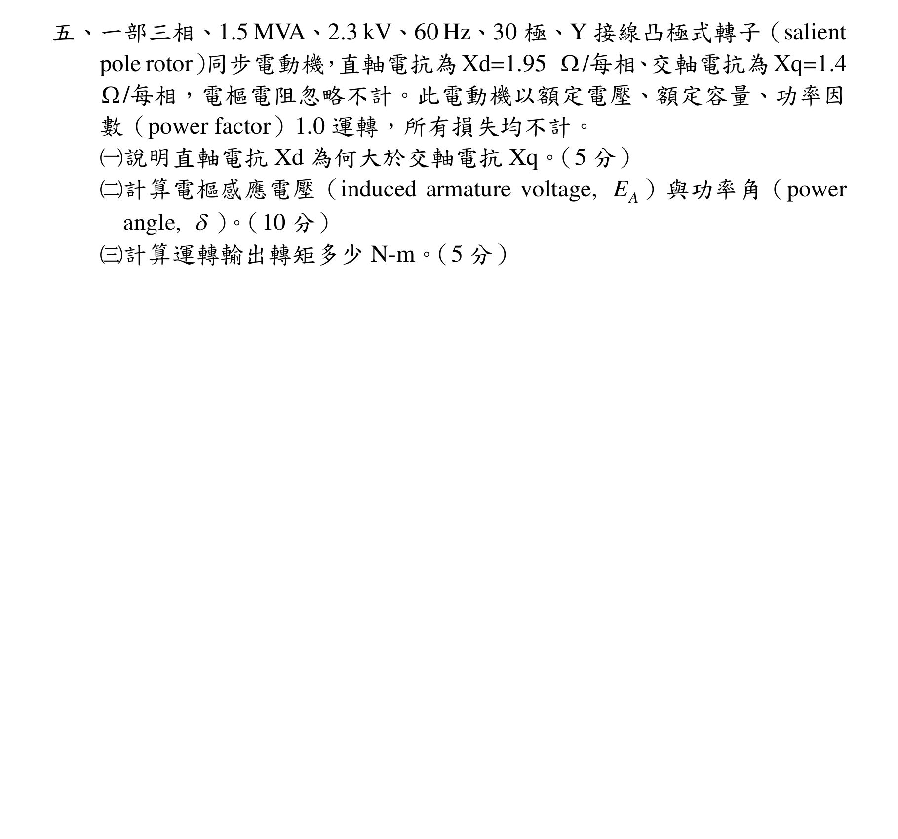

# 公務人員高等考試三級（110年）電機機械 原始試題

> 本檔只保存考選部原始試題的轉錄與裁切圖，不含解答。數學符號、電路接線與圖中文字以原始題目裁切圖為準。

#### 一、一個方型鐵芯磁路平均長度60 cm，截面積150 cm2，鐵芯上繞有一組
200 匝線圈，鐵芯激磁特性區線如圖一所示。（每小題5 分，共20 分）
（一）計算線圈需多少安培電流才能在磁路產生0.015 韋伯（Wb）磁通。
（二）計算此時鐵芯的相對導磁係數（relative permeability）
r
。
（三）計算此時線圈電感量L。
（四）計算此時線圈儲能多少焦耳。
Magnetizing int ensity H( A T / m )

1.0
0.5
0.75
0.25
100
1000
1.25
2000
200
500
300
50
圖一、鐵芯激磁特性區線
Magnetizing intensity H(A∙T / m)
Flux density B(T)

<!-- question_kind: essay; question_number: 1; app_question_number: 1 -->

### 原始題目裁切

### 原始圖形裁切

#### 二、對於直流串激電動機：（每小題5 分，共10 分）
（一）試繪出直流串激電動機的等效電路。
（二）試以公式說明此電動機為何具有高啟動轉矩特性。

<!-- question_kind: essay; question_number: 2; app_question_number: 2 -->

### 原始題目裁切

### 原始圖形裁切

本題原始 PDF 未含獨立嵌入圖形。

#### 三、下表為一個單相、50 kVA、60 Hz、2,400/240 V 配電變壓器的短路（SC）
與開路（OC）實驗測試結果。
電壓（V）
電流（A）
功率（Watt）
開路實驗，在一次側進行
OC
V
=2,400
OC
I
=0.541
OC
P
=186
短路實驗，在一次側進行
SC
V =168
SC
I
=20.8
SC
P =650
（一）繪出轉換到一次側的等效電路，計算其中各電路元件參數，並標示於
等效電路上。（10 分）
（二）若此變壓器二次側操作在全載、功率因數0.8 落後、端電壓240 V，試
計算此變壓器的效率與電壓調整率（V.R.%）。（15 分）

<!-- question_kind: essay; question_number: 3; app_question_number: 3 -->

### 原始題目裁切

### 原始圖形裁切

#### 四、一部三相、460 V、60 Hz、4 極、Y 接線感應電動機有以下等效到定子側
的單相等效電路參數，包含鐵芯損失的總旋轉損失為1 kW。
R1=0.3 ，R2=0.3 ，X1=1.0 ，X2=1.0 ，XM=25 
若此感應電動機操作轉差率為3%，試計算：（每小題5 分，共25 分）
（一）轉子轉速多少rpm？
（二）轉子感應電流頻率多少Hz？
（三）定子電流與功率因數（power factor）。
（四）轉子輸出轉矩多少kg-m？
感應電動機效率。

<!-- question_kind: essay; question_number: 4; app_question_number: 4 -->

### 原始題目裁切

### 原始圖形裁切

本題原始 PDF 未含獨立嵌入圖形。

#### 五、一部三相、1.5 MVA、2.3 kV、60 Hz、30 極、Y 接線凸極式轉子（salient
pole rotor）同步電動機，直軸電抗為Xd=1.95 /每相、交軸電抗為Xq=1.4
/每相，電樞電阻忽略不計。此電動機以額定電壓、額定容量、功率因
數（power factor）1.0 運轉，所有損失均不計。
（一）說明直軸電抗Xd 為何大於交軸電抗Xq。（5 分）
（二）計算電樞感應電壓（induced armature voltage,
A
E ）與功率角（power
angle, ）。（10 分）
（三）計算運轉輸出轉矩多少N-m。（5 分）

<!-- question_kind: essay; question_number: 5; app_question_number: 5 -->

### 原始題目裁切

### 原始圖形裁切

本題原始 PDF 未含獨立嵌入圖形。
