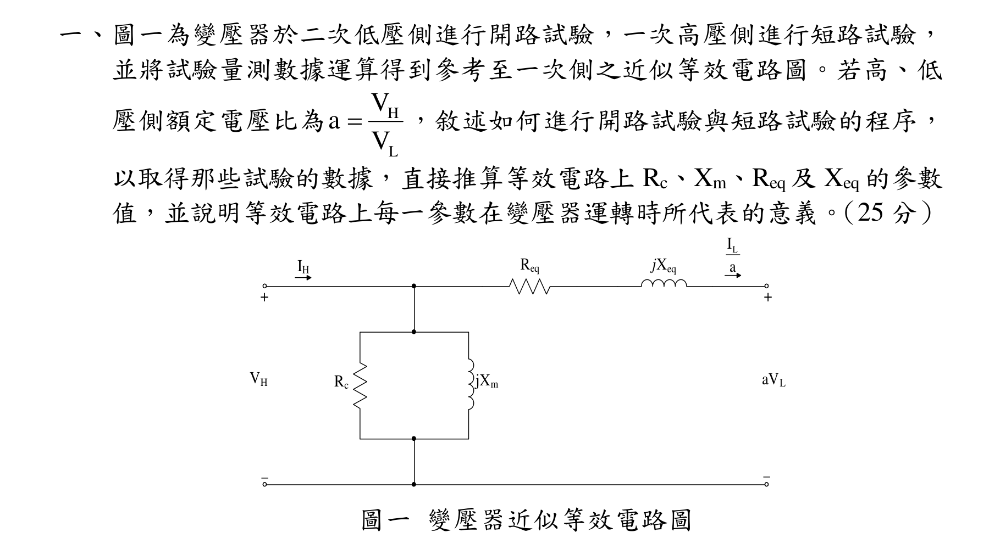
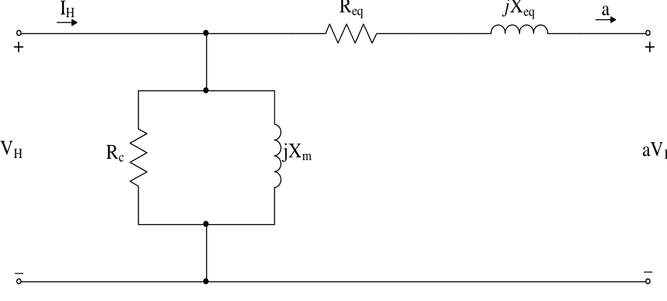
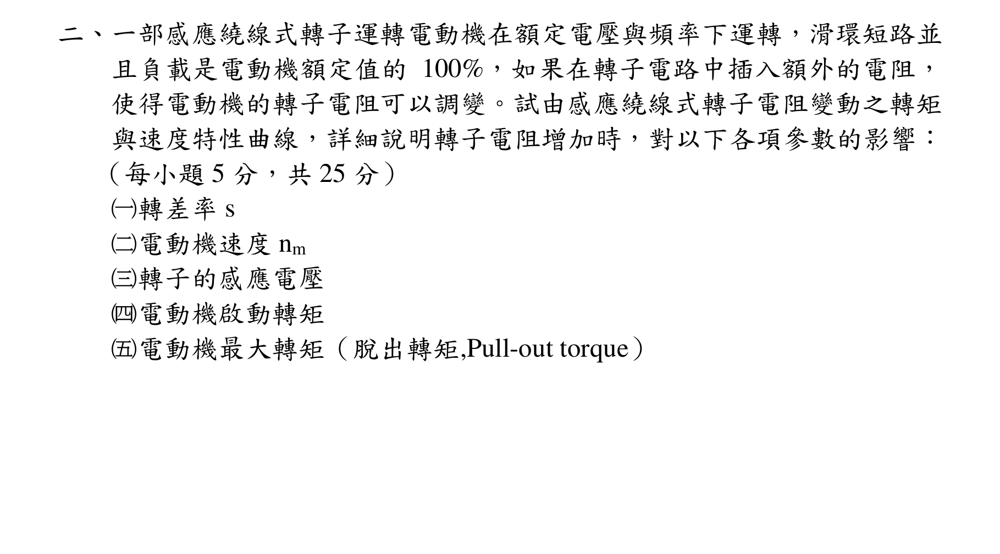
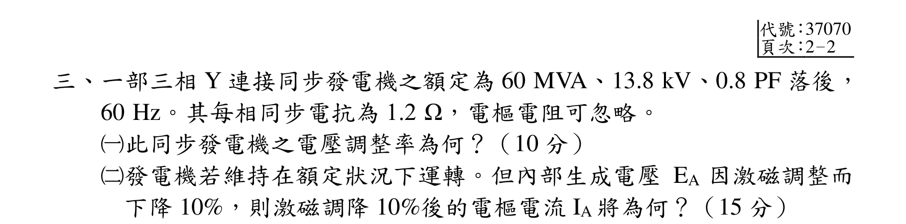
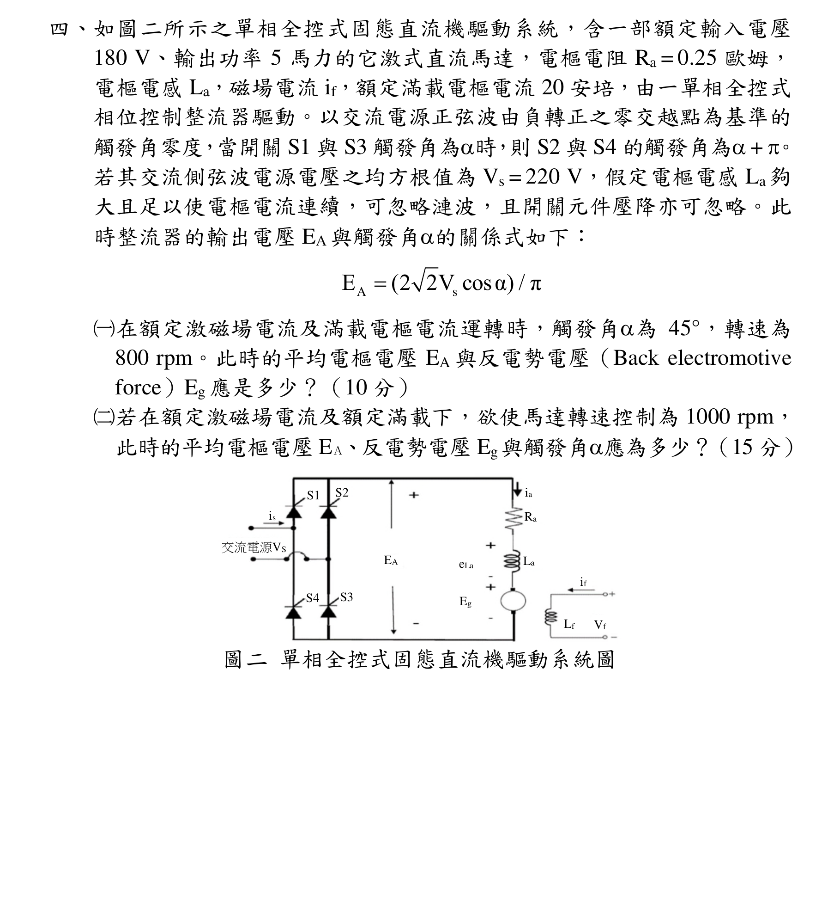
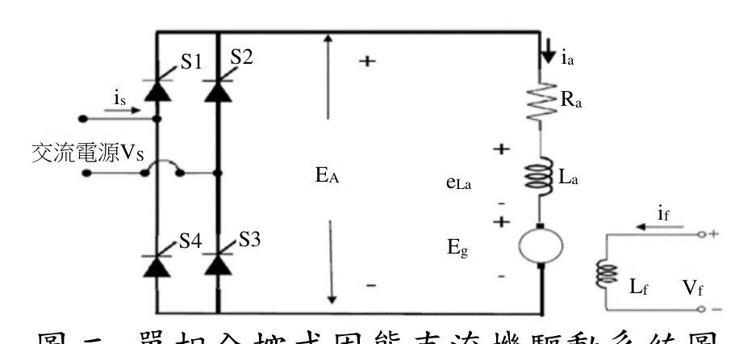

# 公務人員高等考試三級（111年）電機機械 原始試題

> 本檔只保存考選部原始試題的轉錄與裁切圖，不含解答。數學符號、電路接線與圖中文字以原始題目裁切圖為準。

#### 一、圖一為變壓器於二次低壓側進行開路試驗，一次高壓側進行短路試驗，
並將試驗量測數據運算得到參考至一次側之近似等效電路圖。若高、低
壓側額定電壓比為
H
L
V
a
V

，敘述如何進行開路試驗與短路試驗的程序，
以取得那些試驗的數據，直接推算等效電路上Rc、Xm、Req 及Xeq 的參數
值，並說明等效電路上每一參數在變壓器運轉時所代表的意義。（25 分）
Rc
jXm
Req
jXeq
+
-
+
-
VH
IH
aVL
LI
a
圖一變壓器近似等效電路圖

<!-- question_kind: essay; question_number: 1; app_question_number: 1 -->

### 原始題目裁切

### 原始圖形裁切

#### 二、一部感應繞線式轉子運轉電動機在額定電壓與頻率下運轉，滑環短路並
且負載是電動機額定值的100%，如果在轉子電路中插入額外的電阻，
使得電動機的轉子電阻可以調變。試由感應繞線式轉子電阻變動之轉矩
與速度特性曲線，詳細說明轉子電阻增加時，對以下各項參數的影響：
（每小題5 分，共25 分）
（一）轉差率s
（二）電動機速度nm
（三）轉子的感應電壓
（四）電動機啟動轉矩
電動機最大轉矩（脫出轉矩,Pull-out torque）

<!-- question_kind: essay; question_number: 2; app_question_number: 2 -->

### 原始題目裁切

### 原始圖形裁切

本題原始 PDF 未含獨立嵌入圖形。

#### 三、一部三相Y 連接同步發電機之額定為60 MVA、13.8 kV、0.8 PF 落後，
60 Hz。其每相同步電抗為1.2 Ω，電樞電阻可忽略。
（一）此同步發電機之電壓調整率為何？（10 分）
（二）發電機若維持在額定狀況下運轉。但內部生成電壓EA 因激磁調整而
下降10%，則激磁調降10%後的電樞電流IA 將為何？（15 分）

<!-- question_kind: essay; question_number: 3; app_question_number: 3 -->

### 原始題目裁切

### 原始圖形裁切

本題原始 PDF 未含獨立嵌入圖形。

#### 四、如圖二所示之單相全控式固態直流機驅動系統，含一部額定輸入電壓
180 V、輸出功率5 馬力的它激式直流馬達，電樞電阻Ra = 0.25 歐姆，
電樞電感La，磁場電流if，額定滿載電樞電流20 安培，由一單相全控式
相位控制整流器驅動。以交流電源正弦波由負轉正之零交越點為基準的
觸發角零度，當開關S1 與S3 觸發角為時，則S2 與S4 的觸發角為+ 。
若其交流側弦波電源電壓之均方根值為Vs = 220 V，假定電樞電感La 夠
大且足以使電樞電流連續，可忽略漣波，且開關元件壓降亦可忽略。此
時整流器的輸出電壓EA 與觸發角的關係式如下：
A
s
E
(2 2V cosα) / π

（一）在額定激磁場電流及滿載電樞電流運轉時，觸發角為45°，轉速為
800 rpm。此時的平均電樞電壓EA 與反電勢電壓（Back electromotive
force）Eg 應是多少？（10 分）
（二）若在額定激磁場電流及額定滿載下，欲使馬達轉速控制為1000 rpm，
此時的平均電樞電壓EＡ、反電勢電壓Eg與觸發角應為多少？（15 分）
圖二單相全控式固態直流機驅動系統圖
S1
S2
is
S4
S3
EA
ia
Ra
La
if
Lf
Vf
eLa
Eg
交流電源VS

<!-- question_kind: essay; question_number: 4; app_question_number: 4 -->

### 原始題目裁切

### 原始圖形裁切

