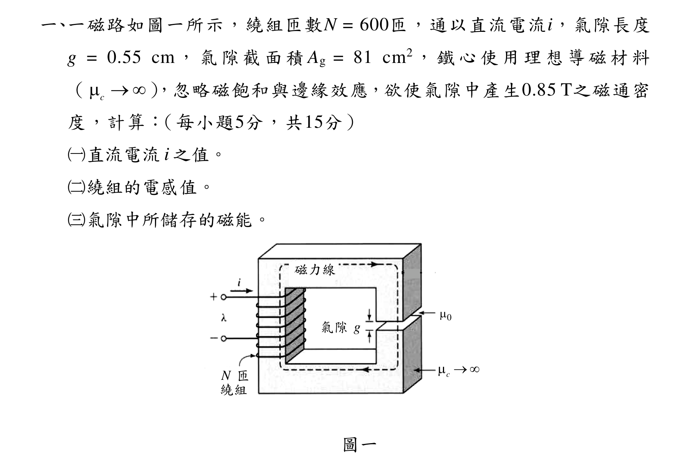
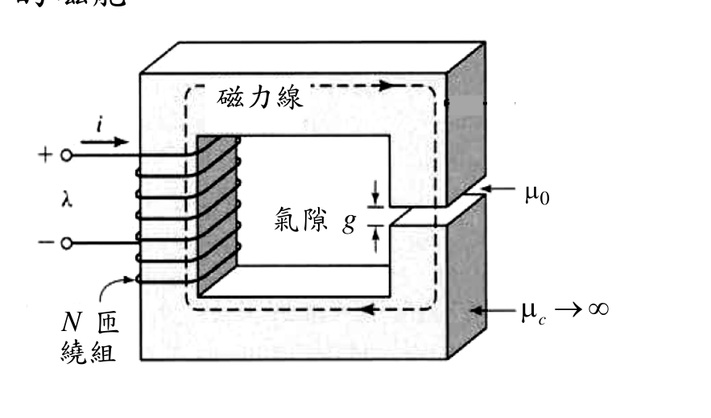
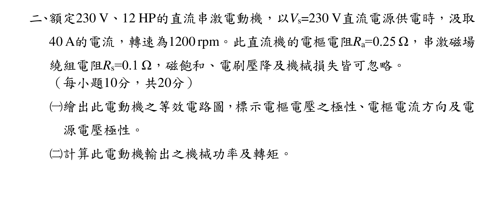
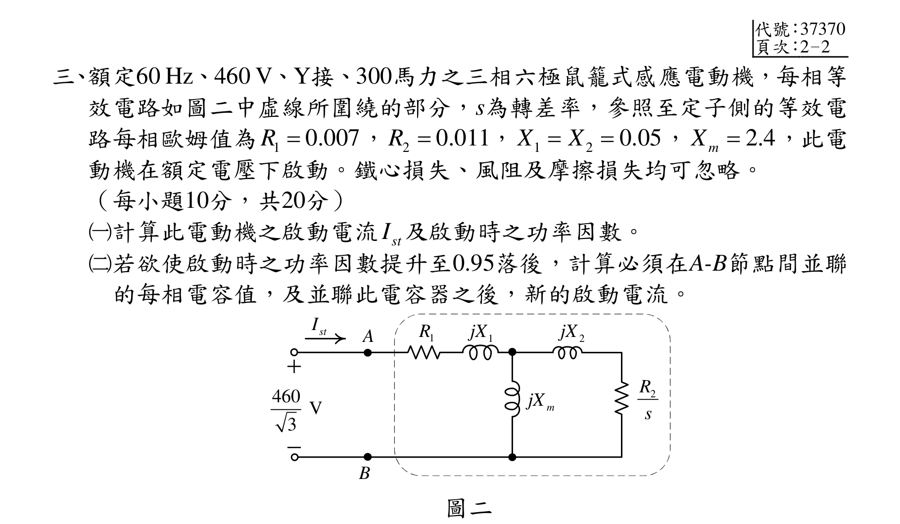
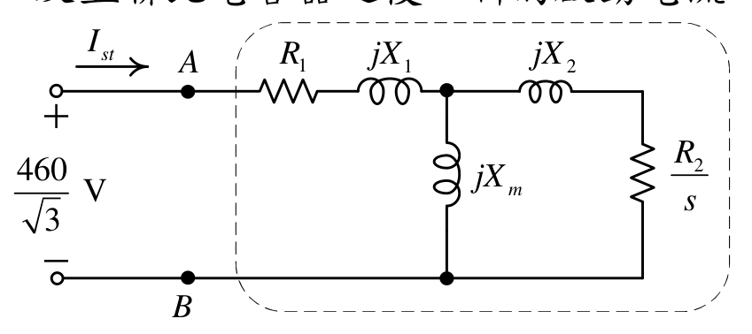
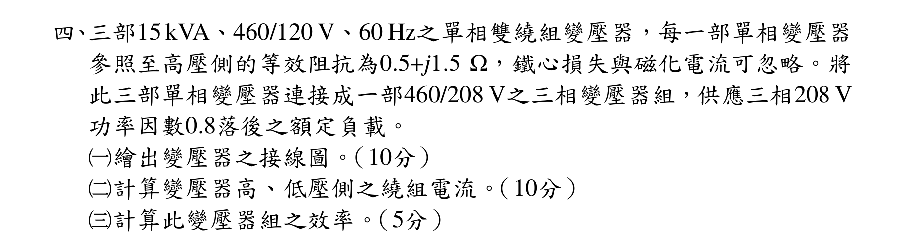
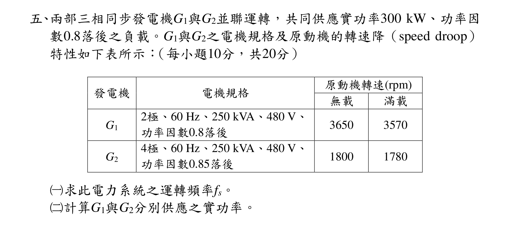
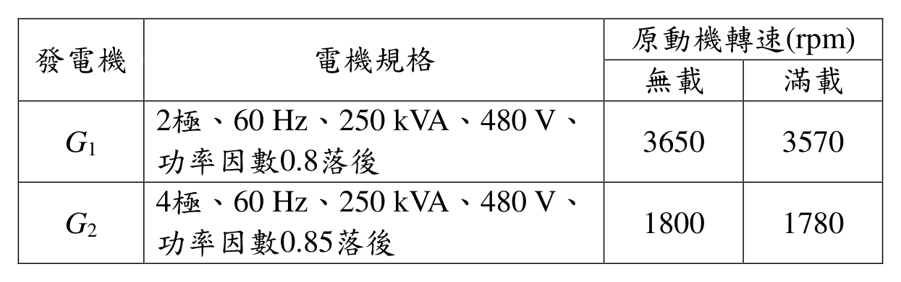

# 公務人員高等考試三級（112年）電機機械 原始試題

> 本檔只保存考選部原始試題的轉錄與裁切圖，不含解答。數學符號、電路接線與圖中文字以原始題目裁切圖為準。

#### 一、一磁路如圖一所示，繞組匝數N = 600匝，通以直流電流i，氣隙長度
g = 0.55 cm，氣隙截面積Ag = 81 cm2，鐵心使用理想導磁材料
（
c
），忽略磁飽和與邊緣效應，欲使氣隙中產生0.85 T之磁通密
度，計算：（每小題5分，共15分）
（一）直流電流i 之值。
（二）繞組的電感值。
（三）氣隙中所儲存的磁能。
c

0

N 匝
繞組
g
氣隙
磁力線
圖一

<!-- question_kind: essay; question_number: 1; app_question_number: 1 -->

### 原始題目裁切

### 原始圖形裁切

#### 二、額定230 V、12 HP的直流串激電動機，以Vs=230 V直流電源供電時，汲取
40 A的電流，轉速為1200 rpm。此直流機的電樞電阻Ra=0.25 Ω，串激磁場
繞組電阻Rs=0.1 Ω，磁飽和、電刷壓降及機械損失皆可忽略。
（每小題10分，共20分）
（一）繪出此電動機之等效電路圖，標示電樞電壓之極性、電樞電流方向及電
源電壓極性。
（二）計算此電動機輸出之機械功率及轉矩。

<!-- question_kind: essay; question_number: 2; app_question_number: 2 -->

### 原始題目裁切

### 原始圖形裁切

本題原始 PDF 未含獨立嵌入圖形。

#### 三、額定60 Hz、460 V、Y接、300馬力之三相六極鼠籠式感應電動機，每相等
效電路如圖二中虛線所圍繞的部分，s為轉差率，參照至定子側的等效電
路每相歐姆值為
1
0.007
R 
，
2
0.011
R 
，
1
2
0.05
X
X


，
2.4
m
X

，此電
動機在額定電壓下啟動。鐵心損失、風阻及摩擦損失均可忽略。
（每小題10分，共20分）
（一）計算此電動機之啟動電流
stI 及啟動時之功率因數。
（二）若欲使啟動時之功率因數提升至0.95落後，計算必須在A-B節點間並聯
的每相電容值，及並聯此電容器之後，新的啟動電流。


460 V
3
2
jX
2
R
s
stI
1
jX
m
jX
1
R
A
B
圖二

<!-- question_kind: essay; question_number: 3; app_question_number: 3 -->

### 原始題目裁切

### 原始圖形裁切

#### 四、三部15 kVA、460/120 V、60 Hz之單相雙繞組變壓器，每一部單相變壓器
參照至高壓側的等效阻抗為0.5+j1.5 Ω，鐵心損失與磁化電流可忽略。將
此三部單相變壓器連接成一部460/208 V之三相變壓器組，供應三相208 V
功率因數0.8落後之額定負載。
（一）繪出變壓器之接線圖。（10分）
（二）計算變壓器高、低壓側之繞組電流。（10分）
（三）計算此變壓器組之效率。（5分）

<!-- question_kind: essay; question_number: 4; app_question_number: 4 -->

### 原始題目裁切

### 原始圖形裁切

本題原始 PDF 未含獨立嵌入圖形。

#### 五、兩部三相同步發電機G1與G2並聯運轉，共同供應實功率300 kW、功率因
數0.8落後之負載。G1與G2之電機規格及原動機的轉速降（speed droop）
特性如下表所示：（每小題10分，共20分）
發電機
電機規格
原動機轉速(rpm)
無載
滿載
G1
2極、60 Hz、250 kVA、480 V、
功率因數0.8落後
3650
3570
G2
4極、60 Hz、250 kVA、480 V、
功率因數0.85落後
1800
1780
（一）求此電力系統之運轉頻率fs。
（二）計算G1與G2分別供應之實功率。

<!-- question_kind: essay; question_number: 5; app_question_number: 5 -->

### 原始題目裁切

### 原始圖形裁切

