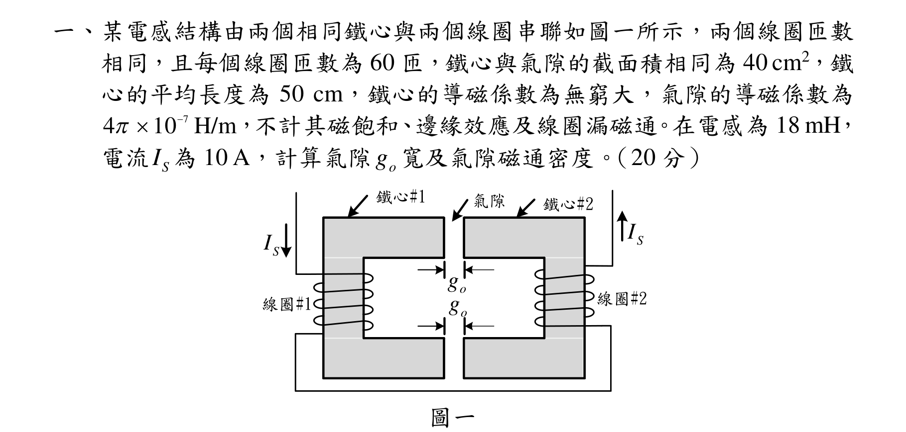
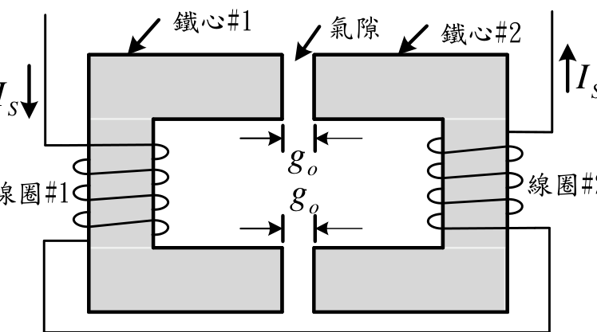
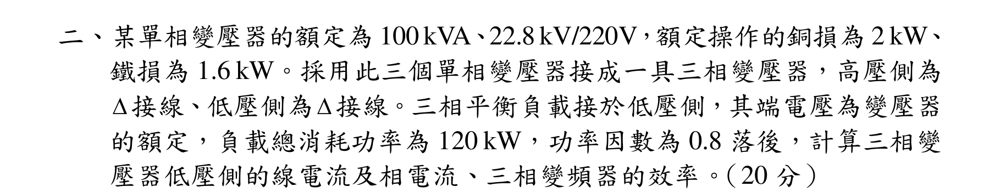
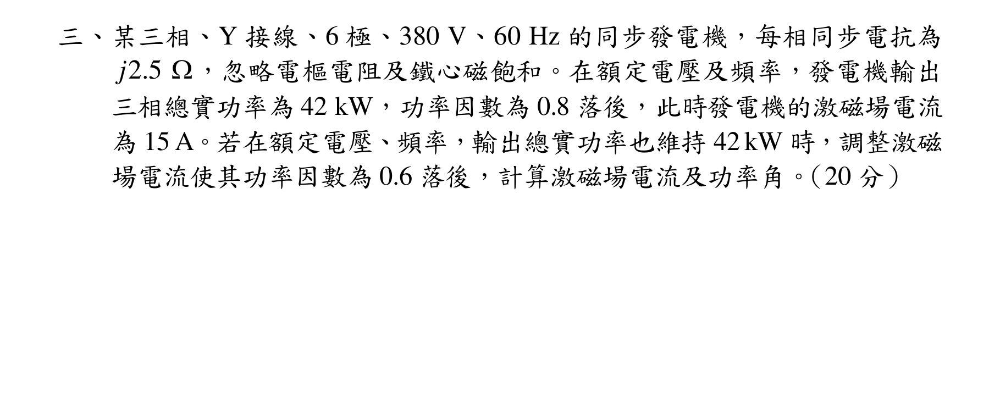
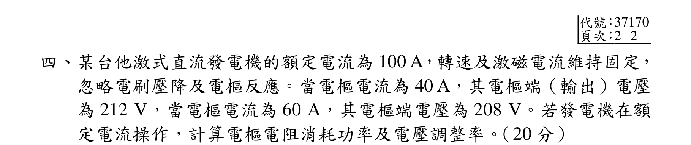
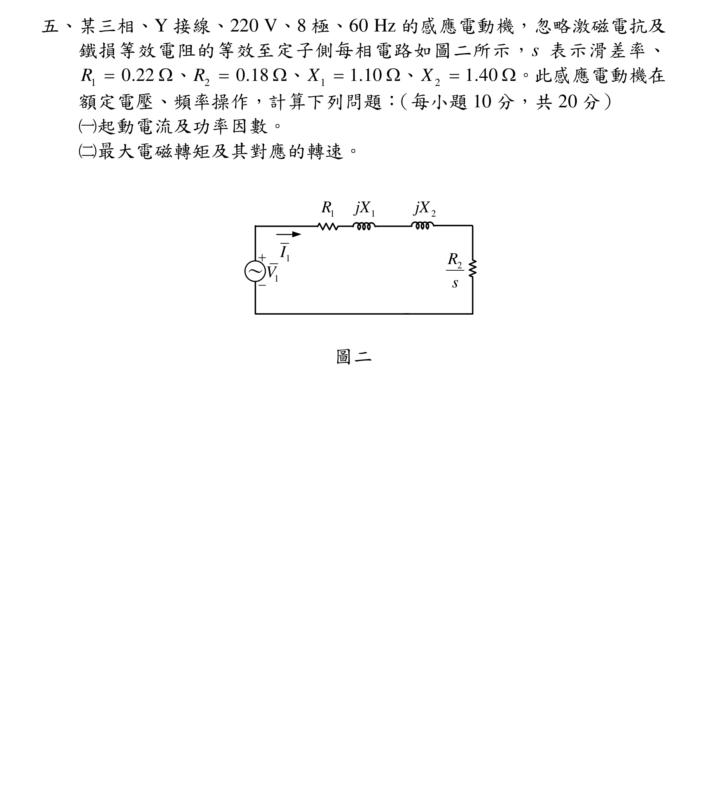
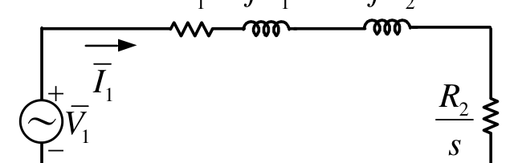

# 公務人員高等考試三級（113年）電機機械 原始試題

> 本檔只保存考選部原始試題的轉錄與裁切圖，不含解答。數學符號、電路接線與圖中文字以原始題目裁切圖為準。

#### 一、某電感結構由兩個相同鐵心與兩個線圈串聯如圖一所示，兩個線圈匝數
相同，且每個線圈匝數為60 匝，鐵心與氣隙的截面積相同為40 cm2，鐵
心的平均長度為50 cm，鐵心的導磁係數為無窮大，氣隙的導磁係數為
7
4
10 H/m



，不計其磁飽和、邊緣效應及線圈漏磁通。在電感為18 mH，
電流
SI 為10 A，計算氣隙
o
g 寬及氣隙磁通密度。（20 分）
圖一
o
g
SI
SI
氣隙
鐵心#1
鐵心#2
線圈#1
線圈#2
o
g

<!-- question_kind: essay; question_number: 1; app_question_number: 1 -->

### 原始題目裁切

### 原始圖形裁切

#### 二、某單相變壓器的額定為100 kVA、22.8 kV/220V，額定操作的銅損為2 kW、
鐵損為1.6 kW。採用此三個單相變壓器接成一具三相變壓器，高壓側為
接線、低壓側為接線。三相平衡負載接於低壓側，其端電壓為變壓器
的額定，負載總消耗功率為120 kW，功率因數為0.8 落後，計算三相變
壓器低壓側的線電流及相電流、三相變頻器的效率。（20 分）

<!-- question_kind: essay; question_number: 2; app_question_number: 2 -->

### 原始題目裁切

### 原始圖形裁切

本題原始 PDF 未含獨立嵌入圖形。

#### 三、某三相、Y 接線、6 極、380 V、60 Hz 的同步發電機，每相同步電抗為
2.5
j
，忽略電樞電阻及鐵心磁飽和。在額定電壓及頻率，發電機輸出
三相總實功率為42 kW，功率因數為0.8 落後，此時發電機的激磁場電流
為15 A。若在額定電壓、頻率，輸出總實功率也維持42 kW 時，調整激磁
場電流使其功率因數為0.6 落後，計算激磁場電流及功率角。（20 分）

<!-- question_kind: essay; question_number: 3; app_question_number: 3 -->

### 原始題目裁切

### 原始圖形裁切

本題原始 PDF 未含獨立嵌入圖形。

#### 四、某台他激式直流發電機的額定電流為100 A，轉速及激磁電流維持固定，
忽略電刷壓降及電樞反應。當電樞電流為40 A，其電樞端（輸出）電壓
為212 V，當電樞電流為60 A，其電樞端電壓為208 V。若發電機在額
定電流操作，計算電樞電阻消耗功率及電壓調整率。（20 分）

<!-- question_kind: essay; question_number: 4; app_question_number: 4 -->

### 原始題目裁切

### 原始圖形裁切

本題原始 PDF 未含獨立嵌入圖形。

#### 五、某三相、Y 接線、220 V、8 極、60 Hz 的感應電動機，忽略激磁電抗及
鐵損等效電阻的等效至定子側每相電路如圖二所示，s 表示滑差率、
1
0.22
R 
、
2
0.18
R 
、
1
1.10
X 
、
2
1.40
X

。此感應電動機在
額定電壓、頻率操作，計算下列問題：（每小題10 分，共20 分）
（一）起動電流及功率因數。
（二）最大電磁轉矩及其對應的轉速。
圖二


2
R
s
1I
1
R
1
jX
2
jX
1V
～

<!-- question_kind: essay; question_number: 5; app_question_number: 5 -->

### 原始題目裁切

### 原始圖形裁切

