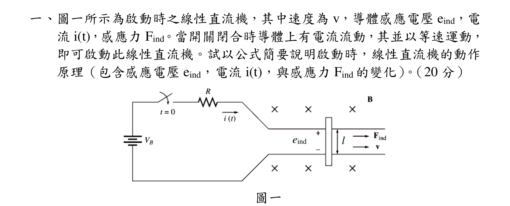
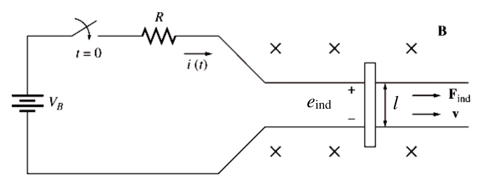
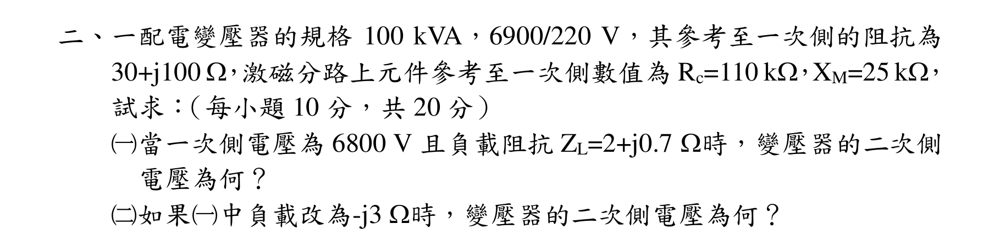
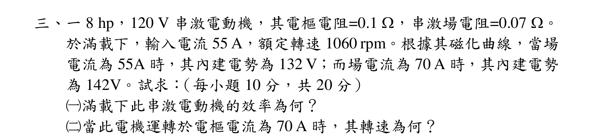
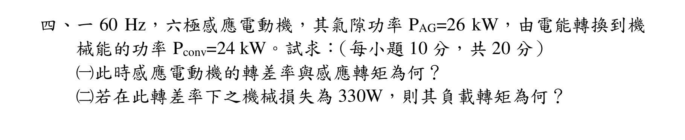
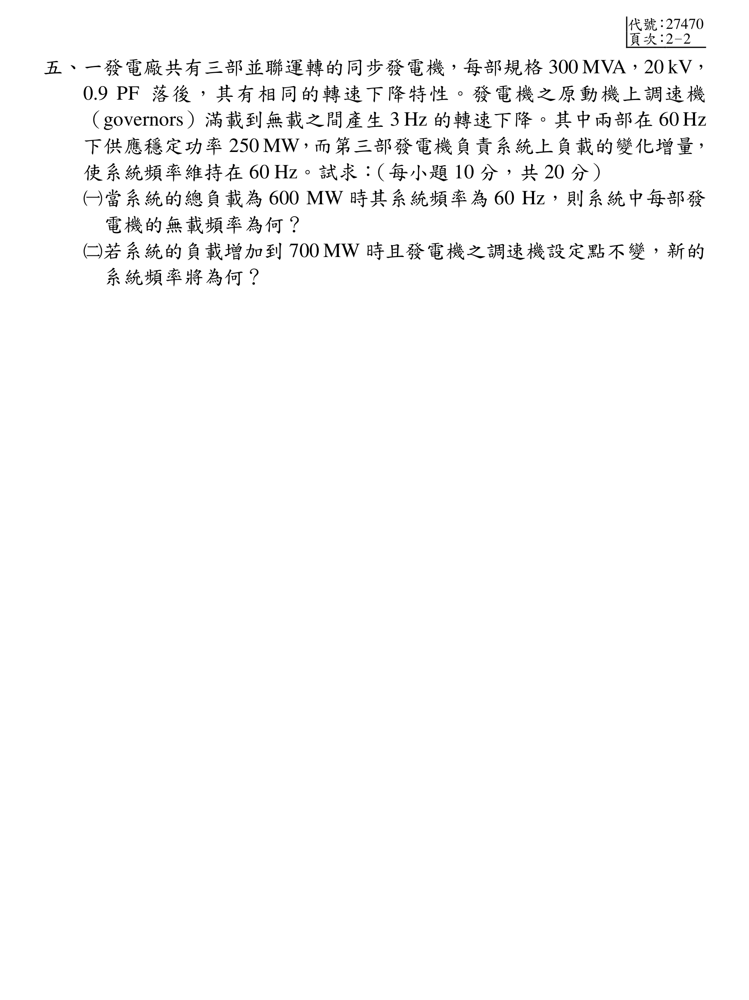

# 公務人員高等考試三級（114年）電機機械 原始試題

> 本檔只保存考選部原始試題的轉錄與裁切圖，不含解答。數學符號、電路接線與圖中文字以原始題目裁切圖為準。

#### 一、圖一所示為啟動時之線性直流機，其中速度為v，導體感應電壓eind，電
流i(t)，感應力Find。當開關閉合時導體上有電流流動，其並以等速運動，
即可啟動此線性直流機。試以公式簡要說明啟動時，線性直流機的動作
原理（包含感應電壓eind，電流i(t)，與感應力Find 的變化）。（20 分）
圖一
l
eind

<!-- question_kind: essay; question_number: 1; app_question_number: 1 -->

### 原始題目裁切

### 原始圖形裁切

#### 二、一配電變壓器的規格100 kVA，6900/220 V，其參考至一次側的阻抗為
30+j100 ，激磁分路上元件參考至一次側數值為Rc=110 k，XM=25 k，
試求：（每小題10 分，共20 分）
（一）當一次側電壓為6800 V 且負載阻抗ZL=2+j0.7 時，變壓器的二次側
電壓為何？
（二）如果（一）中負載改為-j3 時，變壓器的二次側電壓為何？

<!-- question_kind: essay; question_number: 2; app_question_number: 2 -->

### 原始題目裁切

### 原始圖形裁切

本題原始 PDF 未含獨立嵌入圖形。

#### 三、一8 hp，120 V 串激電動機，其電樞電阻=0.1 ，串激場電阻=0.07 。
於滿載下，輸入電流55 A，額定轉速1060 rpm。根據其磁化曲線，當場
電流為55A 時，其內建電勢為132 V；而場電流為70 A 時，其內建電勢
為142V。試求：（每小題10 分，共20 分）
（一）滿載下此串激電動機的效率為何？
（二）當此電機運轉於電樞電流為70 A 時，其轉速為何？

<!-- question_kind: essay; question_number: 3; app_question_number: 3 -->

### 原始題目裁切

### 原始圖形裁切

本題原始 PDF 未含獨立嵌入圖形。

#### 四、一60 Hz，六極感應電動機，其氣隙功率PAG=26 kW，由電能轉換到機
械能的功率Pconv=24 kW。試求：（每小題10 分，共20 分）
（一）此時感應電動機的轉差率與感應轉矩為何？
（二）若在此轉差率下之機械損失為330W，則其負載轉矩為何？

<!-- question_kind: essay; question_number: 4; app_question_number: 4 -->

### 原始題目裁切

### 原始圖形裁切

本題原始 PDF 未含獨立嵌入圖形。

#### 五、一發電廠共有三部並聯運轉的同步發電機，每部規格300 MVA，20 kV，
0.9 PF 落後，其有相同的轉速下降特性。發電機之原動機上調速機
（governors）滿載到無載之間產生3 Hz 的轉速下降。其中兩部在60 Hz
下供應穩定功率250 MW，而第三部發電機負責系統上負載的變化增量，
使系統頻率維持在60 Hz。試求：（每小題10 分，共20 分）
（一）當系統的總負載為600 MW 時其系統頻率為60 Hz，則系統中每部發
電機的無載頻率為何？
（二）若系統的負載增加到700 MW 時且發電機之調速機設定點不變，新的
系統頻率將為何？

<!-- question_kind: essay; question_number: 5; app_question_number: 5 -->

### 原始題目裁切

### 原始圖形裁切

本題原始 PDF 未含獨立嵌入圖形。
