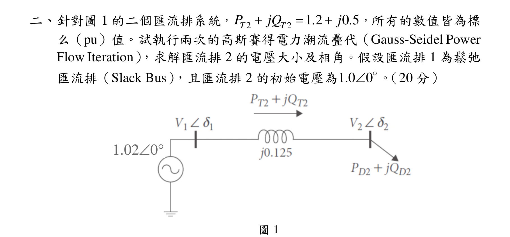
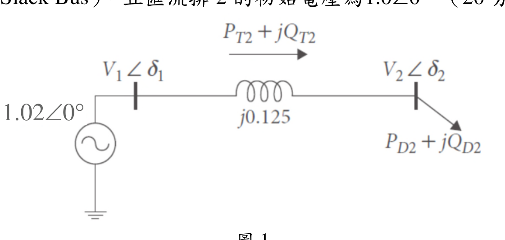
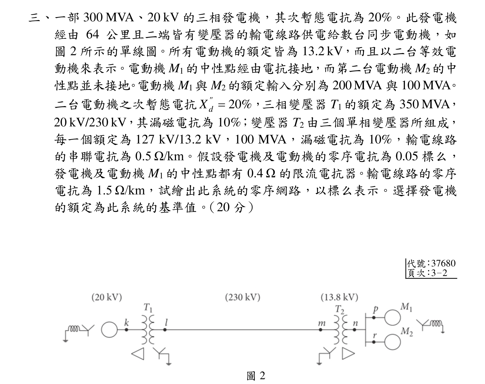
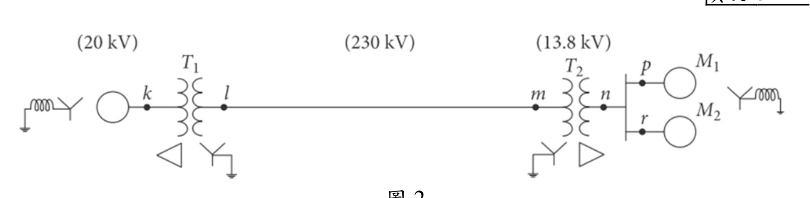
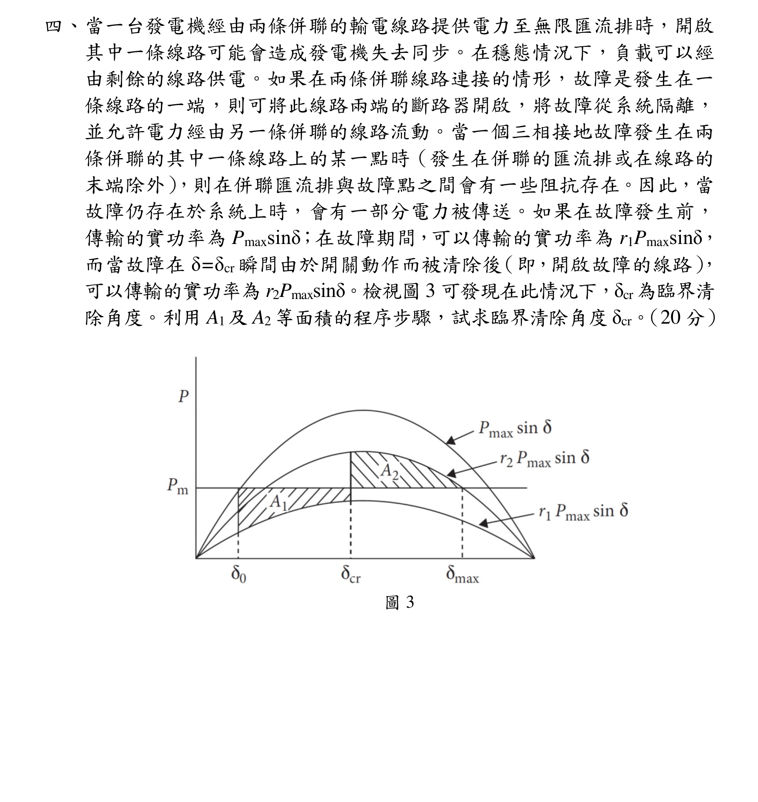
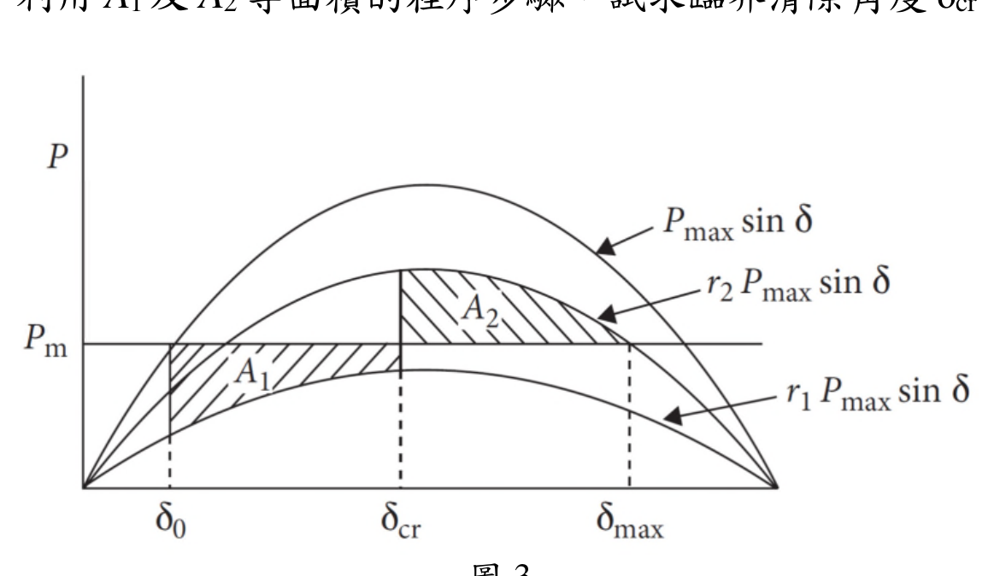
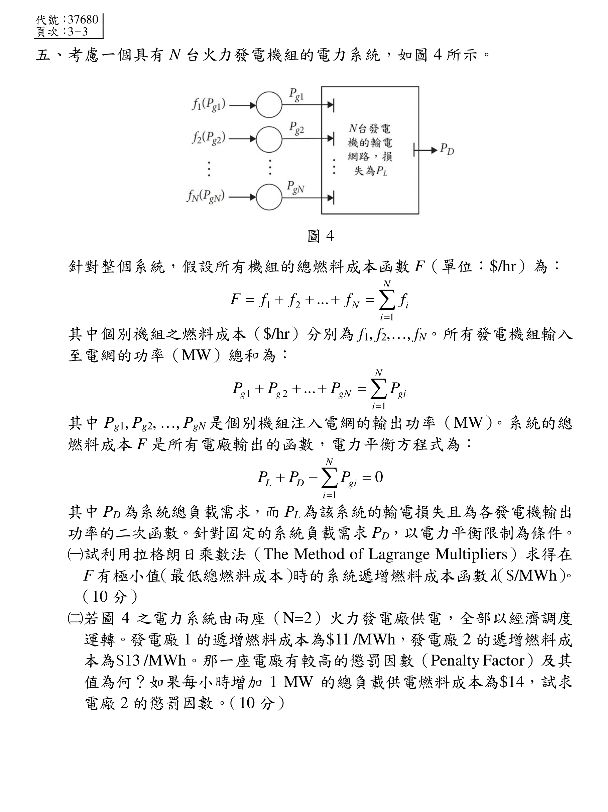
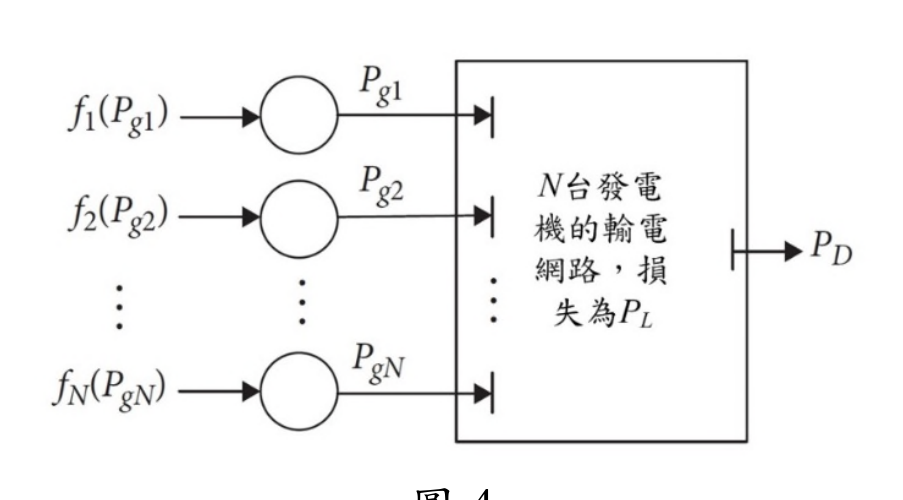

# 公務人員高等考試三級（110年）電力系統 原始試題

> 本檔只保存考選部原始試題的轉錄與裁切圖，不含解答。數學符號、電路接線與圖中文字以原始題目裁切圖為準。

#### 一、功率因數為落後0.707 的三相負載自線電壓440 V 汲取250 kW 功率，
與此負載併聯的是三相電容器組，其汲取60 kVA 功率。試求總電流及
合併的功率因數。（20 分）

<!-- question_kind: essay; question_number: 1; app_question_number: 1 -->

### 原始題目裁切

### 原始圖形裁切

本題原始 PDF 未含獨立嵌入圖形。

#### 二、針對圖1 的二個匯流排系統，
2
2
1.2
0.5
T
T
P
jQ
j



，所有的數值皆為標
么（pu）值。試執行兩次的高斯賽得電力潮流疊代（Gauss-Seidel Power
Flow Iteration），求解匯流排2 的電壓大小及相角。假設匯流排1 為鬆弛
匯流排（Slack Bus），且匯流排2 的初始電壓為1.0 0
。（20 分）
圖1
1.02 0


<!-- question_kind: essay; question_number: 2; app_question_number: 2 -->

### 原始題目裁切

### 原始圖形裁切

#### 三、一部300 MVA、20 kV 的三相發電機，其次暫態電抗為20%。此發電機
經由64 公里且二端皆有變壓器的輸電線路供電給數台同步電動機，如
圖2 所示的單線圖。所有電動機的額定皆為13.2 kV，而且以二台等效電
動機來表示。電動機M1的中性點經由電抗接地，而第二台電動機M2的中
性點並未接地。電動機M1與M2的額定輸入分別為200 MVA 與100 MVA。
二台電動機之次暫態電抗
20%
"
d
X

，三相變壓器T1 的額定為350 MVA，
20 kV/230 kV，其漏磁電抗為10%；變壓器T2 由三個單相變壓器所組成，
每一個額定為127 kV/13.2 kV，100 MVA，漏磁電抗為10%，輸電線路
的串聯電抗為0.5 Ω/km。假設發電機及電動機的零序電抗為0.05 標么，
發電機及電動機M1 的中性點都有0.4 Ω 的限流電抗器。輸電線路的零序
電抗為1.5 Ω/km，試繪出此系統的零序網路，以標么表示。選擇發電機
的額定為此系統的基準值。（20 分）
代號：37680
頁次：3－2
圖2

<!-- question_kind: essay; question_number: 3; app_question_number: 3 -->

### 原始題目裁切

### 原始圖形裁切

#### 四、當一台發電機經由兩條併聯的輸電線路提供電力至無限匯流排時，開啟
其中一條線路可能會造成發電機失去同步。在穩態情況下，負載可以經
由剩餘的線路供電。如果在兩條併聯線路連接的情形，故障是發生在一
條線路的一端，則可將此線路兩端的斷路器開啟，將故障從系統隔離，
並允許電力經由另一條併聯的線路流動。當一個三相接地故障發生在兩
條併聯的其中一條線路上的某一點時（發生在併聯的匯流排或在線路的
末端除外），則在併聯匯流排與故障點之間會有一些阻抗存在。因此，當
故障仍存在於系統上時，會有一部分電力被傳送。如果在故障發生前，
傳輸的實功率為Pmaxsinδ；在故障期間，可以傳輸的實功率為r1Pmaxsinδ，
而當故障在δ=δcr 瞬間由於開關動作而被清除後（即，開啟故障的線路），
可以傳輸的實功率為r2Pmaxsinδ。檢視圖3 可發現在此情況下，δcr為臨界清
除角度。利用A1及A2等面積的程序步驟，試求臨界清除角度δcr。（20 分）
圖3

<!-- question_kind: essay; question_number: 4; app_question_number: 4 -->

### 原始題目裁切

### 原始圖形裁切

#### 五、考慮一個具有N 台火力發電機組的電力系統，如圖4 所示。
圖4
針對整個系統，假設所有機組的總燃料成本函數F（單位：$/hr）為：
1
2
1
...
N
N
i
i
F
f
f
f
f






其中個別機組之燃料成本（$/hr）分別為f1, f2,…, fN。所有發電機組輸入
至電網的功率（MW）總和為：
1
2
1
...
N
g
g
gN
gi
i
P
P
P
P





其中Pg1, Pg2, …, PgN 是個別機組注入電網的輸出功率（MW）。系統的總
燃料成本F 是所有電廠輸出的函數，電力平衡方程式為：
1
0
N
L
D
gi
i
P
P
P





其中PD為系統總負載需求，而PL 為該系統的輸電損失且為各發電機輸出
功率的二次函數。針對固定的系統負載需求PD，以電力平衡限制為條件。
（一）試利用拉格朗日乘數法（The Method of Lagrange Multipliers）求得在
F 有極小值（最低總燃料成本）時的系統遞增燃料成本函數λ（$/MWh）。
（10 分）
（二）若圖4 之電力系統由兩座（N=2）火力發電廠供電，全部以經濟調度
運轉。發電廠1 的遞增燃料成本為$11 /MWh，發電廠2 的遞增燃料成
本為$13 /MWh。那一座電廠有較高的懲罰因數（Penalty Factor）及其
值為何？如果每小時增加1 MW 的總負載供電燃料成本為$14，試求
電廠2 的懲罰因數。（10 分）

<!-- question_kind: essay; question_number: 5; app_question_number: 5 -->

### 原始題目裁切

### 原始圖形裁切

